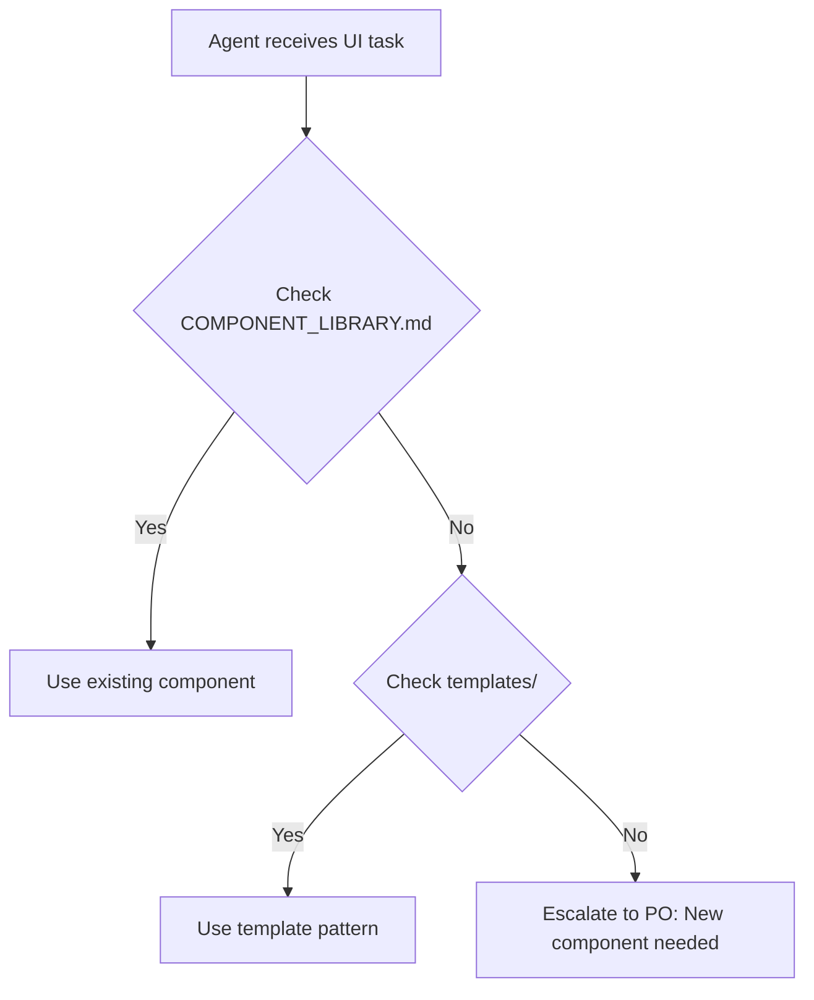

# Design Principles - Mr. Backlog Design System

> **Version**: 1.0.0
> **Last Updated**: 2025-12-14
> **Applies to**: All Mr. Backlog projects

---

## 🎯 Core Principles

### 1. Consistency is King

**Agents MUST use existing patterns before creating new ones.**

- ✅ **DO**: Check COMPONENT_LIBRARY.md before building new components
- ✅ **DO**: Use design tokens from foundations/
- ❌ **DON'T**: Create custom colors without approval
- ❌ **DON'T**: Invent new component variants

**Rationale**: Users learn patterns once, apply everywhere.

---

### 2. Accessibility First

**All components must meet WCAG 2.1 Level AA standards.**

- ✅ **DO**: Include proper ARIA labels
- ✅ **DO**: Ensure 4.5:1 color contrast for text
- ✅ **DO**: Support keyboard navigation
- ✅ **DO**: Provide focus indicators
- ❌ **DON'T**: Use color as sole differentiator
- ❌ **DON'T**: Create keyboard traps

**Rationale**: Inclusive design benefits all users.

---

### 3. Mobile-First Responsive

**Design for mobile, enhance for desktop.**

- ✅ **DO**: Start with 375px (iPhone SE) viewport
- ✅ **DO**: Use Tailwind responsive prefixes (sm:, md:, lg:, xl:)
- ✅ **DO**: Test touch targets (minimum 44x44px)
- ❌ **DON'T**: Design desktop-only layouts
- ❌ **DON'T**: Use fixed pixel widths

**Rationale**: Mobile traffic dominates B2B software.

---

### 4. Progressive Disclosure

**Show essentials first, reveal complexity on demand.**

- ✅ **DO**: Use accordions for secondary information
- ✅ **DO**: Implement "Show more" patterns
- ✅ **DO**: Hide advanced features behind toggles
- ❌ **DON'T**: Show all form fields at once
- ❌ **DON'T**: Overwhelm with options

**Rationale**: Reduces cognitive load, increases completion rates.

---

### 5. Instant Feedback

**Every user action gets immediate visual response.**

- ✅ **DO**: Show loading states (spinners, skeletons)
- ✅ **DO**: Provide success/error feedback
- ✅ **DO**: Use optimistic UI updates
- ✅ **DO**: Disable buttons during processing
- ❌ **DON'T**: Leave users wondering if action registered
- ❌ **DON'T**: Use silent failures

**Rationale**: Perceived performance = actual UX quality.

---

## 📐 Layout Rules

### Grid System

- **Base unit**: 4px (0.25rem)
- **Spacing scale**: 4, 8, 12, 16, 24, 32, 48, 64, 96px
- **Container max-width**: 1280px (xl breakpoint)
- **Content max-width**: 768px (readable text)

### Responsive Breakpoints

- **sm**: 640px (Tablet portrait)
- **md**: 768px (Tablet landscape)
- **lg**: 1024px (Laptop)
- **xl**: 1280px (Desktop)
- **2xl**: 1536px (Large desktop)

### White Space

- **Dense**: 8px gaps (tables, compact lists)
- **Normal**: 16px gaps (forms, cards)
- **Relaxed**: 24px gaps (sections, landing pages)

---

## 🎨 Visual Hierarchy

### Size Scale (from foundations/typography.md)

- **text-xs**: 0.75rem (12px) - Labels, captions
- **text-sm**: 0.875rem (14px) - Body text (small)
- **text-base**: 1rem (16px) - Body text (default)
- **text-lg**: 1.125rem (18px) - Emphasized text
- **text-xl**: 1.25rem (20px) - H4 headings
- **text-2xl**: 1.5rem (24px) - H3 headings
- **text-3xl**: 1.875rem (30px) - H2 headings
- **text-4xl**: 2.25rem (36px) - H1 headings

### Weight Scale

- **font-normal**: 400 - Body text
- **font-medium**: 500 - Emphasized text
- **font-semibold**: 600 - Subheadings
- **font-bold**: 700 - Headings

---

## 🚨 Agent Enforcement Rules

### Quality Gate: Design System Compliance

**Before any Frontend Dev work proceeds, verify:**

- [ ] Component exists in COMPONENT_LIBRARY.md or CUSTOM_COMPONENTS/
- [ ] Colors use semantic tokens (not arbitrary hex values)
- [ ] Spacing uses 4px grid system
- [ ] Typography follows scale
- [ ] Accessibility requirements met (ARIA, contrast, keyboard)
- [ ] Responsive behavior defined for all breakpoints
- [ ] Loading/error states included

**If ANY checkbox is unchecked, escalate to Product Owner.**

---

## 📚 Reference Flow for Agents

---

## 🎯 Success Metrics

**Design system is working when:**

- ✅ 90%+ of components reused (not created)
- ✅ Zero accessibility violations in Lighthouse
- ✅ Consistent UI across all features
- ✅ New features ship faster (less design decisions)
- ✅ Product Owner approval cycle < 1 iteration

---

**Questions?** See `.ai/company/design-system/README.md` or ask Product Owner.
