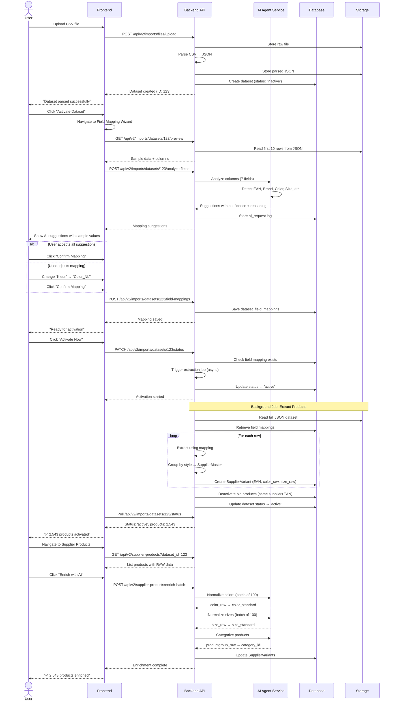

# AI Architecture Blueprint - DataBiz Next

**Document Type:** Architecture Design Document  
**Status:** Draft - Under Review  
**Last Updated:** 2025-12-17  
**Authors:** [BA] + [ARCHITECT]  
**Reviewers:** [ORCHESTRATOR], [FULLSTACK]

---

## 🎯 Executive Summary

DataBiz Next integrates AI agents to automate data enrichment, field mapping, and product categorization. This document defines:
- **Multi-provider architecture** (OpenAI, Anthropic, Gemini, etc.)
- **Token tracking & observability** (cost analysis, performance comparison)
- **AI use cases** across Imports and Supplier Products domains
- **Security & privacy** (data handling, API key management)

**Key Principle:** *Experimentation-first* - Support multiple AI providers with standardized interfaces to compare quality, cost, and speed.

---

## � Complete User Workflow

### Workflow: Dataset Upload → Field Mapping → Activation → Product Extraction



### Step-by-Step User Journey

#### 1️⃣ Upload Dataset (Existing - IMP-FIL-UPL-001)
**Page:** `/imports`  
**Action:** User drags CSV file onto upload zone  
**Result:** Dataset parsed, status 'inactive', preview available

---

#### 2️⃣ Field Mapping Wizard (NEW - IMP-MAP-*)

**Page:** `/imports/datasets/123/field-mapping`

**Step 1: AI Analysis (Auto-starts)**
```
┌─────────────────────────────────────────────────────────────┐
│  🤖 Analyzing dataset columns...                            │
│  ━━━━━━━━━━━━━━━━━━━━━━━ 85%                                │
│                                                              │
│  ✓ Detected 12 columns                                      │
│  ✓ Analyzed 10 sample rows                                  │
│  ✓ Generated mapping suggestions                            │
└─────────────────────────────────────────────────────────────┘
```

**Step 2: Review AI Suggestions**
```
┌─────────────────────────────────────────────────────────────┐
│  Field Mapping - Review AI Suggestions                      │
├─────────────────────────────────────────────────────────────┤
│                                                              │
│  ✅ EAN Code                                    Confidence: 95% │
│     Column: "EAN13"                                         │
│     AI Reasoning: "Column name matches + all values are     │
│                    13-digit numbers"                        │
│     Sample values: 8712345678901, 8712345678918, ...       │
│     [Change Column ▼]                                       │
│                                                              │
│  ✅ Brand                                       Confidence: 90% │
│     Column: "Merk"                                          │
│     AI Reasoning: "Fuzzy matched 'Nike' (85%), 'Adidas'    │
│                    (92%) against brands database"           │
│     Sample values: Nike, Adidas, Puma                       │
│     [Change Column ▼]                                       │
│                                                              │
│  ⚠️  Product Group                            Confidence: 68% │
│     Column: "Type"                            👤 Needs Review │
│     AI Reasoning: "Low confidence - values are generic:     │
│                    'Product', 'Article'. Consider 'Category'│
│                    column instead?"                         │
│     Sample values: Product, Article, Item                   │
│     Alternative: "Category" (Shirts, Pants, Shoes)          │
│     [Change to: Category ▼]                                 │
│                                                              │
│  ✅ Color                                       Confidence: 85% │
│     Column: "Kleur"                                         │
│     Sample values: Rood, Blauw, Groen                       │
│     [Change Column ▼]                                       │
│                                                              │
│  ✅ Size                                        Confidence: 88% │
│     Column: "Maat"                                          │
│     Sample values: 42, 44, 46                               │
│     [Change Column ▼]                                       │
│                                                              │
│  ✅ Image URL                                   Confidence: 92% │
│     Column: "Afbeelding"                                    │
│     Sample values: https://cdn.supplier.nl/img/123.jpg     │
│     [Change Column ▼]                                       │
│                                                              │
│  ✅ Style/Model                                 Confidence: 80% │
│     Column: "Model"                                         │
│     Sample values: Air Max 90, Superstar, Suede Classic    │
│     [Change Column ▼]                                       │
│                                                              │
├─────────────────────────────────────────────────────────────┤
│  [← Back]                        [Save & Activate Dataset →]│
└─────────────────────────────────────────────────────────────┘
```

**Interaction Details:**
- **Green checkmark (✅)**: High confidence (>80%), auto-selected
- **Yellow warning (⚠️)**: Low confidence (<70%), requires user review
- **Dropdown per field**: Shows ALL available columns with 3 sample values each
- **Sample values**: Always visible to help user validate
- **AI Reasoning**: Expandable tooltip with full explanation

**Step 3: Confirm & Save**
User clicks "Save & Activate Dataset" → mapping saved → dataset ready for activation

---

#### 3️⃣ Activate Dataset (Enhanced - IMP-DAT-ACT-001)

**Page:** `/imports` (dataset list)

**Before mapping:**
```
Dataset #123 - Nike Catalog 2025.csv
Status: ⚠️ Inactive (Mapping Required)
[Map Fields] button
```

**After mapping:**
```
Dataset #123 - Nike Catalog 2025.csv
Status: ✅ Ready to Activate
Mapped: EAN, Brand, Color, Size, Image, Style, Group
[Activate Now] button
```

**Click "Activate Now":**
```
┌─────────────────────────────────────────────────────────────┐
│  🚀 Activating Dataset                                       │
│  ━━━━━━━━━━━━━━━━━━━━━━━ 45% (1,234 / 2,543 products)       │
│                                                              │
│  ✓ Extracting products from JSON                            │
│  ✓ Creating SupplierMaster records (142 styles)             │
│  ⏳ Creating SupplierVariant records...                      │
│  ⏸️  Deactivating old products (pending)                     │
└─────────────────────────────────────────────────────────────┘
```

**Completion:**
```
✅ Dataset activated!
   2,543 products extracted
   142 master products created
   89 old products deactivated
   
[View Supplier Products →]
```

---

#### 4️⃣ Browse Supplier Products (NEW - SUP-CAT-LST-001)

**Page:** `/supplier-products`

```
┌─────────────────────────────────────────────────────────────┐
│  Supplier Products (Leveranciersassortiment)                │
├─────────────────────────────────────────────────────────────┤
│  Filters:                                                    │
│  Supplier: [Nike ▼]  Brand: [All ▼]  Category: [All ▼]     │
│  Status: [● Active Only]  Dataset: [All ▼]                  │
│  Search: [____________________________________________] 🔍   │
├─────────────────────────────────────────────────────────────┤
│                                                              │
│  📦 Air Max 90 (Master Product)                              │
│     Brand: Nike  |  Category: Sportschoenen  |  12 variants │
│     Dataset: Nike Catalog 2025.csv (Activated: 2025-12-17)  │
│                                                              │
│     Variants:                                                │
│     ┌─────────────────────────────────────────────────────┐│
│     │ EAN          Color (RAW → STD)      Size   Image    ││
│     ├─────────────────────────────────────────────────────┤│
│     │ 8712345678901 Rood → Red ✓          42    [🖼️ View] ││
│     │ 8712345678918 Blauw → Blue ✓        44    [🖼️ View] ││
│     │ 8712345678925 Groen → Green ✓       46    [🖼️ View] ││
│     │ 8712345678932 Zwart → Black ✓       42    [🖼️ View] ││
│     └─────────────────────────────────────────────────────┘│
│                                                              │
│     Enrichment Status: ⚠️ Not Enriched (RAW data only)       │
│     [Enrich with AI] [Promote to Business Assortment]       │
│                                                              │
├─────────────────────────────────────────────────────────────┤
│  Showing 1-10 of 2,543 products  [← 1 2 3 ... 255 →]       │
└─────────────────────────────────────────────────────────────┘
```

---

#### 5️⃣ AI Enrichment (NEW - SUP-AI-*)

**Click "Enrich with AI":**

```
┌─────────────────────────────────────────────────────────────┐
│  🤖 AI Enrichment Options                                    │
├─────────────────────────────────────────────────────────────┤
│                                                              │
│  Select enrichment tasks:                                    │
│  ☑️ Normalize Colors (Rood → Red, Rouge → Red, etc.)        │
│  ☑️ Normalize Sizes (EU/UK/US conversion)                   │
│  ☑️ Categorize Products (Map to taxonomy)                   │
│                                                              │
│  AI Provider: [OpenAI GPT-4o-mini ▼]                        │
│                                                              │
│  Products to enrich: 12 variants                             │
│  Estimated cost: ~$0.04                                      │
│  Estimated time: ~15 seconds                                 │
│                                                              │
│  [Cancel]                                [Start Enrichment →]│
└─────────────────────────────────────────────────────────────┘
```

**During enrichment:**
```
┌─────────────────────────────────────────────────────────────┐
│  🤖 Enriching with AI...                                     │
│  ━━━━━━━━━━━━━━━━━━━━━━━ 75% (9 / 12 variants)              │
│                                                              │
│  ✅ Colors normalized (12/12) - 100% confidence              │
│  ✅ Sizes normalized (12/12) - 95% avg confidence            │
│  ⏳ Categorizing products (9/12)...                          │
│                                                              │
│  Tokens used: 1,234 in / 567 out                            │
│  Cost so far: $0.03                                          │
└─────────────────────────────────────────────────────────────┘
```

**After enrichment:**
```
✅ Enrichment complete!
   12 colors normalized (avg confidence: 98%)
   12 sizes normalized (avg confidence: 95%)
   12 products categorized (avg confidence: 88%)
   
   Total cost: $0.04
   Total time: 14 seconds
   
[View Results] [Enrich More Products]
```

**Updated product view:**
```
│     Variants:                                                │
│     ┌─────────────────────────────────────────────────────┐│
│     │ EAN          Color (RAW → STD)      Size   Category ││
│     ├─────────────────────────────────────────────────────┤│
│     │ 8712345678901 Rood → Red ✅ 98%     EU 42  Sportschoenen ✅ 92% ││
│     │ 8712345678918 Blauw → Blue ✅ 97%   EU 44  Sportschoenen ✅ 92% ││
│     └─────────────────────────────────────────────────────┘│
│                                                              │
│     Enrichment Status: ✅ Enriched (2025-12-17 14:32)        │
│     [View AI Details] [Re-enrich] [Promote to Assortment]   │
```

---

## 🎨 UI Components & Design Patterns

### Component Library

#### 1. AI Confidence Badge
```tsx
<ConfidenceBadge score={95} />
// Renders:
// ✅ 95%  (green, score >= 80)
// ⚠️  68%  (yellow, score 60-79)
// ❌ 45%  (red, score < 60)
```

#### 2. Field Mapping Row
```tsx
<FieldMappingRow
  fieldName="EAN Code"
  suggestedColumn="EAN13"
  confidence={95}
  reasoning="Column name matches + all values are 13-digit numbers"
  sampleValues={["8712345678901", "8712345678918", "8712345678925"]}
  availableColumns={allColumns}
  onColumnChange={(newColumn) => handleChange(newColumn)}
/>
```

#### 3. AI Provider Selector (Admin)
```tsx
<AIProviderSelector
  providers={[
    { id: 'openai', name: 'OpenAI GPT-4o-mini', cost: 0.002 },
    { id: 'anthropic', name: 'Claude 3.5 Sonnet', cost: 0.015 },
    { id: 'gemini', name: 'Gemini 1.5 Pro', cost: 0.003 },
  ]}
  selected="openai"
  onChange={(providerId) => setProvider(providerId)}
/>
```

#### 4. Enrichment Progress Modal
```tsx
<EnrichmentProgressModal
  totalProducts={12}
  processedProducts={9}
  currentTask="Categorizing products"
  tokensUsed={{ input: 1234, output: 567 }}
  costSoFar={0.03}
  onCancel={() => cancelEnrichment()}
/>
```

#### 5. RAW vs STANDARD Data Display
```tsx
<DataTransformDisplay
  raw="Rood"
  standard="Red"
  confidence={98}
  aiProvider="OpenAI"
  showReasoning={true}
  reasoning="Detected Dutch language, translated 'Rood' to 'Red'"
/>
// Renders: Rood → Red ✅ 98% [ℹ️ Show reasoning]
```

---

## �📊 [BA] AI Use Case Inventory

### 1. Field Mapping (IMP-MAP-*)

**Context:** User uploads CSV → System must identify which columns map to required fields (EAN, brand, color, size, etc.)

| Use Case | AI Task | Input | Expected Output | Success Criteria |
|----------|---------|-------|-----------------|------------------|
| **Analyze Dataset** | Column analysis | First 10 rows JSON | Suggested mappings with confidence | All 7 fields mapped (EAN, brand, productgroup, color, size, image_url, style) |
| **Detect EAN** | Pattern matching | Column names + sample values | `{column: "EAN13", confidence: 95, reasoning: "Column name + 13-digit format"}` | Confidence >80% or null |
| **Detect Brand** | Semantic + fuzzy match | Column names + values + brands DB | `{column: "Merk", confidence: 90, brand_id: 42}` | Fuzzy match >80% against brands table |
| **Detect Productgroup** | Semantic analysis | Column names + sample values | `{column: "Category", confidence: 80, sample_values: ["Shirts", "Pants"]}` | Column identified with samples |
| **Detect Color** | Language detection | Column names + values | `{column: "Kleur", confidence: 85, language: "nl"}` | Color-like values detected |
| **Detect Size** | Size system detection | Column names + values | `{column: "Maat", confidence: 85, size_system: "EU"}` | Size codes detected (S/M/L or numeric) |
| **Detect Image URL** | URL pattern matching | Column names + values | `{column: "Afbeelding", confidence: 90}` | Valid URLs or paths detected |

**Critical Requirements:**
- AI must provide **reasoning** for each suggestion (explainability)
- Show **sample values** (3-5 examples) for user validation
- Flag **uncertain mappings** (confidence <70%) for mandatory user review
- Support **multi-language** column names (NL, EN, DE, FR)

---

### 2. AI Enrichment (SUP-AI-*)

**Context:** After extraction, supplier products have RAW data → AI normalizes to standardized taxonomy

| Use Case | AI Task | Input | Expected Output | Success Criteria |
|----------|---------|-------|-----------------|------------------|
| **Normalize Colors** | Multi-language color mapping | `color_raw: "Rood"` | `{color_standard: "Red", confidence: 95, language: "nl"}` | Maps to color taxonomy (exact match) |
| **Normalize Sizes** | Size system conversion | `size_raw: "42"` | `{size_standard: "EU 42", system: "EU", confidence: 90}` | Detects system + converts |
| **Categorize Products** | Category taxonomy mapping | `productgroup_raw: "Werkbroek", style_raw: "Safety Pro"` | `{category_id: 123, confidence: 85, path: "Workwear > Pants"}` | Maps to taxonomy leaf node |

**Quality Gates:**
- Confidence <60% → Keep RAW value, flag for manual review
- Confidence 60-80% → Use normalized value, show both in UI
- Confidence >80% → Trust AI, use normalized value

---

### 3. Brand Matching (SUP-EXT-BRA-001)

**Context:** Dataset has brand column → Fuzzy match against existing brands table

| Use Case | AI Task | Input | Expected Output | Success Criteria |
|----------|---------|-------|-----------------|------------------|
| **Fuzzy Brand Match** | Entity matching | `brand_raw: "Nke", brands_db: [{id: 1, name: "Nike"}, ...]` | `{brand_id: 1, confidence: 85, matched: "Nike"}` | Fuzzy match >80% |

---

## 🏗️ [ARCHITECT] System Design

### Architecture Layers

```
┌─────────────────────────────────────────────────────────────────┐
│  Application Layer (FastAPI routers)                            │
│  - Field Mapping Router (IMP-MAP-*)                             │
│  - Product Enrichment Router (SUP-AI-*)                         │
└────────────────────┬────────────────────────────────────────────┘
                     │
┌────────────────────▼────────────────────────────────────────────┐
│  AI Service Layer (backend/src/shared/ai/)                      │
│  - AIAgentService (orchestrator)                                │
│  - PromptLibrary (templates)                                    │
│  - ResponseParser (structured outputs)                          │
└────────────────────┬────────────────────────────────────────────┘
                     │
┌────────────────────▼────────────────────────────────────────────┐
│  AI Provider Abstraction (backend/src/shared/ai/providers/)     │
│  - BaseAIProvider (interface)                                   │
│  - OpenAIProvider (GPT-4, GPT-4o)                               │
│  - AnthropicProvider (Claude 3.5 Sonnet, Haiku)                 │
│  - GeminiProvider (Gemini 1.5 Pro)                              │
│  - LocalProvider (Ollama - optional for dev)                    │
└────────────────────┬────────────────────────────────────────────┘
                     │
┌────────────────────▼────────────────────────────────────────────┐
│  Observability Layer (backend/src/shared/ai/tracking/)          │
│  - RequestLogger (log all requests/responses)                   │
│  - TokenTracker (count input/output tokens)                     │
│  - CostCalculator (price per provider)                          │
│  - PerformanceMonitor (latency, success rate)                   │
└─────────────────────────────────────────────────────────────────┘
```

---

### Database Schema

```sql
-- AI Providers Registry
CREATE TABLE ai_providers (
    id UUID PRIMARY KEY DEFAULT gen_random_uuid(),
    name VARCHAR(50) NOT NULL UNIQUE,  -- 'openai', 'anthropic', 'gemini'
    display_name VARCHAR(100),          -- 'OpenAI GPT-4'
    model_id VARCHAR(100) NOT NULL,     -- 'gpt-4o-mini', 'claude-3-5-sonnet'
    is_active BOOLEAN DEFAULT true,
    input_token_cost DECIMAL(10, 8),    -- Cost per 1K input tokens
    output_token_cost DECIMAL(10, 8),   -- Cost per 1K output tokens
    max_tokens INTEGER,                 -- Context window
    created_at TIMESTAMP DEFAULT NOW(),
    updated_at TIMESTAMP DEFAULT NOW()
);

-- AI Request Logs (observability)
CREATE TABLE ai_requests (
    id UUID PRIMARY KEY DEFAULT gen_random_uuid(),
    provider_id UUID REFERENCES ai_providers(id),
    use_case VARCHAR(100) NOT NULL,     -- 'field_mapping_analyze', 'color_normalize'
    prompt_template VARCHAR(50),         -- Reference to prompt library
    input_tokens INTEGER,
    output_tokens INTEGER,
    total_cost DECIMAL(10, 6),
    latency_ms INTEGER,
    confidence_score DECIMAL(5, 2),     -- AI's own confidence (if provided)
    success BOOLEAN DEFAULT true,
    error_message TEXT,
    user_id UUID REFERENCES users(id),  -- Who triggered this?
    entity_id UUID,                     -- Dataset ID, Product ID, etc.
    entity_type VARCHAR(50),            -- 'dataset', 'supplier_product'
    created_at TIMESTAMP DEFAULT NOW()
);

-- AI Experiments (A/B testing)
CREATE TABLE ai_experiments (
    id UUID PRIMARY KEY DEFAULT gen_random_uuid(),
    name VARCHAR(100) NOT NULL,
    description TEXT,
    use_case VARCHAR(100),              -- Which AI task to test
    providers UUID[] NOT NULL,          -- Array of provider IDs to compare
    test_data_sample JSONB,             -- Sample inputs for consistent testing
    is_active BOOLEAN DEFAULT true,
    created_at TIMESTAMP DEFAULT NOW(),
    completed_at TIMESTAMP
);

-- AI Experiment Results
CREATE TABLE ai_experiment_results (
    id UUID PRIMARY KEY DEFAULT gen_random_uuid(),
    experiment_id UUID REFERENCES ai_experiments(id),
    provider_id UUID REFERENCES ai_providers(id),
    request_id UUID REFERENCES ai_requests(id),
    quality_score DECIMAL(5, 2),        -- Human rating (0-100)
    accuracy BOOLEAN,                   -- Was the output correct?
    latency_ms INTEGER,
    total_cost DECIMAL(10, 6),
    notes TEXT,
    created_at TIMESTAMP DEFAULT NOW()
);

-- Dataset Field Mappings (IMP-MAP-SAV-001)
CREATE TABLE dataset_field_mappings (
    id UUID PRIMARY KEY DEFAULT gen_random_uuid(),
    dataset_id UUID REFERENCES datasets(id) ON DELETE CASCADE,
    ai_request_id UUID REFERENCES ai_requests(id),  -- Link to AI analysis
    
    -- Required field mappings
    ean_column VARCHAR(100),
    brand_column VARCHAR(100),
    productgroup_column VARCHAR(100),
    color_column VARCHAR(100),
    size_column VARCHAR(100),
    image_url_column VARCHAR(100),
    style_column VARCHAR(100),
    
    -- AI confidence per field
    ean_confidence DECIMAL(5, 2),
    brand_confidence DECIMAL(5, 2),
    productgroup_confidence DECIMAL(5, 2),
    color_confidence DECIMAL(5, 2),
    size_confidence DECIMAL(5, 2),
    image_url_confidence DECIMAL(5, 2),
    style_confidence DECIMAL(5, 2),
    
    -- Metadata
    ai_reasoning JSONB,                 -- Full AI explanation per field
    user_overrides JSONB,               -- Which fields user manually changed
    validated_by UUID REFERENCES users(id),
    validated_at TIMESTAMP,
    created_at TIMESTAMP DEFAULT NOW(),
    updated_at TIMESTAMP DEFAULT NOW()
);
```

---

### AI Provider Interface

**File:** `backend/src/shared/ai/providers/base.py`

```python
from abc import ABC, abstractmethod
from typing import Dict, Any, Optional
from pydantic import BaseModel

class AIRequest(BaseModel):
    """Standardized AI request"""
    use_case: str
    prompt: str
    system_prompt: Optional[str] = None
    temperature: float = 0.7
    max_tokens: int = 1000
    response_format: Optional[str] = None  # 'json', 'text'

class AIResponse(BaseModel):
    """Standardized AI response"""
    content: str
    input_tokens: int
    output_tokens: int
    latency_ms: int
    model_id: str
    confidence: Optional[float] = None
    raw_response: Dict[str, Any]  # Provider-specific data

class BaseAIProvider(ABC):
    """Abstract base for all AI providers"""
    
    def __init__(self, api_key: str, model_id: str):
        self.api_key = api_key
        self.model_id = model_id
    
    @abstractmethod
    async def complete(self, request: AIRequest) -> AIResponse:
        """Send completion request to AI provider"""
        pass
    
    @abstractmethod
    async def complete_structured(
        self, 
        request: AIRequest, 
        schema: Dict[str, Any]
    ) -> AIResponse:
        """Request structured JSON output"""
        pass
    
    @abstractmethod
    def calculate_cost(self, input_tokens: int, output_tokens: int) -> float:
        """Calculate cost for this request"""
        pass
```

---

### AI Service Orchestrator

**File:** `backend/src/shared/ai/service.py`

```python
from typing import Optional, Dict, Any
from .providers.base import BaseAIProvider, AIRequest, AIResponse
from .tracking import RequestLogger, TokenTracker, CostCalculator

class AIAgentService:
    """Orchestrates AI requests with provider abstraction + tracking"""
    
    def __init__(self, db_session):
        self.db = db_session
        self.providers: Dict[str, BaseAIProvider] = {}
        self.logger = RequestLogger(db_session)
        self.tracker = TokenTracker(db_session)
    
    def register_provider(self, name: str, provider: BaseAIProvider):
        """Register AI provider (OpenAI, Anthropic, etc.)"""
        self.providers[name] = provider
    
    async def complete(
        self,
        use_case: str,
        prompt: str,
        provider_name: Optional[str] = None,
        user_id: Optional[str] = None,
        entity_id: Optional[str] = None,
        entity_type: Optional[str] = None,
        **kwargs
    ) -> AIResponse:
        """
        Send AI request with automatic tracking
        
        Args:
            use_case: e.g., 'field_mapping_analyze', 'color_normalize'
            prompt: The actual prompt text
            provider_name: Which AI to use (defaults to config setting)
            user_id: Who triggered this request
            entity_id: Related entity (dataset_id, product_id)
            entity_type: 'dataset', 'supplier_product'
        """
        # Select provider
        provider_name = provider_name or self.get_default_provider()
        provider = self.providers.get(provider_name)
        
        if not provider:
            raise ValueError(f"Unknown AI provider: {provider_name}")
        
        # Build request
        request = AIRequest(use_case=use_case, prompt=prompt, **kwargs)
        
        # Execute
        response = await provider.complete(request)
        
        # Track usage
        await self.logger.log_request(
            provider_id=await self._get_provider_id(provider_name),
            use_case=use_case,
            input_tokens=response.input_tokens,
            output_tokens=response.output_tokens,
            latency_ms=response.latency_ms,
            cost=provider.calculate_cost(
                response.input_tokens, 
                response.output_tokens
            ),
            user_id=user_id,
            entity_id=entity_id,
            entity_type=entity_type,
            confidence=response.confidence
        )
        
        return response
    
    def get_default_provider(self) -> str:
        """Get default AI provider from config"""
        # TODO: Read from settings
        return "openai"
```

---

### Prompt Library

**File:** `backend/src/shared/ai/prompts.py`

```python
from typing import Dict, List

FIELD_MAPPING_SYSTEM = """
You are an expert data analyst specializing in CSV/Excel column analysis.
Your task is to identify which columns in a dataset correspond to specific product fields.

Available fields to map:
- EAN: European Article Number (8-13 digits)
- Brand: Product manufacturer (e.g., Nike, Adidas)
- Productgroup: Category or product type
- Color: Variant color
- Size: Variant size
- Image URL: Product image link
- Style: Product model/style name

For each field, provide:
1. Suggested column name (or null if not found)
2. Confidence score (0-100)
3. Reasoning (why you chose this column)
4. Sample values (3 examples from the data)

Respond in JSON format only.
"""

FIELD_MAPPING_USER = """
Dataset columns and sample data:

{sample_data}

Analyze these columns and suggest mappings for: EAN, Brand, Productgroup, Color, Size, Image URL, Style.
"""

COLOR_NORMALIZE_SYSTEM = """
You are a color standardization expert. 
Map supplier color names to our standard color taxonomy.

Standard colors: {color_taxonomy}

Rules:
- Translate multi-language (NL, EN, DE, FR) to English
- Map similar colors to closest standard
- Return confidence 0-100
- If confidence <60, recommend keeping original

Respond in JSON: {"color_standard": "Red", "confidence": 95, "language": "nl", "reasoning": "..."}
"""

def get_prompt(template_name: str, **kwargs) -> str:
    """Get prompt with variable substitution"""
    templates = {
        "field_mapping_system": FIELD_MAPPING_SYSTEM,
        "field_mapping_user": FIELD_MAPPING_USER,
        "color_normalize_system": COLOR_NORMALIZE_SYSTEM,
    }
    
    template = templates.get(template_name)
    if not template:
        raise ValueError(f"Unknown prompt template: {template_name}")
    
    return template.format(**kwargs)
```

---

## 🔐 Security & Privacy

### API Key Management

- **Production:** API keys stored in Railway environment variables
- **Development:** API keys in `.env` (gitignored)
- **Rotation:** Support multiple API keys per provider (failover)

### Data Privacy

- **Sensitive Data:** PII (names, emails) NOT sent to AI
- **Compliance:** GDPR - user data anonymized before AI processing
- **Audit Trail:** All AI requests logged with user_id + entity_id

---

## 📈 Observability & Experimentation

### Metrics Dashboard (Future Feature)

**URL:** `/admin/ai-analytics`

- **Cost per provider** (daily/monthly)
- **Token usage** (input vs output)
- **Latency** (p50, p95, p99)
- **Success rate** (errors, retries)
- **Confidence distribution** (how often AI is certain)

### A/B Testing Workflow

1. Create experiment: "Test OpenAI vs Anthropic for field mapping"
2. Select sample datasets (10 representative files)
3. Run both providers on same inputs
4. Human evaluates quality (correctness, reasoning)
5. Pick winner based on: accuracy, cost, speed

---

## 🚀 Implementation Roadmap

### Phase 1: Foundation (Sprint 1-2)
- [ ] Create `backend/src/shared/ai/` directory structure
- [ ] Implement `BaseAIProvider` interface
- [ ] Implement `OpenAIProvider` (GPT-4o-mini)
- [ ] Create database tables: `ai_providers`, `ai_requests`
- [ ] Build `AIAgentService` orchestrator
- [ ] Add to `backend/src/shared/config.py`: `OPENAI_API_KEY`

### Phase 2: Field Mapping (Sprint 3)
- [ ] Implement `IMP-MAP-ANL-001` (analyze dataset with AI)
- [ ] Create prompt templates for field detection
- [ ] Build UI: Show AI suggestions with confidence
- [ ] Save mappings to `dataset_field_mappings` table

### Phase 3: Multi-Provider (Sprint 4)
- [ ] Implement `AnthropicProvider` (Claude)
- [ ] Implement `GeminiProvider`
- [ ] Add provider selection in admin UI
- [ ] Build comparison dashboard

### Phase 4: Enrichment (Sprint 5-6)
- [ ] Implement `SUP-AI-COL-001` (color normalization)
- [ ] Implement `SUP-AI-SIZ-001` (size normalization)
- [ ] Implement `SUP-AI-CAT-001` (category mapping)
- [ ] Batch processing (1000 products/hour target)

---

## 💰 Cost Estimation

### Assumptions
- **Dataset size:** 10,000 products/month
- **Field mapping:** 1 request per dataset (200 tokens input, 500 output)
- **Enrichment:** 3 AI calls per product (color, size, category) (100 input, 50 output each)

### Monthly Cost (OpenAI GPT-4o-mini)

| Task | Requests/Month | Input Tokens | Output Tokens | Cost/Request | Total Cost |
|------|----------------|--------------|---------------|--------------|------------|
| Field Mapping | 50 datasets | 10K | 25K | $0.005 | $0.25 |
| Color Normalize | 10K products | 1M | 500K | $0.002 | $20 |
| Size Normalize | 10K products | 1M | 500K | $0.002 | $20 |
| Category Mapping | 10K products | 1M | 500K | $0.002 | $20 |
| **TOTAL** | | | | | **~$60/month** |

*(Prices as of Dec 2025: $0.15/1M input, $0.60/1M output for GPT-4o-mini)*

---

## 🎓 Next Steps

1. **Review this document** with [ORCHESTRATOR]
2. **Create new domain** `ai_agents` in DOMAIN_REGISTRY.yaml
3. **Generate database migration** for AI tables
4. **Implement Phase 1** (Foundation)
5. **Test with OpenAI** on field mapping use case
6. **Expand to multi-provider** after validation

---

## ✅ Resolved Questions - Stakeholder Decisions (2025-12-17)

### [BA] Business Logic Decisions

#### 1. Field Mapping Validation
**Q:** Wat gebeurt er als een dataset GEEN EAN kolom heeft?  
**✅ DECISION:** Dataset zonder EAN kolom wordt GEBLOKKEERD. Individuele rijen zonder EAN mogen wel (worden geskipt tijdens extraction).

**Q:** Mogen gebruikers field mapping overslaan ("Skip Mapping")?  
**✅ DECISION:** Field mapping is VERPLICHT. Minimaal 5 velden vereist:
1. **Leverancier** (supplier_id - must be set during upload)
2. **Merk** (brand column)
3. **Stijl/Model** (master product name_raw)
4. **Color_raw** (verplicht, geen "One Color" default)
5. **Size_raw** (verplicht, maar "One Size" is toegestaan)

**Optional fields:** EAN (nice to have), Image URL, Productgroup

#### 2. AI Confidence Thresholds
**✅ DECISION:** Use standard thresholds for all field types:
- `>80%` → Auto-accept (groen, geen user review)
- `60-80%` → Suggest but allow (geel, user kan accepteren)
- `<60%` → Reject or manual (rood, verplichte user review)

#### 3. Bulk vs Individual Enrichment
**✅ DECISION:** Selective per DATASET (not per product).
- Field mapping = hele dataset in één keer
- AI enrichment = later fase (separate feature SUP-AI-*)
- User selecteert datasets om te enrichen, niet individuele producten

**✅ DECISION:** Partial success allowed bij enrichment.
- Gelukte producten worden ge-update
- Mislukte producten blijven op RAW data staan
- User kan manual retry doen

#### 4. Old Product Deactivation
**✅ DECISION:** Nieuwe dataset wint ALTIJD.
- Geen merge logica
- Oude producten (zelfde supplier_id + EAN) worden gedeactiveerd
- Als oude product betere data had → user moet handmatig checken

#### 5. Dataset Versioning
**✅ DECISION:** Soft delete (Post-MVP).
- Oude datasets blijven in database
- Status 'archived' (niet getoond in default UI)
- Admin kan oude datasets inzien via filter

---

### [ARCHITECT] Technical Questions

#### 6. AI Provider Failover
**Q:** Wat als OpenAI API down is tijdens field mapping?  
**Options:**
- A) Fail gracefully - toon error, gebruiker probeert later opnieuw
- B) Auto-failover - probeer Anthropic als backup
- C) Queue - request in wachtrij, retry over 5 min
Decisions

#### 6. AI Provider Failover
**✅ DECISION:** Manual retry by user.
- No auto-failover (keeps architecture simple)
- User sees error: "AI provider unavailable - retry in 1 minute"
- No automatic queue/retry logic (Post-MVP feature)

**✅ DECISION:** No rate limiting needed (MVP).
- Expected volume: <100 datasets/day
- OpenAI rate limits sufficient (10K req/min)

#### 7. Real-time vs Batch Processing
**✅ DECISION:** Real-time for field mapping (user waits).
- Field mapping: Fast (<5 sec), show progress bar
- User sees prompt + response in UI (full transparency)
- No background jobs for field mapping

**✅ DECISION:** Real-time for enrichment too (Post-MVP feature).
- Enrichment happens in Supplier Products domain (separate from field mapping)
- Real-time with progress bar showing token usage + cost

#### 8. AI Response Caching
**✅ DECISION:** No caching (MVP).
- Every dataset gets fresh AI analysis
- Cache can be added later if performance issue

#### 9. Token Budget & Cost Limits
**✅ DECISION:** No budget limits (MVP).
- Token usage expected to be low (<1000 requests/month)
- Cost monitoring via `ai_requests` table
- Budget system is Post-MVP feature

#### 10. Data Privacy & GDPR
**✅ DECISION:** Data naar externe AI is TOEGESTAAN.
- No PII filtering needed (datasets contain product data, not personal data)
- Log all AI requests with full prompt+response for debugging
- Retention: Keep logs for 90 days

#### 11. Multi-tenancy & AI Provider per Tenant
**✅ DECISION:** Global AI provider (MVP).
- Single OpenAI API key for entire platform
- Per-tenant API keys is Post-MVP feature

#### 12. Local AI Support (Ollama)
**✅ DECISION:** NO local AI support.
- Ollama NOT needed for production
- Automated tests must SKIP AI features (mock AI responses)
- Use `pytest.mark.skip_ai` marker for test
- A) Full transparency - toon prompt, raw response, token count, cost
- B) Medium - toon reasoning, confidence, cost
- C) Minimal - toon alleen resultaat (groen vinkje of rood kruis)

**Q:** Moeten power users AI prompts kunnen aanpassen?  
**Example:** Admin kan field detection prompt tweaken: "Prioriteer Nederlandse kolomnamen"

#### 14. Error Handling & User Messaging
**Q:** Hoe communiceren we AI fouten naar gebruiker?  
**Examples:**
- "AI kon geen EAN kolom vinden - kies handmatig"
- "AI overbelast - probeer over 5 minuten"
- "AI confidence te laag (45%) - aanbevolen: handmatige review"

**Q:** Moet er een "Report AI Error" knop zijn?  
**Use case:** AI stelt verkeerde kolom voor, gebruiker kan dit rapporteren → improves AI over time
Decisions

#### 13. AI Transparency
**✅ DECISION:** MAXIMUM transparency.
- Show full prompt (collapsible section "View Prompt")
- Show raw AI response JSON (collapsible "View Raw Response")
- Show token count (input/output)
- Show cost per request
- Show reasoning + confidence for every field

**✅ DECISION:** No custom prompts (MVP).
- Users cannot edit prompts (Post-MVP: Admin panel feature)

#### 14. Error Handling & User Messaging
**✅ DECISION:** Clear, actionable error messages.
- "AI kon geen EAN kolom vinden - selecteer handmatig uit dropdown"
- "OpenAI API niet beschikbaar - probeer over 1 minuut"
- "Confidence te laag (45%) - wijzig naar andere kolom"

**✅ DECISION:** No "Report AI Error" button (MVP).
- Error reporting is Post-MVP feature
- For now: errors logged to `ai_requests` table for admin review

#### 15. Onboarding & Help
**✅ DECISION:** Geen tutorials.
- UI is self-explanatory (clear labels, sample values)
- Tooltips waar nodig (ℹ️ icons)
- No interactive onboarding flow

---

## 🎯 All Questions RESOLVED ✅

**Implementation can start immediately based on these decisions.**

Key takeaways:
- Field mapping: 5 verplichte velden (leverancier, merk, stijl, kleur, maat)
- Real-time processing: User wacht op AI (fast, <5 sec)
- Full transparency: Prompt + response zichtbaar in UI
- Manual retry: Geen auto-failover
- No token limits: Volume is laag genoeg
- No local AI: Tests moeten AI mocken