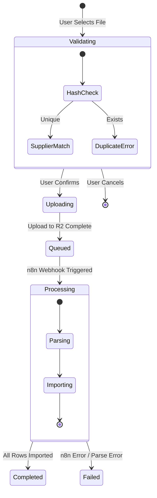

# 🏗️ Design: Import Flow V2 (Thin Backend + R2 + n8n)

> **Date:** December 21, 2025
> **Participants:** [LEAD-DEV], [N8N-EXPERT], [FRONTEND-DEV] > **Status:** DRAFT
> **Goal:** Scalable, serverless import of large CSV files using Cloudflare R2 and n8n.

---

## 🗣️ Team Consensus

**[LEAD-DEV]:** "We must stop sending files through the Python backend. It kills memory. The backend should only sign URLs and track status."
**[FRONTEND-DEV]:** "I need a clean way to upload directly to storage so the UI doesn't freeze. I also need real-time status updates."
**[N8N-EXPERT]:** "Give me a webhook with the R2 file path, and I'll handle the parsing and database insertion. Keep the backend out of the loop."

---

## 🔄 The Flow (Step-by-Step)

### Phase 1: Selection & Validation (Frontend + Backend)

1.  **User** selects CSV file in React UI.
2.  **Frontend** calculates file hash (MD5/SHA) locally.
3.  **Frontend** calls `POST /api/v1/imports/validate-upload`:

    - Input: `filename`, `file_hash`.
    - **Check 1 (Duplicate):** Backend checks DB if hash already exists. If yes -> **BLOCK** ("File already processed").
    - **Check 2 (Supplier Match):** Backend tries to match supplier from filename (Fuzzy Match).
    - Output: `{ "is_valid": true, "suggested_supplier": { "id": "...", "name": "Tricorp" } }` or Error.

4.  **UI Interaction:**
    - If duplicate: Show error.
    - If supplier found: Pre-select in dropdown.
    - If no supplier: User must select from dropdown.
    - _User can always override the selection._

### Phase 2: Direct Upload (Frontend + R2)

5.  **User** confirms upload.
6.  **Frontend** calls `POST /api/v1/imports/upload-url` (Backend).
7.  **Backend** generates a **Presigned URL** for Cloudflare R2 (PUT request).
8.  **Frontend** uploads file **directly to R2** using the Presigned URL.

### Phase 3: Trigger & Orchestration (Backend + n8n)

5.  **Frontend** calls `POST /api/v1/imports/jobs` with `file_key` (e.g., `raw-uploads/file.csv`).
6.  **Backend**:
    - Creates `Dataset` record in DB (Status: `pending`).
    - **Triggers n8n Webhook** (`POST /webhook/import-processor`) with Job ID & File Key.
    - Returns `job_id` to Frontend.

### Phase 3: Processing (n8n)

7.  **n8n Workflow**:
    - **Node 1:** Webhook Trigger.
    - **Node 2:** S3/R2 Download (using File Key).
    - **Node 3:** Parse CSV (Spreadsheet File node).
    - **Node 4:** Update DB Status -> `processing`.
    - **Node 5:** Loop over rows -> Upsert into `products` table.
    - **Node 6:** Update DB Status -> `completed` (or `failed`).

### Phase 4: Feedback (Frontend)

8.  **Frontend** polls `GET /api/v1/imports/jobs/{id}` every 3 seconds.
9.  **UI** shows progress bar or "Completed" state based on DB status.

---

## 🧪 Validation Strategy (Happy Flow PoC)

Before writing full application code, we verify the critical path via CLI scripts.

### Test 1: Infrastructure & Connectivity

**Goal:** Verify R2 credentials and Presigned URL generation.

- [ ] Script: `scripts/poc_r2_direct_upload.py`
- [ ] Action: Generate URL -> Upload Dummy CSV -> List Object
- [ ] Success: File appears in R2 bucket `databiz-development`.

### Test 2: n8n Connectivity

**Goal:** Verify n8n can access the uploaded file.

- [ ] Action: Create simple n8n workflow (Webhook -> S3 Get Object).
- [ ] Trigger: Manually trigger with file key from Test 1.
- [ ] Success: n8n downloads the CSV content.

---

## 📝 Technical Specs

### 1. Backend API (FastAPI)

**Endpoint:** `POST /api/v1/imports/validate-upload`

```json
// Request
{ "filename": "tricorp_2025.csv", "file_hash": "md5-hash-string" }

// Response (Success)
{
  "is_duplicate": false,
  "suggested_supplier": { "id": "uuid", "name": "Tricorp", "confidence": 0.95 }
}

// Response (Duplicate Error)
{
  "is_duplicate": true,
  "message": "This file was already processed on 2025-12-20."
}
```

**Endpoint:** `POST /api/v1/imports/upload-url`

```json
// Request
{ "filename": "catalog.csv", "content_type": "text/csv" }

// Response
{
  "upload_url": "https://<account>.r2.cloudflarestorage.com/databiz-dev/raw/catalog.csv?signature=...",
  "file_key": "raw/catalog.csv"
}
```

**Endpoint:** `POST /api/v1/imports/jobs`

```json
// Request
{ "supplier_id": "uuid", "file_key": "raw/catalog.csv" }

// Response
{ "job_id": "uuid", "status": "pending" }
```

### 2. n8n Workflow Contract

**Webhook Payload:**

```json
{
  "event": "import.requested",
  "payload": {
    "job_id": "uuid",
    "file_key": "raw/catalog.csv",
    "supplier_id": "uuid"
  }
}
```

### 3. Frontend Components

- `FileUploader`: Handles file selection and PUT to R2.
- `ImportStatus`: Polls job status and displays steps (Uploading -> Queued -> Processing -> Done).

---

## 🧠 Domain Behavior (BA Models)

### 1. State Machine (Lifecycle)

The `ImportJob` entity is the heart of this domain. It tracks the file from user selection to database insertion.



### 2. Business Rules (Gherkin/BDD)

These scenarios define the acceptance criteria for the "Validation Phase".

**Feature: Smart Upload Validation**

```gherkin
Scenario: Detect Duplicate File
    Given a file named "winter_collection.csv" with hash "A1B2C3" was successfully imported yesterday
    When I select the same file "winter_collection.csv" (hash "A1B2C3") for upload
    Then the system should detect it is a duplicate
    And the system should show a warning "File already imported on [Date]"
    And the "Upload" button should be disabled by default

Scenario: Fuzzy Match Supplier
    Given a supplier "Tricorp Workwear" exists in the database
    When I select a file named "Tricorp_Prices_2025.csv"
    Then the system should suggest "Tricorp Workwear" as the supplier
    And the confidence score should be high (>80%)

Scenario: Unknown Supplier
    Given no supplier matches "Unknown_Brand.csv"
    When I select the file
    Then the system should allow the upload
    But the user must manually select a supplier from the dropdown
```

---

## ✅ Action Items

- [ ] **[BACKEND]** Implement `generate_presigned_url` service (using `boto3`).
- [ ] **[FRONTEND]** Update `useImportFlow` to use direct R2 upload.
- [ ] **[N8N]** Create `import-processor-r2` workflow (S3 Node instead of HTTP Request).
