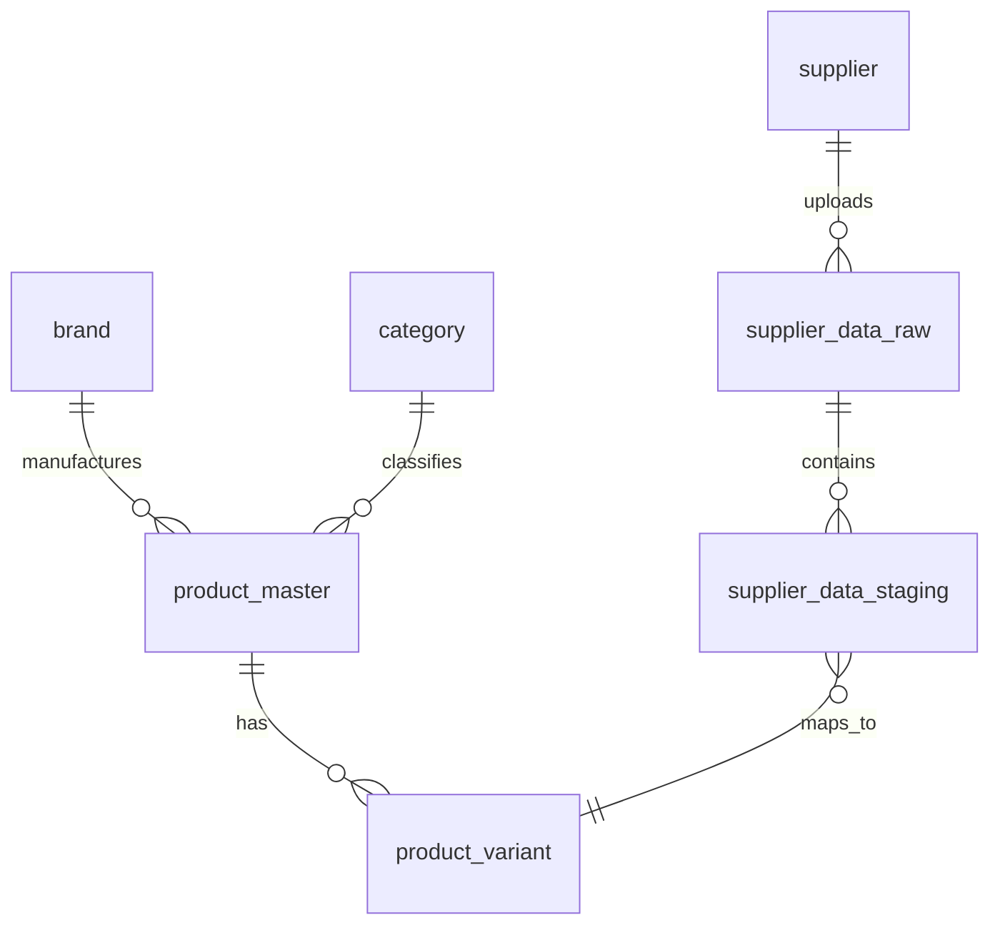

# Core Entities & Database Schema

This document describes the physical database structure (PostgreSQL) and maps it to the Domain Concepts defined in `01-domain/UBIQUITOUS_LANGUAGE.md`.

## 1. Product Catalog (The "Golden Record")

These tables store the standardized, supplier-independent product data.

### `product_master` (Concept: ProductMaster)

The abstract parent product.

- **PK**: `id` (UUID)
- **Key Fields**:
  - `product_number` (String, Unique): Internal reference number.
  - `name` (String): Generic name (e.g., "T-Shirt Basic").
  - `brand_id` (FK -> `brand.id`): The manufacturer.
  - `category_code` (FK -> `category.category_code`): Classification.
  - `status` (Enum): `active`, `inactive`, `archived`.

### `product_variant` (Concept: ProductVariant)

The concrete sellable item.

- **PK**: `id` (UUID)
- **Key Fields**:
  - `product_id` (FK -> `product_master.id`): Parent link.
  - `ean` (String(13), Unique): **MANDATORY** barcode.
  - `sku` (String): Stock Keeping Unit.
  - `color_code` (String): Normalized color code.
  - `size_code` (String): Normalized size code.
  - `status` (Enum): `active`, `inactive`, `discontinued`.

## 2. Supplier Data Pipeline

These tables handle the ingestion and processing of raw data.

### `supplier`

The source of the data.

- **PK**: `id` (UUID)
- **Key Fields**: `name`, `code`, `is_active`.

### `supplier_data_raw` (Concept: SupplierDataset)

The raw file upload.

- **PK**: `id` (UUID)
- **Key Fields**:
  - `supplier_id` (FK): Who sent it.
  - `raw_data` (JSONB): The complete, untouched content of the CSV/XLSX.
  - `processing_status` (Enum): `received`, `processing`, `completed`, `failed`.
  - `activation_status` (Enum): `pending`, `active`.

### `supplier_data_staging` (Concept: SupplierProduct)

The extracted, identifiable products from a dataset.

- **PK**: `id` (UUID)
- **Key Fields**:
  - `supplier_data_raw_id` (FK): Origin dataset.
  - `ean` (String): Extracted EAN.
  - `style_raw`, `color_raw`, `size_raw`: Original values from the file.
  - `mapped_to_variant_id` (FK -> `product_variant.id`): Link to the Golden Record (if matched).

## 3. Taxonomy & Reference

### `brand`

- **PK**: `id` (UUID)
- **Key Fields**: `name`, `code` (3-char unique).

### `category`

- **PK**: `id` (UUID)
- **Key Fields**: `category_code`, `name_nl`, `parent_category_id`.

## 4. Critical Relationships (ERD)

