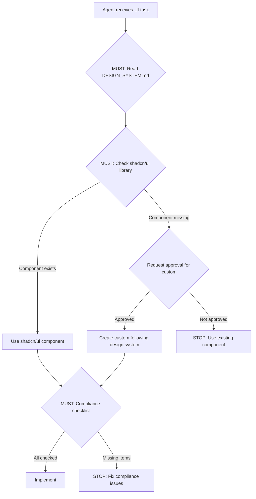

# DataBiz Design System

> **Version**: 2.0.0
> **Last Updated**: 2026-01-08
> **Applies to**: DataBiz project
> **Framework**: shadcn/ui (Tailwind CSS + Radix UI)
> **Target**: Desktop data processing application (1440px minimum)

---

## 🎯 Core Principles

### 1. Consistency is King

**Agents MUST use existing patterns before creating new ones.**

- ✅ **DO**: Check shadcn/ui component library first
- ✅ **DO**: Use design tokens from this document
- ✅ **DO**: Reuse existing components
- ❌ **DON'T**: Create custom components without checking shadcn/ui first
- ❌ **DON'T**: Create custom colors without approval
- ❌ **DON'T**: Invent new component variants

**Rationale**: Users learn patterns once, apply everywhere. Framework components ensure consistency and accessibility.

---

### 2. Accessibility First

**All components must meet WCAG 2.1 Level AA standards.**

- ✅ **DO**: Include proper ARIA labels
- ✅ **DO**: Ensure 4.5:1 color contrast for text
- ✅ **DO**: Support keyboard navigation
- ✅ **DO**: Provide focus indicators
- ❌ **DON'T**: Use color as sole differentiator
- ❌ **DON'T**: Create keyboard traps

**Rationale**: Inclusive design benefits all users. shadcn/ui components include accessibility by default.

---

### 3. Desktop-First (Data Processing Focus)

**This is a desktop application for data processing. No mobile/responsive design.**

- ✅ **DO**: Design for 1440px minimum screen width
- ✅ **DO**: Use full-width layouts for data-dense interfaces
- ✅ **DO**: Implement horizontal scroll for wide data tables
- ✅ **DO**: Use sticky headers and row titles for tables
- ❌ **DON'T**: Add responsive breakpoints (sm:, md:, lg:)
- ❌ **DON'T**: Design for mobile or tablet
- ❌ **DON'T**: Use mobile-first patterns

**Rationale**: DataBiz is a desktop application for data processing. Users work on large screens with precise mouse/keyboard input.

---

### 4. Progressive Disclosure

**Show essentials first, reveal complexity on demand.**

- ✅ **DO**: Use accordions for secondary information
- ✅ **DO**: Implement "Show more" patterns
- ✅ **DO**: Hide advanced features behind toggles
- ❌ **DON'T**: Show all form fields at once
- ❌ **DON'T**: Overwhelm with options

**Rationale**: Reduces cognitive load, increases completion rates.

---

### 5. Instant Feedback

**Every user action gets immediate visual response.**

- ✅ **DO**: Show loading states (spinners, skeletons)
- ✅ **DO**: Provide success/error feedback
- ✅ **DO**: Use optimistic UI updates
- ✅ **DO**: Disable buttons during processing
- ❌ **DON'T**: Leave users wondering if action registered
- ❌ **DON'T**: Use silent failures

**Rationale**: Perceived performance = actual UX quality. Critical for data processing workflows.

---

## 📐 Layout Rules

### Desktop Minimum

- **Minimum screen width**: 1440px (recommended, not enforced)
- **No responsive design**: Application is desktop-only
- **Container strategy**: Containers should fit naturally within viewport width
- **No forced minimum width**: Do not use `min-w-[1440px]` on containers - causes unnecessary horizontal scroll
- **Full-width containers**: No max-width restrictions for data interfaces
- **Horizontal scroll**: Use only for data tables with many columns (not for page containers)

### Grid System

- **Base unit**: 4px (0.25rem)
- **Spacing scale**: 4, 8, 12, 16, 24, 32, 48, 64, 96px
- **Container strategy**: Full-width with horizontal scroll when needed

### Data Table Layout

**For data-dense tables with many columns:**

- **Sticky headers**: Table headers remain visible when scrolling vertically
- **Sticky row titles**: First column (row identifier) remains visible when scrolling horizontally
- **Horizontal scroll**: Table scrolls horizontally when content exceeds viewport width
- **Full-width**: Table uses full available width

**Implementation pattern:**
```tsx
<div className="w-full overflow-x-auto">
  <table className="w-full border-collapse">
    <thead className="sticky top-0 bg-zinc-900 z-10">
      {/* Headers */}
    </thead>
    <tbody>
      <tr>
        <td className="sticky left-0 bg-zinc-900 z-10">{/* Row title */}</td>
        {/* Data cells */}
      </tr>
    </tbody>
  </table>
</div>
```

### White Space

- **Dense**: 8px gaps (data tables, compact lists)
- **Normal**: 16px gaps (forms, cards)
- **Relaxed**: 24px gaps (sections, page breaks)

---

## 🎨 Color System (Dark Mode First)

### Framework: shadcn/ui with Zinc Palette

**Default**: Dark mode only (no light mode support)

We use **Tailwind Zinc** palette for a professional, neutral dark theme that reduces eye strain during long data processing sessions.

### Semantic Tokens (Dark Mode)

| Semantic Token | Tailwind Class | Usage |
|----------------|----------------|-------|
| `background` | `bg-zinc-950` | Page background |
| `surface` | `bg-zinc-900` | Cards, Sidebars, Modals |
| `surface-highlight` | `bg-zinc-800` | Hover states, Active items |
| `border` | `border-zinc-800` | Dividers, Inputs |
| `text-main` | `text-zinc-50` | Headings, Body text |
| `text-muted` | `text-zinc-400` | Secondary text, Labels |

### Status Colors (Business Standard)

Standardized colors for feedback and status:

- **Success (Emerald)**: `text-emerald-400` / `bg-emerald-500/10` - Completed actions, positive status
- **Warning (Amber)**: `text-amber-400` / `bg-amber-500/10` - Attention needed, non-blocking errors
- **Error (Rose)**: `text-rose-400` / `bg-rose-500/10` - Critical failures, validation errors
- **Info (Sky)**: `text-sky-400` / `bg-sky-500/10` - Neutral information, processing states

### Agent Rules for Colors

1. **NEVER use Hex Codes**: Do not write `#18181b`. Use `bg-zinc-900`.
2. **NEVER use arbitrary colors**: Use semantic tokens or status colors only.
3. **Dark Mode Only**: All components assume dark mode.
4. **Contrast Check**: Ensure `text-muted` is readable on `surface` (WCAG AA).

---

## 📝 Typography

### Font Families

- **Sans**: Inter, system-ui, sans-serif (`font-sans`) - UI, Headings, Body
- **Mono**: ui-monospace, SFMono-Regular, monospace (`font-mono`) - EAN codes, IDs, technical data

### Typography Scale

| Level | Size | Line Height | Tailwind Class | Usage |
|-------|------|-------------|----------------|-------|
| **H1** | 1.5rem (24px) | 2rem (32px) | `text-2xl font-semibold` | Page Titles (compact) |
| **H2** | 1.875rem (30px) | 2.25rem (36px) | `text-3xl font-semibold tracking-tight` | Section Headings |
| **H3** | 1.5rem (24px) | 2rem (32px) | `text-2xl font-semibold` | Card Titles, Modal Headers |
| **H4** | 1.25rem (20px) | 1.75rem (28px) | `text-xl font-medium` | Subsections |
| **Body** | 1rem (16px) | 1.5rem (24px) | `text-base font-normal` | Standard content |
| **Small** | 0.875rem (14px) | 1.25rem (20px) | `text-sm font-normal` | Form labels, secondary text |
| **Tiny** | 0.75rem (12px) | 1rem (16px) | `text-xs font-medium` | Badges, Captions |

### Data Typography (Data Tables)

**For data-dense tables, use smaller font sizes:**

- **Table data**: `text-xs` or `text-sm` (12px or 14px)
- **Table headers**: `text-sm font-semibold` (14px, semibold)
- **Compact lists**: `text-sm` (14px)

### Compact List Pattern

**For data-dense list views (sessions, items, etc.):**

- Use compact table layout instead of large cards
- Minimal padding: `p-2` or `p-3` instead of `p-6`
- Smaller fonts: `text-xs` for data, `text-sm` for labels
- Row height: Compact rows with `h-10` or `h-12` maximum
- Hover states: Subtle background change on hover
- Inline actions: Small buttons/icons in table cells
- Example: Sessions list, import history, data logs

### Special Typography Rules

**EAN Codes** (must stand out):
- Use `font-mono` (monospace font)
- Use `text-sm` or `text-base` size
- Consider accent color: `text-primary` or `text-emerald-400`
- Example: `<span className="font-mono text-sm text-emerald-400">8712345678901</span>`

**Names** (must stand out):
- Use `font-semibold` or `font-bold`
- Use `text-base` or `text-sm` size
- Example: `<span className="font-semibold text-base">Product Name</span>`

### Font Weights

- **Regular (400)**: `font-normal` - Body text, paragraphs
- **Medium (500)**: `font-medium` - Labels, Buttons, Navigation
- **Semibold (600)**: `font-semibold` - Subheadings, Names, Emphasized data
- **Bold (700)**: `font-bold` - Main Headings (H1)

---

## 🧩 Component Library (shadcn/ui)

**Framework**: Use [shadcn/ui](https://ui.shadcn.com/) components. Check the component library first before creating custom components.

### 1. Buttons

Use shadcn/ui Button component. Variants:
- **default**: Primary action
- **secondary**: Secondary action
- **ghost**: Tertiary action
- **destructive**: Destructive action
- **outline**: Outlined button

Sizes: `sm`, `default`, `lg`

### 2. Form Inputs

Use shadcn/ui Input component. Style: Filled with border on focus.

### 3. Data Tables

**Critical component for DataBiz**. Use shadcn/ui Table component with customizations:

- **Sticky headers**: `sticky top-0 bg-zinc-900 z-10`
- **Sticky row titles**: `sticky left-0 bg-zinc-900 z-10` (first column)
- **Horizontal scroll**: Wrap table in `overflow-x-auto` container
- **Compact spacing**: Use `text-xs` or `text-sm` for data cells
- **Full-width**: Table uses full available width

### 4. Cards & Containers

Use shadcn/ui Card component or simple bordered containers:

```tsx
<div className="rounded-lg border border-zinc-800 bg-zinc-900 p-6">
  {/* Content */}
</div>
```

### 5. Status Badges

Use shadcn/ui Badge component with status colors:

- **Success**: `bg-emerald-500/10 text-emerald-400`
- **Warning**: `bg-amber-500/10 text-amber-400`
- **Error**: `bg-rose-500/10 text-rose-400`
- **Info**: `bg-sky-500/10 text-sky-400`
- **Neutral**: `bg-zinc-500/10 text-zinc-400`

### 6. Navigation

**Sidebar (Desktop-only)**:
- **Width**: `w-64` (256px)
- **Position**: Fixed Left (`fixed inset-y-0 left-0`)
- **Styling**: `border-r border-zinc-800 bg-zinc-900`
- **Content**: Logo (Top), Primary Navigation (Middle), User Profile (Bottom)

Use shadcn/ui components where available (e.g., Navigation Menu).

---

## 💬 Tone of Voice & Language

> **Interface Language**: Dutch (Nederlands) 🇳🇱
> **Code & Documentation**: English 🇺🇸
> **Style**: Professional, Friendly, Helpful (Vriendelijk, netjes informeel, adviserend assistent)

### Core Principles

#### Professional but Friendly

We speak to professionals, but we are not robots.

- ✅ **DO**: "Wijzigingen opgeslagen."
- ❌ **DON'T**: "De data is succesvol weggeschreven naar de database." (Too technical)
- ❌ **DON'T**: "Joepie! Het is gelukt! 🎉" (Too informal)

#### Helpful & Clear

When things go wrong, we explain **what** happened and **how** to fix it.

- ✅ **DO**: "Dit e-mailadres is niet geldig. Controleer of er een '@' in staat."
- ❌ **DON'T**: "Ongeldige invoer." (Too vague)
- ❌ **DON'T**: "Error 500." (Useless)

#### Concise

Users scan, they don't read. Keep labels and messages short.

- ✅ **DO**: "Wachtwoord vergeten?"
- ❌ **DON'T**: "Ben je misschien je wachtwoord vergeten? Klik dan hier."

### Error Messages Strategy

We use a **Two-Layer Error Strategy**:

1. **User Message (Visible)**: Clear, actionable, Dutch.
   - *Example*: "Het importeren van het bestand is mislukt omdat het formaat onjuist is."
2. **Technical Detail (Expandable/Console)**: Precise, English/Code, for debugging.
   - *Example*: `Error: CSV header mismatch. Expected 'sku', found 'product_id'.`

### Language Separation

| Context | Language | Example |
|---------|----------|---------|
| **UI Labels** | Dutch | "Opslaan", "Annuleren", "Nieuw Product" |
| **Success Messages** | Dutch | "Product succesvol aangemaakt." |
| **Error Messages** | Dutch | "Kan geen verbinding maken met de server." |
| **Code (Variables)** | English | `const saveButton = ...` |
| **Code (Comments)** | English | `// Handle form submission` |
| **Git Commits** | English | `feat: add product creation form` |
| **Documentation** | English | "This component renders a product card." |

### Ubiquitous Language (Domain Specific)

Terminology is defined at the **Project Level** (see `AI/Company/README.md`).
Agents must respect the domain language (e.g., "EAN-variant", "Assortiment", "Dataset").

**Agent Rule**: If you encounter a domain term, check the project's Ubiquitous Language dictionary first. Never invent new terms for existing concepts.

---

## ♿ Accessibility

### WCAG 2.1 Level AA Compliance

All components must meet WCAG 2.1 Level AA standards.

### Focus Indicators

Use custom high-contrast focus rings (shadcn/ui includes these by default):

```tsx
// Standard Focus Ring (included in shadcn/ui components)
focus:outline-none focus:ring-2 focus:ring-offset-2 focus:ring-primary-500
```

### Screen Reader Support

- Use semantic HTML (`<main>`, `<nav>`, `<aside>`, `<h1>`-`<h6>`)
- Use ARIA labels for icon-only buttons
- Use `aria-expanded` or `aria-pressed` for state
- Use `role="alert"` for dynamic error messages

### Keyboard Navigation

- All interactive elements must be keyboard accessible
- Tab order must be logical
- No keyboard traps
- Escape key closes modals/dialogs

### Motion & Animation

Respect user's `prefers-reduced-motion` preference:

```tsx
className="motion-safe:transition-all motion-reduce:transition-none"
```

### Status Row Animations

Voor datasets die nog bezig zijn of actie nodig hebben, gebruik een subtiele fade animatie over de hele regel:

- **Wanneer**: Status is `processing` of `action_required`
- **Kleur**: Subtiele blauwe achtergrond (`bg-sky-500/5`)
- **Animatie**: `animate-fade-subtle` (3s infinite fade in/out)
- **Doel**: Visuele feedback dat er nog iets gebeurt, zonder opdringerig te zijn

**Voorbeeld**:
```tsx
<DataTableRow 
  className={cn(
    (displayStatus === 'processing' || displayStatus === 'action_required') && 
    'bg-sky-500/5 animate-fade-subtle motion-safe:animate-fade-subtle motion-reduce:animate-none'
  )}
>
```

**Richtlijnen**:
- Gebruik zeer lage opacity voor achtergrond (5% of minder)
- Langzame animatie (3s) voor subtiliteit
- Respecteer `prefers-reduced-motion` met `motion-reduce:animate-none`
- Blauwe tint (`sky-500`) voor processing states

### Color Contrast

- **Text**: Minimum 4.5:1 contrast ratio against background
- **Large Text**: Minimum 3:1 contrast ratio
- **UI Components**: Borders and icons must have 3:1 contrast

---

## 🚨 Agent Enforcement Rules (MANDATORY)

### ⚠️ KRITISCH: Agents kunnen NIET om dit design system heen

**VOOR ELKE UI COMPONENT MOET JE:**

1. **MUST**: Lees dit document volledig
2. **MUST**: Check shadcn/ui component library eerst
3. **MUST**: Doorloop de compliance checklist hieronder
4. **MUST**: Gebruik framework componenten (shadcn/ui)
5. **MUST**: Volg desktop-first (1440px minimum, geen responsive)

### Quality Gate: Design System Compliance (Niet Overslaanbaar)

**BEFORE any Frontend Dev work proceeds, verify ALL of these:**

- [ ] **MUST**: Component checked in shadcn/ui library first
- [ ] **MUST**: Desktop-first (1440px minimum) - GEEN responsive code
- [ ] **MUST**: Dark mode only - GEEN light mode code
- [ ] **MUST**: Colors use Zinc semantic tokens - GEEN arbitrary hex values
- [ ] **MUST**: Spacing uses 4px grid system - GEEN arbitrary spacing
- [ ] **MUST**: Typography follows scale - GEEN arbitrary font sizes
- [ ] **MUST**: EAN codes use `font-mono` and stand out
- [ ] **MUST**: Names use `font-semibold` or `font-bold`
- [ ] **MUST**: Data tables have sticky headers (if applicable)
- [ ] **MUST**: Accessibility requirements met (ARIA, contrast, keyboard)
- [ ] **MUST**: Loading/error states included
- [ ] **MUST**: Framework component used (shadcn/ui) - GEEN custom component zonder goedkeuring

**If ANY checkbox is unchecked, STOP and fix it. Do not proceed without compliance.**

### Blokkerende Regels (Code wordt geweigerd als deze regels worden overtreden)

❌ **GEEN code zonder design system verificatie**
❌ **GEEN custom componenten zonder eerst shadcn/ui te checken**
❌ **GEEN mobile/responsive code** (desktop-only)
❌ **GEEN light mode code** (dark mode only)
❌ **GEEN arbitrary colors/spacing/font sizes** (gebruik design system)
❌ **GEEN componenten buiten framework** (shadcn/ui tenzij expliciet goedgekeurd)

### Reference Flow for Agents (MUST FOLLOW)



---

## 🎯 Success Metrics

**Design system is working when:**

- ✅ 90%+ of components from shadcn/ui (not custom)
- ✅ Zero accessibility violations in Lighthouse
- ✅ Consistent UI across all features
- ✅ Desktop-first, no responsive code
- ✅ Dark mode only, no light mode code
- ✅ All EAN codes and Names stand out correctly
- ✅ Data tables have sticky headers and horizontal scroll

---

## 📚 Framework Resources

- **shadcn/ui**: https://ui.shadcn.com/
- **Tailwind CSS**: https://tailwindcss.com/
- **Radix UI**: https://www.radix-ui.com/ (primitives used by shadcn/ui)
- **Zinc Color Palette**: Tailwind default (zinc-50 through zinc-950)

---

**Questions?** See `AI/Company/README.md` or ask Product Owner.

**Version**: 2.0.0  
**Last Updated**: 2026-01-08
