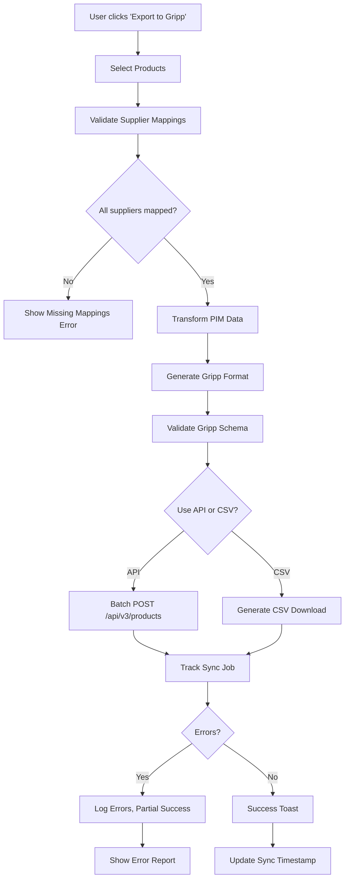

# Gripp Integration Analysis

**Document Versie:** 1.0  
**Laatst Bijgewerkt:** 2025-11-05  
**Doel:** Evaluatie van bidirectionele integratie tussen Van Kruiningen PIM en Gripp ERP

---

## Executive Summary

Dit document analyseert de mogelijkheden voor **bidirectionele synchronisatie** tussen het Van Kruiningen PIM systeem en Gripp ERP. Het behandelt:

1. **Gripp Export Dataset** - Analyse van huidige Gripp productdata structuur
2. **Gripp Import Template** - Vereisten voor producten aanmaken in Gripp
3. **Gripp API v3** - Programmatische toegang tot Gripp (toekomstige uitwerking)
4. **Mapping Matrix** - PIM ↔ Gripp field mapping met transformaties
5. **Gap Analysis** - Kritieke verschillen en oplossingen
6. **Implementatie Roadmap** - Stapsgewijze uitrol strategie

### Kernbevindingen

**✅ DATA SUFFICIENCY ASSESSMENT**

> **Conclusie:** PIM heeft **voldoende data** om Gripp producten aan te maken en te wijzigen, **mits** onderstaande voorwaarden worden geïmplementeerd.

**✅ Voldoende Data:**
- Product naming (via style_name + color + size)
- Prijzen (cost + selling + BTW)
- Supplier SKU (supplier_sku)
- EAN codes (via product_variants.ean)
- Grootboek categorieën (via category mapping)
- Voorraad (stock_quantity)

**⚠️ Kritieke Voorwaarden:**

1. **Leverancier ID Mapping Vereist**
   - Gripp gebruikt numerieke `relatienummerleverancier`
   - PIM gebruikt `suppliers.id`
   - **Oplossing:** Mapping table `gripp_supplier_mappings` (zie Database Schema)

2. **EAN Strategie**
   - Gripp heeft **geen dedicated EAN veld**
   - **Huidige situatie:** EAN in `Omschrijving` kolom (export)
   - **Toekomstige mogelijkheid:** Via API mogelijk in correct veld
   - **Risico:** EAN parsing bij reimport

3. **Variant Grouping**
   - Gripp behandelt elke kleur-maat als **apart product**
   - PIM gebruikt `product_styles` (style) + `product_variants` (SKU)
   - **Impact:** Geen parent-child relatie in Gripp

4. **Afbeeldingen**
   - Gripp ondersteunt **geen image URLs** in import/export
   - **Beslissing:** Images blijven PIM-only

5. **Sync Strategie (Besloten)**
   - **Primary System:** PIM is "source of truth"
   - **Sync Richting:** PIM → Gripp (on-demand/manual)
   - **Prijsbeheer:** Later via Pricing Service (moet bidirectioneel blijven)

---

## 1. Gripp Export Dataset Analysis

### 1.1 Dataset Kenmerken

**Bron:** CSV export vanuit Gripp  
**Record Count:** 5,992 workwear variants  
**Encoding:** UTF-8  
**Delimiter:** Semicolon (`;`)  
**Scope:** **Kleding producten alleen** (Sign materials worden genegeerd)

### 1.2 Gripp Product Naming Convention

**Legacy Format Discovery:**

```
[ARTIKELCODE] | [MERK] | [PRODUCT TYPE] | [KLEUR] | [MAAT]
```

**Voorbeelden per Leverancier:**

| Supplier | Example |
|----------|---------|
| Blåkläder | `151318608699C48` \| `Blåkläder` \| `Winterjas 1513` \| `Army groen/zwart` \| `C48` |
| Tee Jays | `8005_108_S` \| `Tee Jays` \| `Luxury Stripe Polo` \| `Navy/White` \| `S` |
| Mascot | `50127-933-01009_44` \| `Mascot` \| `Werkbroek Lerida` \| `Marine` \| `C44` |
| Workmen | `1401_navy_S` \| `Workmen` \| `Poloshirt Premium` \| `Navy` \| `S` |
| FHB | `79900-20-S` \| `FHB` \| `Softshell Jack RALF` \| `Antraciet` \| `S` |

### 1.3 Column Analysis (Export Dataset)

| Column | Type | Fill Rate | Purpose | Import Relevant? |
|--------|------|-----------|---------|------------------|
| **Nummer** | String | 100% | Gripp internal product ID | ✅ Critical (for updates) |
| **Naam** | String | 100% | Pipe-separated naming | ✅ Critical (parsing needed) |
| **Eenheid** | String | 100% | Unit ("x" = stuks) | ✅ Required (always "x") |
| **Prijs** | String | 100% | Selling price (€ format) | ✅ Critical |
| **Inkoopprijs** | String | 98% | Cost price | ✅ Critical |
| **BTW-tarief** | String | 100% | VAT rate (21.00% / 9.00%) | ✅ Required |
| **Grootboek verkoop** | String | 100% | Sales ledger (8351 = kleding) | ✅ Filter/Category |
| **Grootboek inkoop** | String | 100% | Purchase ledger (5001 = kleding) | ⚠️ Optional |
| **Omschrijving** | String | 100% | **EAN hidden here!** | ⚠️ **EAN extraction** |
| **Bestelcode leverancier** | String | 95% | Supplier SKU | ✅ Critical |
| **Leverancier ID** | Integer | 100% | Gripp supplier ID | ⚠️ **Mapping needed** |
| **EAN** | String | 0% | **Unused!** | ❌ Not used by Gripp |
| **Interne notitie** | String | 5% | Internal notes | ⚠️ Optional |
| **Tags** | String | 100% | Category/product group | ⚠️ Optional (category) |
| **Afbeelding** | String | 0% | Image URL | ❌ **Not supported** |
| **Fabrikant** | String | 0% | Manufacturer | ❌ Not used |
| **In gebruik** | String | ~10% | "Ja" = used in invoices | ⚠️ Optional filter |
| **Marge** | String | 98% | Margin % | ℹ️ Calculated field |

**Kritieke Observaties:**

1. **EAN Locatie:** EAN codes staan in `Omschrijving` kolom (format: `EAN: 1234567890123`)
2. **Geen afbeeldingen:** Dataset bevat geen image URLs
3. **"In gebruik" betekenis:** "Ja" = product al gefactureerd in Gripp (active assortiment indicator)
4. **Leverancier ID:** Numerieke codes zonder context (912, 17, 1000467) - **mapping table vereist**
5. **Variant grouping:** Elke kleur-maat combinatie is een apart Gripp product

### 1.4 Gripp Product Name Parsing Logic

**Pseudo-code voor naam extractie:**

```typescript
interface ParsedGrippName {
  artikelcode: string;      // Supplier SKU
  merk: string;             // Brand
  productType: string;      // Product type
  kleur: string;            // Color
  maat: string;             // Size
}

function parseGrippProductName(naam: string): ParsedGrippName {
  const parts = naam.split(' | ').map(p => p.trim());
  
  if (parts.length !== 5) {
    throw new Error(`Invalid Gripp name format: ${naam}`);
  }
  
  return {
    artikelcode: parts[0],
    merk: parts[1],
    productType: parts[2],
    kleur: parts[3],
    maat: parts[4]
  };
}

// EAN extraction from Omschrijving
function extractEAN(omschrijving: string): string | null {
  const match = omschrijving.match(/EAN:\s*(\d{13})/);
  return match ? match[1] : null;
}
```

### 1.5 Dataset Statistics

**Prijssegmentatie (geschat):**
- Budget (< €20): ~30%
- Mid-range (€20-€50): ~50%
- Premium (> €50): ~20%

**Leverancier Distributie (geschat uit Leverancier ID):**
- ~8 unieke leveranciers
- Grootste leveranciers: ID 912, 17, 1000467

**Merk Distributie (geschat uit naming):**
- ~25 unieke merken
- Top merken: Blåkläder, Tee Jays, Mascot, Workmen, FHB, Santino

**"In gebruik" Status:**
- ~10% van producten heeft "Ja" (active assortiment)
- ~90% nog nooit gefactureerd (legacy/discontinued?)

---

## 2. Gripp Import Template Analysis

### 2.1 Template Structuur

**Bron:** `import_producten.xlsx` (user upload)  
**Format:** Excel (.xlsx)  
**Columns:** 21 velden  
**Purpose:** Bulk product import into Gripp

### 2.2 Field Definitions (Import Template)

| Column (NL) | Data Type | Required | Purpose | Example |
|-------------|-----------|----------|---------|---------|
| **nummer** | String | Optional | Gripp product ID (for updates) | `12345` |
| **naam** | String | **Required** | Product name | `MASTER-BLA-1513-ARMZW-C48` |
| **eenheid** | String | **Required** | Unit | `x` (stuks) |
| **verkoopprijs** | Decimal | **Required** | Selling price | `89.95` |
| **inkoopprijs** | Decimal | Optional | Cost price | `45.00` |
| **btwtarief** | Decimal | **Required** | VAT rate | `21.00` |
| **grootboek** | String | Optional | Ledger code | `8351` |
| **omschrijving** | String | Optional | Description (**EAN here!**) | `EAN: 1234567890123` |
| **bestelcodeleverancier** | String | Optional | Supplier SKU | `151318608699C48` |
| **relatienummerleverancier** | Integer | Optional | Gripp supplier ID | `912` |
| **tags** | String | Optional | Category tags | `Werkkleding, Jassen` |
| **internenotitie** | String | Optional | Internal notes | - |
| **actief** | Boolean | Optional | Is active? | `1` |
| **voorraad** | Integer | Optional | Stock quantity | `50` |
| **minimum_voorraad** | Integer | Optional | Reorder point | `10` |
| **locatie** | String | Optional | Storage location | `A12` |
| **gewicht** | Decimal | Optional | Weight (kg) | `0.5` |
| **lengte** | Decimal | Optional | Length (cm) | - |
| **breedte** | Decimal | Optional | Width (cm) | - |
| **hoogte** | Decimal | Optional | Height (cm) | - |
| **website** | Boolean | Optional | Show on website? | `1` |

### 2.3 Kritieke Verschillen: Export vs Import

| Aspect | Export Column | Import Column | Mismatch Impact |
|--------|---------------|---------------|-----------------|
| Selling Price | `Prijs` | `verkoopprijs` | ⚠️ Name diff |
| Cost Price | `Inkoopprijs` | `inkoopprijs` | ✅ Match |
| VAT | `BTW-tarief` | `btwtarief` | ⚠️ Format diff (21.00% vs 21.00) |
| Supplier ID | `Leverancier ID` | `relatienummerleverancier` | ⚠️ Name diff |
| Supplier SKU | `Bestelcode leverancier` | `bestelcodeleverancier` | ✅ Match |
| EAN | `Omschrijving` | `omschrijving` | ⚠️ **No dedicated field!** |
| Product ID | `Nummer` | `nummer` | ✅ Match |
| Unit | `Eenheid` | `eenheid` | ✅ Match |

**🚨 CRITICAL FINDING:**

Gripp import template heeft **geen dedicated EAN veld**. Huidige workaround:
- **Export:** EAN staat in `Omschrijving` als `EAN: 1234567890123`
- **Import:** EAN moet in `omschrijving` veld met zelfde format
- **Risico:** Parsing errors, data loss bij roundtrip

---

## 3. Gripp API v3 Analysis

### 3.1 API Documentatie

**Referentie:**
- Algemene docs: https://support.gripp.com/nl/10408-api-koppelingen
- API Endpoint: https://api.gripp.com/public/api3.php
- Product API: https://api.gripp.com/public/api3.php#product

**Status:** Gedetailleerde API documentatie wordt **later toegevoegd** (API web search niet bereikbaar tijdens analyse).

### 3.2 API Endpoints (Placeholders)

**Verwachte endpoints voor product management:**

```http
# Product CRUD
POST   /api/v3/products          - Create product
GET    /api/v3/products/:id      - Get product details
PUT    /api/v3/products/:id      - Update product
DELETE /api/v3/products/:id      - Delete product
GET    /api/v3/products          - List products (with filters)

# Bulk operations
POST   /api/v3/products/bulk     - Bulk create/update
```

### 3.3 Verwachte API Fields (Te Valideren)

**Hypothesis:** API endpoints gebruiken vergelijkbare velden als import template.

```json
{
  "naam": "MASTER-BLA-1513-ARMZW-C48",
  "eenheid": "x",
  "verkoopprijs": 89.95,
  "inkoopprijs": 45.00,
  "btwtarief": 21.00,
  "grootboek": "8351",
  "omschrijving": "EAN: 1234567890123",
  "bestelcodeleverancier": "151318608699C48",
  "relatienummerleverancier": 912,
  "tags": "Werkkleding, Jassen",
  "voorraad": 50,
  "actief": true
}
```

**EAN Strategie via API:**

> **Mogelijkheid:** API kan mogelijk dedicated EAN veld ondersteunen (te valideren).  
> **Fallback:** Gebruik `omschrijving` veld zoals in huidige export.

### 3.4 API Integration Benefits

**Voordelen boven Import Template:**

1. **Real-time validation** - Directe feedback bij fouten
2. **Transactionele updates** - Atomic operations
3. **Batch operations** - Efficiëntere bulk sync
4. **Error handling** - Gedetailleerde error responses
5. **Mogelijk EAN veld** - Dedicated veld ipv parsing hack

**Te Onderzoeken:**

- [ ] Authentication methode (API key? OAuth?)
- [ ] Rate limiting
- [ ] Dedicated EAN veld beschikbaar?
- [ ] Variant linking mogelijk?
- [ ] Image upload support?
- [ ] Webhook support voor sync triggers?

---

## 4. Bidirectional Mapping Matrix

### 4.1 PIM → Gripp Field Mapping

**Target:** Gripp Import Template / API

| PIM Table.Column | Gripp Field | Transformation | Status | Notes |
|------------------|-------------|----------------|--------|-------|
| **Product Identification** |
| `product_variants.sku_code` | `naam` | Format: `MASTER-{BRAND}-{STYLE}-{COLOR}-{SIZE}` | ✅ Direct | Custom naming convention |
| `product_variants.ean` | `omschrijving` | Format: `EAN: {ean}` | ⚠️ Workaround | No dedicated EAN field |
| `product_variants.supplier_sku` | `bestelcodeleverancier` | Direct copy | ✅ Direct | - |
| **Pricing** |
| `product_variants.selling_price_excl_vat` | `verkoopprijs` | cents → euros (`/100`) | ✅ Transform | 8995 → 89.95 |
| `product_variants.cost_price` | `inkoopprijs` | cents → euros (`/100`) | ✅ Transform | 4500 → 45.00 |
| `product_variants.vat_rate` | `btwtarief` | Direct copy (%) | ✅ Direct | 21.00 |
| **Inventory** |
| `product_variants.stock_quantity` | `voorraad` | Direct copy | ✅ Direct | - |
| `product_variants.reorder_point` | `minimum_voorraad` | Direct copy | ✅ Direct | - |
| `product_variants.stock_location` | `locatie` | Direct copy | ✅ Direct | - |
| **Product Details** |
| `product_styles.weight_grams` | `gewicht` | grams → kg (`/1000`) | ✅ Transform | 500 → 0.5 |
| `product_variants.is_active` | `actief` | Boolean → 1/0 | ✅ Transform | true → 1 |
| `size_options.size_code` | - | Used in `naam` field | ℹ️ Embedded | Part of SKU |
| **Category/Classification** |
| `categories.category_code` | `grootboek` | Map via lookup table | ⚠️ Mapping | Category → Grootboek |
| `categories.category_name_nl` | `tags` | Comma-separated list | ⚠️ Transform | "Jassen, Winterkleding" |
| **Supplier Linking** |
| `suppliers.id` | `relatienummerleverancier` | **Via mapping table** | 🚨 **Critical** | Requires `gripp_supplier_mappings` |
| **Not Supported** |
| `product_variants.supplier_image_urls` | - | ❌ **No image support** | ❌ N/A | Images blijven PIM-only |
| `product_styles.description` | `internenotitie` | Optional copy | ⚠️ Optional | - |

### 4.2 Gripp → PIM Field Mapping

**Target:** PIM Tables (Import scenario)

| Gripp Field | PIM Table.Column | Transformation | Status | Notes |
|-------------|------------------|----------------|--------|-------|
| **Product Parsing** |
| `naam` | Parse into multiple fields | See parsing logic below | ⚠️ Complex | Pipe-separated format |
| → Part 1 | `product_variants.supplier_sku` | Direct | ✅ Direct | - |
| → Part 2 | `brands.brand_name` | Lookup/Create brand | ⚠️ Lookup | - |
| → Part 3 | `product_styles.style_name` | Direct | ✅ Direct | - |
| → Part 4 | Color mapping | Map to `color_family_options` | ⚠️ Mapping | Complex mapping |
| → Part 5 | Size mapping | Map to `size_options` | ⚠️ Mapping | Supplier size → Standard size |
| **Pricing** |
| `verkoopprijs` | `product_variants.selling_price_excl_vat` | euros → cents (`*100`) | ✅ Transform | 89.95 → 8995 |
| `inkoopprijs` | `product_variants.cost_price` | euros → cents (`*100`) | ✅ Transform | 45.00 → 4500 |
| `btwtarief` | `product_variants.vat_rate` | Direct copy | ✅ Direct | - |
| **EAN Extraction** |
| `omschrijving` | `product_variants.ean` | Regex: `/EAN:\s*(\d{13})/` | ⚠️ Parse | Risk: format changes |
| **Supplier Linking** |
| `relatienummerleverancier` | `suppliers.id` | **Via mapping table** | 🚨 **Critical** | Reverse lookup |
| `bestelcodeleverancier` | `product_variants.supplier_sku` | Direct copy | ✅ Direct | - |
| **Inventory** |
| `voorraad` | `product_variants.stock_quantity` | Direct copy | ✅ Direct | - |
| `minimum_voorraad` | `product_variants.reorder_point` | Direct copy | ✅ Direct | - |
| **Category** |
| `grootboek` | Filter for import | Only import 8351 (kleding) | ⚠️ Filter | Ignore non-clothing |
| `tags` | `categories` | Parse and map | ⚠️ Optional | - |
| **Metadata** |
| `nummer` | Store in external mapping | Gripp ID tracking | ⚠️ Track | For updates |
| `In gebruik` | `product_variants.is_active` | "Ja" → true | ⚠️ Business logic | Active indicator |

### 4.3 Gripp Product Name Generation (PIM → Gripp)

**PIM Naming Convention:**

```typescript
function generateGrippProductName(
  brand: Brand,
  style: ProductStyle,
  color: ColorFamilyOption,
  size: SizeOption,
  variant: ProductVariant
): string {
  const parts = [
    variant.supplier_sku || variant.sku_code,           // Part 1: Artikelcode
    brand.brand_name,                                    // Part 2: Merk
    style.style_name,                                    // Part 3: Product type
    color.display_name_nl,                               // Part 4: Kleur
    size.size_label_nl                                   // Part 5: Maat
  ];
  
  return parts.join(' | ');
}

// Example output:
// "MASTER-BLA-1513-ARMZW-C48 | Blåkläder | Winterjas 1513 | Army groen/zwart | C48"
```

### 4.4 EAN Embedding Strategy

**Current Strategy (Export Format):**

```typescript
function embedEANInDescription(ean: string, description?: string): string {
  const eanPrefix = `EAN: ${ean}`;
  
  if (!description || description.trim() === '') {
    return eanPrefix;
  }
  
  // Append EAN to existing description
  return `${description}\n${eanPrefix}`;
}

// Example:
// Input: ean="1234567890123", description="Waterafstotend, winddicht"
// Output: "Waterafstotend, winddicht\nEAN: 1234567890123"
```

---

## 5. Gap Analysis & Recommendations

### 5.1 Critical Gaps

#### Gap 1: EAN Field Support

**Problem:**
- Gripp heeft **geen dedicated EAN veld**
- Huidige workaround: EAN in `Omschrijving` kolom
- Risico: Data loss bij roundtrip, parsing errors

**Impact:** 🔴 **CRITICAL**

**Oplossingen:**

| Option | Pros | Cons | Recommendation |
|--------|------|------|----------------|
| **A. Blijf `omschrijving` gebruiken** | ✅ Works with current export<br>✅ No Gripp changes needed | ❌ Fragile parsing<br>❌ Not semantic<br>❌ Roundtrip risk | ⚠️ **Short-term** |
| **B. Gebruik `internenotitie`** | ✅ Separate field<br>✅ Not visible to customers | ❌ Still parsing needed<br>❌ Field purpose mismatch | ⚠️ Alternative |
| **C. Gebruik `tags` field** | ✅ Multi-value support | ❌ Pollutes category data<br>❌ Complex parsing | ❌ Not recommended |
| **D. Check API for EAN field** | ✅ Semantic correctness<br>✅ No parsing | ❓ Unknown if supported | ✅ **Investigate first** |

**Recommendation:**
1. **Priority 1:** Onderzoek Gripp API v3 voor dedicated EAN field
2. **Fallback:** Gebruik `omschrijving` met strict validation
3. **Long-term:** Feature request bij Gripp voor EAN veld

**Mitigation Strategy:**

```typescript
// Strict EAN validation schema
const grippEANSchema = z.object({
  omschrijving: z.string().regex(
    /^EAN:\s*\d{13}$/,
    "EAN must be in format 'EAN: 1234567890123'"
  )
});

// Extraction with error handling
function extractEANSafely(omschrijving: string): string | null {
  const match = omschrijving.match(/EAN:\s*(\d{13})/);
  
  if (!match) {
    console.error(`EAN extraction failed: ${omschrijving}`);
    return null;
  }
  
  return match[1];
}
```

---

#### Gap 2: Supplier ID Mapping

**Problem:**
- Gripp gebruikt numerieke `relatienummerleverancier` (912, 17, 1000467)
- PIM gebruikt `suppliers.id` (auto-increment)
- **Geen automatische mapping mogelijk**

**Impact:** 🔴 **CRITICAL** (blocks sync)

**Solution:** Mapping Table (zie Database Schema sectie 7)

```sql
CREATE TABLE gripp_supplier_mappings (
  id SERIAL PRIMARY KEY,
  pim_supplier_id INTEGER NOT NULL REFERENCES suppliers(id),
  gripp_supplier_id INTEGER NOT NULL,
  gripp_supplier_name TEXT,
  created_at TIMESTAMPTZ DEFAULT NOW(),
  UNIQUE(pim_supplier_id),
  UNIQUE(gripp_supplier_id)
);
```

**Workflow:**

1. **Initial Setup:** Admin mapt PIM suppliers → Gripp IDs via UI
2. **Export:** Lookup Gripp ID via mapping table
3. **Import:** Reverse lookup PIM ID via mapping table
4. **Validation:** Error bij ontbrekende mapping

**UI Requirements:**
- Admin tool: "Gripp Supplier Mapping" pagina
- Table met: PIM Supplier | Gripp ID | Gripp Name | Actions
- Bulk import via CSV upload
- Validation: Duplicate checks

---

#### Gap 3: Variant Grouping

**Problem:**
- PIM: `product_styles` (style) → `product_variants` (SKU per kleur-maat)
- Gripp: Elke variant = apart product, geen parent-child relatie

**Impact:** 🟡 **MEDIUM** (functional limitation)

**Implications:**

| Aspect | PIM Model | Gripp Model | Sync Strategy |
|--------|-----------|-------------|---------------|
| **Product Structure** | 1 style → N variants | N separate products | Flatten on export |
| **Shared Attributes** | Stored once (style level) | Duplicated per variant | Repeat for each |
| **Bulk Updates** | Update style = all variants | Update each product separately | Batch API calls |
| **Filtering** | Group by style_id | Filter by name pattern | Regex matching |

**Recommendation:**
- **Accept limitation** - Gripp is niet designed voor variant hierarchies
- **Workaround:** Gebruik naming convention voor grouping
- **Alternative:** Toekomstige feature = custom Gripp field voor "parent_sku"

---

#### Gap 4: Color Name Normalization

**Problem:**
- Gripp gebruikt supplier color names: "Army groen/zwart", "Navy/White", "Marine"
- PIM gebruikt genormaliseerde `color_family_options`: "GREEN/BLACK", "BLUE/WHITE", "BLUE"

**Impact:** 🟡 **MEDIUM** (data quality)

**Solution:** Fuzzy Matching + Mapping Table

```typescript
// Color mapping logic (import Gripp → PIM)
async function mapGrippColorToPIM(
  grippColor: string
): Promise<number | null> {
  // 1. Exact match lookup (cached)
  const exactMatch = await colorMappingCache.get(grippColor);
  if (exactMatch) return exactMatch.color_family_option_id;
  
  // 2. Fuzzy match via search_keywords
  const fuzzyMatch = await supabase
    .from('colors')
    .select('id')
    .contains('search_keywords', [grippColor.toLowerCase()])
    .limit(1);
    
  if (fuzzyMatch.data?.[0]) {
    // Cache for future use
    await cacheColorMapping(grippColor, fuzzyMatch.data[0].id);
    return fuzzyMatch.data[0].id;
  }
  
  // 3. Manual mapping required
  console.warn(`Unmapped Gripp color: ${grippColor}`);
  return null; // Trigger manual review
}
```

**UI Requirements:**
- "Unmapped Colors" queue
- Admin tool voor color mapping approval
- Bulk mapping via pattern matching

---

#### Gap 5: Afbeeldingen

**Problem:**
- PIM: `product_variants.supplier_image_urls[]` (array)
- Gripp: **Geen image support** in export/import

**Impact:** 🟢 **LOW** (images blijven PIM-only)

**Decision:**
- ✅ **Accept:** Images worden **niet** gesynchroniseerd naar Gripp
- ✅ Images blijven exclusief in PIM systeem
- ✅ Gripp producten verwijzen naar PIM voor visuals

---

### 5.2 Data Sufficiency Matrix

**Can we CREATE Gripp products from PIM data?**

| Required Field (Gripp) | PIM Source | Status | Notes |
|------------------------|------------|--------|-------|
| ✅ `naam` | Generated from variant data | **YES** | Custom format |
| ✅ `eenheid` | Hardcoded "x" | **YES** | Always stuks |
| ✅ `verkoopprijs` | `selling_price_excl_vat` | **YES** | Transform cents → euros |
| ✅ `btwtarief` | `vat_rate` | **YES** | Direct copy |
| ⚠️ `omschrijving` (EAN) | `ean` | **YES** | Embed as "EAN: {ean}" |
| ⚠️ `bestelcodeleverancier` | `supplier_sku` | **YES** | Direct copy |
| 🚨 `relatienummerleverancier` | `suppliers.id` | **CONDITIONAL** | **Requires mapping table** |
| ⚠️ `grootboek` | `categories` | **YES** | Via lookup table |
| ✅ `inkoopprijs` | `cost_price` | **YES** | Transform cents → euros |
| ✅ `voorraad` | `stock_quantity` | **YES** | Direct copy |
| ✅ `actief` | `is_active` | **YES** | Boolean → 1/0 |

**Conclusion:** ✅ **YES - PIM has sufficient data**, provided:
1. ✅ Supplier mapping table is configured
2. ✅ Category → Grootboek mapping is defined
3. ✅ EAN embedding strategy is implemented

---

### 5.3 Data Modification Capability

**Can we UPDATE Gripp products from PIM changes?**

| Change Type | PIM Trigger | Gripp Update | Feasibility |
|-------------|-------------|--------------|-------------|
| **Price change** | `selling_price_excl_vat` updated | Update `verkoopprijs` | ✅ **YES** (via API PUT) |
| **Stock sync** | `stock_quantity` updated | Update `voorraad` | ✅ **YES** (high frequency) |
| **Deactivate product** | `is_active` = false | Update `actief` = 0 | ✅ **YES** |
| **Color change** | Color mapping updated | Regenerate `naam` | ⚠️ **RISKY** (breaks Gripp ID) |
| **Size change** | Size mapping updated | Regenerate `naam` | ⚠️ **RISKY** (breaks Gripp ID) |
| **Add new variant** | New `product_variants` row | Create new Gripp product | ✅ **YES** |

**Critical Constraint:**

> ⚠️ Gripp uses `naam` as primary identifier for products. Changing `naam` = creating new product.  
> **Recommendation:** Treat color/size changes as "archive old + create new" operations.

---

## 6. Sync Strategie & Architectuur

### 6.1 Besloten Sync Parameters

**Based on user input:**

| Parameter | Decision | Rationale |
|-----------|----------|-----------|
| **Primary System** | PIM is "source of truth" | PIM has richer data model, master product catalog |
| **Sync Direction** | PIM → Gripp (unidirectional) | On-demand export, Gripp is downstream consumer |
| **Sync Trigger** | Manual/On-demand | User-initiated via UI button |
| **Sync Frequency** | On-demand (not scheduled) | Batch operations when needed |
| **Price Management** | Toekomstige Pricing Service | Later: Pricing Service ↔ Gripp sync (bidirectional) |

### 6.2 Sync Workflow (PIM → Gripp)



### 6.3 Database Schema for Sync Tracking

**Table: `gripp_sync_jobs`**

```sql
CREATE TABLE gripp_sync_jobs (
  id SERIAL PRIMARY KEY,
  sync_type TEXT NOT NULL CHECK (sync_type IN ('export', 'import')),
  sync_method TEXT NOT NULL CHECK (sync_method IN ('api', 'csv')),
  started_at TIMESTAMPTZ NOT NULL DEFAULT NOW(),
  completed_at TIMESTAMPTZ,
  status TEXT NOT NULL DEFAULT 'in_progress' 
    CHECK (status IN ('in_progress', 'completed', 'failed', 'partial')),
  
  -- Stats
  total_products INTEGER NOT NULL DEFAULT 0,
  successful_count INTEGER NOT NULL DEFAULT 0,
  failed_count INTEGER NOT NULL DEFAULT 0,
  
  -- Error tracking
  error_message TEXT,
  error_details JSONB,
  
  -- User tracking
  triggered_by UUID REFERENCES auth.users(id),
  
  -- Metadata
  created_at TIMESTAMPTZ NOT NULL DEFAULT NOW()
);

-- RLS policies
ALTER TABLE gripp_sync_jobs ENABLE ROW LEVEL SECURITY;

CREATE POLICY "Admins can manage sync jobs"
  ON gripp_sync_jobs FOR ALL
  USING (has_role(auth.uid(), 'admin'));

CREATE POLICY "Users can view sync jobs"
  ON gripp_sync_jobs FOR SELECT
  USING (true);
```

### 6.4 Error Handling Strategy

**Error Types:**

| Error Type | Example | Handling Strategy |
|------------|---------|-------------------|
| **Validation Error** | Missing required field | Block sync, show error |
| **Mapping Missing** | Supplier not mapped | Block sync, guide to mapping UI |
| **API Error** | Gripp API 500 error | Retry 3x, then log error |
| **Partial Failure** | 10/100 products failed | Complete sync, show error report |
| **EAN Conflict** | Duplicate EAN in Gripp | Skip product, log warning |

**Error Logging:**

```typescript
interface GrippSyncError {
  product_variant_id: number;
  sku_code: string;
  error_type: 'validation' | 'mapping' | 'api' | 'conflict';
  error_message: string;
  gripp_response?: unknown;
  timestamp: string;
}

// Store in gripp_sync_jobs.error_details (JSONB)
```

---

## 7. Database Schema Extensions

### 7.1 Gripp Supplier Mappings Table

**Purpose:** Map PIM suppliers to Gripp supplier IDs

```sql
CREATE TABLE gripp_supplier_mappings (
  id SERIAL PRIMARY KEY,
  
  -- PIM supplier reference
  pim_supplier_id INTEGER NOT NULL REFERENCES suppliers(id) ON DELETE CASCADE,
  
  -- Gripp supplier ID (from export dataset)
  gripp_supplier_id INTEGER NOT NULL,
  gripp_supplier_name TEXT, -- For display purposes
  
  -- Metadata
  created_at TIMESTAMPTZ NOT NULL DEFAULT NOW(),
  created_by UUID REFERENCES auth.users(id),
  notes TEXT,
  
  -- Constraints
  UNIQUE(pim_supplier_id),
  UNIQUE(gripp_supplier_id)
);

-- Indexes
CREATE INDEX idx_gripp_supplier_mappings_pim ON gripp_supplier_mappings(pim_supplier_id);
CREATE INDEX idx_gripp_supplier_mappings_gripp ON gripp_supplier_mappings(gripp_supplier_id);

-- RLS Policies
ALTER TABLE gripp_supplier_mappings ENABLE ROW LEVEL SECURITY;

CREATE POLICY "Admins can manage supplier mappings"
  ON gripp_supplier_mappings FOR ALL
  USING (has_role(auth.uid(), 'admin'))
  WITH CHECK (has_role(auth.uid(), 'admin'));

CREATE POLICY "Users can view supplier mappings"
  ON gripp_supplier_mappings FOR SELECT
  USING (true);
```

**Example Data:**

| id | pim_supplier_id | gripp_supplier_id | gripp_supplier_name | notes |
|----|-----------------|-------------------|---------------------|-------|
| 1 | 5 | 912 | Blåkläder Nederland | Hoofdleverancier werkkleding |
| 2 | 12 | 17 | Tee Jays Europe | Promotional textiles |
| 3 | 8 | 1000467 | Mascot International | Premium workwear |

### 7.2 Gripp Category Mappings Table

**Purpose:** Map PIM categories to Gripp Grootboek codes

```sql
CREATE TABLE gripp_category_mappings (
  id SERIAL PRIMARY KEY,
  
  -- PIM category reference
  category_id INTEGER NOT NULL REFERENCES categories(id) ON DELETE CASCADE,
  
  -- Gripp grootboek codes
  grootboek_verkoop TEXT NOT NULL, -- e.g., "8351"
  grootboek_inkoop TEXT NOT NULL,  -- e.g., "5001"
  
  -- Metadata
  created_at TIMESTAMPTZ NOT NULL DEFAULT NOW(),
  
  -- Constraints
  UNIQUE(category_id)
);

-- RLS Policies
ALTER TABLE gripp_category_mappings ENABLE ROW LEVEL SECURITY;

CREATE POLICY "Admins can manage category mappings"
  ON gripp_category_mappings FOR ALL
  USING (has_role(auth.uid(), 'admin'))
  WITH CHECK (has_role(auth.uid(), 'admin'));

CREATE POLICY "Anyone can view category mappings"
  ON gripp_category_mappings FOR SELECT
  USING (true);
```

**Example Data:**

| id | category_id | grootboek_verkoop | grootboek_inkoop | notes |
|----|-------------|-------------------|------------------|-------|
| 1 | 15 | 8351 | 5001 | Werkkleding (algemeen) |
| 2 | 23 | 8351 | 5001 | Veiligheidsschoenen |
| 3 | 8 | 8351 | 5001 | Winterjassen |

### 7.3 Gripp Product Tracking (Optional)

**Purpose:** Track which PIM variants are synced to Gripp

```sql
CREATE TABLE gripp_product_sync_status (
  id SERIAL PRIMARY KEY,
  
  -- PIM variant reference
  product_variant_id INTEGER NOT NULL REFERENCES product_variants(id) ON DELETE CASCADE,
  
  -- Gripp product reference
  gripp_product_nummer TEXT, -- Gripp's "Nummer" field
  gripp_product_naam TEXT,
  
  -- Sync metadata
  last_synced_at TIMESTAMPTZ,
  sync_status TEXT CHECK (sync_status IN ('synced', 'pending', 'failed', 'conflict')),
  sync_error TEXT,
  
  -- Timestamps
  created_at TIMESTAMPTZ NOT NULL DEFAULT NOW(),
  updated_at TIMESTAMPTZ NOT NULL DEFAULT NOW(),
  
  -- Constraints
  UNIQUE(product_variant_id)
);

-- RLS Policies
ALTER TABLE gripp_product_sync_status ENABLE ROW LEVEL SECURITY;

CREATE POLICY "Admins can manage sync status"
  ON gripp_product_sync_status FOR ALL
  USING (has_role(auth.uid(), 'admin'))
  WITH CHECK (has_role(auth.uid(), 'admin'));

CREATE POLICY "Anyone can view sync status"
  ON gripp_product_sync_status FOR SELECT
  USING (true);
```

---

## 8. Implementation Roadmap

### Phase 1: Foundation (Week 1-2)

**Goal:** Setup infrastructure voor Gripp integratie

**Tasks:**

1. ✅ **Database Migrations**
   - [ ] Create `gripp_supplier_mappings` table
   - [ ] Create `gripp_category_mappings` table
   - [ ] Create `gripp_sync_jobs` table
   - [ ] Create `gripp_product_sync_status` table (optional)

2. ✅ **Admin UI - Supplier Mapping**
   - [ ] Stamdata page: "Gripp Koppelingen" tab
   - [ ] Table: PIM Supplier | Gripp ID | Gripp Name | Actions
   - [ ] Add/Edit/Delete mappings
   - [ ] CSV bulk import voor initial setup
   - [ ] Validation: Unique constraints

3. ✅ **Admin UI - Category Mapping**
   - [ ] Table: Category | Grootboek Verkoop | Grootboek Inkoop
   - [ ] Pre-populate with default (8351/5001 voor kleding)
   - [ ] Override per category indien nodig

4. ✅ **Validation Schemas**
   - [ ] Zod schema voor Gripp import template
   - [ ] Zod schema voor PIM → Gripp transformatie
   - [ ] Unit tests voor transformaties

**Deliverables:**
- ✅ Database tables operationeel
- ✅ Admin UI werkend
- ✅ Initial supplier mappings ingevoerd

---

### Phase 2: Export Implementatie (Week 3-4)

**Goal:** PIM → Gripp export functionaliteit

**Tasks:**

1. ✅ **Export Edge Function**
   ```typescript
   // supabase/functions/export-to-gripp/index.ts
   ```
   - [ ] Accept product_variant_ids[] array
   - [ ] Validate supplier mappings exist
   - [ ] Transform PIM data → Gripp format
   - [ ] Generate EAN embedding in `omschrijving`
   - [ ] Generate product naming convention
   - [ ] Price conversion (cents → euros)
   - [ ] Category → Grootboek mapping
   - [ ] Return CSV download OR API payload

2. ✅ **UI Integration**
   - [ ] "Export to Gripp" button op ProductsListPage
   - [ ] Multi-select variants
   - [ ] Preview modal met Gripp format
   - [ ] Download CSV knop
   - [ ] Success/Error toasts

3. ✅ **Sync Job Tracking**
   - [ ] Create `gripp_sync_jobs` record
   - [ ] Update sync status (success/failed/partial)
   - [ ] Log errors per product
   - [ ] Display sync history op dashboard

4. ✅ **Testing**
   - [ ] Test met 10 producten (diverse merken, maten, kleuren)
   - [ ] Validate CSV format met Gripp import template
   - [ ] Test edge cases: Missing mappings, special characters

**Deliverables:**
- ✅ CSV export werkend
- ✅ Validation compleet
- ✅ Error handling robuust

---

### Phase 3: API Integration (Week 5-6)

**Goal:** Replace CSV export met API calls

**Tasks:**

1. ✅ **API Research**
   - [ ] Obtain Gripp API credentials
   - [ ] Test authentication
   - [ ] Validate EAN field support
   - [ ] Test bulk product creation
   - [ ] Measure rate limits

2. ✅ **API Client Implementation**
   ```typescript
   // lib/gripp-api-client.ts
   ```
   - [ ] Authentication handler
   - [ ] POST /products endpoint
   - [ ] PUT /products/:id endpoint
   - [ ] Error handling & retries
   - [ ] Rate limiting compliance

3. ✅ **Refactor Export Function**
   - [ ] Add `export_method` parameter (csv | api)
   - [ ] Conditional branching
   - [ ] Batch API calls (chunks van 50)
   - [ ] Transaction rollback bij errors

4. ✅ **Secrets Management**
   - [ ] Add `GRIPP_API_KEY` secret
   - [ ] Add `GRIPP_API_URL` secret
   - [ ] Environment-specific configs (test/prod)

**Deliverables:**
- ✅ API export werkend
- ✅ Faster dan CSV (real-time feedback)
- ✅ Better error handling

---

### Phase 4: Import Functionaliteit (Week 7-8)

**Goal:** Gripp → PIM import (reverse sync)

**Tasks:**

1. ✅ **Import Edge Function**
   ```typescript
   // supabase/functions/import-from-gripp/index.ts
   ```
   - [ ] Accept CSV upload of Gripp export
   - [ ] Parse pipe-separated `naam` field
   - [ ] Extract EAN from `omschrijving`
   - [ ] Reverse lookup suppliers via mapping table
   - [ ] Map colors (fuzzy matching)
   - [ ] Map sizes
   - [ ] Create/update `product_styles` + `product_variants`

2. ✅ **Color Mapping UI**
   - [ ] "Unmapped Colors" queue
   - [ ] Admin approval workflow
   - [ ] Bulk mapping via pattern matching

3. ✅ **Size Mapping UI**
   - [ ] Similar to color mapping
   - [ ] Supplier size → Standard size lookup

4. ✅ **Import Wizard**
   - [ ] Step 1: Upload Gripp CSV
   - [ ] Step 2: Validate columns
   - [ ] Step 3: Preview mapped products
   - [ ] Step 4: Resolve conflicts (duplicate EANs)
   - [ ] Step 5: Execute import

**Deliverables:**
- ✅ Gripp CSV import werkend
- ✅ Color/size mapping compleet
- ✅ Conflict resolution UI

---

### Phase 5: Bidirectional Sync (Week 9-10)

**Goal:** Continuous sync PIM ↔ Gripp

**Tasks:**

1. ✅ **Price Sync**
   - [ ] Detect price changes in PIM
   - [ ] Trigger Gripp API update
   - [ ] Handle Pricing Service integration (future)

2. ✅ **Stock Sync**
   - [ ] Real-time stock updates PIM → Gripp
   - [ ] Optional: Gripp → PIM stock sync (if API supports)

3. ✅ **Scheduled Sync Job**
   - [ ] Supabase Cron job (daily)
   - [ ] Sync all active products
   - [ ] Email report bij errors

4. ✅ **Webhook Integration (Optional)**
   - [ ] Gripp outgoing webhooks (if supported)
   - [ ] Receive updates van Gripp
   - [ ] Trigger PIM updates

**Deliverables:**
- ✅ Automated sync operationeel
- ✅ Monitoring dashboard

---

## 9. Validation Rules & Transformations

### 9.1 Zod Schema - Gripp Import Template

```typescript
import { z } from 'zod';

export const grippImportRowSchema = z.object({
  // Required fields
  naam: z.string().min(1, 'Product naam is verplicht'),
  eenheid: z.enum(['x'], { 
    errorMap: () => ({ message: 'Eenheid moet "x" (stuks) zijn voor kleding' })
  }),
  verkoopprijs: z.string().regex(/^\d+(\.\d{2})?$/, 'Verkoopprijs moet decimaal zijn'),
  btwtarief: z.string().regex(/^\d+(\.\d{2})?$/, 'BTW tarief moet decimaal zijn'),
  
  // Optional but recommended
  inkoopprijs: z.string().regex(/^\d+(\.\d{2})?$/).optional(),
  grootboek: z.string().optional(),
  omschrijving: z.string().optional(),
  bestelcodeleverancier: z.string().optional(),
  relatienummerleverancier: z.number().int().positive().optional(),
  
  // Inventory
  voorraad: z.number().int().min(0).optional(),
  minimum_voorraad: z.number().int().min(0).optional(),
  locatie: z.string().optional(),
  
  // Product details
  gewicht: z.number().positive().optional(),
  actief: z.union([z.literal(0), z.literal(1)]).optional(),
  
  // Tags
  tags: z.string().optional(),
  internenotitie: z.string().optional(),
});

export type GrippImportRow = z.infer<typeof grippImportRowSchema>;
```

### 9.2 Gripp Product Name Parsing Regex

```typescript
// Parse pipe-separated naming convention
const GRIPP_NAME_PATTERN = /^([^|]+)\s*\|\s*([^|]+)\s*\|\s*([^|]+)\s*\|\s*([^|]+)\s*\|\s*([^|]+)$/;

export function parseGrippProductName(naam: string): ParsedGrippName | null {
  const match = naam.match(GRIPP_NAME_PATTERN);
  
  if (!match) {
    console.error(`Invalid Gripp name format: ${naam}`);
    return null;
  }
  
  return {
    artikelcode: match[1].trim(),
    merk: match[2].trim(),
    productType: match[3].trim(),
    kleur: match[4].trim(),
    maat: match[5].trim()
  };
}
```

### 9.3 EAN Extraction & Validation

```typescript
// Extract EAN from Gripp "Omschrijving" field
export function extractEANFromDescription(omschrijving: string): string | null {
  const eanPattern = /EAN:\s*(\d{13})/i;
  const match = omschrijving.match(eanPattern);
  
  if (!match) return null;
  
  const ean = match[1];
  
  // Validate EAN-13 checksum
  if (!validateEAN13Checksum(ean)) {
    console.error(`Invalid EAN checksum: ${ean}`);
    return null;
  }
  
  return ean;
}

function validateEAN13Checksum(ean: string): boolean {
  if (ean.length !== 13) return false;
  
  const digits = ean.split('').map(Number);
  const checksum = digits.pop()!;
  
  const sum = digits.reduce((acc, digit, index) => {
    return acc + digit * (index % 2 === 0 ? 1 : 3);
  }, 0);
  
  const calculatedChecksum = (10 - (sum % 10)) % 10;
  
  return calculatedChecksum === checksum;
}
```

### 9.4 Price Conversion Utilities

```typescript
// Gripp uses Euro decimal format (89.95)
// PIM uses integer cents (8995)

export function eurosToCents(euros: string | number): number {
  const numericValue = typeof euros === 'string' 
    ? parseFloat(euros.replace(',', '.'))
    : euros;
  
  return Math.round(numericValue * 100);
}

export function centsToEuros(cents: number): string {
  return (cents / 100).toFixed(2);
}

// Examples:
// eurosToCents("89.95") => 8995
// eurosToCents("45") => 4500
// centsToEuros(8995) => "89.95"
```

### 9.5 Supplier Lookup Utilities

```typescript
export async function getGrippSupplierID(
  pimSupplierID: number
): Promise<number | null> {
  const { data, error } = await supabase
    .from('gripp_supplier_mappings')
    .select('gripp_supplier_id')
    .eq('pim_supplier_id', pimSupplierID)
    .single();
  
  if (error || !data) {
    console.error(`No Gripp mapping for PIM supplier ${pimSupplierID}`);
    return null;
  }
  
  return data.gripp_supplier_id;
}

export async function getPIMSupplierID(
  grippSupplierID: number
): Promise<number | null> {
  const { data, error } = await supabase
    .from('gripp_supplier_mappings')
    .select('pim_supplier_id')
    .eq('gripp_supplier_id', grippSupplierID)
    .single();
  
  if (error || !data) {
    console.error(`No PIM mapping for Gripp supplier ${grippSupplierID}`);
    return null;
  }
  
  return data.pim_supplier_id;
}
```

---

## 10. Integration Scenarios

### Scenario 1: Initial Migration (Gripp → PIM)

**Use Case:** Van Kruiningen heeft 5,992 producten in Gripp. Migreer naar PIM.

**Workflow:**

1. **Export vanuit Gripp**
   - Download volledige productlijst (CSV)
   - Filter: `Grootboek verkoop = 8351` (kleding only)

2. **Pre-import Setup**
   - Configureer `gripp_supplier_mappings` (8 leveranciers)
   - Review color names → prepare mapping
   - Review size codes → prepare mapping

3. **Import Wizard**
   - Upload Gripp CSV
   - Validate columns
   - Auto-map suppliers (via mapping table)
   - Manual review: Unmapped colors (estimate 50-100 uniques)
   - Manual review: Unmapped sizes (estimate 20-30 uniques)

4. **Execution**
   - Create `product_styles` records (estimate 500-800 unique styles)
   - Create `product_variants` (5,992 variants)
   - Link suppliers via `mapped_brand_id`

5. **Post-import Validation**
   - Check for duplicate EANs
   - Validate price ranges
   - Review "In gebruik" status (10% active)

**Estimated Timeline:** 2-3 days (including manual mapping)

---

### Scenario 2: Continuous Export (PIM → Gripp)

**Use Case:** Nieuwe producten in PIM moeten naar Gripp voor facturatie.

**Workflow:**

1. **Product Selectie**
   - User selecteert variants op ProductsListPage
   - Filter: `is_active = true`

2. **Pre-export Validation**
   - Check: All suppliers mapped? ✅
   - Check: All categories have Grootboek mapping? ✅
   - Check: EAN codes present? ✅

3. **Export Execution**
   - Transform PIM data → Gripp format
   - Generate `naam` field (pipe-separated)
   - Embed EAN in `omschrijving`
   - Convert prices (cents → euros)

4. **Sync Methods**
   - **Option A (CSV):** Download CSV, manual import in Gripp
   - **Option B (API):** Batch POST to Gripp API

5. **Sync Tracking**
   - Create `gripp_sync_jobs` record
   - Update sync status
   - Log errors (if any)

**Frequency:** On-demand, triggered by user

---

### Scenario 3: Price Sync (Toekomstige Pricing Service)

**Use Case:** Pricing Service updates prices → sync to Gripp.

**Workflow:**

1. **Price Change Detection**
   - Pricing Service updates `product_variants.selling_price_excl_vat`
   - Trigger: Database trigger or webhook

2. **Gripp Sync Trigger**
   - Identify affected Gripp products (via `gripp_product_sync_status`)
   - Get Gripp `nummer` for each variant

3. **API Update**
   - Call Gripp API: `PUT /products/{nummer}`
   - Update `verkoopprijs` field
   - Update `inkoopprijs` if cost changed

4. **Sync Confirmation**
   - Update `gripp_product_sync_status.last_synced_at`
   - Log success/failure

**Frequency:** Real-time (via webhook) or hourly batch

---

## 11. UI/UX Mockups

### 11.1 Gripp Supplier Mapping Admin Tool

**Locatie:** `/stamdata/gripp-koppelingen`

**Layout:**

```
┌─────────────────────────────────────────────────────────────┐
│ 📋 Gripp Koppelingen                              [+ Nieuw]  │
├─────────────────────────────────────────────────────────────┤
│                                                               │
│ 🔗 Leverancier Mappings                                      │
│ ┌───────────────────────────────────────────────────────┐   │
│ │ PIM Leverancier  │ Gripp ID │ Gripp Naam  │ Acties   │   │
│ ├───────────────────────────────────────────────────────┤   │
│ │ Blåkläder (ID 5) │ 912      │ Blåkläder NL│ [Edit][X]│   │
│ │ Tee Jays (ID 12) │ 17       │ Tee Jays EU │ [Edit][X]│   │
│ │ Mascot (ID 8)    │ 1000467  │ Mascot Intl │ [Edit][X]│   │
│ └───────────────────────────────────────────────────────┘   │
│                                                               │
│ [📤 Import CSV Mappings]                                     │
│                                                               │
│ 📊 Categorie → Grootboek Mappings                           │
│ ┌───────────────────────────────────────────────────────┐   │
│ │ Categorie        │ Grootboek Verkoop │ Grootboek Ink │   │
│ ├───────────────────────────────────────────────────────┤   │
│ │ Werkkleding      │ 8351              │ 5001          │   │
│ │ Veiligheidsschoen│ 8351              │ 5001          │   │
│ │ Winterjassen     │ 8351              │ 5001          │   │
│ └───────────────────────────────────────────────────────┘   │
└─────────────────────────────────────────────────────────────┘
```

**Features:**

- ✅ Add/Edit/Delete supplier mappings
- ✅ CSV bulk import (template download)
- ✅ Validation: Duplicate Gripp IDs niet toegestaan
- ✅ Auto-populate Gripp naam (via API lookup - future)

---

### 11.2 Gripp Export Dialog

**Trigger:** Button op `/products` pagina

**Modal Layout:**

```
┌─────────────────────────────────────────────────────────┐
│ 📤 Export naar Gripp                            [X]     │
├─────────────────────────────────────────────────────────┤
│                                                           │
│ 📋 Geselecteerde Producten: 15 variants                 │
│                                                           │
│ ⚙️ Export Instellingen                                   │
│ ┌───────────────────────────────────────────────────┐   │
│ │ Export Methode:                                   │   │
│ │ ⚪ CSV Download (handmatige import in Gripp)     │   │
│ │ 🔘 API Sync (automatisch)                        │   │
│ │                                                   │   │
│ │ Mapping Validatie:                                │   │
│ │ ✅ Alle leveranciers gemapt                       │   │
│ │ ✅ Alle categorieën hebben Grootboek             │   │
│ │ ⚠️  3 producten missen EAN codes                  │   │
│ │                                                   │   │
│ │ [📄 Toon Preview]                                 │   │
│ └───────────────────────────────────────────────────┘   │
│                                                           │
│ ⚠️ Waarschuwing: 3 producten worden overgeslagen        │
│    (ontbrekende EAN codes)                              │
│                                                           │
│           [Annuleer]  [Export Starten →]                 │
└─────────────────────────────────────────────────────────┘
```

**Preview Modal:**

```
┌─────────────────────────────────────────────────────────┐
│ 👁️ Gripp Export Preview                         [X]     │
├─────────────────────────────────────────────────────────┤
│                                                           │
│ Voorbeeld van eerste 5 producten:                       │
│                                                           │
│ ┌───────────────────────────────────────────────────┐   │
│ │ naam: MASTER-BLA-1513-ARMZW-C48 | Blåkläder | ...    │   │
│ │ verkoopprijs: 89.95                               │   │
│ │ inkoopprijs: 45.00                                │   │
│ │ btwtarief: 21.00                                  │   │
│ │ omschrijving: EAN: 1234567890123                  │   │
│ │ relatienummerleverancier: 912                     │   │
│ │ grootboek: 8351                                   │   │
│ └───────────────────────────────────────────────────┘   │
│                                                           │
│ [Download Volledig CSV]  [Sluiten]                      │
└─────────────────────────────────────────────────────────┘
```

---

### 11.3 Gripp Import Wizard

**Locatie:** `/import/gripp`

**Steps:**

1. **Upload CSV**
   - Drag & drop or file select
   - Validate: Gripp export format

2. **Column Validation**
   - Auto-detect columns
   - Validate required fields present

3. **Supplier Mapping**
   - Auto-map via `relatienummerleverancier`
   - Show unmapped suppliers → guide to mapping UI

4. **Color & Size Mapping**
   - Show unmapped colors (queue)
   - Manual approval workflow
   - Fuzzy matching suggestions

5. **Preview & Conflicts**
   - Show duplicate EANs
   - Show products to be created/updated
   - Confirm import

6. **Execution**
   - Progress bar
   - Real-time status updates
   - Final report (success/errors)

---

## 12. API Integration Code Samples

### 12.1 Gripp API Client (Placeholder)

```typescript
// lib/gripp-api-client.ts

interface GrippAPIConfig {
  apiUrl: string;
  apiKey: string;
}

interface GrippProduct {
  naam: string;
  eenheid: string;
  verkoopprijs: number;
  inkoopprijs?: number;
  btwtarief: number;
  grootboek?: string;
  omschrijving?: string;
  bestelcodeleverancier?: string;
  relatienummerleverancier?: number;
  voorraad?: number;
  actief?: 0 | 1;
  tags?: string;
}

export class GrippAPIClient {
  private config: GrippAPIConfig;
  
  constructor(config: GrippAPIConfig) {
    this.config = config;
  }
  
  async createProduct(product: GrippProduct): Promise<{ success: boolean; nummer?: string; error?: string }> {
    // TODO: Implement when API docs available
    try {
      const response = await fetch(`${this.config.apiUrl}/products`, {
        method: 'POST',
        headers: {
          'Authorization': `Bearer ${this.config.apiKey}`,
          'Content-Type': 'application/json'
        },
        body: JSON.stringify(product)
      });
      
      if (!response.ok) {
        const error = await response.text();
        return { success: false, error };
      }
      
      const data = await response.json();
      return { success: true, nummer: data.nummer };
      
    } catch (error) {
      return { success: false, error: error.message };
    }
  }
  
  async updateProduct(nummer: string, updates: Partial<GrippProduct>): Promise<{ success: boolean; error?: string }> {
    // TODO: Implement when API docs available
    try {
      const response = await fetch(`${this.config.apiUrl}/products/${nummer}`, {
        method: 'PUT',
        headers: {
          'Authorization': `Bearer ${this.config.apiKey}`,
          'Content-Type': 'application/json'
        },
        body: JSON.stringify(updates)
      });
      
      if (!response.ok) {
        const error = await response.text();
        return { success: false, error };
      }
      
      return { success: true };
      
    } catch (error) {
      return { success: false, error: error.message };
    }
  }
  
  async batchCreateProducts(products: GrippProduct[]): Promise<{ 
    success: boolean; 
    results: Array<{ nummer?: string; error?: string }> 
  }> {
    // TODO: Check if Gripp supports batch operations
    // Fallback: Sequential creates with rate limiting
    
    const results = [];
    
    for (const product of products) {
      const result = await this.createProduct(product);
      results.push(result);
      
      // Rate limiting: Wait 100ms between requests
      await new Promise(resolve => setTimeout(resolve, 100));
    }
    
    const allSuccess = results.every(r => r.success);
    
    return { success: allSuccess, results };
  }
}
```

### 12.2 PIM → Gripp Transformation Function

```typescript
// lib/gripp-transformers.ts

import type { ProductVariant, ProductMaster, Brand, ColorFamilyOption, SizeOption } from '@/types';

export interface GrippProductData {
  naam: string;
  eenheid: 'x';
  verkoopprijs: string;
  inkoopprijs?: string;
  btwtarief: string;
  grootboek: string;
  omschrijving: string;
  bestelcodeleverancier?: string;
  relatienummerleverancier?: number;
  voorraad: number;
  actief: 0 | 1;
  tags?: string;
}

export async function transformPIMToGripp(
  variant: ProductVariant,
  style: ProductMaster,
  brand: Brand,
  color: ColorFamilyOption,
  size: SizeOption,
  grippSupplierID: number,
  grootboek: string
): Promise<GrippProductData> {
  
  // Generate Gripp product name (pipe-separated)
  const naam = [
    variant.supplier_sku || variant.sku_code,
    brand.brand_name,
    style.style_name,
    color.display_name_nl,
    size.size_label_nl
  ].join(' | ');
  
  // Embed EAN in omschrijving
  const omschrijving = variant.ean 
    ? `EAN: ${variant.ean}` 
    : '';
  
  // Price conversion (cents → euros)
  const verkoopprijs = variant.selling_price_excl_vat 
    ? (variant.selling_price_excl_vat / 100).toFixed(2)
    : '0.00';
    
  const inkoopprijs = variant.cost_price
    ? (variant.cost_price / 100).toFixed(2)
    : undefined;
  
  return {
    naam,
    eenheid: 'x',
    verkoopprijs,
    inkoopprijs,
    btwtarief: variant.vat_rate?.toString() || '21.00',
    grootboek,
    omschrijving,
    bestelcodeleverancier: variant.supplier_sku || undefined,
    relatienummerleverancier: grippSupplierID,
    voorraad: variant.stock_quantity || 0,
    actief: variant.is_active ? 1 : 0,
    tags: undefined // TODO: Map categories to tags
  };
}
```

---

## 13. Future Enhancements

### 13.1 Short-term (3-6 maanden)

1. **Gripp API v3 Integration**
   - Replace CSV export met real-time API sync
   - Dedicated EAN field support (if available)
   - Batch operations voor efficiëntie

2. **Automated Price Sync**
   - Integration met Pricing Service
   - Bidirectional price sync (PIM ↔ Gripp)
   - Daily scheduled job

3. **Stock Sync**
   - Real-time voorraad updates
   - Threshold alerts (low stock)

4. **Webhook Support**
   - Gripp → PIM webhooks (if supported)
   - Order notifications
   - Stock updates

### 13.2 Medium-term (6-12 maanden)

1. **Variant Grouping in Gripp**
   - Custom Gripp field: `parent_sku`
   - Link alle kleur-maat varianten aan style
   - Bulk updates per style

2. **Image URL Support**
   - Upload images naar Gripp (if API supports)
   - Or: Link Gripp products naar PIM image gallery

3. **Advanced Color Mapping**
   - AI-powered color matching
   - Auto-suggest mappings
   - Confidence scores

4. **Category Sync**
   - Bidirectional category mapping
   - Gripp tags ↔ PIM categories
   - Hierarchical category support

### 13.3 Long-term (12+ maanden)

1. **Full ERP Integration**
   - Order sync: Gripp orders → PIM
   - Customer data sync
   - Invoice generation in Gripp triggered by PIM

2. **Multi-tenant Support**
   - Support multiple Gripp accounts
   - Per-tenant mapping tables
   - Tenant-specific sync schedules

3. **Analytics Dashboard**
   - Sync success rates
   - Product performance (Gripp vs PIM)
   - Price history tracking

4. **Conflict Resolution AI**
   - Auto-resolve duplicate EANs
   - Smart merging of product data
   - ML-powered data quality checks

---

## 14. Appendices

### Appendix A: Full Column Reference (Gripp Export)

| # | Column | Example Value | Notes |
|---|--------|---------------|-------|
| 1 | Nummer | 12345 | Gripp internal ID |
| 2 | Naam | `MASTER-BLA-1513 \| Blåkläder \| Winterjas \| Navy \| C48` | Pipe-separated |
| 3 | Eenheid | x | Always "x" (stuks) |
| 4 | Prijs | € 89,95 | Selling price |
| 5 | Inkoopprijs | € 45,00 | Cost price |
| 6 | BTW-tarief | 21.00% | VAT rate |
| 7 | Grootboek verkoop | 8351 | Ledger code |
| 8 | Grootboek inkoop | 5001 | Ledger code |
| 9 | Omschrijving | EAN: 1234567890123 | **EAN hidden here** |
| 10 | Bestelcode leverancier | 151318608699C48 | Supplier SKU |
| 11 | Leverancier ID | 912 | Gripp supplier ID |
| 12 | EAN | (empty) | **Not used!** |
| 13 | Interne notitie | - | Rarely used |
| 14 | Tags | Werkkleding, Jassen | Category |
| 15 | Afbeelding | - | **Not supported** |
| 16 | Fabrikant | - | Not used |
| 17 | In gebruik | Ja | Usage indicator |
| 18 | Marge | 49.9% | Calculated |

### Appendix B: Gripp Import Template Column Reference

| # | Column (NL) | Required | Data Type | Notes |
|---|-------------|----------|-----------|-------|
| 1 | nummer | No | String | For updates |
| 2 | naam | **Yes** | String | Product name |
| 3 | eenheid | **Yes** | String | Unit (x) |
| 4 | verkoopprijs | **Yes** | Decimal | Selling price |
| 5 | inkoopprijs | No | Decimal | Cost price |
| 6 | btwtarief | **Yes** | Decimal | VAT rate |
| 7 | grootboek | No | String | Ledger code |
| 8 | omschrijving | No | String | **EAN here** |
| 9 | bestelcodeleverancier | No | String | Supplier SKU |
| 10 | relatienummerleverancier | No | Integer | Gripp supplier ID |
| 11 | tags | No | String | Categories |
| 12 | internenotitie | No | String | Internal notes |
| 13 | actief | No | Boolean | Is active |
| 14 | voorraad | No | Integer | Stock qty |
| 15 | minimum_voorraad | No | Integer | Reorder point |
| 16 | locatie | No | String | Storage location |
| 17 | gewicht | No | Decimal | Weight (kg) |
| 18 | lengte | No | Decimal | Length (cm) |
| 19 | breedte | No | Decimal | Width (cm) |
| 20 | hoogte | No | Decimal | Height (cm) |
| 21 | website | No | Boolean | Show on website |

### Appendix C: Example Product Records

**Example 1: Blåkläder Winterjas (Premium)**

**Gripp Export:**
```
Nummer: 52341
Naam: 151318608699C48 | Blåkläder | Winterjas 1513 | Army groen/zwart | C48
Eenheid: x
Prijs: € 189,95
Inkoopprijs: € 95,00
BTW-tarief: 21.00%
Grootboek verkoop: 8351
Grootboek inkoop: 5001
Omschrijving: EAN: 7391672093804
Bestelcode leverancier: 151318608699C48
Leverancier ID: 912
Tags: Werkkleding, Jassen, Winter
In gebruik: Ja
Marge: 50.0%
```

**PIM Mapping Output:**
```json
{
  "product_styles": {
    "style_name": "Winterjas 1513",
    "brand_id": 5, // Blåkläder
    "supplier_id": 8, // Via mapping: 912 → PIM ID 8
    "product_type": "winterjas"
  },
  "product_variant": {
    "sku_code": "MASTER-BLA-1513-ARMZW-C48",
...
  "product_variant": {
    "sku_code": "MASTER-TEE-LSP-NVWH-S",
    "ean": "5705215001082",
    "supplier_sku": "8005_108_S",
    "selling_price_excl_vat": 2495,
    "cost_price": 1250,
    "vat_rate": 21.00,
    "stock_quantity": 0, // Not in stock
    "is_active": false, // "In gebruik" = Nee
    "option1_id": 156, // Color: Navy/White
    "international_size_id": 8 // S
  }
}
```

---

### Appendix D: Regex Patterns Library

```typescript
// Gripp product name parsing patterns per supplier

export const SUPPLIER_NAME_PATTERNS = {
  BLAKLADER: /^(\d+)\s*\|\s*(Blåkläder)\s*\|\s*([^|]+)\s*\|\s*([^|]+)\s*\|\s*([^|]+)$/,
  TEE_JAYS: /^([A-Z0-9_]+)\s*\|\s*(Tee Jays)\s*\|\s*([^|]+)\s*\|\s*([^|]+)\s*\|\s*([^|]+)$/,
  MASCOT: /^([A-Z0-9-_]+)\s*\|\s*(Mascot)\s*\|\s*([^|]+)\s*\|\s*([^|]+)\s*\|\s*([^|]+)$/,
  WORKMEN: /^([A-Z0-9_]+)\s*\|\s*(Workmen)\s*\|\s*([^|]+)\s*\|\s*([^|]+)\s*\|\s*([^|]+)$/,
  FHB: /^([0-9-]+)\s*\|\s*(FHB)\s*\|\s*([^|]+)\s*\|\s*([^|]+)\s*\|\s*([^|]+)$/,
  SANTINO: /^([A-Z0-9-]+)\s*\|\s*(Santino)\s*\|\s*([^|]+)\s*\|\s*([^|]+)\s*\|\s*([^|]+)$/
};

// EAN extraction patterns
export const EAN_PATTERNS = {
  STANDARD: /EAN:\s*(\d{13})/i,
  LOOSE: /\b(\d{13})\b/, // Fallback: Find any 13-digit number
};

// Price parsing patterns
export const PRICE_PATTERNS = {
  EURO_COMMA: /€\s*(\d+),(\d{2})/, // € 89,95
  EURO_DOT: /€\s*(\d+)\.(\d{2})/, // € 89.95
  PLAIN_COMMA: /(\d+),(\d{2})/, // 89,95
  PLAIN_DOT: /(\d+)\.(\d{2})/, // 89.95
};
```

---

### Appendix E: Sample CSV Import Template (Gripp)

**Filename:** `gripp_import_template.csv`

```csv
nummer,naam,eenheid,verkoopprijs,inkoopprijs,btwtarief,grootboek,omschrijving,bestelcodeleverancier,relatienummerleverancier,tags,voorraad,actief
,MASTER-BLA-1513-ARMZW-C48 | Blåkläder | Winterjas 1513 | Army groen/zwart | C48,x,189.95,95.00,21.00,8351,EAN: 7391672093804,151318608699C48,912,"Werkkleding, Jassen, Winter",10,1
,MASTER-TEE-LSP-NVWH-S | Tee Jays | Luxury Stripe Polo | Navy/White | S,x,24.95,12.50,21.00,8351,EAN: 5705215001082,8005_108_S,17,"Werkkleding, Poloshirts",0,0
```

**Instructions for use:**

1. Download template
2. Fill in product data (leave `nummer` empty for new products)
3. Save as UTF-8 CSV with semicolon delimiter
4. Upload to Gripp import wizard

---

## 15. Conclusie & Aanbevelingen

### Kernbevindingen Samengevat

✅ **PIM heeft voldoende data** om Gripp producten aan te maken en te wijzigen  
⚠️ **Kritieke voorwaarden:**
1. Supplier ID mapping table vereist
2. EAN workaround via `omschrijving` veld (API onderzoek aanbevolen)
3. Category → Grootboek mapping configureren

❌ **Limitaties:**
- Afbeeldingen niet ondersteund in Gripp
- Geen variant grouping mogelijk
- Color/size normalisatie vereist manual mapping

### Aanbevolen Aanpak

**Fase 1 - Foundation (2 weken)**
- Setup database tables (`gripp_supplier_mappings`, `gripp_category_mappings`)
- Bouw admin UI voor mappings
- Configureer initial mappings (8 leveranciers)

**Fase 2 - Export (2 weken)**
- Implementeer PIM → Gripp CSV export
- Validatie & preview functionaliteit
- Sync job tracking

**Fase 3 - API Integration (2 weken)**
- Onderzoek Gripp API v3 capabilities
- Implementeer API client
- Replace CSV met real-time sync

**Fase 4 - Import (2 weken)**
- Gripp → PIM import wizard
- Color/size mapping workflows
- Conflict resolution

**Totale Implementatie Tijd:** 8-10 weken

### Risico's & Mitigatie

| Risico | Impact | Mitigatie |
|--------|--------|-----------|
| EAN parsing fails | 🔴 High | Strict validation, EAN checksum verify |
| Supplier mapping incomplete | 🔴 High | Pre-import validation, block sync |
| API rate limiting | 🟡 Medium | Batch operations, retry logic |
| Color name conflicts | 🟡 Medium | Fuzzy matching, manual review queue |
| Gripp API unavailable | 🟢 Low | CSV fallback method |

### Volgende Stappen

1. ✅ **Approve document** - Review met stakeholders
2. 🔄 **Gripp API research** - Obtain credentials, test endpoints
3. 🔄 **Database migrations** - Create mapping tables
4. 🔄 **Admin UI development** - Supplier mapping tool
5. 🔄 **Pilot test** - Export 10 test products to Gripp
6. 🔄 **Production rollout** - Full integration

---

**Document Einde**  
**Status:** Ready for Implementation  
**Next Review:** After Gripp API v3 integration complete
