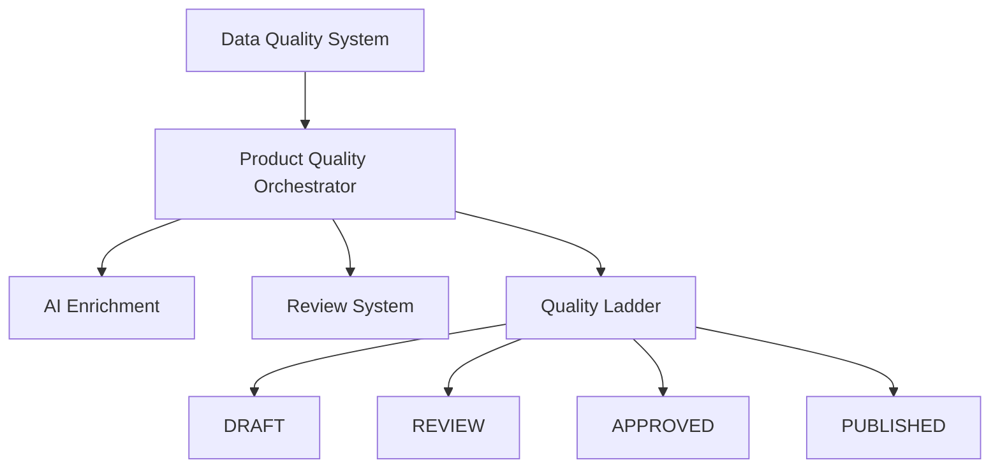

# Features Overzicht

**Laatst bijgewerkt:** 2025-01-20  
**Status:** Actieve features na archivering verouderde systemen

---

## 📚 Over Dit Document

Dit document geeft een overzicht van alle **actieve features** in de Van Kruiningen PIM. Verouderde features en historische documentatie zijn verplaatst naar `docs/archive/`.

---

## 🎯 Actieve Features

### 1. Product Quality Orchestrator

**Status:** ✅ Code Complete - In Testing  
**Versie:** 1.0  
**Documentatie:** `docs/features/product-quality-orchestrator/`

**Beschrijving:**  
Het Product Quality Orchestrator systeem is een intelligente kwaliteitsmanager die producten door een progressieve kwaliteitsladder leidt - van `DRAFT` → `REVIEW` → `APPROVED` → `PUBLISHED`. Het systeem combineert AI-verrijking, automatische validatie, en handmatige reviews.

**Kernfunctionaliteit:**
- ✅ **Progressive Quality Ladder** - 4 kwaliteitsniveaus met specifieke criteria
- ✅ **AI-Powered Enrichment** - Automatische generatie van ontbrekende productinformatie
- ✅ **Smart Automation** - pg_cron jobs voor batch processing (daily, weekly, monthly)
- ✅ **Intelligent Assignment** - Automatische toewijzing van reviewtaken aan teamleden
- ✅ **Audit Trail** - Volledige historische tracking van statuswijzigingen
- ✅ **Dashboard & Analytics** - Real-time overzicht van kwaliteit en productiviteit

**Belangrijke Documenten:**
- `PROJECT_COMPLETION_REPORT.md` - Projectstatus en deliverables
- `IMPLEMENTATION_STATUS.md` - Gedetailleerde implementatievoortgang
- `FASE1_VERIFICATIERAPPORT.md` - Technische foundation review
- `FASE5_PRODUCTION_CHECKLIST.md` - Go-live checklist

**Database Tabellen:**
- `product_quality_rules` - Kwaliteitsregels per niveau
- `product_quality_scores` - Real-time kwaliteitsscores
- `product_quality_transitions` - Audit trail van statuswijzigingen
- `product_review_assignments` - Reviewtaak toewijzingen
- `ai_enrichment_jobs` - AI-verrijking job tracking
- `mv_quality_dashboard_*` - Materialized views voor analytics

**Edge Functions:**
- `orchestrate-product-quality` - Hoofdorchestrator (batch processing)
- `enrich-product-ai` - AI-verrijking per product
- `assign-review-tasks` - Intelligente taakverdeling
- `analyze-product-quality` - Kwaliteitsscore berekening

**UI Componenten:**
- `QualityOrchestratorDashboard` - Hoofddashboard
- `QualityLadderView` - Visuele kwaliteitsladder
- `ReviewAssignmentPanel` - Reviewtaken beheer
- `EnrichmentHistoryView` - AI-verrijking geschiedenis

**Next Steps:**
1. Performance testing (1000+ producten)
2. Security audit (RLS policies)
3. Stakeholder sign-off
4. Production deployment

---

### 2. Data Quality System

**Status:** ✅ Geïmplementeerd & Actief  
**Versie:** 1.0  
**Documentatie:** `docs/features/data-quality.md`

**Beschrijving:**  
De Data Quality feature is een intelligente analyse- en verbeterfunctie die automatisch de volledigheid en kwaliteit van productdata monitort en concrete suggesties biedt voor verbetering.

**Kernfunctionaliteit:**
- ✅ **Automatische Kwaliteitsanalyse** - Berekent score (0-100%) per product
- ✅ **Prioriteitsgestuurde Suggesties** - Critical, High, Medium, Low severity
- ✅ **Actionable Insights** - Directe links naar relevante product pages
- ✅ **Dashboard Overzicht** - Visuele statistieken en trends
- ✅ **Optionele Verrijking** - Geen blokkades bij incomplete data

**Score Berekening (0-100%):**
| Check | Punten | Criticality |
|-------|--------|-------------|
| Primaire Categorie | 20 | Critical |
| Internationale Maten | 20 | High |
| Product Afbeeldingen | 15 | Medium |
| Materiaal Informatie | 10 | Low |
| Beschrijvingen | 10 | Low |
| EAN Codes | 10 | Medium |
| Prijsinformatie | 10 | Medium |

**Database Tabellen:**
- `data_quality_scores` - Kwaliteitsscores per product
- `data_quality_suggestions` - Concrete verbetervoorstellen
- `pim_field_definitions` - Velddefinities en prioriteiten

**Edge Functions:**
- `analyze-data-quality` - Batch analyse van producten

**UI Componenten:**
- `DataQualityDashboard` - Hoofddashboard met statistieken
- `DataQualitySuggestionsList` - Geprioriteeerde actielijst
- `ProductQualityScoreCard` - Score indicator per product

**Design Filosofie:**  
> "Import snel, verrijk slim - niet andersom."

Data Quality **blokkeert geen imports**. Het systeem accepteert incomplete data, analyseert kwaliteit post-import, en helpt gebruikers incrementeel te verbeteren.

---

## 🔄 Feature Dependencies



**Uitleg:**
1. **Data Quality System** berekent basis kwaliteitsscores
2. **Product Quality Orchestrator** gebruikt deze scores voor quality ladder transitie beslissingen
3. **AI Enrichment** verbetert ontbrekende data automatisch
4. **Review System** faciliteert handmatige goedkeuring
5. **Quality Ladder** dwingt kwaliteitsnormen af per niveau

---

## 🗺️ Feature Roadmap

### ✅ Completed (2025 Q1)
- ✅ Data Quality System (Januari)
- ✅ Product Quality Orchestrator (Januari)
- ✅ Progressive Quality Ladder (Januari)
- ✅ AI Enrichment Integration (Januari)

### 🚧 In Development (2025 Q1)
- 🚧 Product Promotion Wizard - Convert feature uitbreiding
- 🚧 Advanced Export Mappings - Gripp/Calculated/Shopify

### 📋 Planned (2025 Q2)
- 📋 Bulk Quality Operations - Mass approve/reject actions
- 📋 Quality Trend Analytics - Historical quality improvements
- 📋 Team Performance Dashboard - Reviewer productivity metrics
- 📋 Automated Cron Job Scheduling - UI configuratie van batch jobs

### 🔮 Future Considerations
- 🔮 Machine Learning Quality Prediction - AI voorspelt quality issues
- 🔮 Multi-language Support - Internationale product descriptions
- 🔮 External Integration Webhooks - Real-time quality notifications
- 🔮 Advanced Reporting - Custom quality KPI dashboards

---

## 📖 Feature Documentatie Structuur

```
docs/
├── features/
│   ├── README.md (dit document)
│   ├── data-quality.md
│   └── product-quality-orchestrator/
│       ├── PROJECT_COMPLETION_REPORT.md
│       ├── IMPLEMENTATION_STATUS.md
│       ├── FASE1_VERIFICATIERAPPORT.md
│       ├── FASE5_PRODUCTION_CHECKLIST.md
│       └── ... (meer fase documenten)
├── technical/
│   ├── database-schema.md
│   ├── user-authorization.md
│   └── ... (technische specs)
└── archive/
    ├── README.md
    └── ... (verouderde features)
```

---

## 🔗 Gerelateerde Documentatie

### Technische Documentatie
- `docs/technical/database-schema.md` - Complete database structuur
- `docs/technical/user-authorization.md` - RLS policies & permissions
- `docs/technical/ai-engine-architecture.md` - AI integratie architectuur

### Data Model Documentatie
- `docs/data-model/progressive-quality-ladder.md` - Quality ladder specificatie
- `docs/data-model/field-validation-rules.md` - Validatieregels per veld
- `docs/technical/pim-field-definitions.md` - PIM velddefinities

### Business Documentatie
- `docs/business/business-requirements.md` - Businessregels en requirements
- `docs/vibe-coding/product-quality-orchestrator.md` - AI prompt specificatie

### Gearchiveerde Documentatie
- `docs/archive/README.md` - Overzicht van verouderde features

---

## 🏗️ Architectuur Overzicht

### Tech Stack
- **Frontend:** React 18 + TypeScript + Tailwind CSS + shadcn/ui
- **Backend:** Supabase (PostgreSQL + RLS + Edge Functions + Storage + Auth)
- **AI:** Lovable AI (Gemini/GPT models zonder API keys)
- **Scheduling:** pg_cron (native PostgreSQL job scheduler)
- **Data Fetching:** TanStack Query
- **Validation:** Zod schemas
- **File Processing:** SheetJS (xlsx) + Papa Parse (CSV)

### Database Design Principles
1. **Multi-tenancy:** Alle queries gefilterd op `tenant_id`
2. **Row Level Security:** RLS policies dwingen data isolatie af
3. **Audit Trails:** Volledige historische tracking via transition tables
4. **Materialized Views:** Pre-computed aggregates voor dashboard performance
5. **Type Safety:** Supabase auto-genereert TypeScript types

### Security Principles
1. **Never use `any` type** in TypeScript
2. **Always filter by `tenant_id`** in queries
3. **Validate input with Zod** schemas
4. **Server-side processing** for large operations (Edge Functions)
5. **Store prices as integer cents** to avoid floating point errors

---

## 📊 Feature Metrics (2025 Q1)

### Database Objects
- **Tables:** 35+ (excl. system tables)
- **Materialized Views:** 6
- **Indexes:** 40+
- **RLS Policies:** 120+
- **Edge Functions:** 12
- **pg_cron Jobs:** 3

### Code Statistics
- **SQL Migrations:** ~8,000 LOC
- **Edge Functions:** ~3,500 LOC
- **Frontend Components:** ~12,000 LOC
- **Total TypeScript:** ~15,500 LOC

### Performance Targets
- **Dashboard Load:** < 2 sec (target: 1.5 sec)
- **Materialized View Refresh:** < 500ms (target: 300ms)
- **Bulk Quality Analysis:** < 5 min voor 1000 producten
- **AI Enrichment:** < 10 sec per product

---

## 🆘 Support & Contact

### Documentatie Issues
Als je een fout vindt in de documentatie of vragen hebt:
1. Check eerst `docs/archive/README.md` - misschien is de feature gearchiveerd
2. Zoek in de technische docs: `docs/technical/`
3. Bekijk de business requirements: `docs/business/`

### Feature Requests
Voor nieuwe feature ideeën:
1. Review eerst de roadmap hierboven
2. Check of de feature niet al in development is
3. Documenteer de business case en technische impact

---

## ✅ Document Metadata

**Aangemaakt:** 2025-01-20  
**Laatste Update:** 2025-01-20  
**Onderhoud Schema:** Bij elke nieuwe feature release  
**Reviewers:** Product Owner, Tech Lead  
**Status:** Living Document
