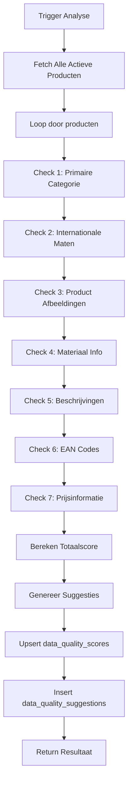

# Datakwaliteit Feature

**Feature ID:** FT-006  
**Status:** Geïmplementeerd  
**Versie:** 1.0  
**Laatst bijgewerkt:** 2025-01-16

---

## 📋 Overzicht

De Datakwaliteit feature is een intelligente analyse- en verbeterfunctie die automatisch de volledigheid en kwaliteit van productdata monitort en concrete suggesties biedt voor verbetering.

### Kernfunctionaliteit

✅ **Automatische Kwaliteitsanalyse** - Berekent score (0-100%) per product  
✅ **Prioriteitsgestuurde Suggesties** - Critical, High, Medium, Low severity  
✅ **Actionable Insights** - Directe links naar relevante product pages  
✅ **Dashboard Overzicht** - Visuele statistieken en trends  
✅ **Optionele Verrijking** - Geen blokkades bij incomplete data

---

## 🎯 Doel en Context

### Probleemstelling

**Voor Datakwaliteit:**
- Producten werden geïmporteerd met ontbrekende informatie
- Geen overzicht van welke data nog verbeterd moet worden
- Geen prioritering van verbeteracties
- Export kwaliteit leed onder incomplete data

**Na Datakwaliteit:**
- Duidelijk overzicht van datakwaliteit per product
- Geprioriteeerde verbeterlijst (critical → low)
- Directe actie mogelijkheden via deep links
- Import blijft robuust, verrijking gebeurt post-import

### Design Filosofie

> **"Import snel, verrijk slim - niet andersom."**

Datakwaliteit **blokkeert geen imports**. De feature:
1. Accepteert incomplete data tijdens import
2. Analyseert kwaliteit na import
3. Geeft concrete verbeter-suggesties
4. Helpt gebruiker incrementeel te verbeteren

---

## 📊 Kwaliteitsmetrics

### Score Berekening (0-100%)

De totaalscore is opgebouwd uit 7 checks met verschillende wegingen:

| Check | Punten | Criticality | Beschrijving |
|-------|--------|-------------|--------------|
| **Primaire Categorie** | 20 | Critical | KERN producten moeten gecategoriseerd zijn |
| **Internationale Maten** | 20 | High | SKUs gekoppeld aan internationale sizing |
| **Product Afbeeldingen** | 15 | Medium | Kleurvarianten met minimaal 1 foto |
| **Materiaal Informatie** | 10 | Low | Material composition ingevuld (>10 chars) |
| **Beschrijvingen** | 10 | Low | Product description ingevuld (>20 chars) |
| **EAN Codes** | 10 | Medium | SKUs met geldige 13-digit EAN |
| **Prijsinformatie** | 10 | Medium | SKUs met inkoopprijs + verkoopprijs |
| **TOTAAL** | **100** | | |

### Score Interpretatie

- **80-100%** 🟢 Excellent - Product volledig verrijkt
- **60-79%** 🟠 Goed - Kleine verbeteringen mogelijk
- **40-59%** 🟠 Matig - Meerdere velden ontbreken
- **0-39%** 🔴 Slecht - Directe aandacht vereist

---

## 🔍 Analyse Proces

### Trigger Opties

**1. Handmatig (UI)**
```
Datakwaliteit Dashboard → "Opnieuw Analyseren" button
```

**2. Automatisch (Cron)** *(toekomstig)*
```
Daily @ 02:00 AM - via Supabase Cron Jobs
```

**3. Post-Import Trigger** *(toekomstig)*
```
Na voltooien van bulk import → auto-analyse
```

### Edge Function Workflow

**Locatie:** `supabase/functions/analyze-data-quality/index.ts`



### Database Operaties

**1. Upsert Quality Scores**
```sql
INSERT INTO data_quality_scores (
  product_style_id,
  total_score,
  has_primary_category,
  has_international_sizes,
  has_color_images,
  has_material_info,
  has_descriptions,
  has_ean_codes,
  has_price_info,
  missing_fields,
  last_analyzed_at
) VALUES (...)
ON CONFLICT (product_style_id) 
DO UPDATE SET ...
```

**2. Replace Suggestions**
```sql
-- Delete oude pending suggestions
DELETE FROM data_quality_suggestions WHERE status = 'pending';

-- Insert nieuwe suggestions
INSERT INTO data_quality_suggestions (...) VALUES (...);
```

---

## 🎨 User Interface

### Datakwaliteit Dashboard

**Route:** `/products/data-quality`

**Secties:**

#### 1. Header
- Titel + beschrijving
- "Opnieuw Analyseren" button met loading state

#### 2. Stats Cards (4x)
```
┌─────────────────────┐  ┌─────────────────────┐
│ Gemiddelde Score    │  │ Kritieke Issues     │
│ 65%                 │  │ 12                  │
│ 156 producten       │  │ Directe aandacht    │
└─────────────────────┘  └─────────────────────┘

┌─────────────────────┐  ┌─────────────────────┐
│ Hoge Prioriteit     │  │ Totaal Suggesties   │
│ 45                  │  │ 87                  │
│ Binnenkort oplossen │  │ Verbeterpunten      │
└─────────────────────┘  └─────────────────────┘
```

#### 3. Actieve Suggesties Lijst
- Severity badge (Critical, High, Medium, Low)
- Titel + beschrijving
- Action button met deep link naar product/tab

**Voorbeeld suggestie:**
```
🔴 CRITICAL  Geen primaire categorie

Product "Polo Shirt Classic" heeft geen primaire 
categorie. Dit is verplicht voor KERN producten.

[Categorie Toewijzen →]  (/products/123)
```

#### 4. Producten Tabel
- Gesorteerd op laagste score (slechtste eerst)
- Kolommen: Product | Score | Ontbrekende Velden | Laatst Geanalyseerd | Acties
- Badge kleuren: 🟢 80%+ | 🟠 60-79% | 🔴 <60%
- "Details" button → `/products/{id}`

---

## 🔧 Technische Implementatie

### Database Schema

**Tabel: `data_quality_scores`**
```sql
CREATE TABLE data_quality_scores (
  id SERIAL PRIMARY KEY,
  product_style_id INTEGER NOT NULL UNIQUE REFERENCES product_styles(id) ON DELETE CASCADE,
  
  -- Overall score
  total_score INTEGER NOT NULL DEFAULT 0 CHECK (total_score >= 0 AND total_score <= 100),
  
  -- Individual metrics (boolean flags)
  has_primary_category BOOLEAN DEFAULT FALSE,    -- 20 pts
  has_international_sizes BOOLEAN DEFAULT FALSE, -- 20 pts
  has_color_images BOOLEAN DEFAULT FALSE,        -- 15 pts
  has_material_info BOOLEAN DEFAULT FALSE,       -- 10 pts
  has_descriptions BOOLEAN DEFAULT FALSE,        -- 10 pts
  has_ean_codes BOOLEAN DEFAULT FALSE,           -- 10 pts
  has_price_info BOOLEAN DEFAULT FALSE,          -- 10 pts
  
  -- Missing fields array
  missing_fields JSONB DEFAULT '[]'::JSONB,
  
  -- Timestamps
  last_analyzed_at TIMESTAMPTZ DEFAULT NOW(),
  created_at TIMESTAMPTZ DEFAULT NOW(),
  updated_at TIMESTAMPTZ DEFAULT NOW()
);

CREATE INDEX idx_dq_score ON data_quality_scores(total_score);
CREATE INDEX idx_dq_category ON data_quality_scores(has_primary_category) 
  WHERE has_primary_category = FALSE;
CREATE INDEX idx_dq_sizes ON data_quality_scores(has_international_sizes) 
  WHERE has_international_sizes = FALSE;
```

**Tabel: `data_quality_suggestions`**
```sql
CREATE TABLE data_quality_suggestions (
  id SERIAL PRIMARY KEY,
  product_style_id INTEGER NOT NULL REFERENCES product_styles(id) ON DELETE CASCADE,
  
  -- Suggestion details
  suggestion_type VARCHAR(50) NOT NULL,  -- 'missing_category', 'missing_international_sizes', etc.
  severity VARCHAR(20) NOT NULL CHECK (severity IN ('low', 'medium', 'high', 'critical')),
  
  title TEXT NOT NULL,
  description TEXT NOT NULL,
  action_label TEXT NOT NULL,
  action_url TEXT,
  
  -- AI suggestions (future)
  suggested_value JSONB,  -- { "category_id": 123, "confidence": 0.95 }
  
  -- Status tracking
  status VARCHAR(20) DEFAULT 'pending' CHECK (status IN ('pending', 'accepted', 'rejected', 'resolved')),
  resolved_at TIMESTAMPTZ,
  resolved_by UUID REFERENCES auth.users(id) ON DELETE SET NULL,
  
  created_at TIMESTAMPTZ DEFAULT NOW(),
  updated_at TIMESTAMPTZ DEFAULT NOW(),
  
  UNIQUE(product_style_id, suggestion_type)
);

CREATE INDEX idx_dqs_status ON data_quality_suggestions(status) WHERE status = 'pending';
CREATE INDEX idx_dqs_severity ON data_quality_suggestions(severity);
CREATE INDEX idx_dqs_type ON data_quality_suggestions(suggestion_type);
```

### Edge Function API

**Endpoint:** `analyze-data-quality`

**Request:**
```typescript
// Geen body nodig - analyseert alle actieve producten
await supabase.functions.invoke('analyze-data-quality');
```

**Response:**
```json
{
  "success": true,
  "analyzed_products": 156,
  "average_score": 65,
  "total_suggestions": 87,
  "quality_scores": [
    {
      "product_style_id": 1,
      "total_score": 45,
      "has_primary_category": false,
      "has_international_sizes": false,
      "missing_fields": ["primary_category", "international_sizes", "color_images"]
    }
  ]
}
```

### React Hooks

**Custom Hook:** `useDataQualityAnalysis()`
```typescript
// Frontend gebruik
import { useMutation, useQueryClient } from '@tanstack/react-query';
import { supabase } from '@/integrations/supabase/client';

const analyzeMutation = useMutation({
  mutationFn: async () => {
    const { data, error } = await supabase.functions.invoke('analyze-data-quality');
    if (error) throw error;
    return data;
  },
  onSuccess: () => {
    queryClient.invalidateQueries({ queryKey: ['data-quality-scores'] });
    queryClient.invalidateQueries({ queryKey: ['data-quality-suggestions'] });
  }
});
```

---

## 📖 User Guide

### Workflow: Datakwaliteit Verbeteren

#### Stap 1: Open Dashboard
```
Sidebar → Datakwaliteit
```

#### Stap 2: Analyseer Data
```
Klik "Opnieuw Analyseren" → Wacht ~10-30 sec (afhankelijk van aantal producten)
```

#### Stap 3: Prioriteer Acties
```
Focus op:
1. 🔴 Kritieke issues eerst (ontbrekende categorieën)
2. 🟠 Hoge prioriteit (internationale maten)
3. Laagste score producten in tabel
```

#### Stap 4: Los Issues Op
```
Klik op suggestie action button → Direct naar product detail page
Vul ontbrekende velden in → Sla op
```

#### Stap 5: Re-analyseer
```
Klik "Opnieuw Analyseren" om vooruitgang te zien
```

### Best Practices

**✅ DO:**
- Run analyse **na elke grote import**
- Focus op **kritieke issues** eerst (categorieën, EANs)
- Los **batch-gewijs** op (bijv. alle producten zonder categorie tegelijk)
- Re-analyseer regelmatig om vooruitgang te tracken

**❌ DON'T:**
- Probeer niet alles in 1x perfect te maken
- Negeer geen kritieke issues lang
- Vergeet niet te re-analyseren na fixes

---

## 🔗 Business Rules

### BR-031: Data Verrijking Optionaliteit
- Import faalt **NOOIT** door ontbrekende optionele velden
- Data quality score (0-100%) meet volledigheid
- Verrijking wordt aangemoedigd maar niet afgedwongen
- Post-import analyse genereert automatisch suggesties

### BR-032: Internationale Maat Mapping Strategie
- Auto-mapping prioriteit: exact match → AI suggestion → manual
- Confidence threshold: ≥0.9 = auto-accept, <0.9 = vraag confirmatie
- Bulk-update tools beschikbaar voor efficiëntie
- Leveranciersmaat blijft altijd primaire identifier

### BR-033: EAN Duplicate Prevention
- EAN is **VERPLICHT** voor alle SKUs (NOT NULL in database)
- EAN moet exact 13 digits zijn
- EAN checksum moet geldig zijn (Luhn algorithm)
- EAN uniciteit voorkomt dubbele producten

### BR-034: Stock Single Source of Truth
- PIM beheert **GEEN** voorraad (verwijderd uit product_variants)
- Gripp ERP is leidend voor stock management
- Export bevat geen voorraad informatie
- Focus PIM op product content, niet operationele data

---

## 🚀 Toekomstige Uitbreidingen

### Fase 2: Manual Mapping Optimization

**Feature:** Verbeteren van mapping templates met size chart helpers

**Logic:**
```typescript
// Voorbeeld: supplier_size_code "M" → international_size_id 15 (EU-48/M)
function suggestInternationalSize(supplierSizeCode: string, clothingTypeId: number) {
  // 1. Exact match op size_code
  const exactMatch = await findExactMatch(supplierSizeCode, clothingTypeId);
  if (exactMatch) return { size_id: exactMatch.id, confidence: 1.0 };
  
  // 2. Pattern matching (48 → EU-48)
  const patternMatch = await findPatternMatch(supplierSizeCode, clothingTypeId);
  if (patternMatch && patternMatch.confidence >= 0.9) {
    return patternMatch;
  }
  
  // 3. Manual intervention required
  return { size_id: null, confidence: 0.0, requires_manual: true };
}
```

### Fase 3: Bulk Fix Tools

**Feature:** Batch updates voor meerdere producten/SKUs tegelijk

**UI Flows:**
1. `/products/bulk-assign-categories` - Assign categorieën aan 50+ producten
2. `/products/bulk-map-sizes` - Map internationale maten aan 100+ SKUs
3. Preview changes before apply
4. Success/error rapport na batch

### Fase 4: Automated Cron Jobs

**Feature:** Dagelijkse automatische analyse

**Supabase Config:**
```toml
[functions.analyze-data-quality]
cron = "0 2 * * *"  # Daily at 2 AM
```

### Fase 5: Trend Analytics

**Feature:** Historische datakwaliteit tracking

**Metrics:**
- Score over tijd grafiek
- Most improved products
- Bottleneck identificatie (welke velden het vaakst ontbreken)

---

## 🐛 Troubleshooting

### Probleem: Analyse duurt te lang

**Symptoom:** "Opnieuw Analyseren" button blijft langer dan 60 seconden laden

**Mogelijke oorzaken:**
- Veel producten in database (1000+)
- Complexe relaties (veel SKUs per product)
- Edge function timeout (default 60s)

**Oplossing:**
```typescript
// Verhoog timeout in supabase/config.toml
[functions.analyze-data-quality]
timeout = 120  # 2 minuten
```

### Probleem: Scores niet bijgewerkt na fixes

**Symptoom:** Product score blijft laag na toevoegen ontbrekende data

**Oorzaak:** Cache niet geïnvalideerd of analyse niet opnieuw gedraaid

**Oplossing:**
1. Klik "Opnieuw Analyseren" in dashboard
2. Check browser console voor errors
3. Verify data is opgeslagen via `/products/{id}`

### Probleem: Suggesties blijven verschijnen na fix

**Symptoom:** Suggestie staat nog steeds in lijst na oplossen issue

**Oorzaak:** Oude pending suggestions worden pas verwijderd bij nieuwe analyse

**Oplossing:**
- Run "Opnieuw Analyseren" - dit delete oude pending suggestions

---

## 📚 Gerelateerde Documentatie

- **Database Schema:** `docs/technical/database-schema.md`
- **Business Rules:** `docs/data-model/business-rules.md`
- **Validation Rules:** `docs/data-model/validation-rules.md`
- **Import Architecture:** `docs/technical/import-architecture.md`
- **Internationale Maatvoering:** `docs/features/international-sizing.md`

---

## ✅ Implementatie Status

- [x] Database schema (data_quality_scores + data_quality_suggestions)
- [x] Edge Function (analyze-data-quality)
- [x] Frontend Dashboard UI
- [x] Sidebar navigatie link
- [x] Stats cards + suggesties lijst
- [x] Producten tabel met sortering
- [x] Deep links naar product details
- [ ] AI auto-mapping (Fase 2)
- [ ] Bulk fix tools (Fase 3)
- [ ] Automated cron jobs (Fase 4)
- [ ] Trend analytics (Fase 5)

---

**Laatst bijgewerkt:** 2025-01-16  
**Door:** Van Kruiningen PIM Team  
**Versie:** 1.0
