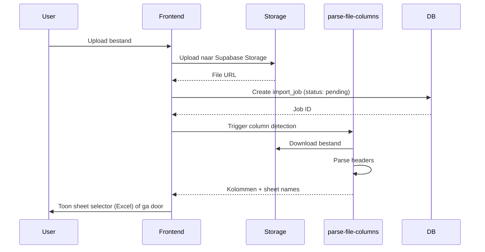

# FASE 1: Bestand Inlezen

**Doel:** Upload Excel/CSV bestand en detecteer kolommen.  
**Duur:** 30 seconden - 2 minuten  
**Resultaat:** Temporary dataset met `is_temp=true`, klaar voor CONVERTEREN

---

## Wat doet deze fase?

In FASE 1 upload je een leveranciersbestand (Excel of CSV) naar het systeem. Het systeem parseert alleen de **kolommen** (niet de data zelf) en slaat het bestand op in een tijdelijke staat.

**Dit is NIET een volledige import!** Je krijgt:
- ✅ Bestand opgeslagen in Supabase Storage
- ✅ Kolommen gedetecteerd voor mapping
- ✅ Import job aangemaakt
- ❌ **Geen** data geparsed
- ❌ **Geen** mapping uitgevoerd
- ❌ **Geen** products aangemaakt

---

## Voorbereiding

### Vereisten checklist

✅ **Stamdata geconfigureerd**
- [ ] Supplier bestaat in systeem (`Inrichting > Leveranciers`)
- [ ] Brand gekoppeld aan supplier (`Inrichting > Merken`)
- [ ] Categorieën aangemaakt (`Inrichting > Categorieën`)
- [ ] Kleurfamilies en opties ingesteld (`Inrichting > Kleuren`)
- [ ] International sizes geconfigureerd (`Inrichting > Maten`)

✅ **Bestand voorbereid**
- [ ] Formaat: `.xlsx`, `.xls` of `.csv`
- [ ] Maximale grootte: 10MB
- [ ] Encoding: UTF-8 of ISO-8859-1 (wordt automatisch gedetecteerd)
- [ ] Minimaal kolommen: SKU, productnaam
- [ ] Data consistent (geen gemengde formaten)

---

## Stap 1.1: Bestand uploaden

### Gebruikersactie

1. Navigeer naar **IMPORT** in hoofdmenu
2. Klik op **"Nieuw bestand uploaden"**
3. Selecteer bestand via "Kies bestand" of drag & drop
4. Wacht op upload (progress bar)

### Wat gebeurt er in het systeem?



### Technische details

**1. Upload naar Storage**
- Pad: `imports/{timestamp}_{filename}`
- Storage bucket: `imports` (private)
- Metadata: `uploaded_by`, `file_size_bytes`

**2. Import Job aanmaken**
```sql
INSERT INTO import_supplier_dataset_jobs (
  file_name,
  file_path,
  original_filename,
  file_size_bytes,
  status,           -- 'pending'
  is_temp,          -- TRUE (belangrijke flag!)
  created_by
)
```

**3. Kolom detectie** (`parse-file-columns` Edge Function)
- Download bestand van Storage
- Detecteer encoding (UTF-8, ISO-8859-1, Windows-1252)
- Parse eerste rij als headers
- Voor Excel: detecteer alle sheet namen
- Return kolommen + sheet options

### Gevolgen

- ✅ Bestand veilig opgeslagen in private storage
- ✅ Import job aangemaakt met `is_temp=true`
- ✅ Kolommen gedetecteerd voor mapping
- ⚠️ Bestand nog **niet** geparsed (alleen headers)

---

## Stap 1.2: Sheet selectie (Excel only)

### Wanneer

Als bestand meerdere sheets bevat (Excel).

### Gebruikersactie

Selecteer de sheet die geïmporteerd moet worden uit dropdown.

### Wat gebeurt er

- Sheet naam wordt opgeslagen in frontend state
- Gebruikt tijdens parsing fase (in CONVERT)

### Gevolgen

- Alleen geselecteerde sheet wordt verwerkt
- Andere sheets worden **genegeerd**

---

## Stap 1.3: Bevestig upload

### Gebruikersactie

Klik **"Bevestig bestand"**

### Wat gebeurt er

```sql
UPDATE import_supplier_dataset_jobs
SET status = 'completed',
    column_count = {aantal_kolommen},
    file_columns = {kolom_namen_array},
    completed_at = NOW()
WHERE id = {job_id}
```

### Gevolgen

- ✅ Import job status: `pending` → `completed`
- ✅ Bestand klaar voor CONVERT fase
- ➡️ Automatische redirect naar `/data-dirigent/convert?dataset_id={job_id}`

---

## Resultaat van FASE 1

### Database State

```sql
-- import_supplier_dataset_jobs
id: 123
file_name: "Tricorp_2025_Q1.xlsx"
file_path: "imports/1234567890_Tricorp_2025_Q1.xlsx"
file_columns: ["Artikelnr", "Omschrijving", "Kleur", "Maat", "Prijs"]
column_count: 5
is_temp: TRUE          -- ⭐ Belangrijke flag!
status: "completed"
data_available: FALSE  -- Nog geen data geparsed
```

### Wat je ziet

**Import Overzicht:**
```
📁 Bestand: Tricorp_2025_Q1.xlsx
📊 Kolommen: 5 gedetecteerd
✅ Status: Klaar voor converteren
⏱️ Geüpload: 5 minuten geleden

[Start Converteren] →
```

---

## Volgende stap

➡️ **FASE 2: DATASET MAKEN**

Klik op **"Maak Dataset aan"** knop bij het succesvol geüploade bestand.

In FASE 2 ga je:
1. AI Column Mapping uitvoeren met intelligente suggesties
2. Data valideren tegen P0/P1 regels met Field Groups
3. Dataset creëren met `product_status=INACTIVE`

💡 **Direct vanuit import flow:** Dataset maken is nu onderdeel van het inleesproces, geen aparte menu-optie meer.

---

## Troubleshooting

### ❌ Fout: "Bestand te groot"

**Oorzaak:** Bestand > 10MB  
**Oplossing:**
1. Splits bestand in meerdere kleinere bestanden
2. Verwijder onnodige kolommen in Excel
3. Gebruik CSV formaat (kleiner dan Excel)

### ❌ Fout: "Geen kolommen gedetecteerd"

**Oorzaak:** Bestand heeft geen header rij of is corrupt  
**Oplossing:**
1. Open bestand in Excel
2. Controleer of eerste rij kolomnamen bevat
3. Sla op en probeer opnieuw

### ❌ Fout: "Encoding probleem"

**Oorzaak:** Rare karakters in bestandsnaam of data  
**Oplossing:**
1. Sla bestand op met UTF-8 encoding
2. Gebruik alleen alphanumerieke karakters in bestandsnaam
3. Probeer CSV formaat

---

## Technical Reference

### Edge Functions

| Function | Input | Output | Duration |
|----------|-------|--------|----------|
| `parse-file-columns` | File path, sheet name | Array of column names | ~2s |

### Database Schema

```sql
-- Relevante kolommen voor FASE 1
import_supplier_dataset_jobs:
  - id (PK)
  - file_name (TEXT)
  - file_path (TEXT)
  - file_columns (TEXT[])
  - column_count (INT)
  - is_temp (BOOLEAN) -- TRUE = in IMPORT fase
  - status (TEXT)
  - data_available (BOOLEAN) -- FALSE in FASE 1
  - created_by (UUID)
  - started_at (TIMESTAMPTZ)
  - completed_at (TIMESTAMPTZ)
```

---

**Laatst bijgewerkt:** Januari 2025  
**Versie:** 6.0 (3-Fase Model)
