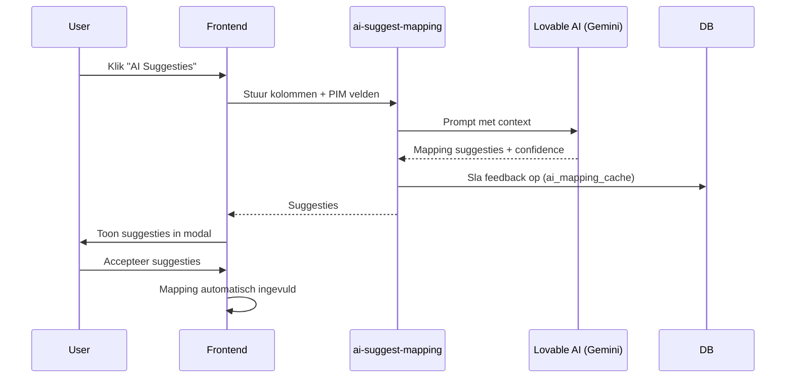
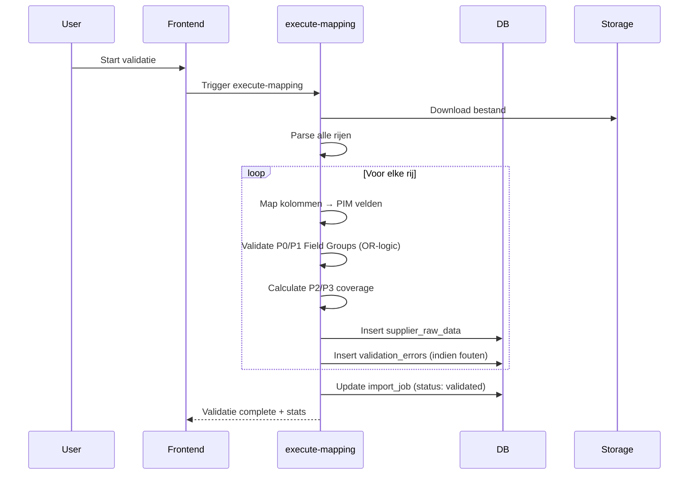
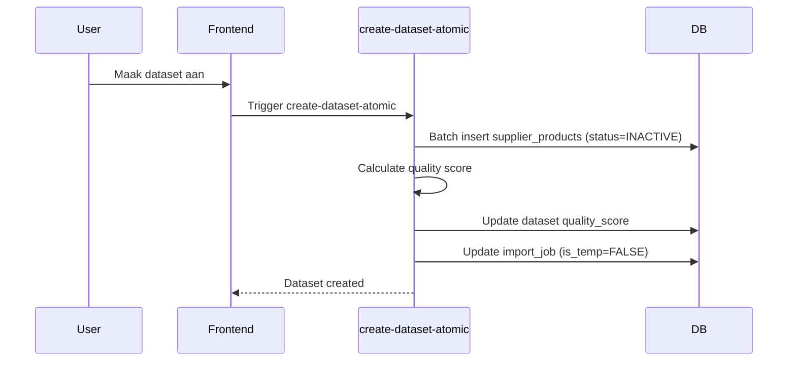

# FASE 1: Dataset maken (v8.0 - Auto-Activatie)

**Doel:** AI Column Mapping, validatie, en conversie naar `supplier_products` met **automatische ACTIVE status**  
**Duur:** 5-30 minuten (afhankelijk van bestandsgrootte)  
**Resultaat:** Gevalideerde products in **ACTIVE state**, direct zichtbaar in catalogus  
**Waar:** Direct vanuit import flow via "Maak Dataset aan" knop

---

## Wat doet deze fase?

In FASE 1 (v8.0) converteer je **ruwe leveranciersdata** naar het **gestructureerde PIM schema** en activeer je producten **automatisch**. Dit gebeurt via intelligent template systeem en AI-gedreven column mapping.

**Belangrijkste acties:**
1. **Auto-load template** (indien beschikbaar voor leverancier+merk)
2. **Kolom mismatch detectie** (waarschuwing bij gewijzigde Excel-structuur)
3. **AI-gedreven column mapping** (P0 velden voor basis import)
4. Valideer alle rijen tegen **P0 regels** met **OR-logic** voor Field Groups
5. Creëer `supplier_products` met `product_status=ACTIVE` (**nieuw in v8.0!**)
6. **Auto-save template** (P0 mappings voor volgende import)
7. **Vervang oude versies** (zelfde leverancier+EAN worden INACTIVE)

**Eindresultaat v8.0:**
- ✅ Products aangemaakt met status **ACTIVE** (direct zichtbaar!)
- ✅ Oude versies (zelfde leverancier+EAN) automatisch **INACTIVE** (historie behoud)
- ✅ Validation errors geregistreerd
- ✅ Quality score berekend (gewogen: P0=50%, P1=30%, P2=15%, P3=5%)
- ✅ **Template automatisch opgeslagen** (P0 mappings + file_columns)
- ✅ Producten **direct zichtbaar** in `/supplier-catalog`

💡 **Nieuw in v8.0:** 
- Producten zijn direct ACTIVE (geen aparte activatiestap meer!)
- Templates worden automatisch geladen en opgeslagen
- Kolom mismatch detectie helpt bij gewijzigde Excel-structuren

---

## Progressive Quality Ladder in Dataset Maken Fase

### Acceptance Criteria: MVP-Only Import Blokkade

**IMPORT/CONVERTEREN** vereist ALLEEN **P0 (MVP)** velden:
- **P0 (MVP):** HARD BLOCK - `supplier_id`, `brand_id`, `tenant_id` (auto-filled) + Field Groups (OR-logic: min 1 per group)
- **P1 (Good):** OPTIONAL - Alleen impact op quality score
- **P2 (Better):** OPTIONAL - Alleen impact op quality score  
- **P3 (Best):** IGNORED - Geen validatie

**Field Groups (P0/MVP niveau):**

| Group ID | Fields | Min Required (Import) | All Required (Promotie) |
|----------|--------|----------------------|------------------------|
| **Color** | `supplier_color_name` OF `supplier_color_code` | 1 | 2 |
| **Style** | `supplier_style_name` OF `supplier_style_code` | 1 | 2 |
| **Size** | `supplier_size_code` | 1 | 1 |
| **EAN** | `ean` | 1 | 1 |

**Voorbeeld Acceptance:**

```typescript
// ✅ ACCEPTABEL in Converteren fase
{
  supplier_color_code: "NVY",        // Enkel code (geen naam)
  supplier_color_name: null,         // ⚠️ Warning: naam ontbreekt
  supplier_style_name: "Polo Basic", // Enkel naam (geen code)
  supplier_style_code: null,         // ✅ OK want OR-logic
  supplier_size_code: "M",           // ✅ Required
  ean: "8712345678901"               // ✅ Required + checksum valid
}
// Result: ACCEPTED maar met waarschuwing voor kleur

// ❌ BLOCKED in Converteren fase
{
  supplier_color_code: null,         // ❌ Color Group: 0/2 velden
  supplier_color_name: null,         // ❌ BLOCKER: Min 1 vereist
  supplier_style_name: "Polo Basic",
  supplier_style_code: null,
  supplier_size_code: "M",
  ean: "8712345678901"
}
// Result: BLOCKED - Color Group heeft min 1 veld nodig
```

---

## Navigatie

### Hoe kom ik hier?

**Direct vanuit Bestand Inlezen:**  
Na succesvol uploaden van een bestand, klik op de **"Maak Dataset aan"** knop.  
Dit brengt je direct naar de mapping stap.

**Alternatief via Datasets pagina:**  
Ga naar `Leveranciers > Datasets`, selecteer een pending dataset, en klik op **"Maak Dataset aan"**.

💡 **Belangrijk:** Dataset maken is nu geïntegreerd in de import flow - je hoeft niet meer handmatig naar een aparte pagina te navigeren.

---

## Stap 2.1: AI Column Mapping

### Gebruikersactie

1. **Bekijk gedetecteerde kolommen** uit het geüploade bestand
2. **Accepteer AI suggesties** of **pas handmatig aan**
3. **Zorg dat alle P0/P1 velden gemapped zijn** (systeem blokkeert indien niet compleet)
4. **Klik "Dataset maken"** om door te gaan naar creatie

💡 **AI Suggesties:** Het systeem gebruikt Gemini 2.5 Flash om automatisch kolomnamen te herkennen en te mappen naar PIM velden. Templates van eerdere imports verbeteren de accuraatheid.

### Wat zie je

**Mapping interface met AI suggesties:**
```
┌─────────────────────────────────────────────────────┐
│ 🟢 AI Suggestie (90% confidence)                    │
│ Leveranciers kolom: "Art.nr" → PIM: supplier_sku   │
│ [Accepteren] [Aanpassen]                            │
└─────────────────────────────────────────────────────┘
```

---

## Stap 2.2: AI Column Mapping met Field Groups

### Overzicht P0/P1/P2/P3 Velden

**P0 (MVP - Rood 🚨):**
- `supplier_id` - Leverancier (auto-filled)
- `brand_id` - Merk (auto-filled)
- `tenant_id` - Tenant (auto-filled via auth)

**P0 (MVP) - FIELD GROUPS MET OR-LOGIC:**

| Field Group | Velden | Import (OR) | Promotie (AND) |
|-------------|--------|-------------|----------------|
| **Kleur** | `supplier_color_name`<br/>`supplier_color_code` | Min 1 veld | Beide velden |
| **Stijl** | `supplier_style_name`<br/>`supplier_style_code` | Min 1 veld | Beide velden |
| **Maat** | `supplier_size_code` | Verplicht | Verplicht |
| **EAN** | `ean` | Verplicht | Verplicht |

⚠️ **Belangrijk:** In de IMPORT fase hoef je per Field Group maar **1 veld** te mappen. Bij PROMOTIE (FASE 4) zijn **alle velden** vereist.

**P1 (Good - Oranje 🟡):**
- `supplier_product_group` - Productgroep (helpt categorisatie)
- `supplier_advised_price` - Adviesprijs (basis prijsstrategie)

**P2 (Better - Blauw 🔵):**
- `material_composition` - Materiaal (SEO + kwaliteit)
- `fabric_weight_gsm` - Stofgewicht (technische spec)

**P3 (Best - Grijs ⚪):**
- `care_instructions` - Wasvoorschrift
- `country_of_origin` - Herkomst
- `certification_marks` - Certificaten (ISO, OEKO-TEX)
- `fit_type` - Pasvorm (Regular/Slim/Loose)

---

### Field Group UI Weergave

**Voorbeeld: Kleur Group tijdens mapping:**

```
┌─────────────────────────────────────────────────────┐
│ 🚨 P0 Field Group: Kleur (Min 1 vereist - MVP)     │
│                                                     │
│ supplier_color_name:                                │
│ [Dropdown: - Selecteer kolom -] ⚪ Niet gemapped   │
│                                                     │
│ supplier_color_code:                                │
│ [Dropdown: Kleur Code] ✅ Gemapped                 │
│                                                     │
│ ℹ️ Status: 1/2 velden gemapped (✅ Voldoet)        │
│ ⚠️ Let op: Bij promotie zijn beide velden vereist │
└─────────────────────────────────────────────────────┘
```

**Na mapping compleet - Kleur Group:**
```
✅ Kleur Group: 1/2 velden gemapped
   ├─ supplier_color_name: ❌ Niet gemapped
   └─ supplier_color_code: ✅ Gemapped naar "Kleur Code"
   
   ⚠️ Waarschuwing: Enkel kleurcode - conversie aanbevolen
   
   Voor PROMOTIE (FASE 4) is ook kleurnaam vereist. 
   Voeg kolom 'Kleurnaam' toe in volgende import.
```

---

### Optie A: Handmatige Mapping

**Gebruikersactie:**
Voor elk PIM veld:
1. Selecteer leverancierskolom uit dropdown
2. Of kies "Vaste waarde" voor constante waarden
3. Of laat leeg (alleen P2)

**Voorbeeld:**
```
PIM Veld: sku (P0)
Mapping: [Dropdown: Artikelnummer] ✓

PIM Veld: name (P0)  
Mapping: [Dropdown: Omschrijving] ✓

PIM Veld: color_family (P1)
Mapping: [Dropdown: Kleur] ✓

PIM Veld: category_id (P0)
Mapping: [Vaste waarde: Werkschoenen] ✓
```

---

### Optie B: AI Mapping Suggesties (Aanbevolen!)

**Gebruikersactie:**
1. Klik **"AI Mapping Suggesties"**
2. Wacht ~5 seconden (AI analyseert kolommen)
3. Review suggesties met confidence scores
4. Accepteer of wijzig per veld

**Wat gebeurt er:**



**AI Response voorbeeld:**
```json
{
  "suggestions": {
    "artikelnummer": "sku",
    "productnaam": "name",
    "kleur": "color_family",
    "maat": "size"
  },
  "confidence": {
    "artikelnummer": 0.95,  // 95% zeker
    "productnaam": 0.98,
    "kleur": 0.87,
    "maat": 0.92
  }
}
```

**Confidence kleuren:**
- 🟢 **90-100%**: Zeer zeker - direct accepteren
- 🟡 **70-89%**: Waarschijnlijk goed - check even
- 🔴 **<70%**: Onzeker - handmatig reviewen

**Gevolgen:**
- ✅ Snellere mapping (vooral bij nieuwe leveranciers)
- ✅ AI leert van feedback (hogere acceptance rate over tijd)
- ✅ Mapping kan worden opgeslagen als template

---

### Auto-Load Template (v8.0 - Automatisch!)

**Wanneer:**
Zodra je een Excel-bestand uploadt en leverancier+merk selecteert.

**Wat gebeurt er AUTOMATISCH:**
```typescript
// 1. Check of template bestaat
const template = await getAutoImportTemplate(supplier_id, brand_id);

if (template) {
  // 2. Vergelijk Excel-kolommen met template.file_columns
  const mismatch = detectColumnMismatch(excelColumns, template.file_columns);
  
  if (mismatch.hasMismatch) {
    // 3. Toon waarschuwing
    showMismatchWarning(mismatch.missingInFile, mismatch.newInFile);
  }
  
  // 4. Laad P0 mappings automatisch in
  applyMappings(template.p0_column_mappings);
}
```

**Wat zie je:**

**✅ Perfect Match (Groene melding):**
```
ℹ Import template geladen
  We hebben je vorige mappings automatisch ingevuld 
  voor Texstar + Fruit of the Loom.
  
  ✓ 6 van 6 kolommen herkend
  Laatst gebruikt: 15 december 2024
```

**⚠️ Kolom Mismatch (Gele waarschuwing):**
```
⚠ Template kolommen komen niet overeen
  Je Excel-bestand heeft andere kolommen dan het opgeslagen template.
  
  Ontbrekende kolommen (in template, niet in Excel):
  • "Artikelnr" 
  • "Product omschrijving"
  
  Nieuwe kolommen (in Excel, niet in template):
  • "SKU"
  • "Productnaam"
  
  Controleer en pas je mappings aan waar nodig.
```

**Voordeel:**
- ⚡ Instant mapping (geen handmatige selectie nodig)
- ✅ Bewezen mapping (gebruikt in eerdere imports)
- 🔍 Automatische mismatch detectie (helpt bij gewijzigde Excel-structuren)

---

### Auto-Save Template (v8.0 - Automatisch!)

**Wanneer:**
Na succesvolle dataset creatie met `product_status=ACTIVE`.

**Wat gebeurt er AUTOMATISCH:**
```typescript
// 1. Na succesvolle import
const templateData = {
  supplier_id: selectedSupplierId,
  brand_id: selectedBrandId || null,  // NULL = merk uit Excel
  p0_column_mappings: extractP0Mappings(allMappings),  // Alleen P0 velden!
  file_columns: excelColumns,
  file_format: 'excel',
  last_used_at: new Date(),
  usage_count: (existingTemplate?.usage_count || 0) + 1
};

// 2. Upsert (insert of update)
await upsertTemplate(templateData);

// 3. Toon bevestiging
toast.success('✓ Import template opgeslagen');
```

**Wat wordt OPGESLAGEN:**
- ✅ **P0 velden mapping** (EAN, SKU, merk, kleur, stijl, maat)
- ✅ **File kolommen** (voor mismatch detectie volgende keer)
- ✅ **Leverancier + merk** combinatie (unieke key)
- ✅ **Gebruiksstatistieken** (usage_count, last_used_at)

**Wat wordt NIET opgeslagen:**
- ❌ P1/P2/P3 velden (handmatig per import)
- ❌ Transformatie regels (size/color mappings = stamdata)
- ❌ Template naam/changelog (niet meer nodig)

**Gedrag bij bestaande template:**
- Template wordt **overschreven** (geen "Nieuwe template" of "Update bestaande" keuze)
- Geen duplicate check dialog
- Simpel: laatste import wint altijd

**Voordeel:**
- 🤖 Volledig automatisch (geen gebruikersactie)
- 🎯 Simplified scope (alleen P0 = sneller)
- 🔄 Altijd up-to-date (laatste import = truth)

---

## Stap 2.4: Mapping Bevestigen

**Gebruikersactie:**
Klik **"Bevestig mapping"**

**Validatie:**
- ✅ Alle P0 velden gemapped
- ✅ Geen duplicate mappings (zelfde kolom → meerdere velden)

**Wat gebeurt er:**
```sql
UPDATE import_supplier_dataset_jobs
SET current_mapping_template_id = {template_id},  -- Indien gebruikt
    mapping_completed_at = NOW()
WHERE id = {job_id}
```

---

## Stap 2.5: Regelvalidatie met Field Groups

### Validatie Starten

**Gebruikersactie:**
Klik **"Start validatie"**

**Wat gebeurt er:**



### Validation Rules - Progressive Quality Ladder

**P0 validatie (MVP - HARD BLOCK):**
- `supplier_id`: Auto-filled (user selection)
- `brand_id`: Auto-filled (user selection)
- `tenant_id`: Auto-filled (auth context)

**P0 validatie (MVP - Field Groups met OR-logic):**

**Color Group (OR-logic):**
```typescript
// ✅ ACCEPTABEL: Min 1 veld gemapped
{
  supplier_color_name: null,     // Niet gemapped
  supplier_color_code: "NVY"     // ✅ Gemapped - OK!
}
// Warning: "Enkel kleurcode - conversie aanbevolen"

// ❌ BLOCKER: 0 velden gemapped
{
  supplier_color_name: null,     // Niet gemapped
  supplier_color_code: null      // Niet gemapped
}
// Error: "Color Group: minimaal 1 veld vereist"
```

**Style Group (OR-logic):**
```typescript
// ✅ ACCEPTABEL: Min 1 veld gemapped
{
  supplier_style_name: "Polo Basic",  // ✅ Gemapped
  supplier_style_code: null           // Niet gemapped - OK!
}

// ❌ BLOCKER: 0 velden gemapped
{
  supplier_style_name: null,     // Niet gemapped
  supplier_style_code: null      // Niet gemapped
}
// Error: "Style Group: minimaal 1 veld vereist"
```

**Size (Direct vereist - geen OR-logic):**
```typescript
// ✅ ACCEPTABEL
{
  supplier_size_code: "M"  // Valid size
}

// ❌ BLOCKER
{
  supplier_size_code: null  // Niet gemapped
}
// Error: "Maat is verplicht"
```

**EAN (Direct vereist + checksum validatie):**
```typescript
// ✅ ACCEPTABEL
{
  ean: "8712345678901"  // 13 cijfers + checksum valid
}

// ❌ BLOCKER
{
  ean: "8712345678900"  // Checksum incorrect
}
// Error: "EAN check digit ongeldig"

// ❌ BLOCKER
{
  ean: "871234567890"   // 12 cijfers (te kort)
}
// Error: "EAN moet exact 13 cijfers zijn"
```

**P1 validatie (Good - score impact only):**
- `supplier_product_group`: Max 255 chars
- `supplier_advised_price`: Positive decimal

**P2 validatie (Better - score impact only):**
- `material_composition`: Max 500 chars
- `fabric_weight_gsm`: 0-9999.99

**P3 validatie (Best - IGNORED):**
- `care_instructions`: Max 1000 chars
- `country_of_origin`: Max 100 chars
- `certification_marks`: Array max 10 items
- `fit_type`: Enum ('Regular', 'Slim', 'Loose', 'Oversized')

### Database Inserts

```sql
-- Ruwe data met mapping toegepast
INSERT INTO supplier_raw_data (
  import_job_id,
  supplier_id,
  brand_id,
  supplier_color_code,       -- Enkel code (geen naam)
  supplier_style_name,        -- Enkel naam (geen code)
  supplier_size_code,
  ean,
  raw_attributes,  -- JSON met alle extra velden
  row_number,
  is_valid
) VALUES (...);

-- Validation errors (indien aanwezig)
INSERT INTO import_job_errors (
  import_job_id,
  row_number,
  ean,
  error_type,         -- 'P0_CRITICAL', 'P1_REQUIRED', 'P2_RECOMMENDED'
  error_message,
  row_data  -- JSON
) VALUES (...);
```

### Progress Tracking

```sql
-- Real-time updates via Supabase Realtime
UPDATE import_supplier_dataset_jobs
SET progress_percentage = {rows_processed} / {total_rows} * 100,
    updated_at = NOW()
WHERE id = {job_id}
```

---

### Validatie Resultaten Bekijken

**Wat zie je:**

```
✅ Validatie compleet
📊 980 / 1000 rijen geldig (98%)

Validatie breakdown:
🔴 P0 Kritiek:     1000/1000 (100%) - ✅ Alle supplier/brand/tenant OK
🟡 P1 Field Groups: 980/1000 (98%)  - ⚠️ 20 rijen incomplete
   • Color Group:   960/1000 (96%)  - 40 enkel kleurcode
   • Style Group:   1000/1000 (100%) - ✅ Alle rijen OK
   • Size:          980/1000 (98%)  - 20 ontbrekend
   • EAN:           1000/1000 (100%) - ✅ Alle checksums valid
🔵 P2 Aanbevolen:   750/1000 (75%)  - ℹ️ Gemiddelde coverage
⚪ P3 Optioneel:    200/1000 (20%)  - ℹ️ Weinig extra data

❌ 20 rijen met P1 fouten (soft blocker)
ℹ️ 250 rijen met incomplete P2 data
```

**Preview tabel:**
- Eerste 10 rijen
- Kolommen: SKU, Name, Color, Size, Errors
- Error badges: 🔴 P0, 🟡 P1, 🔵 P2, ⚪ P3

**Error details:**
Klik op rij → bekijk exacte fouten:
```
Rij 15:
🟡 P1 Field Group Warning: Color Group
   • supplier_color_name: ❌ Niet gemapped
   • supplier_color_code: ✅ "NVY"
   
   ⚠️ Enkel kleurcode aanwezig
   Bij PROMOTIE (FASE 4) is ook kleurnaam vereist.
   
   Aanbeveling: Voeg kolom 'Kleurnaam' toe in volgende import.
```

---

### Overslaan Ongeldige Rijen

**Gebruikersactie:**
Toggle **"Sla ongeldige rijen over"**

**Gevolgen:**
- ✅ Dataset creatie **kan doorgaan** ondanks P1 Field Group warnings
- ⚠️ Rijen met incomplete Field Groups worden **wel** geïmporteerd (met warning)
- ❌ Rijen met P0 fouten worden **niet** geïmporteerd
- ⚠️ Quality score impact: lagere score door incomplete Field Groups

**Beslisregel:**
- **< 5% P0 fouten**: Veilig om over te slaan
- **5-10% P1 warnings**: Acceptabel - maar fix voor promotie
- **> 10% P1 warnings**: Review aanbevolen - fix data aan bron

---

## Stap 2.6: Dataset Creatie

### Dataset Aanmaken

**Gebruikersactie:**
Klik **"Maak dataset aan"**

**Wat gebeurt er:**



### Database Transactie

```sql
BEGIN;

-- 1. Create supplier_products (INACTIVE!)
INSERT INTO supplier_products (
  supplier_id,
  brand_id,
  dataset_id,
  sku,
  product_name,
  color_family_id,
  size_label,
  price_cost_cents,
  price_retail_cents,
  stock_quantity,
  ean,
  raw_attributes,
  product_status  -- 'INACTIVE' (belangrijke default!)
) 
SELECT 
  supplier_id,
  brand_id,
  {job_id},
  sku,
  name,
  color_family_id,
  size,
  price_cost,
  price_retail,
  stock_quantity,
  ean,
  raw_attributes,
  'INACTIVE'  -- ⭐ Niet zichtbaar in catalogus!
FROM supplier_raw_data
WHERE import_job_id = {job_id}
  AND is_valid = TRUE;

-- 2. Update import_job: is_temp → FALSE
UPDATE import_supplier_dataset_jobs
SET is_temp = FALSE,  -- ⭐ Niet meer temporary!
    data_available = TRUE,
    status = 'completed'
WHERE id = {job_id};

COMMIT;
```

---

### Quality Score Berekening - Progressive Quality Ladder

```typescript
function calculateQualityScore(job_id: string): number {
  const stats = getValidationStats(job_id);
  
  // Weighted scoring volgens Progressive Quality Ladder
  const p0Coverage = stats.p0_filled / stats.p0_total;  // 50% weight
  const p1Coverage = stats.p1_filled / stats.p1_total;  // 30% weight
  const p2Coverage = stats.p2_filled / stats.p2_total;  // 15% weight
  const p3Coverage = stats.p3_filled / stats.p3_total;  // 5% weight
  
  const score = 
    (p0Coverage * 50) +
    (p1Coverage * 30) +
    (p2Coverage * 15) +
    (p3Coverage * 5);
  
  return Math.round(score);
}

// Field Group Coverage berekening
function calculateFieldGroupCoverage(group: FieldGroup): GroupStats {
  const { fields, minRequired } = group;
  const filledCount = fields.filter(f => f.value !== null).length;
  
  return {
    filled: filledCount,
    required: minRequired,  // Converteren: 1, Promotie: fields.length
    percentage: (filledCount / fields.length) * 100,
    isValid: filledCount >= minRequired,
    warning: filledCount < fields.length ? generateWarning(group) : null
  };
}
```

**Quality Ranges:**
- **90-100**: Excellent 🟢 - Alle P0/P1 compleet + meeste P2/P3
- **70-89**: Goed 🟡 - Alle P0/P1 compleet + basis P2
- **50-69**: Matig 🟠 - P0 compleet + incomplete P1 Field Groups
- **0-49**: Slecht 🔴 - **Niet activeren** - P0 of kritieke P1 ontbreekt

**Field Group Impact op Score:**
```
Voorbeeld dataset met 1000 rijen:

P0 Coverage: 1000/1000 = 100% → 50 punten
P1 Field Groups:
  • Color Group:   960/1000 (96%)   // 40 rijen enkel code
  • Style Group:   1000/1000 (100%)
  • Size:          980/1000 (98%)
  • EAN:           1000/1000 (100%)
  → Gemiddeld: 98.5% → 29.55 punten (30% * 98.5%)
  
P2 Coverage: 750/1000 = 75% → 11.25 punten (15% * 75%)
P3 Coverage: 200/1000 = 20% → 1 punt (5% * 20%)

Totaal Quality Score: 50 + 29.55 + 11.25 + 1 = 91.8 → 92 (EXCELLENT)
```

---

## Resultaat van FASE 2

### Database State

```sql
-- import_supplier_dataset_jobs
id: 123
is_temp: FALSE  -- ⭐ Geen temporary dataset meer!
data_available: TRUE
status: "completed"

-- supplier_products (nieuwe tabel rows!)
id: 1001
supplier_id: 5
brand_id: 12
dataset_id: 123
sku: "POLO-001-NAVY-M"
product_name: "Polo shirt Navy Medium"
product_status: "INACTIVE"  -- ⭐ Niet zichtbaar in catalogus!
```

### Wat je ziet

**Dataset Overview:**
```
✅ Dataset aangemaakt
📊 Quality Score: 87 / 100 (Goed)
📦 980 producten met status INACTIVE

[Ga naar Activeren] →
```

---

## Volgende stap

➡️ **FASE 3: DATA DIRIGENT - ACTIVATE**

Ga naar `/data-dirigent/activate?dataset_id={job_id}` of klik op **"Ga naar Activeren"** knop.

In FASE 3 ga je:
1. Quality Score reviewen
2. Impact Analysis bekijken
3. Priority Level instellen (LOW/MEDIUM/HIGH)
4. Dataset activeren → Products krijgen `product_status=ACTIVE`

**Belangrijke notitie:** Products zijn nu aangemaakt maar **NIET zichtbaar** in Leveranciers Catalogus totdat je ze activeert in FASE 3!

---

**Laatst bijgewerkt:** Januari 2025  
**Versie:** 6.0 (3-Fase Model)
