# FASE 2: DATA DIRIGENT - Activeren

**Doel:** Quality check, priority selectie, en activatie van INACTIVE products → ACTIVE  
**Duur:** 2-5 minuten  
**Resultaat:** Products zichtbaar in Leveranciers Catalogus met `product_status=ACTIVE`

---

## Wat doet deze fase?

In FASE 2 controleer je de **datakwaliteit** en **activeer** je de products. Na activatie worden ze zichtbaar in de Leveranciers Catalogus en kunnen ze gepromoveerd worden naar Mijn Assortiment.

**Belangrijkste acties:**
1. Review Quality Score (was data compleet genoeg?)
2. Bekijk Impact Analysis (welke products worden geraakt?)
3. Stel Priority Level in (conflict resolution)
4. Activeer dataset → `product_status: INACTIVE → ACTIVE`

**Eindresultaat:**
- ✅ Products status: `INACTIVE` → `ACTIVE`
- ✅ Products zichtbaar in Leveranciers Catalogus
- ✅ Klaar voor Promoveren naar Mijn Assortiment
- ⚠️ Oude datasets mogelijk gedeactiveerd (bij conflicten)

---

## Navigatie

### Hoe kom ik hier?

**Optie 1:** Direct link na FASE 1 (Dataset maken)  
`/data-dirigent/activate?dataset_id={job_id}`

**Optie 2:** Via Databeheer tab in Import  
`IMPORT > Databeheer` → Klik "Activeer" bij dataset

---

## Stap 3.1: Dataset Selectie

### Gebruikersactie

Als je NIET vanuit FASE 2 komt:
1. Selecteer dataset uit dropdown (toont alleen datasets met INACTIVE products)
2. Klik "Ga verder"

### Wat zie je

**Dataset dropdown:**
```
📦 Tricorp_2025_Q1.xlsx (980 INACTIVE products) - Quality: 87
📦 Santino_Winter_2025.xlsx (1500 INACTIVE products) - Quality: 92
📦 Bestex_Prijslijst.csv (450 INACTIVE products) - Quality: 73
```

### Technische details

```sql
-- Query voor datasets dropdown
SELECT 
  ij.id,
  ij.file_name,
  COUNT(sp.id) as inactive_count,
  dqs.quality_score
FROM import_supplier_dataset_jobs ij
LEFT JOIN supplier_products sp ON sp.dataset_id = ij.id
LEFT JOIN dataset_quality_scores dqs ON dqs.import_job_id = ij.id
WHERE ij.is_temp = FALSE
  AND sp.product_status = 'INACTIVE'
GROUP BY ij.id, dqs.quality_score
ORDER BY ij.completed_at DESC
```

---

## Stap 3.2: Quality Score Review

### Wat zie je

**Quality Score Card:**
```
📊 Kwaliteitsscore: 87 / 100 (Goed)

Coverage Details:
✅ P0 Coverage: 100% (5/5 verplichte velden)
✅ P1 Coverage: 83% (5/6 belangrijke velden)
⚠️ P2 Coverage: 45% (9/20 optionele velden)

Export Readiness:
✅ Gripp ERP: Ready (alle required fields aanwezig)
⚠️ Calculated KMS: Missing decoratie posities
❌ Shopify: Missing product descriptions
```

### Quality Breakdown

**90-100 (Excellent):** 🟢
- Direct activeren veilig
- Alle export channels ready
- Geen data warnings

**70-89 (Goed):** 🟡
- Activeren OK, maar review aanbevolen
- Sommige exports mogelijk incomplete
- Minor data gaps

**50-69 (Matig):** 🟠
- Verbeteren sterk aanbevolen
- Veel exports niet ready
- Significante data gaps

**0-49 (Slecht):** 🔴
- **NIET activeren**
- Data te incomplete voor gebruik
- Fix aan bron en herstart import

### Export Readiness Details

**Wat betekent dit?**

Elk export systeem (Gripp, Calculated, Shopify) heeft **verplichte velden**. Als die ontbreken, kan export falen of incomplete data sturen.

**Gripp ERP Requirements:**
- ✅ SKU
- ✅ Productnaam
- ✅ Inkoopprijs
- ✅ Verkoopprijs
- ✅ Voorraad
- ✅ Categorie

**Calculated KMS Requirements:**
- ✅ SKU
- ✅ Productnaam
- ✅ Kleur
- ✅ Maat
- ⚠️ Decoratie posities (optioneel maar aanbevolen)

**Actie bij warnings:**
- **Groen**: Alles OK, activeer gerust
- **Oranje**: Activeren OK, maar sommige exports incomplete
- **Rood**: NIET activeren, data te incomplete

---

## Stap 3.3: Impact Analysis

### Wat zie je

**Impact Visualizer:**
```
📦 Impact op bestaande producten

Dataset info:
📁 Bestand: Tricorp_2025_Q1.xlsx
📊 Supplier: Tricorp | Brand: Tricorp Premium
🕒 Aangemaakt: 2 uur geleden

Products:
🆕 Nieuwe products: 450
🔄 Updates (zelfde SKU bestaat al): 530
⚠️ Conflicten (actieve dataset met hogere priority): 0

Total: 980 products worden ACTIVE
```

### Impact Types

**🆕 Nieuwe products:**
- SKU bestaat nog niet in `supplier_products`
- Wordt toegevoegd als nieuwe ACTIVE product
- Geen conflict mogelijk

**🔄 Updates:**
- SKU bestaat al met status INACTIVE of ACTIVE
- Oude product wordt gedeactiveerd
- Nieuwe product wordt geactiveerd

**⚠️ Conflicten:**
- SKU heeft ACTIVE product met **hogere priority**
- Huidige dataset heeft **lagere priority** → Blijft INACTIVE voor deze SKU
- Conflict resolution via Priority Level (zie hieronder)

---

## Stap 3.4: Priority Level Instellen

### Wat is Priority?

Priority bepaalt **welke dataset wint** bij conflicterende SKU's. Hogere priority overschrijft lagere priority.

### Priority Levels

**HIGH (Hoog):**
- Overschrijft altijd MEDIUM en LOW
- Use case: Real-time voorraad updates, kritische prijswijzigingen
- ⚠️ **Voorzichtig gebruiken** - overschrijft alles!

**MEDIUM (Medium):**
- Overschrijft LOW, verliest van HIGH
- Use case: Reguliere catalogus updates, seizoensupdates
- ✅ **Standaard keuze** voor meeste imports

**LOW (Laag):**
- Wordt overschreven door HIGH en MEDIUM
- Use case: Test datasets, historische data, backup data
- ⚡ Veilig voor testing

### Conflict Resolution Examples

**Scenario 1: Nieuwe dataset = MEDIUM, Oude dataset = LOW**
```
Result: Nieuwe dataset wint
- Oude ACTIVE products → INACTIVE
- Nieuwe INACTIVE products → ACTIVE
```

**Scenario 2: Nieuwe dataset = LOW, Oude dataset = MEDIUM**
```
Result: Oude dataset blijft winnen
- Oude ACTIVE products → Blijven ACTIVE
- Nieuwe INACTIVE products → Blijven INACTIVE (conflict!)
⚠️ Warning: "3 SKU's niet geactiveerd door hogere priority"
```

**Scenario 3: Geen conflicten (alle nieuwe SKU's)**
```
Result: Priority maakt niet uit
- Alle nieuwe INACTIVE products → ACTIVE
✅ No conflicts
```

### Gebruikersactie

**Selecteer priority:**
1. Klik op priority dropdown
2. Kies: LOW / MEDIUM / HIGH
3. Lees impact preview
4. Klik "Bevestig priority"

---

## Stap 3.5: Dataset Activeren

### Pre-Activation Check

**Voor je activeert, check:**
- ✅ Quality Score acceptabel (>70)
- ✅ Export readiness voor jouw gebruik OK
- ✅ Conflict count acceptabel
- ✅ Priority level correct ingesteld

**⚠️ WAARSCHUWING:** Activatie is **niet eenvoudig te reverteren**. Oude ACTIVE products worden INACTIVE. Zorg dat je de juiste dataset activeert!

---

### Activatie Uitvoeren

**Gebruikersactie:**
Klik **"Activeer dataset"**

**Wat gebeurt er:**

```mermaid
sequenceDiagram
    participant User
    participant Frontend
    participant EdgeFn as activate-dataset
    participant DB

    User->>Frontend: Activeer dataset
    Frontend->>EdgeFn: Trigger activate-dataset
    
    EdgeFn->>DB: Start transaction
    
    EdgeFn->>DB: Deactiveer conflicting products (lagere priority)
    EdgeFn->>DB: Update supplier_products: INACTIVE → ACTIVE
    EdgeFn->>DB: Update import_job metadata
    
    EdgeFn->>DB: Commit transaction
    EdgeFn-->>Frontend: Activation complete
```



---

### Database Transactie

```sql
BEGIN;

-- 1. Deactiveer conflicterende ACTIVE products (lagere priority)
UPDATE supplier_products sp1
SET product_status = 'INACTIVE',
    updated_at = NOW()
WHERE sp1.supplier_id = {supplier_id}
  AND sp1.brand_id = {brand_id}
  AND sp1.product_status = 'ACTIVE'
  AND sp1.sku IN (
    -- SKU's van nieuwe dataset
    SELECT sku FROM supplier_products 
    WHERE dataset_id = {new_dataset_id}
  )
  AND sp1.dataset_id IN (
    -- Datasets met lagere priority
    SELECT id FROM import_supplier_dataset_jobs
    WHERE priority < {new_priority}
  );

-- 2. Activeer nieuwe products
UPDATE supplier_products
SET product_status = 'ACTIVE',
    updated_at = NOW()
WHERE dataset_id = {new_dataset_id}
  AND product_status = 'INACTIVE';

-- 3. Update import_job metadata
UPDATE import_supplier_dataset_jobs
SET status = 'active',
    completed_at = NOW()
WHERE id = {new_dataset_id};

COMMIT;
```

---

### Gevolgen van Activatie

**Products:**
- ✅ `product_status: INACTIVE → ACTIVE`
- ✅ Zichtbaar in Leveranciers Catalogus
- ✅ Beschikbaar voor Promoveren wizard

**Oude conflicterende products:**
- ⚠️ `product_status: ACTIVE → INACTIVE`
- ⚠️ Niet meer zichtbaar in catalogus
- ⚠️ **Reversible** via deactivatie huidige dataset

**Dataset:**
- ✅ `status: 'completed' → 'active'`
- ✅ Completion timestamp registered

---

## Stap 3.6: Verificatie

### Wat zie je na activatie

**Success Message:**
```
✅ Dataset succesvol geactiveerd!

📊 Resultaten:
- 980 products status: INACTIVE → ACTIVE
- 450 nieuwe products toegevoegd
- 530 bestaande products geüpdatet
- 0 conflicten (geen hogere priority datasets)

[Bekijk Catalogus] [Start Promoveren]
```

---

### Verifieer in Catalogus

**Navigeer naar:**
`LEVERANCIERS > Catalogus`

**Filter op:**
- Supplier: {jouw supplier}
- Brand: {jouw brand}

**Wat verwacht je:**
- ✅ Alle 980 products zichtbaar
- ✅ Product status badge: "ACTIVE"
- ✅ Correcte data (naam, kleur, maat, prijs)

**Als products NIET zichtbaar zijn:**
1. Check filter instellingen (supplier/brand correct?)
2. Check database: `SELECT * FROM supplier_products WHERE dataset_id = {id} AND product_status = 'ACTIVE'`
3. Check logs in Import page

---

## Alternatief: Dataset Deactiveren

### Wanneer gebruiken?

- Quality score te laag (< 50)
- Te veel conflicten (> 20%)
- Test import (wil niet activeren)
- Foute data gedetecteerd na creatie

### Gebruikersactie

Klik **"Deactiveer zonder activatie"**

### Wat gebeurt er

```sql
-- Products blijven INACTIVE
-- Import_job status → 'archived'
UPDATE import_supplier_dataset_jobs
SET status = 'archived',
    completed_at = NOW()
WHERE id = {job_id};
```

### Gevolgen

- ✅ Products behouden (niet verwijderd)
- ✅ **Geen impact** op ACTIVE products
- ✅ Dataset blijft in geschiedenis
- ⚠️ Products NIET beschikbaar voor gebruik

---

## Na Activatie: Volgende Stappen

### 1. Promoveren naar Mijn Assortiment

**Doel:** Converteer supplier products → Master products (`product_styles` + `product_variants`)

**Navigeer naar:**
`DATA DIRIGENT > Promoveren`

**Acties:**
1. Selecteer ACTIVE products uit catalogus
2. Voer Promotion Wizard uit (6 stappen)
3. Genereer master products met variants
4. Status: `ACTIVE → PROMOTED`

---

### 2. Verrijken (Quality Enhancement)

**Doel:** AI-gedreven data enrichment voor betere productkwaliteit

**Navigeer naar:**
`DATA DIRIGENT > Verrijken`

**Acties:**
1. Bulk enrichment workflow
2. Quality reports genereren
3. Export readiness check
4. Missing data opvullen

---

### 3. Export naar ERP/KMS/Webshop

**Doel:** Stuur data naar externe systemen

**Navigeer naar:**
`EXPORT & INTEGRATIE > Export Channels`

**Acties:**
1. Selecteer export channel (Gripp/Calculated/Shopify)
2. Check export readiness
3. Start export job
4. Monitor export history

---

## Troubleshooting

### ❌ Fout: "Conflict - Hogere priority dataset bestaat"

**Oorzaak:** SKU heeft ACTIVE product met hogere priority

**Oplossing Optie 1 (Aanbevolen):**
1. Review conflicterende SKU's
2. Als nieuwe data belangrijker is: Verhoog priority naar HIGH
3. Probeer activatie opnieuw

**Oplossing Optie 2:**
1. Deactiveer oude dataset handmatig
2. Activeer nieuwe dataset
3. Oude data is nu INACTIVE

---

### ❌ Fout: "Quality score te laag voor activatie"

**Oorzaak:** Quality score < 50 (critical threshold)

**Oplossing:**
1. Klik "Bekijk ontbrekende velden"
2. Fix data aan bron (Excel/CSV)
3. Herstart import vanaf FASE 1
4. Of: Forceer activatie (alleen voor testing!)

---

### ⚠️ Warning: "Products niet zichtbaar in catalogus"

**Oorzaak 1:** Filter instellingen verkeerd

**Oplossing:**
- Check supplier/brand filter in catalogus
- Clear filters en zoek opnieuw

**Oorzaak 2:** Status nog INACTIVE

**Oplossing:**
- Check database: `SELECT product_status FROM supplier_products WHERE dataset_id = {id}`
- Als INACTIVE: Activatie gefaald, check logs

**Oorzaak 3:** Conflict met hogere priority

**Oplossing:**
- Check Impact Analysis voor conflicten
- Verhoog priority en activeer opnieuw

---

## Technical Reference

### Edge Functions

| Function | Input | Output | Duration |
|----------|-------|--------|----------|
| `activate-dataset` | dataset_id, priority | Activation result | ~2-10s |
| `analyze-dataset-quality` | dataset_id | Quality score + readiness | ~1-3s |

### Database Schema

```sql
-- Relevante tabellen voor FASE 3
supplier_products:
  - id (PK)
  - supplier_id (FK)
  - brand_id (FK)
  - dataset_id (FK)
  - sku (TEXT)
  - product_name (TEXT)
  - product_status (ENUM: INACTIVE, ACTIVE, PROMOTED)
  - updated_at (TIMESTAMPTZ)

import_supplier_dataset_jobs:
  - id (PK)
  - supplier_id (FK)
  - brand_id (FK)
  - is_temp (BOOLEAN) -- FALSE in FASE 3
  - status (TEXT) -- 'active' after activation
  - priority (TEXT) -- LOW, MEDIUM, HIGH
  - completed_at (TIMESTAMPTZ)

dataset_quality_scores:
  - id (PK)
  - import_job_id (FK)
  - quality_score (INT 0-100)
  - p0_coverage_percentage (NUMERIC)
  - p1_coverage_percentage (NUMERIC)
  - p2_coverage_percentage (NUMERIC)
  - gripp_ready (BOOLEAN)
  - calculated_ready (BOOLEAN)
  - shopify_ready (BOOLEAN)
```

---

**Laatst bijgewerkt:** Januari 2025  
**Versie:** 6.0 (3-Fase Model)
