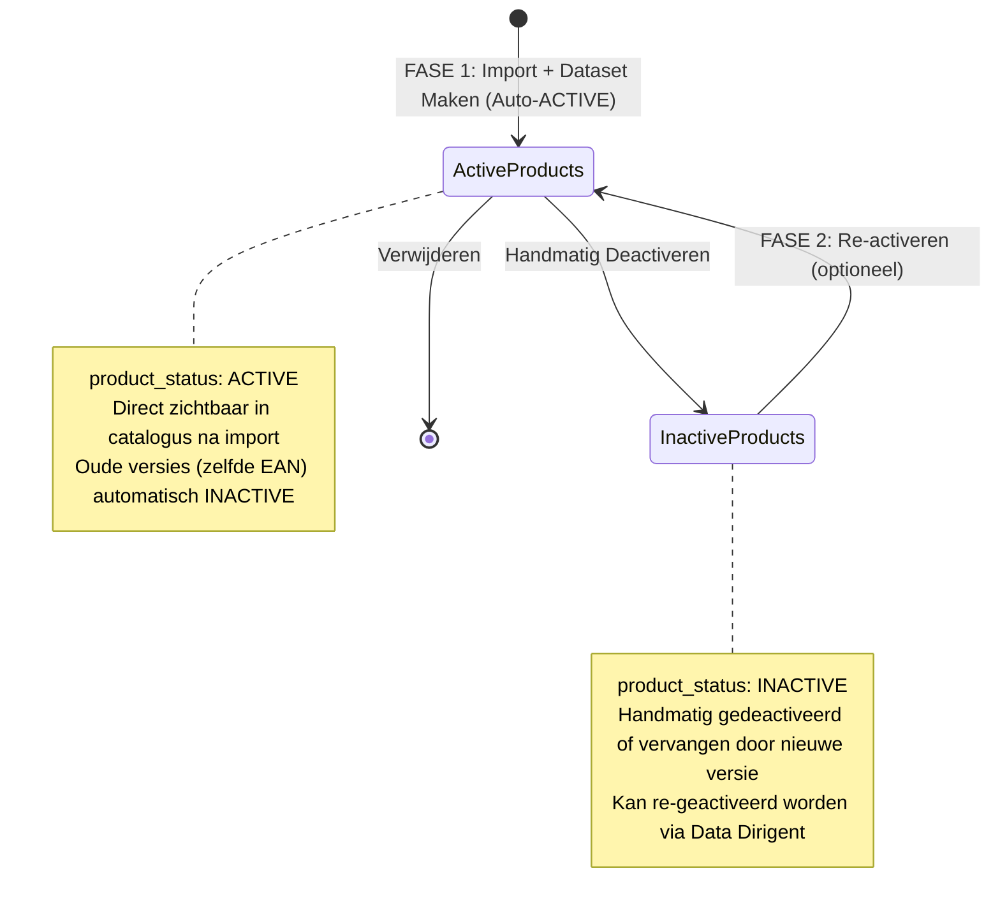

# 03. Import proces - v8.0 Auto-Activatie Architectuur

Het importproces volgt in v8.0 een **gestroomlijnde 2-stappen flow** met automatische activatie en intelligent template systeem.

---

## 🔄 Overzicht - Evolutie naar v8.0

### OUDE structuur (v5.0-v7.0)
```
Upload → Parse → Mapping → Validatie → Creatie → Activatie
(Handmatige activatiestap)
```

### NIEUWE structuur (v8.0)
```
FASE 1: IMPORT + AUTO-ACTIVATIE
    └─ Upload bestand
    └─ AI mapping (auto-load template indien beschikbaar)
    └─ Dataset maken
    └─ Products AUTOMATISCH ACTIVE
    └─ Template AUTOMATISCH opgeslagen
    └─ Oude versies AUTOMATISCH INACTIVE
    
FASE 2: RE-ACTIVATIE (optioneel)
    └─ Alleen voor handmatig gedeactiveerde datasets
```

**Belangrijkste verandering:**  
Producten zijn **direct na import ACTIVE** - geen aparte activatiestap meer nodig!

---

## 🎯 De 3 Fasen

### 1️⃣ FASE 1: IMPORT + AUTO-ACTIVATIE (v8.0)

**Doel:** Upload bestand → AI mapping → Producten direct ACTIVE

**Wat gebeurt er:**
- Upload Excel/CSV bestand (max 100,000 rijen)
- Automatische encodingdetectie  
- Server-side parsing van kolommen
- **Auto-load template** (indien eerder geïmporteerd met zelfde leverancier+merk)
- **Kolom mismatch detectie** (waarschuwing als Excel anders dan template)
- **AI-gedreven column mapping** (P0 velden - basis import)
- **Dataset creëren** met producten
- **AUTOMATISCHE ACTIVATIE:** Status = `product_status=ACTIVE` (direct zichtbaar!)
- **Oude versies vervangen:** Products met zelfde leverancier+EAN worden `INACTIVE`
- **Auto-save template:** P0 mappings automatisch opgeslagen voor volgende import

**Waar:** `/import` pagina → direct naar mapping

**Nieuw in v8.0:**
- ✅ **Template auto-load:** Bij bekende leverancier+merk worden mappings automatisch ingevuld
- ✅ **Kolom mismatch warning:** Systeem detecteert als Excel-kolommen zijn gewijzigd
- ✅ **Auto-save template:** Na succesvolle import wordt template automatisch opgeslagen (geen handmatige actie)
- ✅ **Simplified templates:** Alleen P0 velden worden opgeslagen (P1/P2/P3 handmatig per import)

**Resultaat:**
- Bestand geparsed en gemapped
- Products aangemaakt met `product_status=ACTIVE` (**direct zichtbaar in catalogus**)
- Oude versies (zelfde leverancier+EAN) automatisch `INACTIVE` (historie behoud)
- Validation errors gelogd
- **Template automatisch opgeslagen** (P0 mappings + file_columns)
- Toast toont: "✅ X producten ACTIEF, Y oude versies vervangen | Template opgeslagen"

📖 **[Lees meer: 01. Bestand Inlezen](./01-bestand-inlezen.md)**  
📖 **[Lees meer: 02. Dataset maken](./02-dataset-maken.md)**

---

### 2️⃣ FASE 2: DATA DIRIGENT - ACTIVEREN (Optioneel - Re-activatie)

**Doel:** Re-activeer eerder gedeactiveerde datasets

**Gebruik:**
- **Alleen voor:** Datasets die handmatig zijn gedeactiveerd
- **Niet voor:** Nieuwe uploads (die zijn automatisch al ACTIVE)

**Wat gebeurt er:**
- **Stap 1:** Selecteer dataset (INACTIVE products, ouder dan 5 minuten)
- **Stap 2:** Review quality score + validation errors
- **Stap 3:** Kies priority (LOW/MEDIUM/HIGH) en re-activeer

**Waar:** `/data-dirigent/activate` pagina

**Resultaat:**
- `supplier_products.product_status` update: `'INACTIVE'` → `'ACTIVE'`
- Priority conflicts opgelost (REPLACE vs DOMINATE)
- Producten **NU weer zichtbaar** in `/supplier-catalog`
- **Redirect naar:** `/supplier-catalog?supplier_id={id}`

📖 **[Lees meer: 03. Activeren](./03-activeren.md)**

---

## 🔑 Belangrijkste Veranderingen

### ✅ Voordelen nieuwe structuur

| Aspect | Oud (v5.0-v7.0) | Nieuw (v8.0) |
|--------|-----------|-------------|
| **Overzichtelijkheid** | Alles in 1 wizard (5 stappen) | 2 fasen: Import (auto-actief + auto-template) + Re-activeren |
| **Template beheer** | Handmatig opslaan + laden | **Automatisch:** Auto-load bij upload, auto-save na import |
| **Kolom mismatch** | Geen detectie | **Automatische detectie:** Waarschuwing als Excel is gewijzigd |
| **Kwaliteitscontrole** | Tijdens creatie | Na import (quality score berekend) |
| **Product zichtbaarheid** | Na handmatige activatie | **Direct na import** (auto-ACTIVE) |
| **Fouten herstellen** | Hele import opnieuw | Makkelijk: deactiveer en re-activeer |
| **Conflict handling** | Handmatige priority | Automatisch: nieuwe versie = ACTIVE, oude = INACTIVE |
| **Template scope** | Alle velden (P0-P3) | **Alleen P0 velden** (simplified) |

### ⚠️ Waarschuwingen

1. **Producten direct zichtbaar:**  
   Na import zijn producten **ACTIVE** en direct zichtbaar in catalogus. Oude versies (zelfde leverancier+EAN) worden automatisch INACTIVE.

2. **Automatische vervanging:**  
   Bij nieuwe upload worden oude versies van dezelfde producten (zelfde leverancier+EAN) automatisch gedeactiveerd. Historie blijft behouden.

3. **Re-activatie handmatig:**  
   Als je een oude dataset weer actief wilt maken, gebruik je `/data-dirigent/activate` (alleen voor handmatig gedeactiveerde datasets).

4. **Template saving:**  
   Templates worden automatisch opgeslagen na import (niet meer handmatig). Gebruikt voor AI learning.

---

## 📊 Status Flow Diagram



---

## 🎯 Kwaliteitscriteria

| Score | Rating | Actie |
|-------|--------|-------|
| 90-100 | Excellent | Producten zijn actief en export-klaar |
| 70-89 | Goed | Actief, eventueel verbeteren voor export |
| 50-69 | Matig | Actief, verbeteren aanbevolen |
| 0-49 | Slecht | Actief, maar data verbeteren vereist |

**Verschil met v6.0:**  
Quality check gebeurt **na** import (producten zijn al ACTIVE). Score is informatief, niet blokkerend.

---

## 🚀 Snelle Start

### Nieuwe gebruiker

1. **FASE 1:** Upload bestand op `/import`, map kolommen met AI suggesties, creëer dataset
2. Producten zijn **direct ACTIVE** en zichtbaar in `/supplier-catalog`
3. Quality score wordt automatisch berekend (informatief)

### Bestaande gebruiker (herhaalde import)

1. **FASE 1:** Upload nieuw bestand, selecteer bestaande template (auto-loaded), creëer dataset
2. Oude producten (zelfde leverancier+EAN) worden automatisch INACTIVE, nieuwe producten ACTIVE
3. Producten direct zichtbaar, oude versies blijven beschikbaar in historie

---

## 📖 Gedetailleerde Handleidingen

👉 **[01. Bestand Inlezen](./01-bestand-inlezen.md)** - Upload en parse bestand  
👉 **[02. Dataset maken](./02-dataset-maken.md)** - AI mapping en dataset creatie (onderdeel import flow)  
👉 **[03. Activeren](./03-activeren.md)** - Quality check en activatie  
👉 **[Troubleshooting](./troubleshooting.md)** - Problemen oplossen

---

## 🔄 Migratie v6.0 → v7.0 → v8.0

### v6.0 → v7.0 (Auto-Activatie)
- Producten zijn **automatisch ACTIVE** na import (geen expliciete activatiestap meer)
- Oude versies (zelfde leverancier+EAN) worden automatisch INACTIVE bij nieuwe upload

### v7.0 → v8.0 (Intelligent Templates)
**Belangrijkste veranderingen:**

1. **Auto-Load Templates**
   - Bij upload wordt automatisch gezocht naar template voor leverancier+merk
   - Mappings worden automatisch ingevuld (groene vinkjes)
   - Gebruiker ziet bevestigingsmelding met laatst gebruikt datum

2. **Kolom Mismatch Detectie**
   - Systeem vergelijkt Excel-kolommen met template.file_columns
   - Bij wijziging: gele waarschuwing met lijst van ontbrekende/nieuwe kolommen
   - Gebruiker moet mappings handmatig aanpassen

3. **Auto-Save na Import**
   - Template wordt automatisch opgeslagen na succesvolle import
   - Geen handmatige "Template opslaan" actie meer nodig
   - Bestaande template wordt overschreven (geen duplicate check)

4. **Simplified Template Scope**
   - Alleen P0 velden worden opgeslagen
   - P1/P2/P3 moet gebruiker elke keer handmatig mappen
   - Minder opslagcomplexiteit, sneller laden

**Bestaande data blijft werken:**
- Alle bestaande `supplier_products` blijven `product_status: 'ACTIVE'`
- Oude templates (full scope) blijven beschikbaar maar worden niet meer aangemaakt
- Nieuwe imports volgen v8.0 simplified template flow

**Nieuwe imports volgen v8.0 flow:**
- Nieuwe imports creëren direct ACTIVE producten (v7.0 gedrag)
- Templates worden automatisch geladen en opgeslagen (v8.0 nieuw)
- Kolom mismatch detectie waarschuwt bij wijzigingen (v8.0 nieuw)

---

**Document Status:** ✅ Updated voor v8.0 - Intelligent Template Systeem  
**Laatste Update:** December 2024
