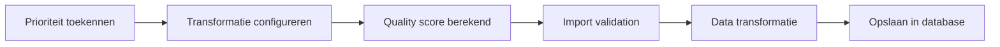

# 📝 PIM Veldspecificaties

**Locatie:** Inrichting → PIM Veldspecs  
**URL:** `/setup/pim-fields`  
**Toegang:** Admin only

## Wat zijn PIM Veldspecificaties?

PIM Veldspecificaties is het centrale configuratiepunt voor alle aspecten van je PIM velden:

1. **Prioriteiten (MVP/Good/Better/Best)** - Bepaal welke velden kritiek, verplicht, aanbevolen of optioneel zijn
2. **Transformatie Regels** - Configureer hoe data getransformeerd moet worden (size normalisatie, kleur mapping, etc.)
3. **Quality Score Systeem** - Bekijk hoe quality scores worden berekend (50/30/15/5% weging)
4. **Veldselectie** - Bepaal welke database kolommen zichtbaar en bewerkbaar zijn

## Vier Hoofdtabs

### 1. 🎯 Prioriteiten

Beheer PIM veld prioriteiten en veldgroepen:

- **MVP (P0)** - Kritieke velden zonder welke import niet mogelijk is
- **Good (P1)** - Verplichte velden voor complete productdata
- **Better (P2)** - Aanbevolen velden die kwaliteit verhogen
- **Best (P3)** - Optionele velden voor premium data
- **Veldgroepen** - OR-logica groepen (bijv. kleur naam OF kleur code)

**Acties:**
- Drag & drop om volgorde aan te passen
- "+ Nieuw" knop voor nieuwe velden of veldgroepen
- Bewerk AI prompts en validatie regels per veld

### 2. 🔄 Transformatie

Configureer transformatie regels per veld:

- **Size Normalization** - Converteer verschillende maat notaties naar standaard formaat
- **Color Normalization** - Vertaal kleurnamen naar Nederlandse standaard
- **Price Normalization** - Formatteer prijzen correct
- **EAN Validation** - Controleer 13-digit barcode format
- **Custom Rules** - Definieer eigen transformaties

**Status:** Regels worden toegepast tijdens import in stap 3 (Data Transformatie)

### 3. 📊 Quality Score Systeem

Inzicht in hoe quality scores worden berekend:

- **Weging:** MVP (50%) + Good (30%) + Better (15%) + Best (5%)
- **Coverage berekening** per prioriteitsniveau
- **Totaal score** - gewogen gemiddelde van alle niveaus

**Let op:** Quality score meet interne data completeness, niet export-readiness.

### 4. ✅ Veldselectie

Beheer welke database kolommen zichtbaar zijn in de UI:

- Per tabel (products, variants, suppliers, etc.)
- Systeem velden zijn altijd geselecteerd (grijs)
- Velden gekoppeld aan prioriteiten kunnen niet uitgezet worden (🔒 Gekoppeld badge)

**Tip:** Schakel alleen velden uit die echt niet gebruikt worden om de UI overzichtelijk te houden.

---

## Workflow

---

## Best Practices

### ✅ Do's
- Ken alleen MVP/Good prioriteit toe aan echt essentiële velden
- Gebruik veldgroepen voor alternatieve identificatie (kleur naam OF code)
- Test transformaties met voorbeelddata voordat je live gaat
- Review quality scores regelmatig en pas prioriteiten aan indien nodig

### ❌ Don'ts
- Maak niet te veel velden MVP - dit blokkeert imports onnodig
- Vergeet niet om transformaties te configureren voor gestandaardiseerde velden (maat, kleur)
- Zet geen velden uit in Veldselectie die gekoppeld zijn aan prioriteiten

---

## Technische Details

**Database tabellen:**
- `pim_field_definitions` - Veld prioriteiten en prompts
- `field_groups` - OR-logica groepen
- `field_transformation_rules` - Transformatie configuratie (toekomstig)
- `table_columns_config` - Veldselectie per tabel

**Voor developers:** Zie `docs/technical/pim-field-definitions.md` voor volledige technische specificatie.
