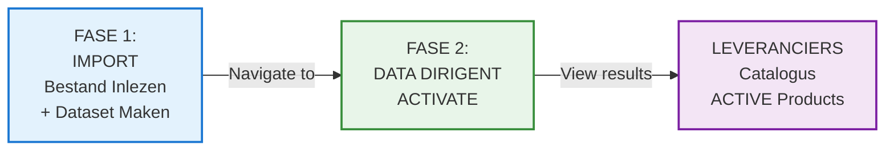
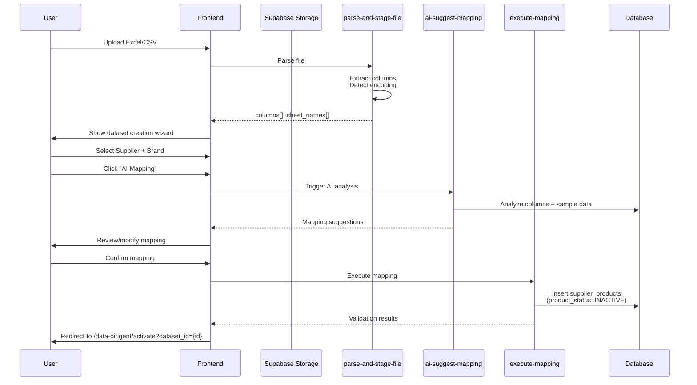
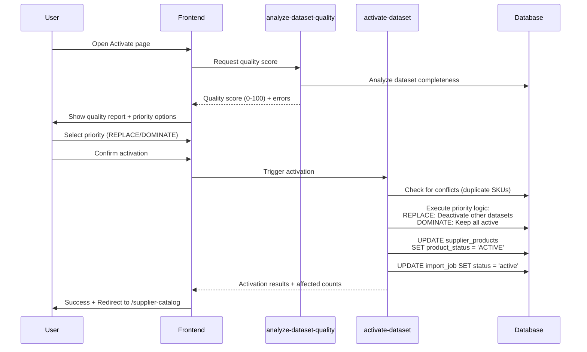
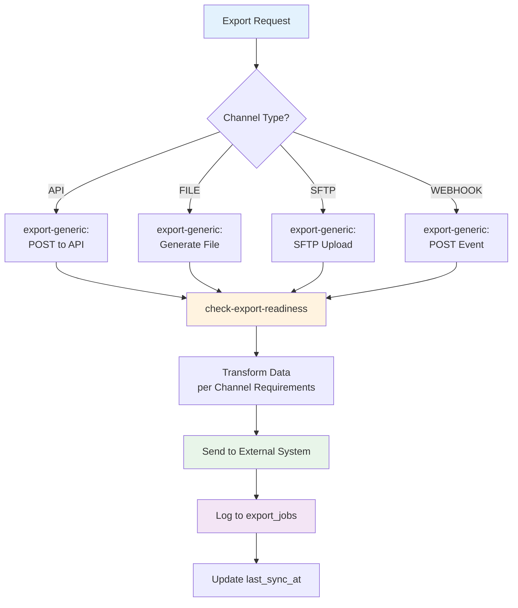
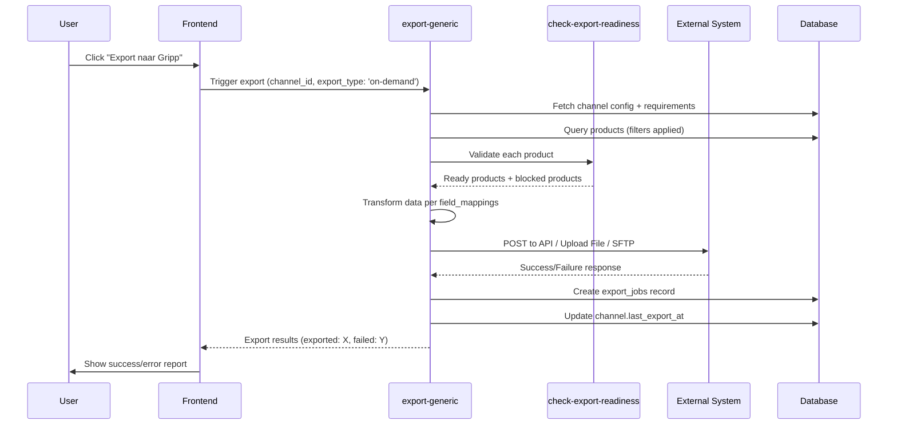

# Architecture Overview

**Last Updated:** 2 november 2025  
**Version:** 2.0 (Shopify-Compatible)

---

## System Overview

**Type:** Internal Product Information Management (PIM)  
**Purpose:** Centrale data hub voor bedrijfskleding - import van leveranciers, export naar Gripp/Calculated/Shopify webshops  
**Users:** Van Kruiningen eigenaren + medewerkers (intern)  
**Architecture Pattern:** Single-tenant SaaS met role-based authorization

**🎯 Shopify Integration:** Product structure designed as Shopify-compatible options layer (Color × Size → Variants). See `docs/shopify/master-shopify-mapping.md` for implementation details.

---

## Technology Stack

### Frontend

- **Framework:** React 18
- **Language:** TypeScript (strict mode)
- **Build Tool:** Vite
- **Styling:** Tailwind CSS
- **Components:** shadcn/ui
- **Routing:** React Router
- **Forms:** React Hook Form + Zod
- **Data Fetching:** TanStack Query
- **State:** React Context / Zustand (minimal)

### Backend

- **Platform:** Supabase (BaaS)
- **Database:** PostgreSQL 15+
- **Auth:** Supabase Auth (JWT)
- **Storage:** Supabase Storage (S3-compatible)
- **Edge Functions:** Deno runtime
- **Security:** Row Level Security (RLS)

### Hosting & Infrastructure

- **Frontend:** Lovable.dev hosting (production) / Vercel (alternative)
- **Backend:** Supabase Cloud
- **CDN:** Cloudflare (voor media)
- **Domain:** vankruiningen-pim.nl

---

## Architecture Diagram

### High-Level System Overview

```
┌─────────────────────────────────────────────────────────────┐
│                        FRONTEND                              │
│  React 18 + TypeScript + Vite + Tailwind + shadcn/ui       │
│  ┌─────────────────────────────────────────────────────┐   │
│  │ NIEUWE NAVIGATIE STRUCTUUR (v6.0)                   │   │
│  │                                                      │   │
│  │ 📥 IMPORT                                            │   │
│  │   └─ Bestand Inlezen (Fase 1)                       │   │
│  │                                                      │   │
│  │ 🎯 DATA DIRIGENT                                     │   │
│  │   ├─ Convert (Fase 2: AI Mapping → INACTIVE)        │   │
│  │   ├─ Activate (Fase 3: Quality → ACTIVE)            │   │
│  │   ├─ Promote (Fase 4: ACTIVE → PROMOTED)            │   │
│  │   └─ Enrich (AI Enrichment)                         │   │
│  │                                                      │   │
│  │ 📦 LEVERANCIERS                                      │   │
│  │   └─ Catalogus (ACTIVE products only)               │   │
│  │                                                      │   │
│  │ 🚀 EXPORT & INTEGRATIE                              │   │
│  │   ├─ Kanalen Beheer                                 │   │
│  │   ├─ Export Jobs                                    │   │
│  │   └─ Planning                                       │   │
│  └─────────────────────────────────────────────────────┘   │
└────────────┬────────────────────────────────────────────────┘
             │ HTTPS / WebSocket
             ▼
┌─────────────────────────────────────────────────────────────┐
│                    LOVABLE CLOUD (Supabase)                 │
│  ┌──────────────┐  ┌──────────────┐  ┌──────────────┐     │
│  │  PostgreSQL  │  │ Edge Functions│  │   Storage    │     │
│  │  + RLS       │  │  (Deno)       │  │   (S3)       │     │
│  │              │  │               │  │              │     │
│  │ Tables:      │  │ Import Flow:  │  │ Buckets:     │     │
│  │ • import_    │  │ - parse-file- │  │ - imports    │     │
│  │   supplier_  │  │   columns     │  │ - exports    │     │
│  │   dataset_   │  │ - ai-suggest- │  │ - product-   │     │
│  │   jobs       │  │   mapping     │  │   images     │     │
│  │   (is_temp)  │  │ - execute-    │  │              │     │
│  │              │  │   mapping     │  │              │     │
│  │ • supplier_  │  │ - activate-   │  │              │     │
│  │   products   │  │   dataset     │  │              │     │
│  │   (product_  │  │ - deactivate- │  │              │     │
│  │    status)   │  │   dataset     │  │              │     │
│  │              │  │               │  │              │     │
│  │ • export_    │  │ Export Flow:  │  │              │     │
│  │   channels   │  │ - export-     │  │              │     │
│  │ • export_    │  │   generic     │  │              │     │
│  │   channel_   │  │ - check-      │  │              │     │
│  │   requirements│ │  export-      │  │              │     │
│  │ • export_    │  │   readiness   │  │              │     │
│  │   jobs       │  │ - scheduled-  │  │              │     │
│  │              │  │   sync        │  │              │     │
│  │              │  │               │  │              │     │
│  │              │  │ 🤖 AI Layer:  │  │              │     │
│  │              │  │ - Gemini 2.5  │  │              │     │
│  │              │  │   Flash       │  │              │     │
│  │              │  │ - GPT-4o-mini │  │              │     │
│  └──────────────┘  └──────────────┘  └──────────────┘     │
└─────────────────────────┬───────────────────────────────────┘
                          │ Generic Export System
                          ▼
┌─────────────────────────────────────────────────────────────┐
│              EXPORT CHANNELS (Dynamisch Configurabel)       │
│  ┌──────────┐  ┌──────────┐  ┌──────────┐  ┌──────────┐   │
│  │  Gripp   │  │Calculated│  │ Shopify  │  │  Custom  │   │
│  │  (API)   │  │  (FILE)  │  │  (API)   │  │ (SFTP)   │   │
│  └──────────┘  └──────────┘  └──────────┘  └──────────┘   │
│                                                              │
│  Elk kanaal heeft:                                          │
│  • Required fields (export_channel_requirements)            │
│  • Field mappings (PIM → External)                          │
│  • Auth config (API keys, tokens)                           │
│  • Schedule (cron expression)                               │
│                                                              │
│  Flow per export: validate → transform → send → track      │
└─────────────────────────────────────────────────────────────┘
```

---

## Core Components

### 1. Data Layer

**PostgreSQL Database:**

- 13+ core tables (styles, variants, SKUs, prices, decorations, categories)
- Role-based access via RLS policies (admin vs user)
- Generated columns voor berekeningen (marges, voorraad)
- Audit trails (price_history)

### 2. API Layer

**Supabase Auto-generated REST API:**

- CRUD operations via PostgREST
- Real-time subscriptions voor live updates
- File uploads via Storage API
- Authentication via JWT tokens

### 3. Processing Layer

**Edge Functions (Serverless):**

**FASE 1: IMPORT - Bestand Inlezen + Dataset Maken**
- `parse-and-stage-file`: Server-side parsing + column detection
- `ai-suggest-mapping`: AI column mapping suggestions (Gemini 2.5 Flash)
- `execute-mapping`: Apply mapping + P0/P1/P2 validation → supplier_products (product_status='INACTIVE')
- `analyze-dataset-quality`: Calculate quality score (0-100) before activation

**FASE 2: DATA DIRIGENT - ACTIVATE**
- `activate-dataset`: Transform INACTIVE → ACTIVE + priority logic (REPLACE/DOMINATE)
- `deactivate-dataset`: Set products INACTIVE + optional replacement
- `analyze-dataset-quality`: Pre-activation quality check

**FASE 4: PROMOTE (ACTIVE → PROMOTED)**
- `promote-products`: AI-assisted promotion with style/color/size mapping
- `ai-enrich-product`: Conversational enrichment suggestions

**EXPORT & INTEGRATIE (Generic System)**
- `export-generic`: Universal export function for all channels (API/FILE/SFTP/WEBHOOK)
- `check-export-readiness`: Validate products against channel-specific requirements
- `scheduled-sync`: Automated cron jobs for periodic exports
- `test-integration`: Health check for external system connectivity

**QUALITY & ENRICHMENT**
- `calculate-product-quality`: Multi-layer quality scoring (Base/Integration/Validation/AI)
- `bulk-enrich-workflow`: Batch enrichment processing
- `generate-quality-report`: Scheduled quality reports generation

**STAMDATA MANAGEMENT**
- `import-standard-colors`: GS1 color library import
- `import-pantone-colors`: Pantone color system import
- `manage-supplier-brands`: Supplier-brand relationship management

**USER MANAGEMENT**
- `invite-user`: Send invitation emails (admin only)
- `get-users-with-roles`: Fetch users + roles
- `update-user-role`: Change user permissions (admin only)
- `activate-user` / `deactivate-user`: User lifecycle management

**DEPRECATED (v1.0 - DO NOT USE)**
- ~~`export-gripp`~~ → Replaced by `export-generic` with Gripp channel config
- ~~`export-calculated`~~ → Replaced by `export-generic` with Calculated channel config
- ~~`export-shopify`~~ → Replaced by `export-generic` with Shopify channel config

### 4. Presentation Layer

**React SPA:**

- Product management interfaces
- Import wizard (multi-step)
- Export configurator
- Decoratie designer
- Admin settings

---

## Data Flow

### 🔄 Import Flow - 3-Fase Funnel Architecture (Version 6.0)

**Key Architectural Change:** Import wizard is now **split into 3 separate pages** with explicit navigation between phases. This replaces the old single-wizard approach.



---

#### **FASE 1: IMPORT - Bestand Inlezen + Dataset Maken**

**Page:** `/import` (ImportPage.tsx)  
**Purpose:** Upload file + parse columns + AI mapping + create INACTIVE products  
**Duration:** 2-4 minutes



**Database State After FASE 1:**
```sql
-- supplier_products
product_status: 'INACTIVE'  -- NOT visible in catalog yet
created_at: NOW()
```

---

#### **FASE 2: DATA DIRIGENT - ACTIVATE**

**Page:** `/data-dirigent/activate` (ActivatePage.tsx)  
**Purpose:** Quality check + priority selection → Set products ACTIVE  
**Duration:** 1-2 minutes



**Priority Logic:**

| Priority | Behavior | Use Case |
|----------|----------|----------|
| **REPLACE** | Deactivate other datasets (same supplier+brand)<br/>Smart EAN-based deactivation | New price list replaces old one |
| **DOMINATE** | Keep all datasets active<br/>New products supplement existing | Add new styles to existing catalog |

**Database State After FASE 3:**
```sql
-- supplier_products
product_status: 'ACTIVE'    -- NOW visible in catalogus!

-- import_supplier_dataset_jobs
status: 'active'            -- Dataset is live
```

---

### 🚀 Export Flow - Generic Channel System (Version 2.0)

**Key Architectural Change:** Hardcoded vendor-specific export functions are **replaced** by a single generic export system with database-driven channel configuration.



---

#### **Channel Configuration (One-Time Setup)**

**Admin creates export channel:**

```sql
-- Example: Gripp ERP (API channel)
INSERT INTO export_channels (
  tenant_id, name, channel_type, endpoint_url, 
  api_key_secret, auth_type, schedule_cron, is_active
) VALUES (
  'tenant-uuid',
  'Gripp ERP',
  'api',
  'https://api.gripp.com/v2/products/bulk',
  'GRIPP_API_KEY',        -- References Supabase secret
  'bearer',
  '0 */6 * * *',          -- Every 6 hours
  true
);

-- Example: Calculated KMS (File channel)
INSERT INTO export_channels (
  tenant_id, name, channel_type, file_format, 
  file_storage_path, schedule_cron, is_active
) VALUES (
  'tenant-uuid',
  'Calculated KMS',
  'file',
  'json',
  'exports/calculated',
  '0 0 * * *',            -- Daily at midnight
  true
);
```

**Define required fields per channel:**

```sql
-- Gripp required fields
INSERT INTO export_channel_requirements (channel_id, pim_field_name, is_required, target_field_name)
VALUES
  (gripp_channel_id, 'sku', true, 'productcode'),
  (gripp_channel_id, 'name', true, 'productomschrijving'),
  (gripp_channel_id, 'price_retail_cents', true, 'verkoopprijs'),
  (gripp_channel_id, 'price_cost_cents', true, 'inkoopprijs'),
  (gripp_channel_id, 'stock_quantity', true, 'voorraad'),
  (gripp_channel_id, 'category_id', true, 'productgroep'),
  (gripp_channel_id, 'supplier_id', true, 'leverancier');
```

---

#### **Export Execution Flow**

**Manual Export (User-triggered):**



**Scheduled Export (Automated):**

```sql
-- Cron job (pg_cron extension)
SELECT cron.schedule(
  'scheduled-exports',
  '0 * * * *',  -- Every hour
  $$
  SELECT supabase.functions.invoke('scheduled-sync', '{}');
  $$
);
```

**scheduled-sync Edge Function logic:**

```typescript
// Loop through all active channels with scheduled exports
const channels = await supabase
  .from('export_channels')
  .select('*')
  .eq('is_active', true)
  .not('schedule_cron', 'is', null);

for (const channel of channels) {
  // Check if export is due (based on cron expression)
  if (isCronDue(channel.schedule_cron)) {
    await supabase.functions.invoke('export-generic', {
      body: { 
        channel_id: channel.id, 
        export_type: 'scheduled' 
      }
    });
  }
}
```

---

#### **Export Readiness Validation**

**check-export-readiness logic:**

```typescript
// For each product, check if it meets channel requirements
const requirements = await getChannelRequirements(channel_id);

const readinessCheck = {
  product_id: product.id,
  is_ready: true,
  missing_fields: [],
  blocking_issues: []
};

for (const req of requirements) {
  const fieldValue = getNestedValue(product, req.pim_field_name);
  
  if (req.is_required && !fieldValue) {
    readinessCheck.is_ready = false;
    readinessCheck.missing_fields.push(req.pim_field_name);
    readinessCheck.blocking_issues.push(
      `Required field '${req.target_field_name}' is missing`
    );
  }
}

return readinessCheck;
```

**Example blocked products:**

| Product | Missing Fields | Blocking Issue |
|---------|----------------|----------------|
| TC-POLO-001 | `price_retail_cents` | Gripp requires 'verkoopprijs' |
| TC-SHIRT-003 | `stock_quantity` | Gripp requires 'voorraad' |
| TC-VEST-005 | `category_id` | Gripp requires 'productgroep' |

---

#### **Export Job Tracking**

**export_jobs table structure:**

```sql
CREATE TABLE export_jobs (
  id UUID PRIMARY KEY,
  tenant_id UUID NOT NULL,
  channel_id UUID NOT NULL,
  export_type TEXT NOT NULL,  -- 'full', 'delta', 'on-demand'
  status TEXT NOT NULL,        -- 'pending', 'running', 'success', 'failed'
  total_products INTEGER,
  exported_products INTEGER,
  failed_products INTEGER,
  skipped_products INTEGER,
  error_message TEXT,
  error_details JSONB,
  started_at TIMESTAMPTZ,
  completed_at TIMESTAMPTZ,
  duration_ms INTEGER,
  output_file_path TEXT,       -- For file exports
  created_at TIMESTAMPTZ DEFAULT now()
);
```

**Example export job record:**

```json
{
  "id": "export-job-uuid",
  "channel_id": "gripp-channel-uuid",
  "export_type": "scheduled",
  "status": "success",
  "total_products": 1500,
  "exported_products": 1450,
  "failed_products": 30,
  "skipped_products": 20,
  "error_details": [
    {
      "product_id": "TC-POLO-001",
      "error": "Missing required field: price_retail_cents"
    }
  ],
  "started_at": "2025-01-16T10:00:00Z",
  "completed_at": "2025-01-16T10:02:15Z",
  "duration_ms": 135000
}
```

---

## Security Architecture

### Role-Based Authorization

**Database Level:**

- `user_roles` table with app_role enum (admin, user)
- Row Level Security (RLS) policies:
  ```sql
  -- All authenticated users can read
  CREATE POLICY "authenticated_read" ON products
  FOR SELECT TO authenticated USING (true);
  
  -- Only admins can write
  CREATE POLICY "admin_write" ON products
  FOR ALL TO authenticated 
  USING (public.has_role(auth.uid(), 'admin'));
  ```

**Application Level:**

- Check user role via `has_role()` security definer function
- Admin role required for: imports, exports, user invites
- User role: read-only access to all data
- Validate in Edge Functions before write operations

**Why Single-Tenant:** Internal use only for Van Kruiningen Reclame

### Authentication & Authorization

- **Auth Provider:** Supabase Auth
- **Method:** Magic link + Email/password
- **Tokens:** JWT with user_id
- **Roles:** Admin, User (stored in user_roles table)
- **Invite System:** Admin can invite new users via email
- **Session:** 7 days, refresh token rotation

### Data Protection

- **Encryption at rest:** Supabase default (AES-256)
- **Encryption in transit:** TLS 1.3
- **Secrets:** Supabase Edge Function Secrets (never in code)
- **API Keys:** Rotate quarterly

---

## Scalability

### Current Capacity

- Users: 5-10 concurrent
- Products: 10,000-50,000 SKUs
- Imports: Daily batches 1,000-5,000 products
- Exports: Hourly syncs to 3-4 external systems

### Scaling Strategy

**Vertical (Supabase tier upgrades):**

- Database: Free → Pro → Team (more connections, compute)
- Storage: 1GB → 100GB (media files)
- Edge Functions: 500K invocations → 2M → unlimited

**Horizontal (if needed in future):**

- Read replicas voor reporting
- CDN voor static assets
- Message queue voor async exports (Redis/RabbitMQ)

---

## Performance Targets

| Metric               | Target        | Current |
| -------------------- | ------------- | ------- |
| Page Load            | < 2s          | TBD     |
| API Response         | < 200ms (p95) | TBD     |
| Import 1000 products | < 5 min       | TBD     |
| Export to Gripp      | < 2 min       | TBD     |
| Database queries     | < 100ms (p95) | TBD     |
| Uptime               | 99.9%         | TBD     |

**Optimization Strategies:**

- Database indexes op tenant_id, foreign keys, is_active
- Query result caching (TanStack Query: 5 min stale time)
- Image optimization (resize, compress before upload)
- Batch operations (100-500 records per transaction)
- Pagination (max 100 items per page)

---

## Monitoring & Observability

### Application Monitoring

- **Tool:** Supabase Dashboard + Custom logging
- **Metrics:**
  - API request count, latency
  - Edge Function invocations, errors
  - Database connection pool usage
  - Storage bandwidth

### Business Metrics

- Import success rate
- Export sync failures
- Products created/updated per day
- Active users

### Error Tracking

- **Method:** Structured logging in Edge Functions
- **Storage:** Database table: error_logs
- **Alerts:** Email bij critical errors (export failures)

---

## Disaster Recovery

### Backup Strategy

- **Database:** Supabase automated daily backups (7-day retention)
- **Storage:** S3 versioning enabled
- **Code:** Git repository (GitHub)
- **Recovery Time Objective (RTO):** 4 hours
- **Recovery Point Objective (RPO):** 24 hours

### Incident Response

1. Detect (monitoring alerts)
2. Assess (check logs, database)
3. Restore (rollback code OR restore DB backup)
4. Verify (test critical flows)
5. Post-mortem (document lessons)

---

## Development Workflow

### Environments

- **Development:** Local (Supabase CLI) + Lovable preview
- **Staging:** Separate Supabase project (mirror production)
- **Production:** Lovable.dev hosting + Supabase Cloud

### Deployment Pipeline

```
1. Code in Lovable (vibe coding)
2. Auto-commit to GitHub
3. Test in Lovable preview
4. Merge to main branch
5. Lovable auto-deploys to production
6. Database migrations via Supabase CLI
```

### Version Control

- **Repository:** GitHub (private)
- **Branching:** main (production), develop (staging), feature/\* branches
- **Commits:** Conventional commits (feat, fix, docs)

---

## Future Considerations

### Phase 2 Enhancements

- **API for external apps:** Public REST API met API keys
- **Webhooks:** Event notifications (product updated, stock changed)
- **Advanced reporting:** Analytics dashboard, custom queries

### Explicit Non-Goals

**No Mobile/Tablet Support:**

Van Kruiningen PIM zal **NOOIT** mobile of tablet ondersteuning krijgen omdat:
1. Workflows zijn te complex voor touch interfaces
2. Data density vereist desktop schermen (≥1280px)
3. Target users werken uitsluitend op desktop workstations
4. Development focus blijft op desktop UX optimalisatie

**No Responsive Design:**
- Geen media queries voor < 1280px
- Geen touch gesture support
- Geen mobile-first CSS patterns

### Technology Upgrades

- **If needed:** Migrate to Next.js (SSR for SEO)
- **If scaling:** Add Redis cache layer
- **If international:** Multi-language UI (i18n)

---

_Architecture evolves based on actual usage patterns and business needs._
