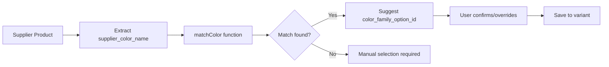
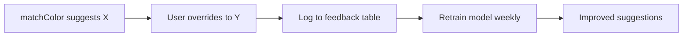

# Color Matching System

## Overview

Het Color Matching System is verantwoordelijk voor het automatisch matchen van ongestructureerde kleurwaarden uit leveranciersdata (zoals "Sport Grey" of "Black/White") naar de gestandaardiseerde `color_family_options` database van Van Kruiningen PIM.

**Doel:** Automatisch het juiste `color_family_option_id` vinden voor gebruik in de Promotie Wizard bij het omzetten van supplier producten naar master variants.

**Database:** 
- `colors` tabel: 2405 individuele kleuren met NL + EN namen
- `color_family_options` tabel: 1465 kleurcombinaties (MONO/DUO/TRIO/MULTI)

---

## Database Structuur

### Colors Tabel (2405 kleuren)

De `colors` tabel bevat alle individuele kleuren met beide talen:

```sql
TABLE: colors
- id                    : integer (PK)
- color_name_nl         : text (bijv. "Grijs", "Zwart")
- color_name_en         : text (bijv. "Grey", "Black")
- color_family          : text (RED, BLUE, GREY, GREEN, etc.)
- hex_code              : text (#RRGGBB)
- search_keywords       : text[] (array voor fuzzy matching)
- is_family_default     : boolean (hoofdkleur van een family)
- is_active             : boolean
- sort_order            : integer
- rgb_r, rgb_g, rgb_b   : integer
- is_fluorescent        : boolean
- is_high_visibility    : boolean
- application_context   : text
- common_secondary_colors : text[]
- color_description     : text
- swatch_type           : text
```

**Belangrijkste velden voor matching:**
- `color_name_en` / `color_name_nl`: Voor exacte matches
- `search_keywords`: Voor fuzzy matching (bijv. ["grey", "gray", "sport grey"])
- `color_family`: De family waar deze kleur bij hoort (gebruikt in stap 3)
- `is_family_default`: Voorkeur bij meerdere matches binnen dezelfde family

**Voorbeelden:**
| color_name_en | color_name_nl | color_family | is_family_default | search_keywords |
|---------------|---------------|--------------|-------------------|-----------------|
| Grey          | Grijs         | GREY         | true              | ["grey", "gray", "grijs"] |
| Sport Grey    | Sport Grijs   | GREY         | false             | ["sport grey", "grey"] |
| Black         | Zwart         | BLACK        | true              | ["black", "zwart"] |
| Navy Blue     | Marine Blauw  | BLUE         | false             | ["navy", "blue", "marine"] |

---

### Color Family Options Tabel (1465 opties)

De `color_family_options` tabel bevat alle mogelijke kleurcombinaties:

```sql
TABLE: color_family_options
- id                    : integer (PK) ← Dit ID wordt opgeslagen bij variant!
- color_type            : text (MONO, DUO, TRIO, MULTI)
- primary_family        : text (RED, BLUE, GREY, etc.)
- secondary_family      : text (nullable)
- tertiary_family       : text (nullable)
- primary_hex_code      : text
- secondary_hex_code    : text (nullable)
- tertiary_hex_code     : text (nullable)
- display_name_nl       : text (bijv. "Grijs", "Zwart/Wit")
- display_name_en       : text (bijv. "Grey", "Black/White")
- color_code            : text (bijv. "GREY-MONO", "BLACK-WHITE-DUO")
- is_active             : boolean
```

**Kleurtypen:**
- **MONO**: 1 kleur (bijv. GREY)
- **DUO**: 2 kleuren (bijv. BLACK + WHITE)
- **TRIO**: 3 kleuren (bijv. RED + WHITE + BLUE)
- **MULTI**: 4+ kleuren of speciale combinaties (bijv. MISC-MISC-MISC)

**Voorbeelden:**
| id  | color_type | primary_family | secondary_family | tertiary_family | display_name_en |
|-----|------------|----------------|------------------|-----------------|-----------------|
| 162 | MONO       | GREY           | null             | null            | Grey            |
| 23  | DUO        | BLACK          | WHITE            | null            | Black/White     |
| 134 | DUO        | WHITE          | BLACK            | null            | White/Black     |
| 456 | TRIO       | RED            | WHITE            | BLUE            | Red/White/Blue  |

---

## Het 4-Stappen Matching Algoritme

### Stap 1: Split Input op Meerdere Scheidingstekens

**Doel:** Detecteer of het een enkelvoudige of samengestelde kleur is.

**Scheidingstekens:** `/`, `-`, `&`, `,`, `;`

**Logica:**
```typescript
function splitColorName(input: string): string[] {
  // Split op meerdere delimiters
  const parts = input.split(/[\/\-&,;]/).map(part => part.trim());
  
  // Filter lege strings
  return parts.filter(p => p.length > 0);
}
```

**Voorbeelden:**

| Input                  | Output                          |
|------------------------|---------------------------------|
| "Sport Grey"           | `["Sport Grey"]`                |
| "Black/White"          | `["Black", "White"]`            |
| "Rood-Wit-Blauw"       | `["Rood", "Wit", "Blauw"]`      |
| "Navy & White"         | `["Navy", "White"]`             |
| "Grey,Black"           | `["Grey", "Black"]`             |
| "Red;White;Blue"       | `["Red", "White", "Blue"]`      |

**Edge cases:**
- Single color zonder scheidingsteken → Array met 1 element
- Trailing/leading whitespace → Wordt getrimd
- Meerdere spaties tussen woorden → Blijven behouden (voor "Sport Grey")

---

### Stap 2: Match Elk Deel naar `colors` Tabel

**Doel:** Voor elk gesplitst deel, vind de best matchende kleur in de `colors` tabel.

**Matching Priority (oplopende fuzzyness):**

#### **Priority 1: Exacte Match (confidence: `exact`)**
```sql
SELECT * FROM colors 
WHERE LOWER(color_name_en) = LOWER($1)
   OR LOWER(color_name_nl) = LOWER($1)
  AND is_active = true
```

**Voorbeeld:**
- Input: `"Grey"` → Match met `color_name_en = "Grey"` → ✅ Exact

#### **Priority 2: Keyword Match (confidence: `high`)**
```sql
SELECT * FROM colors 
WHERE LOWER($1) = ANY(
  SELECT LOWER(unnest(search_keywords))
)
AND is_active = true
```

**Voorbeeld:**
- Input: `"sport grey"` → Match met `search_keywords = ['sport grey', 'grey']` → ✅ High

#### **Priority 3: Contains Match (confidence: `medium`)**
```sql
SELECT * FROM colors 
WHERE LOWER(color_name_en) LIKE '%' || LOWER($1) || '%'
   OR LOWER(color_name_nl) LIKE '%' || LOWER($1) || '%'
  AND is_active = true
```

**Voorbeeld:**
- Input: `"Navy"` → Match met `color_name_en = "Navy Blue"` (contains "Navy") → ✅ Medium

#### **Priority 4: Keyword Extractie Match (confidence: `low`)**

Als bovenstaande niets oplevert:
1. Extract individuele keywords: `"Sport Grey"` → `["sport", "grey"]`
2. Zoek elke keyword in `search_keywords` of color names
3. Kies beste match

**Voorbeeld:**
- Input: `"Heather Grey"` → Extract `["heather", "grey"]`
- Keyword `"grey"` matcht kleuren met family GREY → ✅ Low

**Voorkeur bij meerdere matches:**
- Bij gelijke confidence: kies `is_family_default = true`
- Bij gelijke default status: kies lagere `sort_order`

**Output per deel:**
```typescript
interface ColorMatchDetail {
  colorId: number;           // ID uit colors tabel
  colorFamily: string;       // bijv. "GREY", "BLUE", "RED"
  confidence: 'exact' | 'high' | 'medium' | 'low';
  matchedOn: string;         // bijv. "color_name_en", "search_keywords", "contains"
  colorNameEn: string;       // Voor logging
  colorNameNl: string;       // Voor logging
}
```

**Voorbeelden:**

| Input         | Matched Color | color_family | confidence | matchedOn        |
|---------------|---------------|--------------|------------|------------------|
| "Grey"        | Grey          | GREY         | exact      | color_name_en    |
| "Sport Grey"  | Grey          | GREY         | high       | search_keywords  |
| "Navy"        | Navy Blue     | BLUE         | medium     | contains         |
| "Heather Grey"| Grey          | GREY         | low        | keyword: grey    |

---

### Stap 3: Bepaal Color Type

**Doel:** Bepaal of het een MONO, DUO, TRIO of MULTI kleur is.

**Logica:**
```typescript
function determineColorType(families: string[]): ColorType {
  const uniqueFamilies = [...new Set(families)]; // Verwijder duplicaten
  
  switch(uniqueFamilies.length) {
    case 1: return 'MONO';
    case 2: return 'DUO';
    case 3: return 'TRIO';
    default: return 'MULTI'; // 4+ families
  }
}
```

**Voorbeelden:**

| Matched Families       | Unique Families  | Color Type |
|------------------------|------------------|------------|
| `["GREY"]`             | `["GREY"]`       | MONO       |
| `["BLACK", "WHITE"]`   | `["BLACK", "WHITE"]` | DUO    |
| `["RED", "WHITE", "BLUE"]` | `["RED", "WHITE", "BLUE"]` | TRIO |
| `["RED", "RED"]`       | `["RED"]`        | MONO       |
| `["A", "B", "C", "D"]` | `["A", "B", "C", "D"]` | MULTI |

**Edge case - Duplicaten:**
- Input: `"Red/Red"` → Beide delen matchen naar RED family
- Unique families: `["RED"]` → MONO (niet DUO)

---

### Stap 4: Lookup in `color_family_options`

**Doel:** Vind het exacte `color_family_option_id` op basis van families en type.

#### **Voor MONO (1 family):**
```sql
SELECT id FROM color_family_options
WHERE color_type = 'MONO'
  AND primary_family = $1
  AND is_active = true
LIMIT 1
```

**Voorbeeld:**
- Families: `["GREY"]` → Query: `primary_family = 'GREY'` → Result: `id = 162`

#### **Voor DUO (2 families):**

**Probleem:** Volgorde kan verschillen (BLACK/WHITE vs WHITE/BLACK zijn aparte opties!)

**Oplossing:** Probeer beide volgordes

```sql
SELECT id FROM color_family_options
WHERE color_type = 'DUO'
  AND (
    (primary_family = $1 AND secondary_family = $2)
    OR
    (primary_family = $2 AND secondary_family = $1)
  )
  AND is_active = true
LIMIT 1
```

**Voorbeeld:**
- Families: `["BLACK", "WHITE"]`
- Query: 
  - `primary='BLACK' AND secondary='WHITE'` → id 23 ✅
  - OF `primary='WHITE' AND secondary='BLACK'` → id 134 ✅
- Kies eerste match (voorkeur voor supplier volgorde)

#### **Voor TRIO (3 families):**

**Probleem:** 3 families = 6 mogelijke permutaties!

**Oplossing:** Probeer alle 6 permutaties

```typescript
const permutations = [
  [A, B, C], [A, C, B], [B, A, C], 
  [B, C, A], [C, A, B], [C, B, A]
];

for (const [p, s, t] of permutations) {
  const result = await supabase
    .from('color_family_options')
    .select('id')
    .eq('color_type', 'TRIO')
    .eq('primary_family', p)
    .eq('secondary_family', s)
    .eq('tertiary_family', t)
    .eq('is_active', true)
    .maybeSingle();
  
  if (result.data) return result.data.id;
}
```

**Voorbeeld:**
- Families: `["RED", "WHITE", "BLUE"]`
- Probeer:
  1. RED-WHITE-BLUE
  2. RED-BLUE-WHITE
  3. WHITE-RED-BLUE
  4. WHITE-BLUE-RED
  5. BLUE-RED-WHITE
  6. BLUE-WHITE-RED
- Eerste match wordt geretourneerd

#### **Voor MULTI (4+ families):**

**Strategie:** Fallback naar generieke MULTI optie

```sql
SELECT id FROM color_family_options
WHERE color_type = 'MULTI'
  AND primary_family = 'MISC'
  AND secondary_family = 'MISC'
  AND tertiary_family = 'MISC'
  AND is_active = true
LIMIT 1
```

**Voorbeeld:**
- Families: `["RED", "BLUE", "GREEN", "YELLOW"]`
- Fallback: `MISC-MISC-MISC` → Generic multicolor option

**Special case - Geen match gevonden:**
- Return `null` of fallback naar een "Unknown Color" optie
- Log warning voor handmatige review

---

## Test Cases & Verwachte Resultaten

### Test Case 1: Eenvoudige Mono Kleur
```
Input:     "Sport Grey"
Step 1:    ["Sport Grey"]
Step 2:    Match via search_keywords → GREY family (confidence: high)
Step 3:    1 family → MONO
Step 4:    Query: primary_family='GREY' AND color_type='MONO'
✅ Result: color_family_option_id = 162
```

### Test Case 2: Duo Kleur met Slash
```
Input:     "Black/White"
Step 1:    ["Black", "White"]
Step 2:    
  - "Black" → BLACK family (exact)
  - "White" → WHITE family (exact)
Step 3:    2 families → DUO
Step 4:    Query: (primary='BLACK' AND secondary='WHITE') 
           OR (primary='WHITE' AND secondary='BLACK')
✅ Result: color_family_option_id = 23 (BLACK/WHITE)
```

### Test Case 3: Complexe Naam met Keyword Extractie
```
Input:     "Navy Blue"
Step 1:    ["Navy Blue"]
Step 2:    Match via contains → "Navy Blue" color → BLUE family (medium)
Step 3:    1 family → MONO
Step 4:    Query: primary_family='BLUE' AND color_type='MONO'
✅ Result: color_family_option_id = [BLUE_MONO_ID]
```

### Test Case 4: Trio met Streepjes
```
Input:     "Rood-Wit-Blauw"
Step 1:    ["Rood", "Wit", "Blauw"]
Step 2:    
  - "Rood" → RED family (exact NL)
  - "Wit" → WHITE family (exact NL)
  - "Blauw" → BLUE family (exact NL)
Step 3:    3 families → TRIO
Step 4:    Try all 6 permutations of RED, WHITE, BLUE
✅ Result: First matching TRIO option ID
```

### Test Case 5: Fuzzy Match met Heather
```
Input:     "Heather Grey"
Step 1:    ["Heather Grey"]
Step 2:    
  - Exact: ❌ No match
  - Keywords: ❌ "heather grey" not in search_keywords
  - Contains: ❌ No color name contains "heather grey"
  - Keyword extraction: ["heather", "grey"]
    - "grey" matches search_keywords → GREY family (low)
Step 3:    1 family → MONO
Step 4:    Query: primary_family='GREY' AND color_type='MONO'
✅ Result: color_family_option_id = 162
```

### Test Case 6: Edge Case - Duplicate Colors
```
Input:     "Red/Red"
Step 1:    ["Red", "Red"]
Step 2:    Both match RED family
Step 3:    Unique families: ["RED"] → MONO (not DUO!)
Step 4:    Query: primary_family='RED' AND color_type='MONO'
✅ Result: RED MONO option ID
```

### Test Case 7: Multi-color Fallback
```
Input:     "Rainbow Mix (Red/Orange/Yellow/Green/Blue/Purple)"
Step 1:    ["Rainbow Mix (Red", "Orange", "Yellow", ...]
Step 2:    Match multiple families: RED, ORANGE, YELLOW, GREEN, BLUE, PURPLE
Step 3:    6 families → MULTI
Step 4:    Fallback: primary='MISC' AND color_type='MULTI'
✅ Result: MISC-MISC-MISC generic multicolor ID
```

---

## Code Implementatie Preview

### Hoofdfunctie Signatuur

```typescript
/**
 * Match een supplier kleur naam naar een color_family_option_id
 * 
 * @param supplierColorName - Ongestructureerde kleur input (bijv. "Sport Grey", "Black/White")
 * @returns ColorMatchResult met id en metadata, of null als geen match gevonden
 * 
 * @example
 * const result = await matchColor("Sport Grey");
 * // { colorFamilyOptionId: 162, confidence: 'high', colorType: 'MONO', ... }
 */
export async function matchColor(
  supplierColorName: string
): Promise<ColorMatchResult | null>
```

### Interfaces

```typescript
/**
 * Resultaat van color matching algoritme
 */
interface ColorMatchResult {
  colorFamilyOptionId: number;     // ID uit color_family_options (opslaan bij variant!)
  confidence: 'exact' | 'high' | 'medium' | 'low';
  colorType: 'MONO' | 'DUO' | 'TRIO' | 'MULTI';
  matchedColors: ColorMatchDetail[]; // Details van alle matched kleuren
  matchedFamilies: string[];        // bijv. ["BLACK", "WHITE"]
  displayNameNl: string;            // bijv. "Zwart/Wit"
  displayNameEn: string;            // bijv. "Black/White"
}

/**
 * Details van één matched kleur uit colors tabel
 */
interface ColorMatchDetail {
  colorId: number;                  // ID uit colors tabel
  colorFamily: string;              // bijv. "GREY", "BLUE", "RED"
  colorNameEn: string;              // bijv. "Grey"
  colorNameNl: string;              // bijv. "Grijs"
  confidence: 'exact' | 'high' | 'medium' | 'low';
  matchedOn: string;                // bijv. "color_name_en", "search_keywords", "contains"
  isFamilyDefault: boolean;         // Of dit de default kleur van de family is
}

/**
 * Interne data uit colors tabel
 */
interface Color {
  id: number;
  color_name_nl: string;
  color_name_en: string;
  color_family: string;
  search_keywords: string[] | null;
  is_family_default: boolean;
  is_active: boolean;
  sort_order: number;
}

/**
 * Interne data uit color_family_options tabel
 */
interface ColorFamilyOption {
  id: number;
  color_type: 'MONO' | 'DUO' | 'TRIO' | 'MULTI';
  primary_family: string;
  secondary_family: string | null;
  tertiary_family: string | null;
  display_name_nl: string;
  display_name_en: string;
  color_code: string;
  is_active: boolean;
}
```

### Helper Functies

```typescript
/**
 * Split kleur naam op meerdere delimiters
 */
function splitColorName(input: string): string[] {
  return input
    .split(/[\/\-&,;]/)
    .map(part => part.trim())
    .filter(part => part.length > 0);
}

/**
 * Match één kleur deel naar colors tabel met fuzzy logic
 */
async function matchColorPart(
  colorPart: string, 
  allColors: Color[]
): Promise<ColorMatchDetail | null> {
  // Priority 1: Exact match
  // Priority 2: Keyword match
  // Priority 3: Contains match
  // Priority 4: Keyword extraction match
  // Return beste match met confidence
}

/**
 * Extract keywords uit kleur naam voor fuzzy matching
 */
function extractKeywords(input: string): string[] {
  return input
    .toLowerCase()
    .split(/\s+/)
    .filter(word => word.length > 2);
}

/**
 * Bepaal color type op basis van aantal families
 */
function determineColorType(families: string[]): 'MONO' | 'DUO' | 'TRIO' | 'MULTI' {
  const unique = [...new Set(families)];
  if (unique.length === 1) return 'MONO';
  if (unique.length === 2) return 'DUO';
  if (unique.length === 3) return 'TRIO';
  return 'MULTI';
}

/**
 * Vind color_family_option voor gegeven families en type
 * Probeert alle permutaties voor DUO/TRIO
 */
async function findColorFamilyOption(
  families: string[],
  colorType: 'MONO' | 'DUO' | 'TRIO' | 'MULTI',
  options: ColorFamilyOption[]
): Promise<ColorFamilyOption | null> {
  // MONO: directe match
  // DUO: probeer A-B en B-A
  // TRIO: probeer alle 6 permutaties
  // MULTI: fallback naar MISC-MISC-MISC
}

/**
 * Genereer alle permutaties van een array (voor TRIO)
 */
function generatePermutations<T>(arr: T[]): T[][] {
  if (arr.length <= 1) return [arr];
  
  const result: T[][] = [];
  for (let i = 0; i < arr.length; i++) {
    const rest = [...arr.slice(0, i), ...arr.slice(i + 1)];
    const perms = generatePermutations(rest);
    for (const perm of perms) {
      result.push([arr[i], ...perm]);
    }
  }
  return result;
}
```

### Hoofd Implementatie

```typescript
import { supabase } from '@/integrations/supabase/client';

export async function matchColor(
  supplierColorName: string
): Promise<ColorMatchResult | null> {
  // Input validatie
  if (!supplierColorName || supplierColorName.trim().length === 0) {
    console.warn('[ColorMatching] Empty input provided');
    return null;
  }

  try {
    // 1. Fetch alle colors (met caching in productie)
    const { data: allColors, error: colorsError } = await supabase
      .from('colors')
      .select('id, color_name_nl, color_name_en, color_family, search_keywords, is_family_default, is_active, sort_order')
      .eq('is_active', true);
    
    if (colorsError) throw colorsError;
    if (!allColors || allColors.length === 0) {
      throw new Error('No colors found in database');
    }

    // 2. Fetch alle color_family_options (met caching in productie)
    const { data: colorFamilyOptions, error: optionsError } = await supabase
      .from('color_family_options')
      .select('id, color_type, primary_family, secondary_family, tertiary_family, display_name_nl, display_name_en, color_code, is_active')
      .eq('is_active', true);
    
    if (optionsError) throw optionsError;
    if (!colorFamilyOptions || colorFamilyOptions.length === 0) {
      throw new Error('No color family options found in database');
    }

    // 3. Split input op delimiters
    const colorParts = splitColorName(supplierColorName);
    console.log(`[ColorMatching] Split "${supplierColorName}" into ${colorParts.length} parts:`, colorParts);

    // 4. Match elk deel naar colors tabel
    const matchedColors: ColorMatchDetail[] = [];
    for (const part of colorParts) {
      const match = await matchColorPart(part, allColors);
      if (match) {
        matchedColors.push(match);
      } else {
        console.warn(`[ColorMatching] No match found for part: "${part}"`);
      }
    }

    // Faal als geen enkele kleur gematcht kon worden
    if (matchedColors.length === 0) {
      console.error(`[ColorMatching] No colors matched for input: "${supplierColorName}"`);
      return null;
    }

    // 5. Bepaal color type
    const matchedFamilies = matchedColors.map(c => c.colorFamily);
    const colorType = determineColorType(matchedFamilies);
    console.log(`[ColorMatching] Determined type: ${colorType}, families:`, matchedFamilies);

    // 6. Find in color_family_options
    const colorFamilyOption = await findColorFamilyOption(
      matchedFamilies,
      colorType,
      colorFamilyOptions
    );

    if (!colorFamilyOption) {
      console.error(`[ColorMatching] No color_family_option found for type=${colorType}, families=`, matchedFamilies);
      return null;
    }

    // 7. Bepaal overall confidence (laagste confidence van alle matches)
    const confidenceLevels = { 'exact': 4, 'high': 3, 'medium': 2, 'low': 1 };
    const minConfidence = matchedColors.reduce((min, c) => {
      return confidenceLevels[c.confidence] < confidenceLevels[min] ? c.confidence : min;
    }, 'exact' as const);

    // 8. Return resultaat
    const result: ColorMatchResult = {
      colorFamilyOptionId: colorFamilyOption.id,
      confidence: minConfidence,
      colorType,
      matchedColors,
      matchedFamilies: [...new Set(matchedFamilies)], // Unique families
      displayNameNl: colorFamilyOption.display_name_nl,
      displayNameEn: colorFamilyOption.display_name_en,
    };

    console.log(`[ColorMatching] ✅ Success:`, result);
    return result;

  } catch (error) {
    console.error('[ColorMatching] Error during matching:', error);
    return null;
  }
}
```

---

## Integratie Punten

### 1. Promotie Wizard - Color Mapping Step

**Use Case:** Gebruiker selecteert supplier producten voor promotie. Systeem moet automatisch kleur suggesties doen.

**Workflow:**


**Code Integratie:**
```typescript
// In PromotionWizardColorStep.tsx
const suggestions = await Promise.all(
  selectedProducts.map(async (product) => {
    const result = await matchColor(product.supplier_color_name);
    return {
      productId: product.id,
      suggestedColorFamilyOptionId: result?.colorFamilyOptionId,
      confidence: result?.confidence,
      displayName: result?.displayNameNl,
    };
  })
);

// Toon suggesties aan gebruiker met confidence indicator
```

### 2. Import Mapping - AI-Gestuurde Mapping Engine

**Use Case:** Bij import van nieuwe supplier data, automatisch kleur kolommen mappen.

**Workflow:**
- Detecteer kolom die kleurnamen bevat (bijv. "Kleur", "Color", "Colorway")
- Voor sample van rijen, run `matchColor()`
- Als >80% confidence, automatisch accepteer mapping
- Anders: vraag gebruiker om handmatige review

### 3. Data Quality - Validatie van Kleur Consistentie

**Use Case:** Check of alle kleuren in database valid zijn.

**Implementatie:**
```typescript
// In data quality scan
const unmatchedColors = await supabase
  .from('supplier_products')
  .select('id, supplier_color_name')
  .not('supplier_color_name', 'is', null);

for (const product of unmatchedColors.data) {
  const match = await matchColor(product.supplier_color_name);
  if (!match || match.confidence === 'low') {
    // Flag voor handmatige review
    await flagDataQualityIssue({
      productId: product.id,
      issue: 'unmatched_color',
      value: product.supplier_color_name,
    });
  }
}
```

---

## Performance Overwegingen

### 1. Database Query Optimalisatie

**Probleem:** Elke `matchColor()` call doet 2 database queries.

**Oplossing: In-Memory Caching**
```typescript
let cachedColors: Color[] | null = null;
let cachedColorFamilyOptions: ColorFamilyOption[] | null = null;
let cacheTimestamp: number = 0;
const CACHE_TTL = 1000 * 60 * 60; // 1 uur

async function getCachedColors(): Promise<Color[]> {
  if (cachedColors && Date.now() - cacheTimestamp < CACHE_TTL) {
    return cachedColors;
  }
  
  const { data } = await supabase.from('colors').select('*').eq('is_active', true);
  cachedColors = data || [];
  cacheTimestamp = Date.now();
  return cachedColors;
}
```

**Impact:** Eerste call: 2 DB queries. Volgende calls binnen 1 uur: 0 DB queries.

### 2. Batch Matching voor Import

**Probleem:** Import van 1000 producten = 1000x `matchColor()` = langzaam.

**Oplossing: Batch Processing**
```typescript
async function matchColorsBatch(
  colorNames: string[]
): Promise<(ColorMatchResult | null)[]> {
  // Haal data 1x op
  const colors = await getCachedColors();
  const options = await getCachedColorFamilyOptions();
  
  // Match alle kleuren in parallel (in-memory)
  return Promise.all(
    colorNames.map(name => matchColorSync(name, colors, options))
  );
}
```

**Impact:** 1000 producten: van ~2000 queries naar ~2 queries.

### 3. Database Indexen

**Aanbevolen indexen voor snelle queries:**

```sql
-- Voor keyword matching
CREATE INDEX idx_colors_search_keywords ON colors USING GIN(search_keywords);

-- Voor family lookups
CREATE INDEX idx_color_family_options_families 
ON color_family_options(color_type, primary_family, secondary_family, tertiary_family);

-- Voor case-insensitive naam matching
CREATE INDEX idx_colors_name_en_lower ON colors(LOWER(color_name_en));
CREATE INDEX idx_colors_name_nl_lower ON colors(LOWER(color_name_nl));
```

**Impact:** Keyword match van ~100ms naar ~5ms.

### 4. Precomputed Matches voor Veelvoorkomende Kleuren

**Idee:** Sla vaak gematchte combinaties op in cache tabel.

```sql
CREATE TABLE color_match_cache (
  supplier_color_name text PRIMARY KEY,
  color_family_option_id integer,
  confidence text,
  last_used_at timestamptz,
  usage_count integer
);
```

**Workflow:**
1. Check cache eerst
2. Bij miss: run algoritme + sla resultaat op
3. Bij hit: increment `usage_count`

**Impact:** Top 100 kleuren: instant lookup (<1ms).

---

## Toekomstige Uitbreidingen

### 1. Machine Learning voor Betere Keyword Extractie

**Probleem:** Huidige keyword extractie is simpel (split op spaties, filter >2 chars).

**Oplossing:** Train ML model op historische matches.

**Data:**
- Input: `"Heather Sport Grey Melange"`
- Output: Relevante keywords in volgorde: `["grey", "heather", "sport"]`

**Model:** TF-IDF + Naive Bayes of lightweight transformer.

**Impact:** Verhoog confidence van 'low' naar 'medium' matches.

### 2. User Feedback Loop voor Foutieve Matches

**Workflow:**


**Database:**
```sql
CREATE TABLE color_match_feedback (
  id bigserial PRIMARY KEY,
  supplier_color_name text,
  suggested_option_id integer,
  corrected_option_id integer,
  user_id uuid,
  created_at timestamptz DEFAULT now()
);
```

**Impact:** Self-learning systeem dat steeds beter wordt.

### 3. Supplier-Specifieke Mapping Templates

**Observatie:** Elke supplier heeft eigen kleur conventies.

**Voorbeeld:**
- Supplier A: "Grey Melange" = GREY
- Supplier B: "Grey Melange" = GREY/WHITE (duo)

**Oplossing:** Sla supplier-specifieke overrides op.

```typescript
interface SupplierColorMapping {
  supplierId: number;
  colorName: string;
  colorFamilyOptionId: number;
  overridesDefault: boolean;
}

// In matchColor():
const supplierOverride = await getSupplierColorMapping(supplierId, colorName);
if (supplierOverride) return supplierOverride;
// Anders: run standaard algoritme
```

**Impact:** 100% accuracy voor bekende supplier kleuren.

### 4. Visuele Kleur Matching via Hex Codes

**Idee:** Als geen tekstuele match, gebruik hex code (indien beschikbaar).

**Workflow:**
1. Supplier levert: `color_name = "XYZ-123"`, `hex_code = "#4A5D6F"`
2. Tekstuele match faalt
3. Bereken color distance tussen `#4A5D6F` en alle `colors.hex_code`
4. Match nearest color in LAB color space

**Algoritme:**
```typescript
function colorDistance(hex1: string, hex2: string): number {
  const lab1 = hexToLAB(hex1);
  const lab2 = hexToLAB(hex2);
  return deltaE(lab1, lab2); // CIE Delta E 2000
}
```

**Impact:** Kan exotische/proprietary kleurnamen matchen.

### 5. Multi-Language Support voor Kleurnamen

**Uitbreiding:** Voeg meer talen toe (Duits, Frans, Spaans).

**Database:**
```sql
ALTER TABLE colors 
ADD COLUMN color_name_de text,
ADD COLUMN color_name_fr text,
ADD COLUMN color_name_es text;
```

**Matching:** Check alle talen in stap 2.

**Impact:** Internationale suppliers kunnen worden ondersteund.

---

## Relatie met Andere Documentatie

**Gerelateerde Documenten:**

### Architectuur
- [`database-schema.md`](./database-schema.md) - Volledige schema van `colors` en `color_family_options` tabellen
- [`promotion-strategy.md`](./promotion-strategy.md) - Hoe color matching past in promotie workflow

### Archive (Oude Systemen)
- [`intelligent-promotion-system.md`](../archive/intelligent-promotion-system.md) - Legacy AI promotion system (vervangen)

### Gebruikershandleiding
- [`docs/gebruikershandleiding/05-promotie-beheer/README.md`](../gebruikershandleiding/05-promotie-beheer/README.md) - Hoe gebruikers de promotie wizard gebruiken

### Business Requirements
- [`business-requirements.md`](../business/business-requirements.md) - Waarom kleur standaardisatie belangrijk is

---

## Troubleshooting

### Probleem: Lage Confidence Matches

**Symptoom:** Veel matches met `confidence: 'low'`

**Oorzaken:**
1. Supplier gebruikt niet-standaard kleur namen
2. `search_keywords` in `colors` tabel incompleet
3. Nieuwe kleur varianten niet in database

**Oplossing:**
- Analyseer meest voorkomende ongematchte kleuren via data quality scan
- Voeg ontbrekende keywords toe aan `colors.search_keywords`
- Overweeg supplier-specifieke mapping template

### Probleem: Geen Match Gevonden (null result)

**Symptoom:** `matchColor()` returned `null`

**Oorzaken:**
1. Kleur naam is compleet onbekend (bijv. proprietary code)
2. Typo in database (`colro_name_en` ipv `color_name_en`)
3. Alle kleuren zijn `is_active = false`

**Oplossing:**
- Check logs: welke stap faalde?
- Valideer dat `colors` en `color_family_options` data aanwezig is
- Fallback: toon gebruiker keuzelijst met alle opties

### Probleem: DUO/TRIO Volgorde Verkeerd

**Symptoom:** Supplier levert "Black/White", systeem slaat "White/Black" op

**Oorzaak:** Beide volgordes bestaan in `color_family_options`, eerste match wint

**Oplossing:**
- Optie 1: Geef voorkeur aan supplier volgorde in permutatie loop
- Optie 2: Check display_name match eerst
- Optie 3: Toon gebruiker beide opties met preview

### Probleem: Performance Issues bij Grote Import

**Symptoom:** Import van 10.000+ producten duurt >10 minuten

**Diagnose:**
```typescript
console.time('ColorMatching');
await matchColor("Black/White");
console.timeEnd('ColorMatching'); // Should be <100ms
```

**Oplossing:**
- Implementeer caching (zie Performance sectie)
- Gebruik `matchColorsBatch()` voor imports
- Check database indexen

---

## Conclusie

Het Color Matching System is een **kritisch onderdeel** van de Van Kruiningen PIM voor:
- ✅ Automatisering van promotie workflows
- ✅ Data kwaliteit en consistentie
- ✅ Gebruikerservaring (minder handmatige input)
- ✅ Schaalbaarheid (duizenden producten per dag)

**Belangrijkste Ontwerpprincipes:**
1. **Fuzzy maar deterministisch**: Flexibel in matching, maar reproduceerbaar
2. **Performance first**: Caching en batching ingebouwd
3. **Extensible**: Makkelijk uit te breiden met ML/feedback loops
4. **Debuggable**: Uitgebreide logging en confidence scores

**Volgende Stappen:**
1. Implementeer basis algoritme in `src/lib/utils/color-matching.ts`
2. Integreer in Promotie Wizard (stap 4: Color Mapping)
3. Test met productie data (sample van 1000 producten)
4. Itereer op basis van gebruikersfeedback
5. Voeg caching en optimalisaties toe

---

**Laatste Update:** 2025-01-13  
**Auteur:** Van Kruiningen PIM Team  
**Status:** Specificatie Compleet - Implementatie Pending
