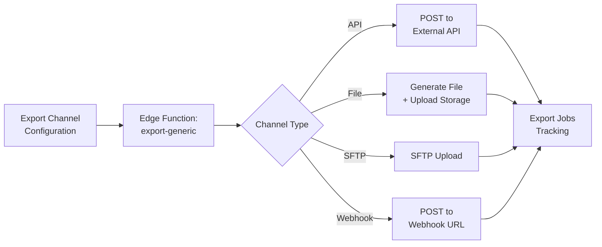

# Export Architecture - Generic Export System

**Last Updated:** 2025-01-16  
**Version:** 2.0 - Generic Export Framework

---

## Overview

**Purpose:** Transform PIM data → external system formats via configurable channels  
**Architecture:** Generic channel-based system (replaces hardcoded vendor exports)  
**Processing:** Server-side (Supabase Edge Functions + Scheduled jobs)  
**Scale:** 1,000-10,000 products per export  
**Frequency:** Configurable per channel (hourly, daily, on-demand)

---

## 🔄 Architecture Pattern (Version 2.0)

### HIGH-LEVEL FLOW



### KEY CHANGES FROM V1.0 → V2.0

| Aspect | OLD (v1.0 - Hardcoded) | NEW (v2.0 - Generic) |
|--------|------------------------|----------------------|
| **Export Functions** | Separate function per vendor:<br>`export-gripp`, `export-calculated` | Single generic function:<br>`export-generic` |
| **Configuration** | Hardcoded in Edge Function code | Database tables:<br>`export_channels`, `export_channel_requirements` |
| **Field Mapping** | Fixed per vendor | Dynamic based on channel requirements |
| **Adding New Export** | Write new Edge Function + code deploy | Add row to `export_channels` table (no code) |
| **Maintenance** | Update code for each vendor | Update database configuration |
| **Export Job Tracking** | Ad-hoc logging | Standardized `export_jobs` table |

---

## 📦 Database Schema (NEW in v2.0)

### Table 1: export_channels

**Purpose:** Define export destinations (API, file, SFTP, webhook)

```sql
CREATE TABLE export_channels (
  id UUID PRIMARY KEY DEFAULT gen_random_uuid(),
  tenant_id UUID NOT NULL REFERENCES tenants(id) ON DELETE CASCADE,
  
  -- Channel identification
  name TEXT NOT NULL,                    -- "Gripp ERP", "Calculated KMS", "Shopify Webshop"
  channel_type TEXT NOT NULL             -- 'api', 'file', 'sftp', 'webhook'
    CHECK (channel_type IN ('api', 'file', 'sftp', 'webhook')),
  
  -- Connection details
  endpoint_url TEXT,                     -- For API/webhook channels
  api_key_secret TEXT,                   -- Reference to Supabase secret (e.g., "GRIPP_API_KEY")
  auth_type TEXT,                        -- 'bearer', 'api_key', 'basic', 'none'
  
  -- File-specific config
  file_format TEXT                       -- 'json', 'csv', 'xml'
    CHECK (file_format IN ('json', 'csv', 'xml') OR file_format IS NULL),
  file_storage_path TEXT,                -- Storage bucket path for generated files
  
  -- SFTP-specific config
  sftp_config JSONB,                     -- {host, port, username, password_secret, path}
  
  -- Schedule
  schedule_cron TEXT,                    -- Cron expression for scheduled exports
  
  -- Status
  is_active BOOLEAN DEFAULT true,
  last_export_at TIMESTAMPTZ,
  
  -- Timestamps
  created_at TIMESTAMPTZ DEFAULT now(),
  updated_at TIMESTAMPTZ DEFAULT now()
);

CREATE INDEX idx_export_channels_tenant ON export_channels(tenant_id);
CREATE INDEX idx_export_channels_active ON export_channels(is_active);
```

**Example rows:**

```sql
-- Gripp ERP (API channel)
INSERT INTO export_channels (tenant_id, name, channel_type, endpoint_url, api_key_secret, auth_type, is_active)
VALUES (
  'tenant-uuid',
  'Gripp ERP',
  'api',
  'https://api.gripp.com/v2/products/bulk',
  'GRIPP_API_KEY',
  'bearer',
  true
);

-- Calculated KMS (File channel)
INSERT INTO export_channels (tenant_id, name, channel_type, file_format, file_storage_path, is_active)
VALUES (
  'tenant-uuid',
  'Calculated KMS',
  'file',
  'json',
  'exports/calculated',
  true
);

-- Shopify (Webhook channel)
INSERT INTO export_channels (tenant_id, name, channel_type, endpoint_url, api_key_secret, auth_type, schedule_cron, is_active)
VALUES (
  'tenant-uuid',
  'Shopify Webshop',
  'webhook',
  'https://mystore.myshopify.com/admin/api/2024-01/products.json',
  'SHOPIFY_API_KEY',
  'bearer',
  '0 * * * *', -- Every hour
  true
);
```

---

### Table 2: export_channel_requirements

**Purpose:** Define which PIM fields are required for each export channel

```sql
CREATE TABLE export_channel_requirements (
  id UUID PRIMARY KEY DEFAULT gen_random_uuid(),
  channel_id UUID NOT NULL REFERENCES export_channels(id) ON DELETE CASCADE,
  
  -- Field requirement
  pim_field_name TEXT NOT NULL,         -- Matches pim_field_definitions.field_key
  is_required BOOLEAN DEFAULT true,
  
  -- Optional transformation
  mapping_rule TEXT,                    -- JSONPath or transformation rule
  target_field_name TEXT,               -- External system field name
  
  -- Timestamps
  created_at TIMESTAMPTZ DEFAULT now()
);

CREATE INDEX idx_channel_requirements_channel ON export_channel_requirements(channel_id);
```

**Example rows for Gripp:**

```sql
-- Gripp required fields
INSERT INTO export_channel_requirements (channel_id, pim_field_name, is_required, target_field_name)
SELECT 
  (SELECT id FROM export_channels WHERE name = 'Gripp ERP'),
  field_name,
  true,
  target_name
FROM (VALUES
  ('sku', 'productcode'),
  ('name', 'productomschrijving'),
  ('price_retail_cents', 'verkoopprijs'),
  ('price_cost_cents', 'inkoopprijs'),
  ('stock_quantity', 'voorraad'),
  ('category_id', 'productgroep'),
  ('supplier_id', 'leverancier')
) AS required_fields(field_name, target_name);
```

**Example rows for Calculated:**

```sql
-- Calculated required fields
INSERT INTO export_channel_requirements (channel_id, pim_field_name, is_required, target_field_name)
SELECT 
  (SELECT id FROM export_channels WHERE name = 'Calculated KMS'),
  field_name,
  is_req,
  target_name
FROM (VALUES
  ('style_name', true, 'artikelnummer'),
  ('style_name', true, 'omschrijving'),
  ('category_id', true, 'categorie'),
  ('brand_id', true, 'merk'),
  ('color_variants', true, 'kleuren'),
  ('sizes', true, 'maten'),
  ('price_retail_cents', true, 'prijs_per_stuk'),
  ('decoration_options', false, 'decoratie_opties')
) AS required_fields(field_name, is_req, target_name);
```

---

### Table 3: export_jobs

**Purpose:** Track all export job executions

```sql
CREATE TABLE export_jobs (
  id UUID PRIMARY KEY DEFAULT gen_random_uuid(),
  tenant_id UUID NOT NULL REFERENCES tenants(id) ON DELETE CASCADE,
  channel_id UUID NOT NULL REFERENCES export_channels(id) ON DELETE CASCADE,
  
  -- Job details
  export_type TEXT NOT NULL              -- 'full', 'delta', 'on-demand'
    CHECK (export_type IN ('full', 'delta', 'on-demand')),
  status TEXT NOT NULL                   -- 'pending', 'running', 'success', 'failed'
    CHECK (status IN ('pending', 'running', 'success', 'failed')),
  
  -- Metrics
  total_products INTEGER,
  exported_products INTEGER,
  failed_products INTEGER,
  skipped_products INTEGER,
  
  -- Error handling
  error_message TEXT,
  error_details JSONB,
  
  -- Performance
  started_at TIMESTAMPTZ DEFAULT now(),
  completed_at TIMESTAMPTZ,
  duration_ms INTEGER,
  
  -- Output (for file exports)
  output_file_path TEXT,
  
  -- Timestamps
  created_at TIMESTAMPTZ DEFAULT now()
);

CREATE INDEX idx_export_jobs_channel ON export_jobs(channel_id);
CREATE INDEX idx_export_jobs_status ON export_jobs(status);
CREATE INDEX idx_export_jobs_tenant ON export_jobs(tenant_id);
```

---

## 🔧 Edge Function: export-generic (NEW)

**Path:** `supabase/functions/export-generic/index.ts`

### Input

```typescript
interface ExportGenericRequest {
  channel_id: string;
  tenant_id: string;
  export_type: 'full' | 'delta' | 'on-demand';
  product_ids?: string[];  // Optional: specific products (for on-demand)
  filters?: {              // Optional: additional filters
    supplier_id?: string;
    brand_id?: string;
    category_id?: string;
    updated_since?: string; // ISO timestamp for delta exports
  };
}
```

### Processing Flow

```typescript
serve(async (req) => {
  const { channel_id, tenant_id, export_type, product_ids, filters } = await req.json();

  // 1. Create export job
  const job = await createExportJob({
    tenant_id,
    channel_id,
    export_type,
    status: 'running'
  });

  try {
    // 2. Fetch channel configuration
    const channel = await supabase
      .from('export_channels')
      .select(`
        *,
        export_channel_requirements(*)
      `)
      .eq('id', channel_id)
      .single();

    if (!channel.data || !channel.data.is_active) {
      throw new Error('Channel not found or inactive');
    }

    // 3. Build query to fetch products with required fields
    const requiredFields = channel.data.export_channel_requirements
      .map(req => req.pim_field_name);

    let productsQuery = supabase
      .from('product_styles')
      .select(`
        *,
        brand:brands(*),
        supplier:suppliers(*),
        color_variants(*),
        product_skus(*)
      `)
      .eq('tenant_id', tenant_id)
      .eq('product_type', 'KERN')
      .eq('is_active', true);

    // Apply filters
    if (filters?.supplier_id) {
      productsQuery = productsQuery.eq('supplier_id', filters.supplier_id);
    }
    if (filters?.updated_since) {
      productsQuery = productsQuery.gte('updated_at', filters.updated_since);
    }
    if (product_ids) {
      productsQuery = productsQuery.in('id', product_ids);
    }

    const { data: products } = await productsQuery;

    // 4. Transform products dynamically based on channel requirements
    const transformedProducts = products.map(product => 
      transformProduct(product, channel.data.export_channel_requirements)
    );

    // 5. Export based on channel type
    let exportResult;
    switch (channel.data.channel_type) {
      case 'api':
        exportResult = await exportToAPI(transformedProducts, channel.data);
        break;
      case 'file':
        exportResult = await exportToFile(transformedProducts, channel.data);
        break;
      case 'sftp':
        exportResult = await exportToSFTP(transformedProducts, channel.data);
        break;
      case 'webhook':
        exportResult = await exportToWebhook(transformedProducts, channel.data);
        break;
    }

    // 6. Update export job
    await completeExportJob(job.id, {
      status: 'success',
      total_products: products.length,
      exported_products: exportResult.success_count,
      failed_products: exportResult.failed_count,
      completed_at: new Date().toISOString(),
      duration_ms: Date.now() - new Date(job.started_at).getTime()
    });

    return new Response(JSON.stringify({
      success: true,
      job_id: job.id,
      exported: exportResult.success_count,
      failed: exportResult.failed_count
    }));

  } catch (error) {
    await failExportJob(job.id, error.message);
    throw error;
  }
});
```

### Transform Function

```typescript
function transformProduct(
  product: ProductStyle,
  requirements: ExportChannelRequirement[]
): Record<string, any> {
  const transformed: Record<string, any> = {};

  requirements.forEach(req => {
    const sourceValue = getNestedValue(product, req.pim_field_name);
    const targetFieldName = req.target_field_name || req.pim_field_name;

    // Apply mapping rule if exists
    if (req.mapping_rule) {
      transformed[targetFieldName] = applyMappingRule(sourceValue, req.mapping_rule);
    } else {
      transformed[targetFieldName] = sourceValue;
    }

    // Handle required fields
    if (req.is_required && !transformed[targetFieldName]) {
      throw new Error(`Required field missing: ${req.pim_field_name}`);
    }
  });

  return transformed;
}

// Example: Get nested value from object
function getNestedValue(obj: any, path: string): any {
  return path.split('.').reduce((current, key) => current?.[key], obj);
}

// Example: Apply transformation rule
function applyMappingRule(value: any, rule: string): any {
  // Rules can be JSONPath expressions or custom transformations
  // Example rules:
  // - "price_cents / 100" → Convert cents to euros
  // - "toUpperCase()" → Uppercase transformation
  // - "concat(brand.name, ' - ', style_name)" → String concatenation
  
  // Simple eval for demonstration (in production, use safer parser)
  return eval(rule.replace('$', JSON.stringify(value)));
}
```

### Export Handlers

#### 1. Export to API

```typescript
async function exportToAPI(
  products: any[],
  channel: ExportChannel
): Promise<ExportResult> {
  const API_KEY = Deno.env.get(channel.api_key_secret);
  const results = { success_count: 0, failed_count: 0, errors: [] };

  // Batch API calls (100 per request)
  for (let i = 0; i < products.length; i += 100) {
    const batch = products.slice(i, i + 100);

    try {
      const response = await fetch(channel.endpoint_url, {
        method: 'POST',
        headers: {
          'Authorization': channel.auth_type === 'bearer' 
            ? `Bearer ${API_KEY}`
            : API_KEY,
          'Content-Type': 'application/json'
        },
        body: JSON.stringify(batch)
      });

      if (response.ok) {
        results.success_count += batch.length;
      } else {
        results.failed_count += batch.length;
        results.errors.push({
          batch: i / 100,
          error: await response.text()
        });
      }
    } catch (error) {
      results.failed_count += batch.length;
      results.errors.push({ batch: i / 100, error: error.message });
    }

    // Rate limiting delay
    await sleep(500);
  }

  return results;
}
```

#### 2. Export to File

```typescript
async function exportToFile(
  products: any[],
  channel: ExportChannel
): Promise<ExportResult> {
  // Generate file based on format
  let fileContent: string;
  let fileExtension: string;

  switch (channel.file_format) {
    case 'json':
      fileContent = JSON.stringify({
        export_date: new Date().toISOString(),
        channel: channel.name,
        products
      }, null, 2);
      fileExtension = 'json';
      break;

    case 'csv':
      fileContent = convertToCSV(products);
      fileExtension = 'csv';
      break;

    case 'xml':
      fileContent = convertToXML(products);
      fileExtension = 'xml';
      break;
  }

  // Upload to Supabase Storage
  const fileName = `${channel.name.toLowerCase().replace(/\s+/g, '-')}_${Date.now()}.${fileExtension}`;
  const filePath = `${channel.file_storage_path}/${fileName}`;

  await supabase.storage
    .from('exports')
    .upload(filePath, fileContent, {
      contentType: getContentType(channel.file_format),
      upsert: false
    });

  return {
    success_count: products.length,
    failed_count: 0,
    errors: [],
    file_path: filePath
  };
}
```

#### 3. Export to SFTP

```typescript
async function exportToSFTP(
  products: any[],
  channel: ExportChannel
): Promise<ExportResult> {
  const sftpConfig = channel.sftp_config as {
    host: string;
    port: number;
    username: string;
    password_secret: string;
    path: string;
  };

  const password = Deno.env.get(sftpConfig.password_secret);

  // Generate file content
  const fileContent = JSON.stringify(products, null, 2);
  const fileName = `export_${Date.now()}.json`;

  // Upload via SFTP (pseudo-code - requires SFTP library)
  const sftp = await connectSFTP({
    host: sftpConfig.host,
    port: sftpConfig.port,
    username: sftpConfig.username,
    password
  });

  await sftp.uploadFile(
    Buffer.from(fileContent),
    `${sftpConfig.path}/${fileName}`
  );

  await sftp.disconnect();

  return {
    success_count: products.length,
    failed_count: 0,
    errors: []
  };
}
```

#### 4. Export to Webhook

```typescript
async function exportToWebhook(
  products: any[],
  channel: ExportChannel
): Promise<ExportResult> {
  const API_KEY = Deno.env.get(channel.api_key_secret);

  const response = await fetch(channel.endpoint_url, {
    method: 'POST',
    headers: {
      'Authorization': `Bearer ${API_KEY}`,
      'Content-Type': 'application/json'
    },
    body: JSON.stringify({
      event: 'product.export',
      timestamp: new Date().toISOString(),
      data: products
    })
  });

  if (!response.ok) {
    throw new Error(`Webhook failed: ${response.statusText}`);
  }

  return {
    success_count: products.length,
    failed_count: 0,
    errors: []
  };
}
```

---

## 🔧 Edge Function: check-export-readiness (NEW)

**Purpose:** Check which products are ready for export to a specific channel

**Path:** `supabase/functions/check-export-readiness/index.ts`

### Input

```typescript
interface ExportReadinessRequest {
  channel_id: string;
  tenant_id: string;
  product_ids?: string[];  // Optional: check specific products
}
```

### Process

```typescript
serve(async (req) => {
  const { channel_id, tenant_id, product_ids } = await req.json();

  // 1. Fetch channel requirements
  const { data: channel } = await supabase
    .from('export_channels')
    .select(`
      *,
      export_channel_requirements(*)
    `)
    .eq('id', channel_id)
    .single();

  const requiredFields = channel.export_channel_requirements
    .filter(req => req.is_required)
    .map(req => req.pim_field_name);

  // 2. Fetch products
  let query = supabase
    .from('product_styles')
    .select('*')
    .eq('tenant_id', tenant_id);

  if (product_ids) {
    query = query.in('id', product_ids);
  }

  const { data: products } = await query;

  // 3. Check each product against requirements
  const readinessResults = products.map(product => {
    const missingFields = requiredFields.filter(field => {
      const value = getNestedValue(product, field);
      return !value || value === null || value === '';
    });

    const readinessScore = Math.round(
      ((requiredFields.length - missingFields.length) / requiredFields.length) * 100
    );

    return {
      product_id: product.id,
      sku: product.style_name,
      name: product.style_name,
      missing_fields: missingFields,
      readiness_score,
      status: readinessScore === 100 ? 'ready' : 
              readinessScore >= 70 ? 'partial' : 'not_ready'
    };
  });

  return new Response(JSON.stringify({
    channel: channel.name,
    required_fields: requiredFields,
    products: readinessResults,
    summary: {
      total: products.length,
      ready: readinessResults.filter(r => r.status === 'ready').length,
      partial: readinessResults.filter(r => r.status === 'partial').length,
      not_ready: readinessResults.filter(r => r.status === 'not_ready').length
    }
  }));
});
```

---

## 🎨 Frontend Components (NEW)

### 1. Export Channels Page

**Path:** `src/pages/export/ExportChannelsPage.tsx`

**Features:**
- List all configured export channels
- Add new channel (form: name, type, endpoint, API key)
- Edit existing channel
- Delete channel
- Test connection button
- View channel requirements

### 2. Export Jobs Page

**Path:** `src/pages/export/ExportJobsPage.tsx`

**Features:**
- List all export job history
- Filter by channel, status, date range
- View job details (metrics, errors)
- Retry failed jobs
- Download export files (for file-based exports)
- Trigger on-demand export

### 3. Export Readiness Tab

**Path:** `src/pages/data-dirigent/enrich/components/ExportReadinessTab.tsx`

**Features:**
- Select export channel
- Display product readiness table:
  - ✅ Green: All required fields present
  - ⚠️ Yellow: Some required fields missing
  - ❌ Red: Critical fields missing
- Bulk action: "Enrich Missing Fields" → trigger AI enrichment
- Filter by readiness status

---

## 📊 Migration from v1.0 to v2.0

### Step 1: Create Database Tables

```sql
-- Run migration SQL from schema section above
-- Creates: export_channels, export_channel_requirements, export_jobs
```

### Step 2: Seed Export Channels

```sql
-- Migrate Gripp configuration
INSERT INTO export_channels (tenant_id, name, channel_type, endpoint_url, api_key_secret, auth_type)
VALUES ('tenant-uuid', 'Gripp ERP', 'api', 'https://api.gripp.com/v2/products/bulk', 'GRIPP_API_KEY', 'bearer');

-- Migrate Calculated configuration
INSERT INTO export_channels (tenant_id, name, channel_type, file_format, file_storage_path)
VALUES ('tenant-uuid', 'Calculated KMS', 'file', 'json', 'exports/calculated');

-- Add requirements (see examples above)
```

### Step 3: Deploy New Edge Functions

```bash
# Deploy export-generic
supabase functions deploy export-generic

# Deploy check-export-readiness
supabase functions deploy check-export-readiness
```

### Step 4: Remove Old Edge Functions

```bash
# Delete old hardcoded functions
supabase functions delete export-gripp
supabase functions delete export-calculated
```

### Step 5: Update Frontend

- Add `ExportChannelsPage.tsx`
- Add `ExportJobsPage.tsx`
- Add `ExportReadinessTab.tsx` to Verrijken page
- Update AppSidebar with "EXPORT & INTEGRATIE" menu

---

## 🎯 Benefits of Generic Export System

### ✅ Scalability
- Add new export channels via database (no code changes)
- Support any external system (API, file, SFTP, webhook)
- No Edge Function redeployment needed

### ✅ Maintainability
- Single export logic to maintain
- Channel-specific config in database
- Easier testing and debugging

### ✅ Flexibility
- Dynamic field mapping per channel
- Custom transformation rules
- Schedule per channel

### ✅ Monitoring
- Centralized job tracking
- Standardized error logging
- Performance metrics per channel

---

## 🔗 Related Documentation

- [Import Architecture](./import-architecture.md) - Import flow (Import → Converteren → Activeren)
- [Database Schema](./database-schema.md) - Complete database structure
- [User Guide: Export](../gebruikershandleiding/05-export/README.md)

---

**Document Status:** ✅ Updated for v2.0 - Generic Export System  
**Last Review:** 2025-01-16
