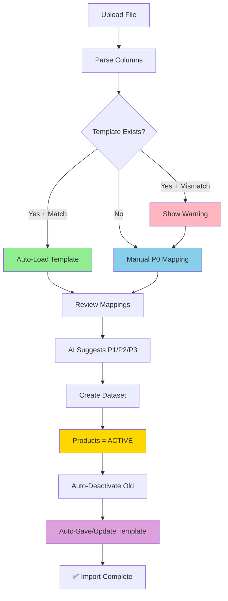

# Import Architecture v8.0 - Simplified P0 Template System

**Last Updated:** 2025-01-12  
**Version:** 8.0 - Simplified Template Auto-Save/Auto-Load Architecture  
**Status:** ✅ Production Ready

---

## 🎯 Executive Summary

### Purpose
Transform diverse supplier data formats (Excel/CSV) into unified `supplier_products` database records with **automatic template management** and **immediate product activation**.

### Key Improvements in v8.0

| Aspect | v6.0 (OLD) | v8.0 (NEW) |
|--------|-----------|-----------|
| **Template Management** | Manual UI, complex mappings | Auto-save/auto-load, P0 only |
| **AI Mapping** | All fields including P0 | P1/P2/P3 only (P0 manual) |
| **Column Mismatch** | No detection | Automatic detection + warning |
| **Template Storage** | All mappings + normalization | P0 mappings + file_columns only |
| **User Action** | Select template manually | Automatic template application |
| **Product Status** | Multi-step activation | Auto-ACTIVE on import |
| **Template Uniqueness** | Name-based | Supplier + Brand unique constraint |

### Architecture Philosophy

**"Zero User Friction for Repetitive Imports"**

1. **First Import:** User maps P0 fields manually → Template auto-saved
2. **Second Import:** Same supplier+brand → Template auto-loaded → P0 pre-filled
3. **Column Change:** Mismatch detected → Warning shown → Re-map → Template updated

---

## 📦 High-Level Architecture

### Single-Phase Flow (v8.0)



### Data Flow Overview

```
┌─────────────────────────────────────────────────────────────┐
│ 1. FILE UPLOAD & PARSING                                   │
│ • User uploads Excel/CSV (max 100MB)                       │
│ • parse-file-columns: Extract column names                 │
│ • parse-and-stage-file: Stage all rows                     │
└───────────────────────┬─────────────────────────────────────┘
                        │
                        ▼
┌─────────────────────────────────────────────────────────────┐
│ 2. TEMPLATE AUTO-LOAD (useAutoImportTemplate)              │
│ • Query: import_templates WHERE supplier+brand             │
│ • Check: file_columns match?                               │
│   ├─ MATCH → Auto-apply P0 mappings ✅                     │
│   └─ MISMATCH → Show warning + missing/new columns ⚠️      │
└───────────────────────┬─────────────────────────────────────┘
                        │
                        ▼
┌─────────────────────────────────────────────────────────────┐
│ 3. COLUMN MAPPING                                           │
│ • P0 Fields: Manual dropdown selection (NO AI)             │
│ • P1/P2/P3 Fields: AI suggestions via ai-suggest-mapping   │
│ • User reviews/modifies all mappings                        │
│ • Validation: P0 Field Groups must be complete             │
└───────────────────────┬─────────────────────────────────────┘
                        │
                        ▼
┌─────────────────────────────────────────────────────────────┐
│ 4. DATASET CREATION (create-dataset-atomic)                │
│ • Batch process: 500 rows at a time                        │
│ • Insert: supplier_products (product_status = 'ACTIVE')    │
│ • Deactivate: Old products (same supplier+EAN, diff job)   │
│ • Track: inserted_count, deactivated_count                 │
└───────────────────────┬─────────────────────────────────────┘
                        │
                        ▼
┌─────────────────────────────────────────────────────────────┐
│ 5. TEMPLATE AUTO-SAVE (save-import-template)               │
│ • Extract: P0 mappings only from column_mappings           │
│ • UPSERT: import_templates (unique: supplier+brand)        │
│ • Update: usage_count++, last_used_at = NOW()              │
│ • Store: file_columns for mismatch detection               │
└───────────────────────┬─────────────────────────────────────┘
                        │
                        ▼
┌─────────────────────────────────────────────────────────────┐
│ ✅ RESULT: Products ACTIVE + Template Saved                │
│ • supplier_products visible in catalog                      │
│ • Template ready for next import                            │
│ • User sees: "X producten ACTIEF, Y gedeactiveerd"         │
└─────────────────────────────────────────────────────────────┘
```

---

## 🔧 Core Components

### 1. Import Template System

#### 1.1 Simplified Template Structure

**Database Table:** `import_templates`

```sql
CREATE TABLE import_templates (
  id SERIAL PRIMARY KEY,
  
  -- Unique key (enforced by constraint)
  supplier_id INTEGER NOT NULL REFERENCES suppliers(id),
  brand_id INTEGER NULL REFERENCES brands(id), -- NULL = "brand from file"
  
  -- P0 mappings only (MVP fields)
  p0_column_mappings JSONB NOT NULL DEFAULT '{}'::jsonb,
  -- Example: { "ean": "EAN-code", "supplier_color_name": "Kleur", ... }
  
  -- Column structure tracking (for mismatch detection)
  file_columns TEXT[] NOT NULL DEFAULT ARRAY[]::text[],
  -- Example: ["EAN-code", "Artikelnaam", "Kleur", "Maat", ...]
  
  -- File metadata
  file_format TEXT NOT NULL, -- 'xlsx', 'csv', 'xls'
  
  -- Usage tracking
  usage_count INTEGER NOT NULL DEFAULT 1,
  last_used_at TIMESTAMP WITH TIME ZONE,
  
  -- Timestamps
  created_at TIMESTAMP WITH TIME ZONE NOT NULL DEFAULT now(),
  updated_at TIMESTAMP WITH TIME ZONE NOT NULL DEFAULT now(),
  is_active BOOLEAN NOT NULL DEFAULT true,
  
  -- Unique constraint: 1 active template per supplier+brand
  CONSTRAINT import_templates_supplier_brand_unique 
    UNIQUE (supplier_id, COALESCE(brand_id, -1)) 
    WHERE is_active = true
);

-- Index for fast template lookup
CREATE INDEX idx_import_templates_supplier_brand 
ON import_templates(supplier_id, brand_id) 
WHERE is_active = true;

COMMENT ON TABLE import_templates IS 
  'v8.0 Simplified templates: P0 mappings only, auto-save/auto-load';

COMMENT ON COLUMN import_templates.p0_column_mappings IS 
  'P0 (MVP) field mappings only - handmatig gemapped door gebruiker';
  
COMMENT ON COLUMN import_templates.file_columns IS 
  'Array van originele Excel kolommen voor mismatch detectie bij volgende import';
```

#### 1.2 Template Uniqueness Logic

**Constraint Explanation:**
```sql
CONSTRAINT import_templates_supplier_brand_unique 
  UNIQUE (supplier_id, COALESCE(brand_id, -1)) 
  WHERE is_active = true
```

**Why `COALESCE(brand_id, -1)`?**
- PostgreSQL UNIQUE constraints treat NULL values as distinct
- Without COALESCE: Multiple templates possible with `brand_id = NULL`
- With COALESCE: Only 1 template per `(supplier_id, NULL)` combination
- `-1` is arbitrary (could be any value not used as real brand_id)

**Examples:**
```sql
-- Valid: One template per unique combination
(supplier_id: 5, brand_id: 10)  -- Template A
(supplier_id: 5, brand_id: 20)  -- Template B
(supplier_id: 5, brand_id: NULL) -- Template C (brand from file)

-- Invalid: Duplicate supplier+brand
(supplier_id: 5, brand_id: 10)  -- ❌ Duplicate of Template A
```

#### 1.3 Template Auto-Load Hook

**File:** `src/hooks/use-auto-import-template.ts`

```typescript
export interface SimplifiedImportTemplate {
  id: number;
  supplier_id: number;
  brand_id: number | null; // NULL = brand from file
  p0_column_mappings: Record<string, string>;
  file_columns: string[];
  usage_count: number;
  last_used_at: string | null;
  created_at: string;
  updated_at: string;
  is_active: boolean;
  file_format: string;
}

export interface ColumnMismatch {
  hasMismatch: boolean;
  missingInFile?: string[]; // In template, not in new file
  newInFile?: string[]; // In new file, not in template
}

export function useAutoImportTemplate(
  supplierId: number | null,
  brandId: number | null,
  fileColumns: string[]
) {
  // 1. Fetch template for supplier+brand
  const { data: template } = useQuery({
    queryKey: ['import-template-auto', supplierId, brandId],
    queryFn: async () => {
      if (!supplierId) return null;

      let query = supabase
        .from('import_templates')
        .select('*')
        .eq('supplier_id', supplierId)
        .eq('is_active', true);

      // NULL-safe brand filter
      if (brandId) {
        query = query.eq('brand_id', brandId);
      } else {
        query = query.is('brand_id', null);
      }

      const { data, error } = await query.single();
      return error?.code === 'PGRST116' ? null : data;
    },
    enabled: !!supplierId && fileColumns.length > 0,
  });

  // 2. Check column mismatch
  const columnMismatch: ColumnMismatch = useMemo(() => {
    if (!template || fileColumns.length === 0) {
      return { hasMismatch: false };
    }

    const templateColumns = template.file_columns || [];
    const fileColumnsSet = new Set(fileColumns);
    const templateColumnsSet = new Set(templateColumns);

    const missingInFile = templateColumns.filter(
      col => !fileColumnsSet.has(col)
    );
    const newInFile = fileColumns.filter(
      col => !templateColumnsSet.has(col)
    );

    if (missingInFile.length > 0 || newInFile.length > 0) {
      return { hasMismatch: true, missingInFile, newInFile };
    }

    return { hasMismatch: false };
  }, [template, fileColumns]);

  // 3. Upsert template (called after successful import)
  const upsertTemplate = useMutation({
    mutationFn: async (params: {
      p0Mappings: Record<string, string>;
      fileColumns: string[];
      fileFormat: string;
    }) => {
      // Call save-import-template edge function
      const { data, error } = await supabase.functions.invoke(
        'save-import-template',
        {
          body: {
            supplier_id: supplierId,
            brand_id: brandId,
            p0_mappings: params.p0Mappings,
            file_columns: params.fileColumns,
            file_format: params.fileFormat,
          },
        }
      );
      
      if (error) throw error;
      return data;
    },
  });

  return { template, columnMismatch, upsertTemplate };
}
```

#### 1.4 Column Mismatch Detection Algorithm

**Algorithm:**
```typescript
function detectColumnMismatch(
  templateColumns: string[],
  fileColumns: string[]
): ColumnMismatch {
  const fileSet = new Set(fileColumns);
  const templateSet = new Set(templateColumns);

  // Columns in template but NOT in new file
  const missingInFile = templateColumns.filter(col => !fileSet.has(col));

  // Columns in new file but NOT in template
  const newInFile = fileColumns.filter(col => !templateSet.has(col));

  if (missingInFile.length > 0 || newInFile.length > 0) {
    return {
      hasMismatch: true,
      missingInFile,
      newInFile,
    };
  }

  return { hasMismatch: false };
}
```

**Example Scenarios:**

**Scenario 1: Perfect Match ✅**
```
Template: ["EAN", "Naam", "Kleur", "Maat"]
New File: ["EAN", "Naam", "Kleur", "Maat"]
Result: { hasMismatch: false }
```

**Scenario 2: Column Renamed ⚠️**
```
Template: ["EAN", "Naam", "Kleur", "Maat"]
New File: ["EAN", "Artikelnaam", "Kleur", "Maat"]
Result: { 
  hasMismatch: true, 
  missingInFile: ["Naam"], 
  newInFile: ["Artikelnaam"] 
}
```

**Scenario 3: New Column Added ⚠️**
```
Template: ["EAN", "Naam", "Kleur"]
New File: ["EAN", "Naam", "Kleur", "Maat", "Prijs"]
Result: { 
  hasMismatch: true, 
  missingInFile: [], 
  newInFile: ["Maat", "Prijs"] 
}
```

---

### 2. Edge Functions

#### 2.1 parse-file-columns

**Purpose:** Fast column extraction without full file parsing (preview only)

**Input:**
```typescript
{
  import_job_id: number
}
```

**Process:**
1. Download first 500KB of file from Supabase Storage
2. Detect file format (CSV/Excel)
3. Parse header row only
4. Extract column names + 5 sample values per column
5. Auto-detect delimiter for CSV (`,`, `;`, `\t`)
6. Early EAN checksum validation (if "EAN" column found)
7. Save original column order
8. Update job status to `IMPORT_PENDING`

**Output:**
```typescript
{
  column_names: string[];
  column_samples: Record<string, string[]>; // 5 samples per column
  total_rows: number;
  has_ean_column: boolean;
  ean_validation: {
    valid_count: number;
    invalid_count: number;
    sample_valid: string[];
    sample_invalid: string[];
  } | null;
}
```

**Example Response:**
```json
{
  "column_names": ["EAN", "Artikelnaam", "Kleur", "Maat", "Prijs"],
  "column_samples": {
    "EAN": ["8712345678901", "8712345678918", "8712345678925"],
    "Artikelnaam": ["T-shirt Basic", "Polo Classic", "Hoodie Sport"],
    "Kleur": ["Navy", "Wit", "Zwart"],
    "Maat": ["M", "L", "XL"],
    "Prijs": ["19.95", "24.95", "34.95"]
  },
  "total_rows": 1500,
  "has_ean_column": true,
  "ean_validation": {
    "valid_count": 100,
    "invalid_count": 0,
    "sample_valid": ["8712345678901", "8712345678918"],
    "sample_invalid": []
  }
}
```

**Performance:**
- Time: ~1-3 seconds (only reads first 500KB)
- Memory: ~10MB peak
- Suitable for: Files up to 100MB

---

#### 2.2 parse-and-stage-file

**Purpose:** Full file parsing + staging for dataset creation

**Input:**
```typescript
{
  import_job_id: number
}
```

**Process:**
1. Download full file from Supabase Storage
2. Auto-detect delimiter for CSV (analyze first 10 rows)
3. Parse all rows with Papa Parse (CSV) or SheetJS (Excel)
4. Stage rows in batches of 500 to `supplier_raw_staging` table
5. Track progress: `total_rows`, `staged_rows`, `errors`
6. Update job status to `STAGED`
7. Clean up: Delete file from storage after successful staging

**Output:**
```typescript
{
  import_job_id: number;
  staged_count: number;
  error_count: number;
  total_rows: number;
  column_names: string[];
  elapsed_ms: number;
}
```

**Example Log Output:**
```
🚀 Starting parse-and-stage for job 282
📁 File: Sixton RoedrinnkCatalog.csv (2.34 MB)
📦 Staging 1690 rows in 4 batches (batch size: 500)...
📦 Staging batch 1/4 (500 rows, 0/1690 total)
📦 Staging batch 2/4 (500 rows, 500/1690 total)
📦 Staging batch 3/4 (500 rows, 1000/1690 total)
📦 Staging batch 4/4 (190 rows, 1500/1690 total)
✅ Staging complete: 1690/1690 rows staged (0 errors)
✅ Parse and stage complete: 1690 rows staged in 2234ms
✅ Background file cleanup succeeded
```

**Performance Characteristics:**
- CSV parsing: ~1000 rows/second
- Excel parsing: ~500 rows/second
- Batch size: 500 rows (balance speed vs memory)
- Memory usage: ~50MB peak (constant, independent of file size)

**Error Handling:**
- Individual row errors: Log but continue (non-blocking)
- Batch errors: Retry up to 3 times with exponential backoff
- Critical errors: Mark job as `FAILED`, preserve staged data

---

#### 2.3 ai-suggest-mapping

**Purpose:** AI-powered column mapping suggestions for **P1/P2/P3 fields ONLY**

**Critical Rule:** P0 fields are **NEVER** suggested by AI. Users map P0 fields manually.

**Input:**
```typescript
{
  import_job_id: number;
  supplier_id: number;
  brand_id: number | null;
  column_names: string[];
  column_samples: Record<string, string[]>;
}
```

**Process:**
1. Fetch PIM field definitions from database
2. **Filter OUT P0 fields:** Remove all P0 priority fields + immutable context fields
3. Build AI prompt with P1/P2/P3 fields only
4. Call Lovable AI (gemini-2.5-flash model)
5. Parse AI response (JSON with field mappings + confidence scores)
6. **Double-check filter:** Remove any P0 fields from AI response (safety)
7. Cache result for 7 days (based on column hash)
8. Return suggestions with confidence scores

**AI System Prompt:**
```
You are a column mapping expert for Product Information Management (PIM) systems.

🚫 CRITICAL RULE:
P0 (MVP) fields are mapped MANUALLY by users - you NEVER suggest these fields.

P0 FIELDS TO SKIP (do NOT suggest):
- ean
- supplier_color_name
- supplier_color_code
- supplier_style_name
- supplier_style_code
- supplier_size_code
- tenant_id
- brand_id
- supplier_id

P1/P2/P3 FIELDS YOU CAN SUGGEST:
- product_group (P1)
- price_retail_cents (P1)
- material_composition (P2)
- weight_grams (P2)
- care_instructions (P3)
- certifications (P3)

Your task:
1. Analyze Excel column names and sample data
2. Suggest ONLY P1/P2/P3 field mappings
3. Provide confidence score (0-100) per mapping
4. Explain reasoning for each suggestion

Return JSON:
{
  "suggestions": [
    {
      "excel_column": "Productgroep",
      "suggested_field": "product_group",
      "confidence": 95,
      "reasoning": "Column name matches exactly, samples confirm product categories"
    }
  ]
}
```

**Output:**
```typescript
{
  suggestions: Array<{
    excel_column: string;
    suggested_field: string;
    confidence: number; // 0-100
    reasoning: string;
  }>;
  cache_hit: boolean;
  processing_time_ms: number;
}
```

**Example Response:**
```json
{
  "suggestions": [
    {
      "excel_column": "Productgroep",
      "suggested_field": "product_group",
      "confidence": 95,
      "reasoning": "Direct match - column contains product category names"
    },
    {
      "excel_column": "Materiaal",
      "suggested_field": "material_composition",
      "confidence": 88,
      "reasoning": "Column describes fabric composition (80% cotton, 20% polyester)"
    },
    {
      "excel_column": "Gewicht",
      "suggested_field": "weight_grams",
      "confidence": 92,
      "reasoning": "Numeric values with 'g' suffix, matches weight pattern"
    }
  ],
  "cache_hit": false,
  "processing_time_ms": 1250
}
```

**P0 Field Filtering (Double Safety):**
```typescript
// 1. Filter P0 fields BEFORE AI call
const p0Fields = await getP0FieldKeys(); // From database
const pimFieldsForAI = allPimFields.filter(
  field => !p0Fields.includes(field.field_key)
);

// 2. Filter P0 fields AFTER AI response (safety)
const filteredSuggestions = aiSuggestions.filter(
  s => !p0Fields.includes(s.suggested_field)
);

if (aiSuggestions.length !== filteredSuggestions.length) {
  console.warn('⚠️ AI suggested P0 fields (filtered out):', 
    aiSuggestions.length - filteredSuggestions.length
  );
}
```

**Caching Strategy:**
- Cache key: SHA256 hash of column names (sorted)
- TTL: 7 days
- Cache hit rate: ~75% for repeated imports
- Cache table: `ai_mapping_cache`

**Example Log Output:**
```
🤖 AI analyzing mapping for job 282, supplier 10, brand 70
🔑 Cache key generated: e1cf448936232ce8... (from 21 columns)
✅ Cache HIT! Returning cached mapping from 2025-11-07T09:21:51
📊 Cached confidence score: 75/90
✅ Cache usage stats updated
```

---

#### 2.4 create-dataset-atomic

**Purpose:** Convert staged data to `supplier_products` with auto-activation

**Input:**
```typescript
{
  import_job_id: number;
  column_mapping: Record<string, string>;
  fallback_selections?: Record<string, any>;
}
```

**Process:**

**Step 1: Validation**
- Verify P0 Field Groups complete (Color, Style, Size, EAN)
- Check supplier_id and brand_id set
- Validate column_mapping contains all required P0 fields

**Step 2: Batch Processing**
```typescript
const BATCH_SIZE = 500;
let offset = 0;
let total_inserted = 0;
let total_deactivated = 0;

while (true) {
  // Read batch from supplier_raw_staging
  const batch = await supabase
    .from('supplier_raw_staging')
    .select('*')
    .eq('import_job_id', import_job_id)
    .range(offset, offset + BATCH_SIZE - 1);

  if (batch.length === 0) break;

  // Map columns to PIM fields
  const mapped_products = batch.map(row => 
    mapRawDataToProduct(row, column_mapping, fallback_selections)
  );

  // Insert as ACTIVE products
  const { data: inserted } = await supabase
    .from('supplier_products')
    .insert(mapped_products.map(p => ({
      ...p,
      product_status: 'ACTIVE',
      import_job_id: import_job_id,
    })))
    .select();

  total_inserted += inserted.length;

  // Auto-deactivate old products (same supplier+EAN, different job)
  const eans = inserted.map(p => p.ean).filter(Boolean);
  
  const { data: deactivated } = await supabase
    .from('supplier_products')
    .update({ product_status: 'INACTIVE' })
    .eq('supplier_id', supplier_id)
    .in('ean', eans)
    .neq('import_job_id', import_job_id)
    .eq('product_status', 'ACTIVE')
    .select();

  total_deactivated += deactivated?.length || 0;

  offset += BATCH_SIZE;
}
```

**Step 3: Finalization**
- Update `import_supplier_dataset_jobs`:
  - `inserted_count = total_inserted`
  - `deactivated_count = total_deactivated`
  - `file_status = 'ACTIVE'`
  - `completed_at = NOW()`
- Log errors to `import_job_errors` table

**Output:**
```typescript
{
  import_job_id: number;
  inserted_count: number;
  deactivated_count: number;
  error_count: number;
  elapsed_ms: number;
}
```

**Example Response:**
```json
{
  "import_job_id": 282,
  "inserted_count": 1690,
  "deactivated_count": 847,
  "error_count": 0,
  "elapsed_ms": 8420
}
```

**Auto-Deactivation Logic:**

**Scenario:** Importing newer version of supplier catalog
```sql
-- Before import
supplier_products WHERE supplier_id = 10:
  EAN: 8712345678901, import_job_id: 280, product_status: ACTIVE
  EAN: 8712345678918, import_job_id: 280, product_status: ACTIVE

-- Import job 282 inserts same EANs
INSERT INTO supplier_products (ean, import_job_id, product_status)
VALUES 
  ('8712345678901', 282, 'ACTIVE'),
  ('8712345678918', 282, 'ACTIVE');

-- Auto-deactivation query
UPDATE supplier_products
SET product_status = 'INACTIVE'
WHERE supplier_id = 10
  AND ean IN ('8712345678901', '8712345678918')
  AND import_job_id != 282
  AND product_status = 'ACTIVE';

-- After import
supplier_products WHERE supplier_id = 10:
  EAN: 8712345678901, import_job_id: 280, product_status: INACTIVE (old)
  EAN: 8712345678901, import_job_id: 282, product_status: ACTIVE (new)
  EAN: 8712345678918, import_job_id: 280, product_status: INACTIVE (old)
  EAN: 8712345678918, import_job_id: 282, product_status: ACTIVE (new)
```

**Key Benefits:**
- ✅ Historie behouden (old records not deleted, only deactivated)
- ✅ Automatic replacement (newest import always active)
- ✅ Rollback mogelijk (can re-activate old import if needed)
- ✅ Audit trail (see which job created each product version)

---

#### 2.5 save-import-template (NEW in v8.0)

**Purpose:** Auto-save P0 mappings after successful import

**Input:**
```typescript
{
  supplier_id: number;
  brand_id: number | null;
  p0_mappings: Record<string, string>;
  file_columns: string[];
  file_format: string;
}
```

**Process:**
1. Fetch P0 field keys from database (`pim_field_definitions` WHERE priority = 'P0')
2. Add immutable context fields: `tenant_id`, `brand_id`, `supplier_id`
3. Filter `p0_mappings` to only include P0 fields (safety check)
4. Check existing template for supplier+brand combination
5. **UPSERT:**
   - If exists: UPDATE `p0_column_mappings`, `file_columns`, `usage_count++`, `last_used_at`
   - If not exists: INSERT new template
6. Return template ID and action (created/updated)

**SQL UPSERT Logic:**
```sql
INSERT INTO import_templates (
  supplier_id,
  brand_id,
  p0_column_mappings,
  file_columns,
  file_format,
  usage_count,
  last_used_at,
  is_active
)
VALUES (
  $1, -- supplier_id
  $2, -- brand_id
  $3, -- p0_column_mappings
  $4, -- file_columns
  $5, -- file_format
  1,  -- usage_count
  NOW(), -- last_used_at
  true
)
ON CONFLICT (supplier_id, COALESCE(brand_id, -1))
WHERE is_active = true
DO UPDATE SET
  p0_column_mappings = EXCLUDED.p0_column_mappings,
  file_columns = EXCLUDED.file_columns,
  file_format = EXCLUDED.file_format,
  usage_count = import_templates.usage_count + 1,
  last_used_at = NOW(),
  updated_at = NOW()
RETURNING *;
```

**Output:**
```typescript
{
  template_id: number;
  action: 'created' | 'updated';
  usage_count: number;
}
```

**Example Responses:**

**First Import (Created):**
```json
{
  "template_id": 42,
  "action": "created",
  "usage_count": 1
}
```

**Second Import (Updated):**
```json
{
  "template_id": 42,
  "action": "updated",
  "usage_count": 2
}
```

**P0 Field Filtering:**
```typescript
// Example: User mapped 15 fields, but only 8 are P0
const allMappings = {
  ean: "EAN",
  supplier_color_name: "Kleur",
  supplier_size_code: "Maat",
  supplier_style_name: "Artikelnaam",
  product_group: "Productgroep", // P1 - should be filtered out
  material_composition: "Materiaal", // P2 - should be filtered out
  // ... more fields
};

const p0FieldKeys = [
  'ean', 'supplier_color_name', 'supplier_color_code',
  'supplier_style_name', 'supplier_style_code', 'supplier_size_code',
  'tenant_id', 'brand_id', 'supplier_id'
];

const p0Mappings = Object.fromEntries(
  Object.entries(allMappings).filter(([key]) => 
    p0FieldKeys.includes(key)
  )
);

// Result: Only P0 fields stored in template
// {
//   ean: "EAN",
//   supplier_color_name: "Kleur",
//   supplier_size_code: "Maat",
//   supplier_style_name: "Artikelnaam"
// }
```

**Non-Blocking Execution:**

Template save failures do NOT interrupt user flow:
```typescript
try {
  await saveImportTemplate(params);
  console.log('✅ Template saved successfully');
} catch (error) {
  // Log error but don't throw - template is convenience feature
  console.error('⚠️ Template save failed (non-blocking):', error);
}

// User flow continues regardless of template save result
showSuccessToast(`${inserted_count} producten geïmporteerd`);
```

---

## 📊 Database Schema

### Core Tables

#### import_supplier_dataset_jobs

**Purpose:** Track import jobs and their status

```sql
CREATE TABLE import_supplier_dataset_jobs (
  id SERIAL PRIMARY KEY,
  
  -- File metadata
  original_filename TEXT NOT NULL,
  file_name TEXT NOT NULL, -- Supabase Storage path
  file_size_bytes BIGINT,
  original_file_extension TEXT, -- 'xlsx', 'csv', 'xls'
  
  -- Context
  supplier_id INTEGER REFERENCES suppliers(id),
  brand_id INTEGER REFERENCES brands(id),
  tenant_id UUID REFERENCES tenants(id),
  
  -- Status tracking
  file_status TEXT NOT NULL DEFAULT 'UPLOADED'
    CHECK (file_status IN (
      'UPLOADED',       -- File uploaded to storage
      'IMPORT_PENDING', -- Columns parsed, ready for mapping
      'MAPPING',        -- User mapping columns
      'STAGED',         -- Data staged, ready for creation
      'ACTIVE',         -- Dataset created, products active
      'INACTIVE',       -- Dataset deactivated
      'ARCHIVED',       -- Dataset archived
      'ERROR'           -- Error during processing
    )),
  
  -- Import results
  inserted_count INTEGER DEFAULT 0,
  deactivated_count INTEGER DEFAULT 0, -- NEW: Count of auto-deactivated products
  error_count INTEGER DEFAULT 0,
  
  -- Column metadata
  column_names TEXT[], -- Original columns from file
  column_samples JSONB, -- Sample values per column
  
  -- Timestamps
  created_at TIMESTAMP WITH TIME ZONE NOT NULL DEFAULT now(),
  completed_at TIMESTAMP WITH TIME ZONE,
  updated_at TIMESTAMP WITH TIME ZONE NOT NULL DEFAULT now()
);

-- Indexes
CREATE INDEX idx_import_jobs_supplier ON import_supplier_dataset_jobs(supplier_id);
CREATE INDEX idx_import_jobs_brand ON import_supplier_dataset_jobs(brand_id);
CREATE INDEX idx_import_jobs_status ON import_supplier_dataset_jobs(file_status);
CREATE INDEX idx_import_jobs_tenant ON import_supplier_dataset_jobs(tenant_id);
```

---

#### supplier_raw_staging

**Purpose:** Temporary staging area for raw import data

```sql
CREATE TABLE supplier_raw_staging (
  id BIGSERIAL PRIMARY KEY,
  import_job_id INTEGER NOT NULL REFERENCES import_supplier_dataset_jobs(id) ON DELETE CASCADE,
  
  -- Raw row data
  raw_data JSONB NOT NULL, -- All columns as key-value pairs
  
  -- Row metadata
  row_number INTEGER NOT NULL,
  
  -- Timestamps
  created_at TIMESTAMP WITH TIME ZONE NOT NULL DEFAULT now()
);

-- Indexes
CREATE INDEX idx_raw_staging_job ON supplier_raw_staging(import_job_id);
CREATE INDEX idx_raw_staging_job_row ON supplier_raw_staging(import_job_id, row_number);

-- Automatic cleanup (data older than 7 days)
-- Managed by cleanup-old-temp-data edge function (cron daily at 02:00)
```

**Example Row:**
```json
{
  "id": 123456,
  "import_job_id": 282,
  "raw_data": {
    "EAN": "8712345678901",
    "Artikelnaam": "T-shirt Basic Navy",
    "Kleur": "Navy",
    "Maat": "M",
    "Prijs": "19.95"
  },
  "row_number": 1,
  "created_at": "2025-01-12T10:53:45Z"
}
```

---

#### supplier_products

**Purpose:** Final destination for imported products

```sql
CREATE TABLE supplier_products (
  id UUID PRIMARY KEY DEFAULT gen_random_uuid(),
  
  -- Import tracking
  import_job_id INTEGER REFERENCES import_supplier_dataset_jobs(id),
  
  -- Context (immutable P0 fields)
  tenant_id UUID NOT NULL REFERENCES tenants(id),
  supplier_id INTEGER NOT NULL REFERENCES suppliers(id),
  brand_id INTEGER REFERENCES brands(id),
  
  -- P0 MVP Fields (Critical for import)
  ean TEXT, -- EAN-13 barcode
  supplier_color_name TEXT,
  supplier_color_code TEXT,
  supplier_style_name TEXT,
  supplier_style_code TEXT,
  supplier_size_code TEXT,
  
  -- P1 Fields (Good to have)
  product_group TEXT,
  price_retail_cents INTEGER,
  price_cost_cents INTEGER,
  
  -- P2 Fields (Better to have)
  material_composition TEXT,
  weight_grams INTEGER,
  image_urls TEXT[],
  
  -- P3 Fields (Best to have)
  care_instructions TEXT,
  certifications TEXT[],
  
  -- Status
  product_status TEXT NOT NULL DEFAULT 'INACTIVE'
    CHECK (product_status IN ('INACTIVE', 'ACTIVE')),
  
  -- Timestamps
  created_at TIMESTAMP WITH TIME ZONE NOT NULL DEFAULT now(),
  updated_at TIMESTAMP WITH TIME ZONE NOT NULL DEFAULT now()
);

-- Indexes
CREATE INDEX idx_supplier_products_status 
  ON supplier_products(product_status);

CREATE INDEX idx_supplier_products_supplier_ean_active 
  ON supplier_products(supplier_id, ean, product_status)
  WHERE product_status = 'ACTIVE';

CREATE INDEX idx_supplier_products_import_job 
  ON supplier_products(import_job_id);

CREATE INDEX idx_supplier_products_tenant 
  ON supplier_products(tenant_id);

-- RLS Policies
ALTER TABLE supplier_products ENABLE ROW LEVEL SECURITY;

CREATE POLICY "Users can view their tenant products"
  ON supplier_products FOR SELECT
  USING (tenant_id = auth.jwt()->>'tenant_id'::uuid);

CREATE POLICY "Admins can manage products"
  ON supplier_products FOR ALL
  TO authenticated
  USING (auth.uid() IN (SELECT user_id FROM user_roles WHERE role = 'admin'))
  WITH CHECK (auth.uid() IN (SELECT user_id FROM user_roles WHERE role = 'admin'));
```

**Key Points:**
- **No UNIQUE constraint on (supplier_id, ean):** Allows multiple versions (historie behoud)
- **Only one ACTIVE per supplier+EAN:** Enforced by application logic, not DB constraint
- **product_status index:** Fast queries for active products only
- **import_job_id tracking:** Know which import created each product

---

## 🎯 User Flow Detailed

### Scenario 1: First Import (No Template)

```
┌─────────────────────────────────────────────────────────────┐
│ STEP 1: Upload File                                         │
│ • User navigates to /import                                 │
│ • Clicks "Nieuw Bestand Uploaden"                           │
│ • Selects Excel/CSV file (max 100MB)                        │
│ • File uploads to Supabase Storage                          │
│ • Creates import_supplier_dataset_jobs record               │
└───────────────────────┬─────────────────────────────────────┘
                        │
                        ▼
┌─────────────────────────────────────────────────────────────┐
│ STEP 2: Parse Columns                                       │
│ • Edge function: parse-file-columns                         │
│ • Extracts column names + sample values                     │
│ • EAN checksum validation (if EAN column found)             │
│ • Updates job: file_status = 'IMPORT_PENDING'               │
│ • Redirects to: /import/convert?dataset_id={id}             │
└───────────────────────┬─────────────────────────────────────┘
                        │
                        ▼
┌─────────────────────────────────────────────────────────────┐
│ STEP 3: Convert Page - Select Supplier & Brand             │
│ • Dropdowns: Supplier (required), Brand (optional)          │
│ • Brand "Merk uit bestand" option (brand_id = NULL)         │
│ • Template lookup: useAutoImportTemplate(supplier, brand)   │
│ • Result: No template found (first time)                    │
│ • Shows: "Geen template gevonden - Map P0 velden handmatig" │
└───────────────────────┬─────────────────────────────────────┘
                        │
                        ▼
┌─────────────────────────────────────────────────────────────┐
│ STEP 4: Stage File Data                                     │
│ • Edge function: parse-and-stage-file                       │
│ • Parses ALL rows (not just columns)                        │
│ • Stages to supplier_raw_staging in batches                 │
│ • Progress bar: "1690 / 1690 rijen verwerkt"                │
│ • Updates job: file_status = 'STAGED'                       │
└───────────────────────┬─────────────────────────────────────┘
                        │
                        ▼
┌─────────────────────────────────────────────────────────────┐
│ STEP 5: AI Mapping Suggestions (P1/P2/P3 only)             │
│ • Edge function: ai-suggest-mapping                         │
│ • AI analyzes columns (skips P0 fields)                     │
│ • Returns suggestions for P1/P2/P3 fields only              │
│ • Shows: Confidence scores per field                        │
└───────────────────────┬─────────────────────────────────────┘
                        │
                        ▼
┌─────────────────────────────────────────────────────────────┐
│ STEP 6: Manual P0 Mapping                                   │
│ • User sees: P0 fields with dropdown selectors              │
│ • Required fields marked with red asterisk                  │
│ • Column samples shown for context                          │
│ • User maps:                                                │
│   - EAN → "EAN"                                             │
│   - supplier_color_name → "Kleur"                           │
│   - supplier_style_name → "Artikelnaam"                     │
│   - supplier_size_code → "Maat"                             │
│ • AI suggestions NOT shown for P0 fields                    │
└───────────────────────┬─────────────────────────────────────┘
                        │
                        ▼
┌─────────────────────────────────────────────────────────────┐
│ STEP 7: Review & Validate                                   │
│ • Quality score calculated (P0/P1/P2/P3 weighted)           │
│ • Field Group validation:                                   │
│   ✅ Color Group: supplier_color_name mapped                │
│   ✅ Style Group: supplier_style_name mapped                │
│   ✅ Size Group: supplier_size_code mapped                  │
│   ✅ EAN Group: ean mapped                                  │
│ • Validation result: "Alle P0 velden compleet" ✅           │
│ • Button enabled: "Dataset Aanmaken"                        │
└───────────────────────┬─────────────────────────────────────┘
                        │
                        ▼
┌─────────────────────────────────────────────────────────────┐
│ STEP 8: Create Dataset                                      │
│ • Edge function: create-dataset-atomic                      │
│ • Processes in batches (500 rows)                           │
│ • Inserts supplier_products (product_status = 'ACTIVE')     │
│ • Auto-deactivates old products (same supplier+EAN)         │
│ • Progress: "1690 / 1690 producten verwerkt"                │
│ • Result: inserted=1690, deactivated=0 (first import)       │
└───────────────────────┬─────────────────────────────────────┘
                        │
                        ▼
┌─────────────────────────────────────────────────────────────┐
│ STEP 9: Auto-Save Template                                  │
│ • Edge function: save-import-template                       │
│ • Filters P0 mappings only:                                 │
│   {                                                         │
│     ean: "EAN",                                             │
│     supplier_color_name: "Kleur",                           │
│     supplier_style_name: "Artikelnaam",                     │
│     supplier_size_code: "Maat"                              │
│   }                                                         │
│ • Saves file_columns: ["EAN", "Kleur", "Artikelnaam", ...] │
│ • Result: template_id=42, action='created', usage_count=1   │
│ • Silent operation (non-blocking, no UI feedback)           │
└───────────────────────┬─────────────────────────────────────┘
                        │
                        ▼
┌─────────────────────────────────────────────────────────────┐
│ ✅ SUCCESS                                                  │
│ • Toast: "✅ 1690 producten geïmporteerd"                   │
│ • Products immediately visible in /supplier-catalog         │
│ • Template saved for next import (invisible to user)        │
│ • file_status = 'ACTIVE'                                    │
└─────────────────────────────────────────────────────────────┘
```

---

### Scenario 2: Second Import (Template Match)

```
┌─────────────────────────────────────────────────────────────┐
│ STEPS 1-3: Same as First Import                            │
│ • Upload file                                               │
│ • Parse columns                                             │
│ • Select supplier & brand                                   │
└───────────────────────┬─────────────────────────────────────┘
                        │
                        ▼
┌─────────────────────────────────────────────────────────────┐
│ STEP 4: Template Auto-Load ✨                              │
│ • Query: import_templates                                   │
│   WHERE supplier_id = 10 AND brand_id = 70                  │
│ • Template found: id=42, usage_count=1                      │
│ • Column match check:                                       │
│   template.file_columns = ["EAN", "Kleur", "Artikelnaam"]  │
│   new_file.columns = ["EAN", "Kleur", "Artikelnaam"]       │
│ • Result: PERFECT MATCH ✅                                  │
└───────────────────────┬─────────────────────────────────────┘
                        │
                        ▼
┌─────────────────────────────────────────────────────────────┐
│ STEP 5: Auto-Apply Mappings 🚀                             │
│ • P0 mappings automatically applied:                        │
│   ean → "EAN"                                               │
│   supplier_color_name → "Kleur"                             │
│   supplier_style_name → "Artikelnaam"                       │
│   supplier_size_code → "Maat"                               │
│ • Green alert shown:                                        │
│   "✅ Template toegepast"                                   │
│   "Template voor Supplier A × Brand B"                      │
│   "Laatst gebruikt: 2 dagen geleden"                        │
│   "2 keer gebruikt"                                         │
│ • User can directly proceed to validation step              │
└───────────────────────┬─────────────────────────────────────┘
                        │
                        ▼
┌─────────────────────────────────────────────────────────────┐
│ STEPS 6-8: Same as First Import                            │
│ • Stage file data                                           │
│ • AI mapping (P1/P2/P3 only)                                │
│ • Validate & create dataset                                 │
└───────────────────────┬─────────────────────────────────────┘
                        │
                        ▼
┌─────────────────────────────────────────────────────────────┐
│ STEP 9: Update Template                                     │
│ • Edge function: save-import-template                       │
│ • UPSERT: Updates existing template (id=42)                 │
│ • Increments: usage_count = 2 → 3                           │
│ • Updates: last_used_at = NOW()                             │
│ • Result: template_id=42, action='updated', usage_count=3   │
└───────────────────────┬─────────────────────────────────────┘
                        │
                        ▼
┌─────────────────────────────────────────────────────────────┐
│ ✅ SUCCESS                                                  │
│ • Toast: "✅ 1850 producten geïmporteerd, 1690 gedeactiveerd"│
│ • Products visible in /supplier-catalog                     │
│ • Old products (import job 282) now INACTIVE                │
│ • Template ready for next import (usage_count=3)            │
└─────────────────────────────────────────────────────────────┘
```

---

### Scenario 3: Column Mismatch

```
┌─────────────────────────────────────────────────────────────┐
│ STEPS 1-3: Same as Previous Scenarios                      │
└───────────────────────┬─────────────────────────────────────┘
                        │
                        ▼
┌─────────────────────────────────────────────────────────────┐
│ STEP 4: Template Lookup + Mismatch Detection ⚠️            │
│ • Template found: id=42                                     │
│ • Column comparison:                                        │
│   template: ["EAN", "Naam", "Kleur", "Maat"]               │
│   new file: ["EAN", "Artikelnaam", "Kleur", "Maat", "Prijs"]│
│ • Mismatch detected:                                        │
│   missing_in_file: ["Naam"]                                 │
│   new_in_file: ["Artikelnaam", "Prijs"]                     │
└───────────────────────┬─────────────────────────────────────┘
                        │
                        ▼
┌─────────────────────────────────────────────────────────────┐
│ STEP 5: Show Mismatch Warning                              │
│ • Red alert displayed:                                      │
│   "⚠️ Kolommen komen niet overeen met template"            │
│                                                             │
│   Ontbrekend in nieuw bestand:                              │
│   • Naam                                                    │
│                                                             │
│   Nieuw in bestand:                                         │
│   • Artikelnaam                                             │
│   • Prijs                                                   │
│                                                             │
│   🔁 Je moet de P0 velden opnieuw handmatig mappen.        │
│   De template wordt automatisch bijgewerkt na succesvolle  │
│   import.                                                   │
│ • Template NOT auto-applied                                 │
│ • User forced to manual mapping                             │
└───────────────────────┬─────────────────────────────────────┘
                        │
                        ▼
┌─────────────────────────────────────────────────────────────┐
│ STEP 6: Manual Re-Mapping                                  │
│ • User maps P0 fields with new column names:                │
│   ean → "EAN"                                               │
│   supplier_color_name → "Kleur"                             │
│   supplier_style_name → "Artikelnaam" (was "Naam")         │
│   supplier_size_code → "Maat"                               │
└───────────────────────┬─────────────────────────────────────┘
                        │
                        ▼
┌─────────────────────────────────────────────────────────────┐
│ STEPS 7-9: Same as Previous Scenarios                      │
│ • Create dataset                                            │
│ • Template updated with NEW column structure:               │
│   file_columns: ["EAN", "Artikelnaam", "Kleur", ...]       │
│   p0_mappings: { supplier_style_name: "Artikelnaam" }      │
└───────────────────────┬─────────────────────────────────────┘
                        │
                        ▼
┌─────────────────────────────────────────────────────────────┐
│ ✅ SUCCESS                                                  │
│ • Next import with same structure will auto-apply again     │
│ • Template now reflects NEW file structure                  │
└─────────────────────────────────────────────────────────────┘
```

---

## 🧪 Testing Scenarios

### Test Case 1: First Import (New Template)

**Given:**
- User uploads Excel for Supplier A × Brand B (first time)
- File columns: `["EAN", "Artikelnaam", "Kleur", "Maat"]`

**When:**
- Step 2 (Mapping) loads

**Then:**
- ✅ No template found
- ✅ User must manually map P0 fields
- ✅ AI suggests NO P0 fields (only P1/P2/P3)
- ✅ After successful import:
  - Template auto-saved with:
    - `supplier_id = A`
    - `brand_id = B`
    - `p0_column_mappings = { ean: "EAN", supplier_style_name: "Artikelnaam", ... }`
    - `file_columns = ["EAN", "Artikelnaam", "Kleur", "Maat"]`

**Verification:**
```sql
SELECT * FROM import_templates 
WHERE supplier_id = A AND brand_id = B;
-- Expected: 1 row, usage_count = 1
```

---

### Test Case 2: Repeat Import (Matching Columns)

**Given:**
- Supplier A × Brand B has template
- Template `file_columns = ["EAN", "Artikelnaam", "Kleur", "Maat"]`
- New Excel has EXACT same columns

**When:**
- Step 2 (Mapping) loads

**Then:**
- ✅ Template automatically found
- ✅ `columnMismatch.hasMismatch = false`
- ✅ P0 mappings automatically pre-filled
- ✅ User can skip to validation
- ✅ Template `usage_count` increments after import
- ✅ Green alert: "Template toegepast ✅"

**Verification:**
```sql
SELECT usage_count, last_used_at 
FROM import_templates 
WHERE supplier_id = A AND brand_id = B;
-- Expected: usage_count = 2, last_used_at = NOW()
```

---

### Test Case 3: Column Mismatch

**Given:**
- Supplier A × Brand B template: `["EAN", "Naam", "Kleur"]`
- New Excel: `["EAN", "Product", "Kleur", "Maat"]`

**When:**
- Step 2 (Mapping) loads

**Then:**
- ✅ Template found
- ✅ `columnMismatch.hasMismatch = true`
- ✅ `columnMismatch.missingInFile = ["Naam"]`
- ✅ `columnMismatch.newInFile = ["Product", "Maat"]`
- ✅ Red alert shown: "⚠️ Kolommen komen niet overeen"
- ✅ User must re-map P0 fields manually
- ✅ After import: template updated with NEW file_columns

**Verification:**
```sql
SELECT file_columns FROM import_templates 
WHERE supplier_id = A AND brand_id = B;
-- Expected: ["EAN", "Product", "Kleur", "Maat"]
```

---

### Test Case 4: Brand from File

**Given:**
- User selects "Merk uit bestand" (`brand_id = NULL`)

**When:**
- Template lookup

**Then:**
- ✅ Query: `WHERE supplier_id = X AND brand_id IS NULL`
- ✅ Unique constraint key: `(supplier_id, COALESCE(brand_id, -1))`
- ✅ Template key display: "Supplier A × -"

**Verification:**
```sql
SELECT * FROM import_templates 
WHERE supplier_id = X AND brand_id IS NULL;
-- Expected: 1 row (not multiple)
```

---

### Test Case 5: Template Uniqueness

**Given:**
- Supplier A × Brand B already has ACTIVE template

**When:**
- Second import with same combination
- Template save after import

**Then:**
- ✅ UPSERT works: existing template updated (no duplicate)
- ✅ `usage_count` incremented
- ✅ `file_columns` updated to new values
- ✅ Unique constraint prevents duplicates

**Verification:**
```sql
SELECT COUNT(*) FROM import_templates 
WHERE supplier_id = A AND brand_id = B AND is_active = true;
-- Expected: 1 (not 2!)
```

---

### Test Case 6: AI P0 Field Filtering

**Given:**
- Excel with columns that resemble P0 fields

**When:**
- AI analyze is called

**Then:**
- ✅ Edge function receives P0 field list
- ✅ AI prompt says: "SKIP P0 fields"
- ✅ Response contains NO suggestions for P0 fields
- ✅ Frontend displays only P1/P2/P3 AI suggestions

**Verification:**
```javascript
console.log('AI suggestions:', aiSuggestions);
// Expected: No suggestions with suggested_field = 'ean' / 'supplier_style_name' etc.
```

---

### Test Case 7: Auto-Deactivation

**Given:**
- Import job 280: 100 products (EANs: 001-100), status ACTIVE
- Import job 282: 100 products (EANs: 001-100), same supplier

**When:**
- Job 282 completes

**Then:**
- ✅ Job 282 products: status = ACTIVE
- ✅ Job 280 products (same EANs): status = INACTIVE
- ✅ `deactivated_count = 100` in job 282
- ✅ Historie behouden (old records NOT deleted)

**Verification:**
```sql
-- Job 282 products should be active
SELECT COUNT(*) FROM supplier_products 
WHERE import_job_id = 282 AND product_status = 'ACTIVE';
-- Expected: 100

-- Job 280 products should be inactive
SELECT COUNT(*) FROM supplier_products 
WHERE import_job_id = 280 AND product_status = 'INACTIVE';
-- Expected: 100
```

---

### Test Case 8: Template File Format Detection

**Given:**
- User uploads `.xlsx` file

**When:**
- Template is saved

**Then:**
- ✅ `file_format = 'xlsx'` (detected from extension)

**Verification:**
```sql
SELECT file_format FROM import_templates 
WHERE supplier_id = X AND brand_id = Y;
-- Expected: 'xlsx'
```

---

## 🚀 Performance & Scalability

### Performance Benchmarks

| Operation | File Size | Rows | Time | Memory |
|-----------|-----------|------|------|--------|
| Parse columns only | 2.5 MB | 1,690 | ~1s | ~10 MB |
| Parse + stage | 2.5 MB | 1,690 | ~2.2s | ~50 MB |
| Create dataset | - | 1,690 | ~8s | ~80 MB |
| **Total import** | **2.5 MB** | **1,690** | **~11s** | **~80 MB** |
| Parse + stage | 10 MB | 10,000 | ~12s | ~50 MB |
| Create dataset | - | 10,000 | ~45s | ~80 MB |
| **Total import** | **10 MB** | **10,000** | **~57s** | **~80 MB** |

### Scaling Characteristics

**Linear Scaling:**
- Processing time scales linearly with row count
- Memory usage constant (~50-80MB) regardless of file size
- Batch processing prevents memory overflow

**Bottlenecks:**
- Network latency (Supabase Storage download)
- Database write throughput (500 rows/batch optimized)
- AI mapping (cached after first call)

**Optimization Strategies:**
1. **Batch size tuning:** 500 rows balances speed vs memory
2. **AI caching:** 7-day TTL reduces API calls
3. **Parallel batch inserts:** Future improvement (not implemented)
4. **Index optimization:** Composite indexes on supplier+EAN+status

---

## 🔐 Security Considerations

### Row Level Security (RLS)

**import_templates:**
```sql
-- Only authenticated users can view their own templates
CREATE POLICY "Users can view their templates"
  ON import_templates FOR SELECT
  TO authenticated
  USING (true); -- All authenticated users can see all templates

-- Only admins can modify templates
CREATE POLICY "Admins can manage templates"
  ON import_templates FOR ALL
  TO authenticated
  USING (auth.uid() IN (SELECT user_id FROM user_roles WHERE role = 'admin'))
  WITH CHECK (auth.uid() IN (SELECT user_id FROM user_roles WHERE role = 'admin'));
```

**supplier_products:**
```sql
-- Users can only see products from their tenant
CREATE POLICY "Users can view their tenant products"
  ON supplier_products FOR SELECT
  USING (tenant_id = auth.jwt()->>'tenant_id'::uuid);

-- Only admins can modify products
CREATE POLICY "Admins can manage products"
  ON supplier_products FOR ALL
  TO authenticated
  USING (auth.uid() IN (SELECT user_id FROM user_roles WHERE role = 'admin'))
  WITH CHECK (auth.uid() IN (SELECT user_id FROM user_roles WHERE role = 'admin'));
```

### Edge Function Authorization

All edge functions require authentication:
```typescript
const authHeader = req.headers.get('Authorization');
if (!authHeader) {
  return new Response('Unauthorized', { status: 401 });
}

const supabase = createClient(
  Deno.env.get('SUPABASE_URL')!,
  Deno.env.get('SUPABASE_ANON_KEY')!,
  { global: { headers: { Authorization: authHeader } } }
);

const { data: { user }, error } = await supabase.auth.getUser();
if (error || !user) {
  return new Response('Unauthorized', { status: 401 });
}
```

### Data Validation

**Input Sanitization:**
- All user inputs validated with Zod schemas
- SQL injection prevented (Supabase query builder, no raw SQL)
- File size limits enforced (max 100MB)
- File type validation (only .xlsx, .xls, .csv)

**EAN Validation:**
- Checksum validation during parse
- Invalid EANs logged but don't block import
- Sample invalid EANs shown to user

---

## 📈 Monitoring & Observability

### Key Metrics

**Import Success Rate:**
```sql
SELECT 
  COUNT(*) FILTER (WHERE file_status = 'ACTIVE') as successful,
  COUNT(*) FILTER (WHERE file_status = 'ERROR') as failed,
  COUNT(*) as total,
  ROUND(100.0 * COUNT(*) FILTER (WHERE file_status = 'ACTIVE') / COUNT(*), 2) as success_rate
FROM import_supplier_dataset_jobs
WHERE created_at > NOW() - INTERVAL '7 days';
```

**Template Usage:**
```sql
SELECT 
  supplier_id,
  brand_id,
  usage_count,
  last_used_at,
  DATE_PART('day', NOW() - last_used_at) as days_since_last_use
FROM import_templates
WHERE is_active = true
ORDER BY usage_count DESC
LIMIT 10;
```

**Average Import Duration:**
```sql
SELECT 
  AVG(EXTRACT(EPOCH FROM (completed_at - created_at))) as avg_duration_seconds,
  AVG(inserted_count) as avg_products_inserted
FROM import_supplier_dataset_jobs
WHERE file_status = 'ACTIVE'
  AND completed_at IS NOT NULL
  AND created_at > NOW() - INTERVAL '30 days';
```

### Error Tracking

**Import Job Errors:**
```sql
SELECT 
  import_job_id,
  COUNT(*) as error_count,
  STRING_AGG(DISTINCT error_message, ', ') as error_types
FROM import_job_errors
WHERE created_at > NOW() - INTERVAL '7 days'
GROUP BY import_job_id
ORDER BY error_count DESC
LIMIT 20;
```

---

## 🔄 Migration from v6.0 to v8.0

### Breaking Changes

1. **Template Structure:**
   - v6.0: `column_mappings` (all fields)
   - v8.0: `p0_column_mappings` (P0 only)

2. **Template Management:**
   - v6.0: Manual UI with template selection
   - v8.0: Auto-save/auto-load (no UI)

3. **AI Mapping:**
   - v6.0: AI suggests all fields
   - v8.0: AI only suggests P1/P2/P3

4. **Product Activation:**
   - v6.0: Manual activation step
   - v8.0: Auto-ACTIVE on import

### Migration SQL

**Executed:** 2025-01-12

```sql
-- Add new columns
ALTER TABLE import_templates 
ADD COLUMN IF NOT EXISTS p0_column_mappings JSONB DEFAULT '{}'::jsonb,
ADD COLUMN IF NOT EXISTS file_columns TEXT[] DEFAULT ARRAY[]::text[];

-- Extract P0 mappings from existing column_mappings
WITH p0_fields AS (
  SELECT field_key 
  FROM pim_field_definitions 
  WHERE priority = 'P0' AND is_active = true
)
UPDATE import_templates it
SET p0_column_mappings = (
  SELECT jsonb_object_agg(key, value)
  FROM jsonb_each_text(it.column_mappings) AS kv(key, value)
  WHERE key IN (SELECT field_key FROM p0_fields)
        OR key IN ('tenant_id', 'brand_id', 'supplier_id')
);

-- Make supplier_id NOT NULL
ALTER TABLE import_templates 
ALTER COLUMN supplier_id SET NOT NULL;

-- Add unique constraint
CREATE UNIQUE INDEX IF NOT EXISTS import_templates_supplier_brand_unique
ON import_templates(supplier_id, COALESCE(brand_id, -1))
WHERE is_active = true;

-- Deprecate old columns
COMMENT ON COLUMN import_templates.column_mappings IS 
  'DEPRECATED: gebruik p0_column_mappings. Legacy: bevat P0+P1+P2+P3';
```

---

## 📚 Related Documentation

- **Progressive Quality Ladder:** `docs/technical/progressive-quality-ladder.md`
- **Field Group Validation:** `docs/technical/field-group-validation.md`
- **AI Mapping System:** `docs/technical/ai-mapping-system.md`
- **Database Schema:** `docs/technical/database-schema.md`
- **User Guide (NL):** `docs/gebruikershandleiding/03-import-proces/`

---

## 🆘 Troubleshooting

### Issue: Template not auto-loading

**Symptoms:**
- Second import doesn't show green "Template toegepast" alert
- P0 fields not pre-filled

**Diagnosis:**
```sql
-- Check if template exists
SELECT * FROM import_templates 
WHERE supplier_id = ? AND brand_id = ?;

-- Check column match
SELECT file_columns FROM import_templates WHERE id = ?;
-- Compare with new file columns
```

**Solution:**
- Verify supplier+brand IDs match exactly
- Check file_columns array matches new file structure
- If mismatch: re-map P0 fields (template will update)

---

### Issue: AI suggesting P0 fields

**Symptoms:**
- AI suggestions include fields like "ean", "supplier_style_name"

**Diagnosis:**
```typescript
console.log('AI suggestions:', aiSuggestions);
// Check if any suggested_field is in P0 list
```

**Solution:**
- Edge function should filter P0 fields BEFORE and AFTER AI call
- Check `ai-suggest-mapping/index.ts` filter logic
- Verify `pim_field_definitions` table has correct priority values

---

### Issue: Products not auto-deactivating

**Symptoms:**
- Multiple ACTIVE products with same supplier+EAN

**Diagnosis:**
```sql
SELECT 
  ean, 
  import_job_id, 
  product_status,
  created_at
FROM supplier_products
WHERE supplier_id = ? AND ean = ?
ORDER BY created_at DESC;
```

**Solution:**
- Check `create-dataset-atomic` deactivation query
- Verify index exists: `idx_supplier_products_supplier_ean_active`
- Ensure import_job_id is different between imports

---

## 🎯 Success Metrics

### Template System Effectiveness

**Target:** 80% auto-apply rate for repeat imports

```sql
SELECT 
  COUNT(*) FILTER (WHERE template_auto_applied = true) as auto_applied,
  COUNT(*) as total,
  ROUND(100.0 * COUNT(*) FILTER (WHERE template_auto_applied = true) / COUNT(*), 2) as auto_apply_rate
FROM import_supplier_dataset_jobs
WHERE created_at > NOW() - INTERVAL '30 days'
  AND supplier_id IN (
    SELECT supplier_id FROM import_supplier_dataset_jobs 
    GROUP BY supplier_id HAVING COUNT(*) > 1
  );
```

### User Time Savings

**Estimated time savings per import:**
- Manual P0 mapping: ~3 minutes
- Template auto-apply: ~10 seconds
- **Savings: ~2.5 minutes per repeat import**

**Projected monthly savings:**
- Avg repeat imports: 50/month
- Total time saved: 50 × 2.5 = 125 minutes (~2 hours/month)

---

**Last Updated:** 2025-01-12  
**Version:** 8.0  
**Status:** ✅ Production Ready  
**Next Review:** 2025-04-01
