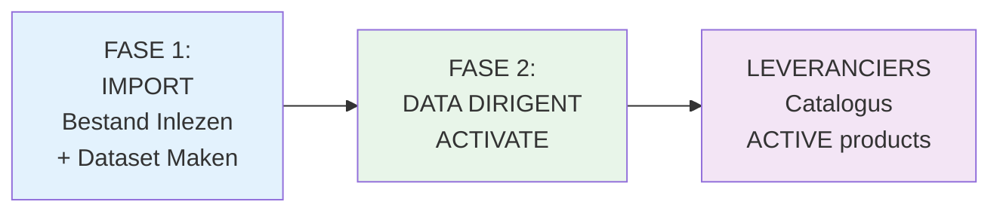

# Import Architecture - Split Flow (Version 6.0)

**Last Updated:** 2025-01-16  
**Version:** 6.0 - Funnel-First Architecture (Import → Convert → Activate)

---

## 🎯 Overview

**Purpose:** Transform diverse supplier data formats → unified supplier_products database  
**Architecture:** Split 3-phase flow (Import → Convert → Activate)  
**Processing:** Server-side parsing → Temp staging → AI mapping → Quality check → Activation
**Scale:** No practical limit (tested up to 100,000 rows per file)  
**Authorization:** Admin role required for all operations

---

## 🔄 New Architecture Pattern (Version 6.0)

### HIGH-LEVEL FUNNEL FLOW



### KEY CHANGES FROM V5.0 → V6.0

| Aspect | OLD (v5.0) | NEW (v6.0) |
|--------|-----------|-----------|
| **Wizard** | Single 5-step unified wizard | Integrated 2-phase flow in Import |
| **Data Status** | Temp → Permanent in one flow | `INACTIVE` → `ACTIVE` via explicit activation |
| **User Journey** | Upload → Map → Create → Done | Upload → Map → Create (INACTIVE) → **Navigate** → Activate |
| **Product Visibility** | Immediate after creation | Only visible after activation |
| **Quality Control** | During creation | **Before** activation (separate step) |
| **Navigation** | Modal dialog | Dataset maken in Import, Activeren via dedicated page |

---

## 📦 FASE 1: IMPORT - Bestand Inlezen + Dataset Maken (Auto-ACTIVE)

**Page:** `src/pages/import/UploadPage.tsx` + `ConvertDatasetDialog.tsx`  
**Purpose:** Upload file, parse columns, AI mapping (carousel), create ACTIVE products  
**Database:** `supplier_products` (product_status: 'ACTIVE', auto-deactivate old)  
**UI:** Dialog-based workflow (70% × 80% viewport)

### ✅ Auto-Activatie tijdens Import (v7.0)

**Producten worden automatisch ACTIVE gemaakt tijdens dataset creatie:**
- **Nieuwe producten:** `product_status = 'ACTIVE'` (direct zichtbaar in catalogus)
- **Oude producten:** Zelfde supplier+EAN, andere import_job → automatisch `product_status = 'INACTIVE'`
- **Historie behoud:** Meerdere records per supplier+EAN mogelijk, maar slechts één ACTIVE
- **Transparantie:** Gebruiker ziet `deactivated_count` in success toast
- **Database function:** `map_staging_chunk` bevat deactivation logic

### Progressive Quality Ladder Integration

**Phase:** `IMPORT + DATASET MAKEN`  
**Validation Rigor:** MVP-only - Only P0 fields required  
**Reference:** See `docs/technical/progressive-quality-ladder.md`

**Field Groups Used in Dataset Creation (All P0/MVP):**
- **Color Group:** `supplier_color` OR `supplier_color_code` (at least 1 required)
- **Style Group:** `supplier_style` OR `supplier_style_code` (at least 1 required)
- **Size Group:** `supplier_size_code` (direct required)
- **EAN Group:** `ean` (direct required)

**Quality Score Calculation:**
```typescript
// Weighted formula based on P0/P1/P2/P3 priorities
qualityScore = (
  (P0_present * 50) + // MVP fields (Supplier, Brand, Color, Style, Size, EAN)
  (P1_present * 30) + // Good fields (Product Group, Price)
  (P2_present * 15) + // Better fields (Material, Weight, Images)
  (P3_present * 5)    // Best fields (Care Instructions, Certifications)
) / total_fields * 100;
```

**GO/NO-GO Decision:**
- **BLOCKED:** Any P0 (MVP) field missing → Cannot proceed with import
- **ALLOWED:** P1/P2/P3 missing → User can proceed (only affects quality score)

### Architecture

```
┌─────────────────────────────────────────────────────────────┐
│ User Action: Upload Excel/CSV                               │
│ Max: 100,000 rows per file                                  │
└───────────────────────────┬─────────────────────────────────┘
                            │
                            ▼
┌─────────────────────────────────────────────────────────────┐
│ Edge Function: parse-and-stage-file                         │
│ • Download file from Storage or parse directly              │
│ • Server-side parsing (SheetJS/Papa Parse)                  │
│ • Extract columns + detect data types                       │
└───────────────────────────┬─────────────────────────────────┘
                            │
                            ▼
┌─────────────────────────────────────────────────────────────┐
│ Dataset Maken Flow (Integrated in Import)                   │
│ • AI Column Mapping (ai-suggest-mapping)                    │
│ • User reviews/modifies mapping                             │
│ • Validation preview                                        │
│ • 🆕 AUTO-ACTIVATE: Create supplier_products (ACTIVE)       │
│ • 🆕 DEACTIVATE: Old products with same EAN (INACTIVE)      │
└───────────────────────────┬─────────────────────────────────┘
                            │
                            ▼
┌─────────────────────────────────────────────────────────────┐
│ SUCCESS: Dataset ACTIVE and visible in catalog              │
│ • product_status: ACTIVE (immediately visible)              │
│ • Old products: INACTIVE (historie behoud)                  │
│ • Quality score calculated                                  │
│ • Toast: "✅ X producten ACTIEF, Y gedeactiveerd"           │
└─────────────────────────────────────────────────────────────┘
```

### Components (v8.0 - Dialog Architecture)

**Primary Components:**
- ✅ `UploadPage.tsx` - File upload + supplier/brand selection
- ✅ `ConvertDatasetDialog.tsx` - Dialog-based conversion workflow (70% × 80%)
- ✅ `MappingCarousel.tsx` - Carousel-based mapping interface (replaces InteractiveMappingEditor)
- ✅ `FieldProgressIndicator.tsx` - Visual progress with clickable colored dots (🟢 mapped / 🔴 not mapped)
- ✅ `DatasetCreationProgress.tsx` - Real-time creation progress
- ✅ **Workflow Steps:**
  1. Upload (UploadPage)
  2. Mapping (MappingCarousel with carousel slides)
  3. Controle (validation preview)
  4. Verwerken (DatasetCreationProgress)
  5. Voltooid (success confirmation)

### Database Schema

**Table:** `supplier_products`

**Status column:**
```sql
ALTER TABLE supplier_products
ADD COLUMN product_status TEXT DEFAULT 'INACTIVE' 
CHECK (product_status IN ('INACTIVE', 'ACTIVE'));

CREATE INDEX idx_supplier_products_status ON supplier_products(product_status);

-- 🆕 v7.0: No UNIQUE constraint (historie behoud)
-- Multiple records per supplier+EAN possible, only one ACTIVE
CREATE INDEX idx_supplier_products_supplier_ean_active 
ON supplier_products(supplier_id, ean, product_status)
WHERE product_status = 'ACTIVE';

-- product_status: 'ACTIVE'   → Created in Import (visible in catalog)
-- product_status: 'INACTIVE' → Old/deactivated (not visible)
```

### Edge Functions

**Used:** 
- `parse-and-stage-file` (parses file and extracts columns)
- `ai-suggest-mapping` (AI mapping suggestions)
- `map_staging_chunk` (creates supplier_products with ACTIVE status + deactivates old)

**Input (map_staging_chunk):**
```typescript
{
  import_job_id: number,
  column_mapping: Record<string, string>,
  chunk_size: number,
  offset: number
}
```

**Output (v7.0):**
```typescript
{
  processed: number,
  inserted: number,
  updated: number, // Always 0 (no ON CONFLICT)
  errors: number,
  duplicates: number,
  deactivated: number, // ✅ Count of old ACTIVE products deactivated
  remaining: number,
  total_rows: number,
  progress_percentage: number
}
```

**Edge Function:** `create-dataset-atomic`
- Sets `file_status = 'ACTIVE'` immediately (lines 204, 421)
- Tracks `deactivated_count` from `map_staging_chunk` response
- Updates `import_supplier_dataset_jobs.deactivated_count` column

### User Flow (v8.0 - Dialog-Based)

1. User navigates to `/import` or `/import/management`
2. Clicks "Nieuw Bestand Uploaden" or "Convert" on existing dataset
3. Selects Excel/CSV file (if new upload)
4. System parses file and extracts columns
5. **ConvertDatasetDialog opens (70% × 80% modal):**
   - **Step 2 - Mapping:** MappingCarousel with:
     - 1 field/group per slide
     - Visual progress: 🟢 mapped / 🔴 not mapped / 🟠 partial
     - Left/right navigation arrows
     - Clickable progress dots to jump to specific fields
     - Keyboard shortcuts (← → arrows, Enter to advance)
   - **Step 3-4 - Creation:** DatasetCreationProgress with real-time updates
6. System creates `supplier_products` with `product_status=ACTIVE`
7. System deactivates old ACTIVE products (same supplier+EAN, different import_job)
8. SUCCESS: Toast shows "✅ X producten ACTIEF, Y gedeactiveerd"
9. Dialog closes, products immediately visible in `/supplier-catalog`

---

## 📦 FASE 2: DATA DIRIGENT - ACTIVATE (Optioneel - Re-activatie)

**Page:** `/data-dirigent/activate`  
**Purpose:** Re-activeer eerder gedeactiveerde datasets  
**Database:** `supplier_products.product_status` update + priority logic

### Gebruik

**Alleen voor:**
- Datasets die handmatig zijn gedeactiveerd
- Datasets ouder dan 5 minuten (filter fresh uploads)

**Niet voor:**
- Nieuwe uploads (die zijn automatisch al ACTIVE)

### Architecture

```
┌─────────────────────────────────────────────────────────────┐
│ ENTRY POINT: /data-dirigent/activate                       │
│ • Direct link (shows dropdown of INACTIVE datasets)         │
│ • OR redirect from Convert: ?dataset_id={id}                │
└───────────────────────────┬─────────────────────────────────┘
                            │
                            ▼
┌─────────────────────────────────────────────────────────────┐
│ WIZARD STEP 1: Dataset Selection                           │
│ • Select dataset with INACTIVE products                     │
│ • (or pre-selected via URL)                                 │
└───────────────────────────┬─────────────────────────────────┘
                            │
                            ▼
┌─────────────────────────────────────────────────────────────┐
│ WIZARD STEP 2: Quality Review (Progressive Quality Ladder) │
│ • Display quality score (0-100) with weighted calculation  │
│ • Show validation errors summary by priority level         │
│ • P0 errors: 🚨 MVP (must be 0) - Blocks activation        │
│ • P1 errors: 🟡 Good - Impacts quality score               │
│ • P2 errors: 🔵 Better - Impacts quality score             │
│ • P3 errors: ⚪ Best - Nice to have                        │
│ • Completeness level: Excellent/Good/Basic/Poor            │
│ • Field Group satisfaction status                          │
└───────────────────────────┬─────────────────────────────────┘
                            │
                            ▼
┌─────────────────────────────────────────────────────────────┐
│ WIZARD STEP 3: Priority & Activate                         │
│ • Select priority: LOW/MEDIUM/HIGH                          │
│ • HIGH (REPLACE): Deactivate other datasets (same supp+brand)│
│ • MEDIUM/LOW (DOMINATE): Keep all datasets active           │
│ • Show impact preview (which products affected)             │
│ • Confirmation checkbox                                     │
└───────────────────────────┬─────────────────────────────────┘
                            │
                            ▼
┌─────────────────────────────────────────────────────────────┐
│ Edge Function: activate-dataset                             │
│ 1. Validate dataset exists and has INACTIVE products        │
│ 2. Update dataset priority in datasets table                │
│ 3. Execute priority logic:                                  │
│    • HIGH (REPLACE): Set other datasets to INACTIVE         │
│    • MEDIUM/LOW: Keep all ACTIVE                            │
│ 4. Update supplier_products.product_status = 'ACTIVE'       │
│ 5. Update datasets.status = 'active'                        │
└───────────────────────────┬─────────────────────────────────┘
                            │
                            ▼
┌─────────────────────────────────────────────────────────────┐
│ SUCCESS: Products activated                                 │
│ • product_status = 'ACTIVE'                                 │
│ • NOW visible in /supplier-catalog                          │
│ • Redirect to: /supplier-catalog?supplier_id={id}           │
└─────────────────────────────────────────────────────────────┘
```

### Database Schema

**Tables used:**
- `supplier_products` (update `product_status`)
- `datasets` (update `priority`, `status`)

**Priority logic:**
```sql
-- HIGH priority (REPLACE mode)
-- Step 1: Deactivate OTHER datasets with same supplier+brand
UPDATE supplier_products
SET product_status = 'INACTIVE'
WHERE dataset_id IN (
  SELECT id FROM datasets 
  WHERE supplier_id = {supplier_id}
    AND brand_id = {brand_id}
    AND id != {current_dataset_id}
);

-- Step 2: Activate current dataset
UPDATE supplier_products
SET product_status = 'ACTIVE'
WHERE dataset_id = {current_dataset_id};

-- MEDIUM/LOW priority (DOMINATE mode)
-- Just activate current dataset, keep others active
UPDATE supplier_products
SET product_status = 'ACTIVE'
WHERE dataset_id = {current_dataset_id};
```

### Edge Functions

**New Edge Function:** `activate-dataset`

**Input:**
```typescript
{
  dataset_id: string,
  priority: 'low' | 'medium' | 'high',
  tenant_id: string
}
```

**Process:**
```typescript
async function activateDataset(req: ActivateRequest) {
  // 1. Verify dataset exists and has INACTIVE products
  const dataset = await verifyDataset(req.dataset_id);
  
  // 2. Update dataset priority
  await supabase
    .from('datasets')
    .update({ priority: req.priority, status: 'active' })
    .eq('id', req.dataset_id);
  
  // 3. Execute priority logic
  if (req.priority === 'high') {
    // REPLACE: Deactivate other datasets
    await deactivateOtherDatasets(dataset.supplier_id, dataset.brand_id, req.dataset_id);
  }
  
  // 4. Activate current dataset products
  await supabase
    .from('supplier_products')
    .update({ product_status: 'ACTIVE' })
    .eq('dataset_id', req.dataset_id);
  
  return { success: true, activated_count: result.count };
}
```

**New Edge Function:** `deactivate-dataset`

**Input:**
```typescript
{
  dataset_id: string,
  tenant_id: string
}
```

**Process:**
```typescript
async function deactivateDataset(req: DeactivateRequest) {
  // 1. Update supplier_products to INACTIVE
  await supabase
    .from('supplier_products')
    .update({ product_status: 'INACTIVE' })
    .eq('dataset_id', req.dataset_id);
  
  // 2. Update dataset status
  await supabase
    .from('datasets')
    .update({ status: 'inactive' })
    .eq('id', req.dataset_id);
  
  return { success: true, deactivated_count: result.count };
}
```

### Component Structure

```
src/pages/data-dirigent/
  ActivatePage.tsx (NEW - main wrapper)
    components/activate/
      DatasetQualityReview.tsx (REUSE DatasetQualityScore from import/)
      ImpactPreview.tsx (REUSE from import/steps/)
      PrioritySelector.tsx (REUSE DatasetPrioritySelector from import/steps/)
      ActivationConfirmDialog.tsx (NEW)
```

### User Flow

1. User navigates to `/data-dirigent/activate?dataset_id={id}`
2. **Step 1:** Dataset pre-selected (or select from dropdown)
3. **Step 2:** Review quality score, validation errors, completeness
4. **Step 3:** Select priority (LOW/MEDIUM/HIGH)
5. View impact preview: "X products will be activated, Y will be deactivated (if REPLACE)"
6. Confirm activation checkbox
7. Click "Activeer Dataset" → Call `activate-dataset` Edge Function
8. System updates `product_status='ACTIVE'`
9. System handles priority conflicts (REPLACE vs DOMINATE)
10. SUCCESS: "Dataset geactiveerd! {X} producten nu ACTIVE"
11. Redirect to `/supplier-catalog?supplier_id={supplier_id}&filter=active`

---

## 🔄 Impact on Supplier Catalogus

**Page:** `src/pages/supplier-catalog/SupplierCatalogPage.tsx`

**Critical Change:** Catalogus now **ONLY shows ACTIVE products**

### Query Update

```typescript
// OLD (v5.0) - Shows all products
const { data: products } = await supabase
  .from('supplier_products')
  .select('*')
  .eq('tenant_id', tenantId);

// NEW (v6.0) - Only ACTIVE products
const { data: products } = await supabase
  .from('supplier_products')
  .select('*')
  .eq('tenant_id', tenantId)
  .eq('product_status', 'ACTIVE'); // ⭐ NEW FILTER
```

### UI Changes

- ✅ Badge showing "ACTIVE" status on product cards
- ✅ Filter dropdown: "Alle | Active | Inactive" (admin-only for testing)
- ❌ "Activate" button removed (moved to `/data-dirigent/activate`)

---

## 📊 Migration Path: v5.0 → v6.0

### Database Migration

```sql
-- 1. Add is_temp column to import_supplier_dataset_jobs
ALTER TABLE import_supplier_dataset_jobs
ADD COLUMN is_temp BOOLEAN DEFAULT false;

-- Existing jobs are already converted (is_temp=false)
-- New jobs will be temp (is_temp=true) until Converteren

-- 2. Add product_status column to supplier_products
ALTER TABLE supplier_products
ADD COLUMN product_status TEXT DEFAULT 'ACTIVE' 
CHECK (product_status IN ('INACTIVE', 'ACTIVE'));

-- Existing products are already active (default='ACTIVE')

-- 3. Create indexes
CREATE INDEX idx_supplier_products_status ON supplier_products(product_status);
CREATE INDEX idx_supplier_products_tenant_status 
  ON supplier_products(tenant_id, product_status);

-- 4. Create datasets table (if not exists) for priority tracking
CREATE TABLE IF NOT EXISTS datasets (
  id UUID PRIMARY KEY DEFAULT gen_random_uuid(),
  tenant_id UUID NOT NULL,
  supplier_id INTEGER NOT NULL,
  brand_id INTEGER NOT NULL,
  import_job_id INTEGER REFERENCES import_supplier_dataset_jobs(id),
  priority TEXT CHECK (priority IN ('low', 'medium', 'high')),
  status TEXT CHECK (status IN ('active', 'inactive')),
  created_at TIMESTAMPTZ DEFAULT NOW(),
  activated_at TIMESTAMPTZ
);
```

### Code Migration

**Components to Move:**
1. `DatasetCreationDialog.tsx` → Split into 3 pages (ConvertPage, ActivatePage, simplified ImportPage)
2. `MappingStep1/2/3` → Reuse in ConvertPage
3. `DatasetQualityScore` → Reuse in ActivatePage
4. `ImpactPreview` → Reuse in ActivatePage

**New Components to Create:**
1. `ConvertPage.tsx` (NEW)
2. `ActivatePage.tsx` (NEW)
3. `DatasetSelector.tsx` (NEW)
4. `ValidationPreview.tsx` (NEW)
5. `ActivationConfirmDialog.tsx` (NEW)

**New Edge Functions to Create:**
1. `activate-dataset` (NEW)
2. `deactivate-dataset` (NEW)

**Edge Functions to Modify:**
1. `execute-mapping` → Add `product_status='INACTIVE'`
2. `create-dataset-atomic` → Update `is_temp=false`

---

## 🎯 Key Benefits of v6.0 Architecture

### ✅ User Experience
- **Clearer mental model:** 3 distinct phases with explicit navigation
- **Better quality control:** Separate review step before activation
- **Reduced errors:** Can't accidentally activate bad data
- **Resumable:** Can pause and resume at any phase

### ✅ Technical
- **Cleaner separation of concerns:** Each page has single responsibility
- **Better testability:** Each phase independently testable
- **Safer activations:** Explicit user confirmation required
- **Auditable:** Clear tracking of Import → Convert → Activate flow

### ✅ Business
- **Risk mitigation:** Data not visible until quality approved
- **Conflict resolution:** Explicit priority system (REPLACE vs DOMINATE)
- **Data governance:** Admin control over which datasets are active
- **Compliance:** Clear audit trail of all activation decisions

---

## 📝 Rollback Procedure

If v6.0 causes issues, rollback is possible:

```sql
-- 1. Set all products to ACTIVE (remove filter)
UPDATE supplier_products SET product_status = 'ACTIVE';

-- 2. Drop new columns (optional)
ALTER TABLE supplier_products DROP COLUMN product_status;
ALTER TABLE import_supplier_dataset_jobs DROP COLUMN is_temp;

-- 3. Redeploy v5.0 code
```

**Data Safety:** No data loss during rollback, only UI/UX changes revert.

---

## 🔗 Related Documentation

- [Export Architecture](./export-architecture.md) - Generiek export systeem
- [Database Schema](./database-schema.md) - Complete database structure
- [User Guide: Import](../gebruikershandleiding/03-import-proces/01-bestand-inlezen.md)
- [User Guide: Converteren](../gebruikershandleiding/03-import-proces/02-converteren.md)
- [User Guide: Activeren](../gebruikershandleiding/03-import-proces/03-activeren.md)

---

**Document Status:** ✅ Updated for v6.0 - Funnel-First Architecture  
**Last Review:** 2025-01-16
