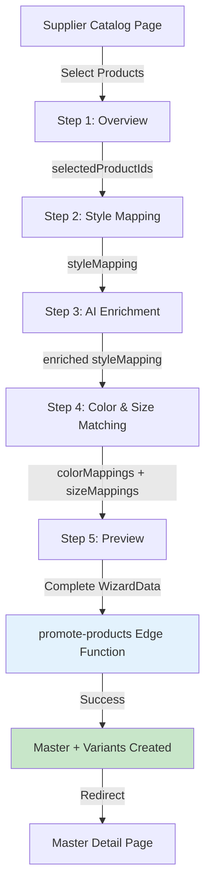

# Promotion Wizard - Technische Architectuur

**Versie:** 1.0  
**Laatst bijgewerkt:** 2025-11-14  
**Status:** ✅ Geïmplementeerd

---

## 📋 Overzicht

De **Promotion Wizard** is een multi-step wizard die leveranciersproducten transformeert naar een gestandaardiseerde Master/Variant structuur in het PIM systeem. Het proces converteert ruwe supplier data naar een genormaliseerde productcatalogus met volledige kleur- en maatmapping naar stamdata.

### Kern Functionaliteit
- 5-stappen wizard flow voor product promotie
- Automatische matching van kleuren naar `color_family_options`
- Automatische matching van maten naar `size_options`
- Manual override mogelijkheid voor lage confidence matches
- Preview van alle te creëren Master en Variants
- Generatie van Variant Display Names volgens standaard: `Brand | Master | Color | Size`

---

## 🏗️ Architectuur Componenten

### Component Structuur

```
src/components/promotion/
├── PromotionWizardDialog.tsx          # Hoofd wizard container met stepper UI
└── steps/
    ├── Step1SelectionOverview.tsx     # Toon geselecteerde producten + grouping
    ├── Step2StyleMapping.tsx          # Map style naar Master metadata
    ├── Step2AiEnrichment.tsx          # Optionele AI verrijking
    ├── Step4ColorSizeMatching.tsx     # Automatische + manual color/size matching
    └── Step5PreviewConfirm.tsx        # Preview + finale bevestiging
```

### Data Flow Diagram



---

## 🔧 Hooks & Utilities

### State Management Hook

**`src/hooks/use-promotion-wizard.ts`**

```typescript
export interface WizardData {
  selectedProductIds: number[];
  aiEnrichments?: Record<number, Record<string, any>>;
  styleMapping: StyleMapping | null;
  colorMappings: Record<string, ColorMapping>;
  sizeMappings: Record<string, SizeMapping>;
  templateId?: number;
}

export interface ColorMapping {
  color_family_option_id: number;  // FK naar color_family_options
}

export interface SizeMapping {
  size_option_id: number;  // FK naar size_options
}

export interface StyleMapping {
  style_name: string;              // Master Name
  mapped_brand_id: number;         // FK naar brands
  supplier_id: number;             // FK naar suppliers
  category_id?: number;            // FK naar categories
  gender?: string;                 // Unisex/Heren/Dames
  description?: string;
  material_composition?: string;
  care_instructions?: string;
  weight_grams?: number;
}
```

**API:**
- `currentStep`: Huidige wizard stap (1-5)
- `wizardData`: Volledige wizard state
- `handleNext(data)`: Ga naar volgende stap + merge data
- `handleBack()`: Ga terug naar vorige stap
- `resetWizard()`: Reset alle state
- `setWizardData(data)`: Overschrijf volledige state

---

### Color Matching Utility

**`src/lib/utils/color-matching.ts`**

Implementeert 4-tier matching algoritme:

```typescript
export interface ColorMatchResult {
  supplier_color_name: string;
  matched_family_option_id: number | null;
  matched_display_name_nl: string | null;
  matched_color_type: string | null;
  confidence: 'exact' | 'high' | 'medium' | 'low' | 'none';
  match_method: 'exact_nl' | 'exact_en' | 'family' | 'manual';
}
```

**Matching Prioriteit:**
1. **Exact match op `display_name_nl`** → confidence: `exact`
2. **Exact match op `display_name_en`** → confidence: `high`
3. **Match op `primary_family`** → confidence: `medium`
4. **Fuzzy includes match** → confidence: `low`
5. **Geen match** → confidence: `none` (manual select vereist)

**Performance:**
- Caching: `colorFamilyOptionsCache` voorkomt herhaalde DB queries
- Batch processing via `batchMatchColors()` voor meerdere kleuren

---

### Size Matching Utility

**`src/lib/utils/size-matching.ts`**

Implementeert normalisatie + matching algoritme:

```typescript
export interface SizeMatchResult {
  supplier_size_code: string;
  matched_size_option_id: number | null;
  matched_size_code: string | null;
  matched_size_label_nl: string | null;
  confidence: 'exact' | 'high' | 'medium' | 'low' | 'none';
  match_method: 'exact' | 'normalized' | 'fuzzy' | 'numeric' | 'manual';
}
```

**Normalisatie Regels:**
1. Trim + uppercase
2. Convert `XXXL` → `3XL`, `XXXXL` → `4XL`
3. Remove prefixes: `EU-48` → `48`, `Size 48` → `48`
4. Jeans format: `W32/L34` → `32-34`

**Matching Prioriteit:**
1. **Exact match** → confidence: `exact`
2. **Normalized match** → confidence: `high`
3. **Fuzzy match op label** → confidence: `medium`
4. **Numeric extraction** → confidence: `low`
5. **Geen match** → confidence: `none`

---

### Variant Display Name Utility

**`src/lib/utils/variant-display-name.ts`**

```typescript
export function formatVariantDisplayName(parts: VariantDisplayParts): string {
  return `${parts.brandName} | ${parts.masterName} | ${parts.colorName} | ${parts.sizeCode}`;
}

export function previewVariantNames(
  brandName: string,
  masterName: string,
  colorMappings: Map<string, { display_name_nl: string }>,
  sizeMappings: Map<string, { size_code: string }>
): string[] {
  // Genereert alle combinaties: 3 kleuren × 5 maten = 15 variant names
  // Voorbeeld: "Russell | Premium Polo | Navy | XL"
}

export function countVariantCombinations(
  colorCount: number,
  sizeCount: number
): number {
  return colorCount * sizeCount;
}
```

---

## 🔄 Wizard Flow Details

### Step 1: Selectie Overzicht

**Component:** `Step1SelectionOverview.tsx`

**Functie:**
- Toon totaal aantal geselecteerde producten
- Groepeer per `style_display_name` → `supplier_color_name` → `supplier_size_code`
- Visualiseer unieke kleuren en maten per style

**Data Output:**
```typescript
{
  selectedProductIds: [101, 102, 103, ...],
}
```

---

### Step 2: Style Mapping

**Component:** `Step2StyleMapping.tsx`

**Functie:**
- Map supplier style naar Master metadata
- Verplichte velden: Master Name, Brand, Supplier, Category
- Optionele velden: Gender, Description, Material Composition, Care Instructions, Weight

**Form Validatie (Zod):**
```typescript
const styleMappingSchema = z.object({
  style_name: z.string().min(3).max(255),
  mapped_brand_id: z.number().positive(),
  supplier_id: z.number().positive(),
  category_id: z.number().positive(),
  gender: z.enum(['Unisex', 'Heren', 'Dames']).optional(),
  description: z.string().optional(),
  material_composition: z.string().optional(),
  care_instructions: z.string().optional(),
  weight_grams: z.number().positive().optional(),
});
```

**Data Output:**
```typescript
{
  styleMapping: {
    style_name: "Premium Polo",
    mapped_brand_id: 42,
    supplier_id: 7,
    category_id: 12,
    gender: "Unisex",
    description: "...",
  }
}
```

---

### Step 3: AI Enrichment (Optioneel)

**Component:** `Step2AiEnrichment.tsx`

**Functie:**
- Hergebruik van bestaande AI enrichment component
- Kan gebruiker toestaan AI te gebruiken voor automatische invulling van description, material composition, etc.
- **Optioneel** - kan worden overgeslagen

**Data Output:**
```typescript
{
  aiEnrichments: {
    description: "AI-generated description",
    material_composition: "65% Polyester, 35% Katoen",
  }
}
```

---

### Step 4: Color & Size Matching

**Component:** `Step4ColorSizeMatching.tsx`

**Functie:**
- Automatische matching van unieke kleuren naar `color_family_options`
- Automatische matching van unieke maten naar `size_options`
- Toon confidence indicator per match (✓ Exact, ⚠ Gemiddeld, ✗ Geen match)
- Manual override via dropdown voor lage confidence matches
- **Blokkeer volgende stap** totdat alle kleuren en maten gemapped zijn

**UI Flow:**
```typescript
// Automatische matching gebeurt bij component mount
useEffect(() => {
  colorMatches → initialColorMappings
  sizeMatches → initialSizeMappings
}, [colorMatches, sizeMatches]);

// Manual override
handleColorOverride(supplierColor, colorFamilyOptionId);
handleSizeOverride(supplierSize, sizeOptionId);

// Validatie
const canProceed = allColorsMapped && allSizesMapped;
```

**Data Output:**
```typescript
{
  colorMappings: {
    "Navy": { color_family_option_id: 42 },
    "Black": { color_family_option_id: 1 },
    "Grey": { color_family_option_id: 15 },
  },
  sizeMappings: {
    "XS": { size_option_id: 10 },
    "S": { size_option_id: 11 },
    "M": { size_option_id: 12 },
    "L": { size_option_id: 13 },
    "XL": { size_option_id: 14 },
  }
}
```

---

### Step 5: Preview & Bevestiging

**Component:** `Step5PreviewConfirm.tsx`

**Functie:**
- Preview Master product metadata
- Preview Variants matrix (kleuren × maten)
- Preview alle Variant Display Names (expandable list)
- Toon gekoppelde supplier products count
- Final submit button met loading state

**Preview Data Sources:**
```typescript
// Lookup reference data
const brand = brands?.find(b => b.id === styleMapping.mapped_brand_id);
const supplier = suppliers?.find(s => s.id === styleMapping.supplier_id);
const category = categories?.find(c => c.id === styleMapping.category_id);

// Build display maps
colorDisplayMap: Map<supplierColor, { id, display_name_nl }>
sizeDisplayMap: Map<supplierSize, { id, size_code }>

// Generate variant names
const variantNames = previewVariantNames(
  brand.brand_name,
  styleMapping.style_name,
  colorDisplayMap,
  sizeDisplayMap
);
```

**Submit Flow:**
```typescript
const handleFinalSubmit = async () => {
  await promoteProductsAsync({
    supplier_product_ids: wizardData.selectedProductIds,
    style_mapping: wizardData.styleMapping,
    color_mappings: wizardData.colorMappings,
    size_mappings: wizardData.sizeMappings,
  });
  
  // On success: close wizard + toast + redirect naar Master detail
};
```

---

## 🚀 Edge Function Integration

### Edge Function Call

**Hook:** `src/hooks/use-promotion.ts`

```typescript
export function usePromotion() {
  const mutation = useMutation({
    mutationFn: async (payload: PromotePayload) => {
      const { data, error } = await supabase.functions.invoke('promote-products', {
        body: payload,
      });
      
      if (error) throw error;
      if (!data.success) throw new Error(data.error);
      
      return data;
    },
    onSuccess: (data) => {
      // Invalidate queries
      // Show success toast
    },
  });
  
  return {
    promoteProductsAsync: mutation.mutateAsync,
    isPromoting: mutation.isPending,
  };
}
```

**Payload Structure:**
```typescript
{
  supplier_product_ids: [101, 102, 103, ...],
  style_mapping: {
    style_name: "Premium Polo",
    mapped_brand_id: 42,
    supplier_id: 7,
    category_id: 12,
    gender: "Unisex",
    description: "...",
    material_composition: "...",
    care_instructions: "...",
    weight_grams: 250,
  },
  color_mappings: {
    "Navy": { color_family_option_id: 42 },
    "Black": { color_family_option_id: 1 },
  },
  size_mappings: {
    "XS": { size_option_id: 10 },
    "S": { size_option_id: 11 },
  }
}
```

**Expected Response:**
```typescript
{
  success: true,
  master_id: 123,
  master_code: "RUS-POLO-001",
  variants_created: 15,
  color_family_options_used: 3,
}
```

---

## 📊 Database Impact

### Tables Modified

**`master`** (1 insert)
```sql
INSERT INTO master (
  master_code,
  master_name,
  brand_id,
  supplier_id,
  status,
  created_by_user_id
) VALUES (...);
```

**`master_content_extension`** (1 insert)
```sql
INSERT INTO master_content_extension (
  master_id,
  description,
  material_composition,
  care_instructions,
  gender,
  weight_grams
) VALUES (...);
```

**`master_category_link`** (1 insert)
```sql
INSERT INTO master_category_link (
  master_id,
  category_id,
  is_primary
) VALUES (...);
```

**`master_product_variant`** (N inserts, waar N = colors × sizes)
```sql
INSERT INTO master_product_variant (
  master_id,
  variant_display_name,
  color_family_option_id,
  size_option_id,
  status
) VALUES (...);
```

**`dataset_rule_link`** (N inserts, 1 per supplier product)
```sql
INSERT INTO dataset_rule_link (
  variant_id,
  supplier_product_id,
  import_dataset_job_id
) VALUES (...);
```

**`supplier_products`** (N updates)
```sql
UPDATE supplier_products
SET is_promoted = true
WHERE id IN (...);
```

---

## ⚡ Performance Optimisaties

### 1. Caching Strategie

**Color Family Options:**
```typescript
let colorFamilyOptionsCache: ColorFamilyOption[] | null = null;
// Cache TTL: In-memory (application lifetime)
// Invalidatie: Bij page refresh
```

**Size Options:**
```typescript
let sizeOptionsCache: SizeOption[] | null = null;
// Cache TTL: In-memory (application lifetime)
```

**React Query Cache:**
```typescript
staleTime: 5 * 60 * 1000  // 5 minuten voor matching results
staleTime: 10 * 60 * 1000 // 10 minuten voor dropdown options
```

### 2. Batch Processing

**Color Matching:**
```typescript
// ✅ CORRECT: Batch alle kleuren in één keer
const matches = await batchMatchColors(['Navy', 'Black', 'Grey']);

// ❌ WRONG: Loop met individuele calls
for (const color of colors) {
  await matchColorToFamily(color); // Veel langzamer!
}
```

### 3. Lazy Loading

**Variant Names Preview:**
```typescript
// Default: Collapsed (alleen teller zichtbaar)
<Collapsible defaultOpen={false}>
  <CollapsibleContent>
    {variantNames.map(...)} // Render alleen bij expand
  </CollapsibleContent>
</Collapsible>
```

---

## 🧪 Testing Scenarios

### Happy Path Test
```
1. Selecteer 15 producten (3 colors × 5 sizes) in supplier catalog
2. Open wizard
3. Step 1: Zie 15 producten grouped
4. Step 2: Vul Master Name = "Premium Polo", Brand = "Russell", etc.
5. Step 3: Skip AI enrichment
6. Step 4: Auto-match: 3 colors → exact, 5 sizes → exact (geen manual actie nodig)
7. Step 5: Review matrix → Submit
8. ✓ Success: Master + 15 variants aangemaakt
9. ✓ Redirect naar master detail page
```

### Manual Override Test
```
1. Selecteer producten met rare kleuren ("Lime Punch", "Neon Yellow")
2. Step 4: Color matching geeft "low" of "none" confidence
3. Handmatig selecteren uit dropdown: "Geel (MONO)"
4. Size matching OK (auto)
5. Step 5: Review → Submit
6. ✓ Correcte kleur gebruikt ondanks lage auto-match
```

### Validation Test
```
1. Selecteer producten
2. Step 4: Een kleur kan niet worden gematcht (confidence: none)
3. Vergeet handmatig te selecteren
4. Probeer naar Step 5 te gaan
5. ✗ Blokkeer: "Niet alle kleuren zijn gematcht"
6. Ga terug, selecteer handmatig
7. Nu wel naar Step 5 mogelijk
```

---

## 🔒 Security Overwegingen

### Authentication
- Wizard is alleen toegankelijk voor **ingelogde gebruikers**
- Supplier products worden gefilterd op basis van user permissions

### Data Validatie
- **Client-side:** Zod schemas valideren alle form inputs
- **Server-side:** Edge function valideert opnieuw alle mappings
- **Database:** RLS policies forceren tenant isolation

### Input Sanitization
```typescript
// Alle text inputs worden getrimd en gesanitized
const sanitized = input.trim().slice(0, 255); // Max length enforcement
```

---

## 📝 Future Enhancements (Niet in MVP)

### 1. Template Functionaliteit
```typescript
interface PromotionTemplate {
  template_name: string;
  supplier_id: number;
  brand_id: number;
  style_mapping: StyleMapping;
  color_mappings: Record<string, ColorMapping>;
  size_mappings: Record<string, SizeMapping>;
}

// Gebruik: "Save as Template" button in Step 5
// Re-use: "Load Template" dropdown in Step 2
```

### 2. Bulk Undo / Demote
```typescript
// Rollback een promotie
async function demoteProducts(masterIds: number[]) {
  // 1. Verwijder variants
  // 2. Verwijder master
  // 3. Reset is_promoted = false op supplier_products
  // 4. Verwijder dataset_rule_link entries
}
```

### 3. Smart Grouping Detection
```typescript
// AI detecteert of producten bij elkaar horen
const shouldSplit = await detectMultipleStyles(selectedProducts);
if (shouldSplit) {
  // Stel voor om te splitsen in meerdere masters
}
```

### 4. Conflict Resolution
```typescript
// Detecteer bestaande master met zelfde naam + brand
const existingMaster = await findExistingMaster({
  name: styleMapping.style_name,
  brand_id: styleMapping.mapped_brand_id,
});

if (existingMaster) {
  // Optie 1: Voeg variants toe aan bestaande master
  // Optie 2: Maak nieuwe master met suffix
}
```

---

## 🐛 Debugging Tips

### Console Logs
```typescript
// Enable debug mode
localStorage.setItem('debug:promotion-wizard', 'true');

// Check wizard state
console.log('Wizard Data:', wizardData);
console.log('Color Matches:', colorMatches);
console.log('Size Matches:', sizeMatches);
```

### Network Inspection
```
1. Open DevTools → Network tab
2. Filter: "promote-products"
3. Inspect Request Payload
4. Check Response Status + Body
```

### Common Issues

**Issue:** "Niet alle kleuren zijn gematcht"
- **Oorzaak:** `confidence: 'none'` voor één of meer kleuren
- **Fix:** Controleer of `color_family_options` de juiste kleuren bevat
- **Workaround:** Handmatig selecteren uit dropdown

**Issue:** "Edge function timeout"
- **Oorzaak:** Teveel producten (>1000) in één batch
- **Fix:** Implementeer batching in edge function
- **Workaround:** Selecteer minder producten per promotie

**Issue:** "Duplicate master_code"
- **Oorzaak:** Master code generator conflict
- **Fix:** Backend moet unieke code garantieren (increment suffix)

---

## 📚 Related Documentation

- [Color Matching System](./color-matching-system.md)
- [Size Matching System](./size-matching-system.md)
- [Variant Display Names](./variant-display-names.md)
- [Database Schema](./database-schema.md)
- [Edge Functions Guide](./edge-functions.md)
