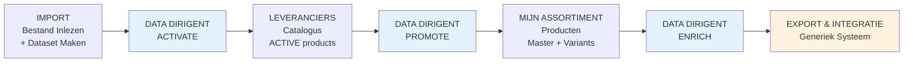
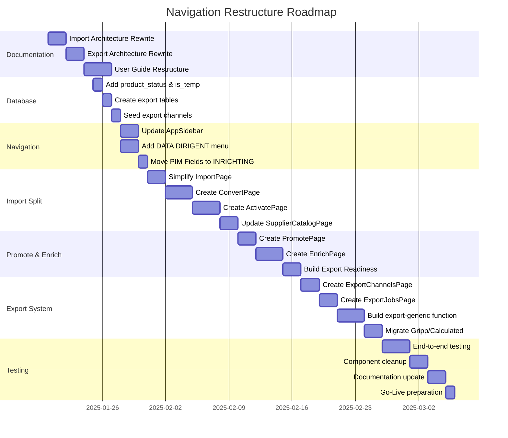

# Navigation Restructure Masterplan
## Van Import-First naar Funnel-First Architectuur

**Status:** Planning  
**Versie:** 1.0  
**Datum:** 2025-01-16  
**Auteur:** Van Kruiningen PIM Team  

---

## Executive Summary

Het centrale concept is **"Data Dirigent"** - een AI-assistent die gebruikers begeleidt door alle data transformatie stappen.

### Belangrijkste Veranderingen

1. **Dataset Maken Geïntegreerd in Import**: De dataset creatie is nu onderdeel van de Import flow zelf:
   - **IMPORT** (Bestand Inlezen + Dataset Maken): Upload, parse, AI mapping, en creëer INACTIVE products
   - **DATA DIRIGENT - ACTIVATE**: Kwaliteitstoetsing en Activatie

2. **Data Dirigent als Hub voor Orchestratie**: Hoofdmenu sectie met 3 sub-items:
   - Activeren (INACTIVE → ACTIVE status)
   - Promoveren (Supplier Products → Master Products)
   - Verrijken (Quality Enhancement)

3. **Generiek Export Systeem**: Vervangt hardcoded vendor exports (VK, Gripp, Calculated) met een configureerbaar systeem via database tabellen (`export_channels`, `export_channel_requirements`, `export_jobs`).

4. **PIM Velddefinities Verplaatst**: Van onzichtbaar onder AI Engine naar prominent onder **INRICHTING** (admin-only toegang).

5. **Status-Driven Architecture**: Introduceren van `INACTIVE` en `ACTIVE` status voor `supplier_products`:
   - **INACTIVE**: Na Converteren (niet zichtbaar in catalogus)
   - **ACTIVE**: Na Activeren (zichtbaar in catalogus voor Promoveren)

---

## 1. Funnel Visualisatie



### Toelichting Flow

1. **IMPORT + DATASET MAKEN**: Upload Excel/CSV → Parse → AI Mapping → Create `supplier_products` (product_status=INACTIVE)
2. **ACTIVATE**: Quality Check → Priority Selection → Update status=ACTIVE
3. **CATALOGUS**: Toon ALLEEN ACTIVE supplier_products
4. **PROMOTE**: Select ACTIVE products → Create `product_styles` + `product_variants`
5. **MIJN ASSORTIMENT**: Beheer master producten en varianten
6. **ENRICH**: AI Enrichment → Quality Reports → Export Readiness Check
7. **EXPORT**: Generiek systeem stuurt data naar geconfigureerde channels

---

## 2. Nieuwe Navigatie Structuur

### AppSidebar.tsx (Pseudo-Code)

```typescript
const navigationItems = [
  {
    title: "IMPORT",
    icon: Upload,
    url: "/import",
    description: "Upload Excel/CSV bestanden en parse kolommen"
  },
  {
    title: "DATA DIRIGENT",
    icon: Sparkles,
    items: [
      {
        title: "Activeren",
        url: "/data-dirigent/activate",
        icon: CheckCircle,
        description: "Quality Check & Activatie: INACTIVE → ACTIVE"
      },
      {
        title: "Promoveren",
        url: "/data-dirigent/promote",
        icon: TrendingUp,
        description: "Create Master Products: Supplier → Assortiment"
      },
      {
        title: "Verrijken",
        url: "/data-dirigent/enrich",
        icon: Sparkles,
        description: "AI Enrichment & Quality Enhancement"
      }
    ]
  },
  {
    title: "LEVERANCIERS",
    icon: Factory,
    items: [
      {
        title: "Catalogus",
        url: "/supplier-catalog",
        icon: Package,
        badge: "ACTIVE products only"
      }
    ]
  },
  {
    title: "MIJN ASSORTIMENT",
    icon: ShoppingBag,
    items: [
      {
        title: "Producten",
        url: "/products",
        icon: Package
      }
    ]
  },
  {
    title: "EXPORT & INTEGRATIE",
    icon: Share2,
    items: [
      {
        title: "Export Channels",
        url: "/export/channels",
        icon: Send,
        description: "Configureer export doelen"
      },
      {
        title: "Export Jobs",
        url: "/export/jobs",
        icon: History,
        description: "Bekijk export geschiedenis"
      },
      {
        title: "Export Readiness",
        url: "/export/readiness",
        icon: CheckSquare,
        description: "Check product export gereedheid"
      }
    ]
  },
  {
    title: "INRICHTING",
    icon: Settings,
    items: [
      {
        title: "Leveranciers",
        url: "/stamdata/suppliers"
      },
      {
        title: "Merken",
        url: "/stamdata/brands"
      },
      {
        title: "Categorieën",
        url: "/stamdata/categories"
      },
      {
        title: "Kleuren",
        url: "/stamdata/colors"
      },
      {
        title: "Maten",
        url: "/stamdata/sizing"
      },
      {
        title: "Decoratie",
        url: "/stamdata/decoration"
      },
      {
        title: "PIM Velddefinities", // ⭐ NIEUW: Verplaatst van AI Engine
        url: "/inrichting/pim-fields",
        icon: FileText,
        badge: "Admin"
      }
    ]
  },
  {
    title: "SYSTEEM",
    icon: Cog,
    items: [
      {
        title: "Gebruikers",
        url: "/users"
      },
      {
        title: "Documentatie",
        url: "/docs"
      }
    ]
  }
];
```

---

## 3. Functionaliteits Mapping (OLD → NEW)

| OLD Route/Functie | NEW Route/Functie | Status | Opmerkingen |
|-------------------|-------------------|--------|-------------|
| `/import` (Unified 5-step wizard) | **GEÏNTEGREERD** | 🔴 INTEGRATED | Dataset maken nu deel van Import |
| Step 1: File Upload + Supplier/Brand | `/import` (Bestand Inlezen + Dataset Maken) | ✅ BLIJFT | Uitgebreid met mapping wizard |
| Step 2-4: AI Mapping + Validation + Creation | `/import` (Geïntegreerd) | 🆕 GEÏNTEGREERD | Nu onderdeel van Import flow |
| Step 5: Activation | `/data-dirigent/activate` | 🆕 NIEUW | Aparte 3-stappen wizard |
| `/supplier-catalog` | `/supplier-catalog` | ⚠️ GEWIJZIGD | Toont NU alleen ACTIVE products |
| `PromotionWizard` (modal) | `/data-dirigent/promote` | 🆕 VERPLAATST | Dedicated page met wizard |
| `/products` | `/products` | ✅ BLIJFT | Geen wijziging |
| `BulkEnrichmentWorkflow` | `/data-dirigent/enrich` | 🆕 VERPLAATST | Onderdeel van Enrich page |
| `/quality/*` | `/data-dirigent/enrich` | 🆕 SAMENGEVOEGD | Quality Reports + Enrichment |
| **N.V.T.** | `/export/channels` | 🆕 NIEUW | Configureer export doelen |
| **N.V.T.** | `/export/jobs` | 🆕 NIEUW | Export geschiedenis |
| **N.V.T.** | `/export/readiness` | 🆕 NIEUW | Export gereedheid check |
| `/ai-engine/pim-fields` | `/inrichting/pim-fields` | 🆕 VERPLAATST | Van AI Engine → Inrichting |

### Legenda
- ✅ **BLIJFT**: Functionaliteit blijft op dezelfde plek
- ⚠️ **GEWIJZIGD**: Functionaliteit blijft, maar gedrag verandert
- 🆕 **NIEUW/VERPLAATST**: Nieuwe locatie of nieuwe functionaliteit
- 🔴 **SPLIT**: Bestaande wizard opgesplitst in meerdere delen

---

## 4. Gedetailleerde Fase Beschrijvingen

### FASE 1: IMPORT - Bestand Inlezen

**Doel**: Gebruiker uploadt een bestand en systeem parseert de kolommen.

#### Huidige Staat (OLD)
- **File:** `src/pages/import/ImportPage.tsx`
- **Component:** `DatasetCreationDialog.tsx` (5-step wizard)
- **Stappen:**
  1. File Upload + Supplier/Brand selectie
  2. AI Column Mapping
  3. Row Validation
  4. Dataset Creation
  5. Activation

#### Nieuwe Staat (NEW)
- **File:** `src/pages/import/ImportPage.tsx` (VEREENVOUDIGD)
- **Doel:** ALLEEN bestand uploaden en parsen
- **Stappen:**
  1. **Upload**: Selecteer Excel/CSV bestand (max 10MB)
  2. **Parse**: Detecteer kolommen via `parse-file-columns` Edge Function
  3. **Opslaan**: Sla op in `supplier_datasets` met `is_temp=true`
  4. **Redirect**: Navigeer naar `/data-dirigent/convert?dataset_id={id}`

#### Database Impact
- **Bestaande tabel:** `supplier_datasets`
- **Nieuwe kolom:** `is_temp` (boolean, default true)
  - `is_temp=true`: Nog niet geconverteerd (in IMPORT fase)
  - `is_temp=false`: Geconverteerd naar products (in CONVERT fase)

#### Edge Functions
- **Bestaand:** `parse-file-columns` (blijft)
- **Bestaand:** `parse-and-stage-file` (blijft, maar simplified)

#### UI/UX
- **Verwijderd:** Supplier/Brand selectie (verplaatst naar Convert)
- **Toegevoegd:** "Start Converteren" button die redirect naar `/data-dirigent/convert`
- **Table:** `import_jobs` tabel toont alleen upload + parse status

---

### FASE 2: DATA DIRIGENT - CONVERT

**Doel**: AI-gedreven column mapping en conversie van supplier data naar PIM schema.

#### Nieuwe Implementatie
- **File:** `src/pages/data-dirigent/ConvertPage.tsx` (NIEUW)
- **Wizard:** 4-step process
  1. **Dataset Selectie + Supplier/Brand**: Kies `is_temp=true` dataset, selecteer supplier/brand
  2. **AI Column Mapping**: Map columns via AI suggestions (uses `ai-suggest-mapping`)
  3. **Validatie & Preview**: Show validation errors, preview first 10 mapped rows
  4. **Dataset Creatie**: Execute mapping → Create `supplier_products` met `product_status=INACTIVE`

#### Database Impact
- **Bestaande tabel:** `supplier_products`
- **Nieuwe kolom:** `product_status` (enum: `INACTIVE`, `ACTIVE`)
  - `INACTIVE`: Default na Convert (niet zichtbaar in catalogus)
  - `ACTIVE`: Na Activate (zichtbaar in catalogus)

```sql
-- Migration: Add product_status column
ALTER TABLE supplier_products 
ADD COLUMN product_status TEXT DEFAULT 'INACTIVE' CHECK (product_status IN ('INACTIVE', 'ACTIVE'));

CREATE INDEX idx_supplier_products_status ON supplier_products(product_status);
CREATE INDEX idx_supplier_products_tenant_status ON supplier_products(tenant_id, product_status);
```

#### Edge Functions
- **Bestaand:** `ai-suggest-mapping` (blijft)
- **Bestaand:** `execute-mapping` (blijft, maar update to set `product_status=INACTIVE`)
- **Bestaand:** `create-dataset-atomic` (blijft, maar update to set `is_temp=false` on dataset)

#### Component Structuur
```
src/pages/data-dirigent/
  ConvertPage.tsx (NIEUW)
    components/convert/
      DatasetSelector.tsx (NIEUW)
      SupplierBrandSelector.tsx (HERGEBRUIK van ImportPage)
      ColumnMappingWizard.tsx (HERGEBRUIK van MappingStep1/2/3)
      ValidationPreview.tsx (NIEUW)
      DatasetCreationProgress.tsx (HERGEBRUIK)
```

#### Gebruikersflow
1. Gebruiker komt binnen via:
   - Direct link: `/data-dirigent/convert`
   - Redirect vanuit Import: `/data-dirigent/convert?dataset_id={id}`
2. Als `dataset_id` in URL: pre-select dataset
3. Anders: Toon dropdown met alle `is_temp=true` datasets
4. Selecteer supplier + brand
5. AI suggest mapping (confidence scores)
6. Valideer + preview
7. Create dataset → `supplier_products` met `product_status=INACTIVE`
8. Success: Redirect naar `/data-dirigent/activate?dataset_id={id}`

---

### FASE 3: DATA DIRIGENT - ACTIVATE

**Doel**: Kwaliteitstoetsing en beslissing om INACTIVE products ACTIVE te maken.

#### Nieuwe Implementatie
- **File:** `src/pages/data-dirigent/ActivatePage.tsx` (NIEUW)
- **Wizard:** 3-step process
  1. **Dataset Selectie**: Kies dataset met INACTIVE products
  2. **Quality Review**: Bekijk quality score, validation errors, impact analysis
  3. **Priority & Activate**: Kies priority (REPLACE/DOMINATE), activeer products

#### Database Impact
- **Bestaande tabel:** `supplier_products`
- **Kolom:** `product_status` (enum: `INACTIVE`, `ACTIVE`)
- **Bestaande tabel:** `datasets`
- **Kolom:** `priority` (enum: `low`, `medium`, `high`) - al aanwezig

#### Activatie Logic
```typescript
// Pseudo-code voor activatie
async function activateDataset(datasetId: string, priority: 'low' | 'medium' | 'high') {
  // 1. Update dataset priority
  await supabase
    .from('datasets')
    .update({ priority, status: 'active' })
    .eq('id', datasetId);
  
  // 2. Update product_status voor alle products in dataset
  await supabase
    .from('supplier_products')
    .update({ product_status: 'ACTIVE' })
    .eq('dataset_id', datasetId);
  
  // 3. Conflict resolution (als priority REPLACE):
  // - Deactiveer bestaande ACTIVE products met zelfde supplier/brand/sku
  if (priority === 'high') {
    // Implement replace logic
  }
}
```

#### Edge Functions
- **Nieuw:** `activate-dataset` (POST: activate products)
- **Nieuw:** `deactivate-dataset` (POST: deactivate products)
- **Bestaand:** `analyze-dataset-quality` (hergebruik voor quality review)

#### Component Structuur
```
src/pages/data-dirigent/
  ActivatePage.tsx (NIEUW)
    components/activate/
      DatasetQualityReview.tsx (HERGEBRUIK van DatasetQualityScore)
      ImpactPreview.tsx (HERGEBRUIK van import/steps/ImpactPreview.tsx)
      PrioritySelector.tsx (HERGEBRUIK van import/steps/DatasetPrioritySelector.tsx)
      ActivationConfirmDialog.tsx (NIEUW)
```

#### Gebruikersflow
1. Gebruiker komt binnen via:
   - Redirect vanuit Convert: `/data-dirigent/activate?dataset_id={id}`
   - Direct link: `/data-dirigent/activate` (dropdown met INACTIVE datasets)
2. Toon Quality Score (completeness, validation errors)
3. Toon Impact Analysis:
   - Aantal nieuwe products
   - Aantal vervangen products (bij REPLACE priority)
   - Conflicten met bestaande datasets
4. Kies priority (LOW/MEDIUM/HIGH)
5. Confirm activatie
6. Success: Redirect naar `/supplier-catalog?filter=supplier_id`

---

### FASE 4: LEVERANCIERS - CATALOGUS

**Doel**: Bekijk en beheer ACTIVE supplier products.

#### Wijziging
- **File:** `src/pages/supplier-catalog/SupplierCatalogPage.tsx` (WIJZIGING)
- **Filter:** Toon ALLEEN products met `product_status=ACTIVE`

#### Implementatie
```typescript
// Oude query
const { data: products } = await supabase
  .from('supplier_products')
  .select('*')
  .eq('tenant_id', tenantId);

// Nieuwe query
const { data: products } = await supabase
  .from('supplier_products')
  .select('*')
  .eq('tenant_id', tenantId)
  .eq('product_status', 'ACTIVE'); // ⭐ NIEUWE FILTER
```

#### UI/UX Wijziging
- **Toegevoegd:** Badge "ACTIVE" in product cards
- **Toegevoegd:** Filter dropdown: "Alle | Alleen Active | Alleen Inactive" (admin-only voor testing)
- **Verwijderd:** Activate button (verplaatst naar /data-dirigent/activate)

---

### FASE 5: DATA DIRIGENT - PROMOTE

**Doel**: Converteer ACTIVE supplier products naar master products (`product_styles` + `product_variants`).

#### Huidige Staat
- **Component:** `src/components/promotion/PromotionWizard.tsx` (modal)
- **Trigger:** Button in SupplierCatalogPage

#### Nieuwe Staat
- **File:** `src/pages/data-dirigent/PromotePage.tsx` (NIEUW dedicated page)
- **Wizard:** Integrated `PromotionWizard` (blijft zelfde 6 stappen)

#### Wijzigingen
- **FROM:** Modal dialog triggered vanuit `/supplier-catalog`
- **TO:** Dedicated page `/data-dirigent/promote`
- **Start:** Via "Promoveren" button in catalogus → redirect naar page
- **Product Selection:** Pre-select via URL params: `/data-dirigent/promote?style_id={supplier_style_id}`

#### Component Structuur
```
src/pages/data-dirigent/
  PromotePage.tsx (NIEUW - wrapper rond PromotionWizard)
    components/promote/
      ← Integrates existing PromotionWizard component (no changes to wizard itself)
```

#### Edge Functions
- **Bestaand:** `promote-products` (blijft)

#### Gebruikersflow
1. Gebruiker klikt "Promoveren" bij product in `/supplier-catalog`
2. Redirect naar `/data-dirigent/promote?style_id={id}`
3. Wizard pre-populates met geselecteerde product
4. Complete wizard (6 stappen):
   - Model selection
   - Product selection
   - AI enrichment
   - Style mapping
   - Color mapping
   - Size mapping
   - Preview
5. Create `product_styles` + `product_variants`
6. Success: Redirect naar `/products?filter=newly_created`

---

### FASE 6: DATA DIRIGENT - ENRICH

**Doel**: AI-gedreven data enrichment en kwaliteitsverbetering.

#### Huidige Staat
- **Pages:**
  - `/quality/bulk-enrichment` (BulkEnrichmentPage)
  - `/quality/reports` (QualityReportsPage)
  - `/quality/overview` (QualityOverviewPage)

#### Nieuwe Staat
- **File:** `src/pages/data-dirigent/EnrichPage.tsx` (NIEUW consolidated page)
- **Tabs:**
  1. **Bulk Enrichment**: Integrated BulkEnrichmentWorkflow
  2. **Quality Reports**: Integrated QualityReportsList
  3. **Export Readiness**: NIEUWE functionaliteit (zie hieronder)

#### NIEUW: Export Readiness Check

**Doel**: Check welke products klaar zijn voor export naar specifieke channels.

**Functionaliteit:**
1. Selecteer export channel (from `export_channels` table)
2. Toon required fields voor dit channel (from `export_channel_requirements` table)
3. Check alle `product_styles` + `product_variants`:
   - ✅ Groen: Alle required fields present
   - ⚠️ Geel: Sommige required fields missing
   - ❌ Rood: Critical fields missing
4. Bulk action: "Enrich Missing Fields" → trigger AI enrichment

**Database:** Gebruikt nieuwe `export_channels` en `export_channel_requirements` tabellen (zie FASE 7)

#### Component Structuur
```
src/pages/data-dirigent/
  EnrichPage.tsx (NIEUW)
    components/enrich/
      BulkEnrichmentTab.tsx (HERGEBRUIK BulkEnrichmentWorkflow)
      QualityReportsTab.tsx (HERGEBRUIK QualityReportsList)
      ExportReadinessTab.tsx (NIEUW)
        components/
          ChannelSelector.tsx (NIEUW)
          ProductReadinessTable.tsx (NIEUW)
          MissingFieldsDrawer.tsx (NIEUW)
```

#### Edge Functions
- **Bestaand:** `bulk-enrich-workflow` (blijft)
- **Bestaand:** `generate-quality-report` (blijft)
- **Nieuw:** `check-export-readiness` (NEW)

```typescript
// check-export-readiness Edge Function
interface ExportReadinessRequest {
  channel_id: string;
  tenant_id: string;
}

interface ExportReadinessResponse {
  channel: ExportChannel;
  required_fields: string[];
  products: Array<{
    product_id: string;
    sku: string;
    name: string;
    missing_fields: string[];
    readiness_score: number; // 0-100
    status: 'ready' | 'partial' | 'not_ready';
  }>;
}
```

---

### FASE 7: EXPORT & INTEGRATIE - Generiek Systeem

**Doel**: Vervang hardcoded vendor exports (VK, Gripp, Calculated) met generiek configureerbaar systeem.

#### Huidige Staat (HARDCODED)
- **Geen export functionaliteit in UI**
- **Hardcoded in backend:** Gripp/Calculated export logic
- **Docs:** `docs/technical/export-architecture.md` beschrijft Gripp/Calculated specifiek

#### Nieuwe Staat (GENERIEK)

##### Database Schema (NIEUW)

```sql
-- 1. Export Channels (configuratie van export doelen)
CREATE TABLE export_channels (
  id UUID PRIMARY KEY DEFAULT gen_random_uuid(),
  tenant_id UUID NOT NULL REFERENCES tenants(id) ON DELETE CASCADE,
  name TEXT NOT NULL, -- "Gripp ERP", "Calculated KMS", "Shopify Webshop"
  channel_type TEXT NOT NULL CHECK (channel_type IN ('api', 'file', 'sftp', 'webhook')),
  endpoint_url TEXT, -- Voor API channels
  api_key_secret TEXT, -- Reference to Supabase secret
  file_format TEXT CHECK (file_format IN ('json', 'csv', 'xml')), -- Voor file channels
  sftp_config JSONB, -- Voor SFTP channels
  is_active BOOLEAN DEFAULT true,
  created_at TIMESTAMPTZ DEFAULT now(),
  updated_at TIMESTAMPTZ DEFAULT now()
);

-- 2. Export Channel Requirements (welke velden zijn verplicht per channel)
CREATE TABLE export_channel_requirements (
  id UUID PRIMARY KEY DEFAULT gen_random_uuid(),
  channel_id UUID NOT NULL REFERENCES export_channels(id) ON DELETE CASCADE,
  pim_field_name TEXT NOT NULL, -- Matches pim_field_definitions.field_name
  is_required BOOLEAN DEFAULT true,
  mapping_rule TEXT, -- Optional: JSON path of transformation rule
  created_at TIMESTAMPTZ DEFAULT now()
);

-- 3. Export Jobs (tracking van export runs)
CREATE TABLE export_jobs (
  id UUID PRIMARY KEY DEFAULT gen_random_uuid(),
  tenant_id UUID NOT NULL REFERENCES tenants(id) ON DELETE CASCADE,
  channel_id UUID NOT NULL REFERENCES export_channels(id) ON DELETE CASCADE,
  status TEXT NOT NULL CHECK (status IN ('pending', 'running', 'success', 'failed')),
  total_products INTEGER,
  exported_products INTEGER,
  error_message TEXT,
  started_at TIMESTAMPTZ DEFAULT now(),
  completed_at TIMESTAMPTZ
);
```

##### UI/UX (NIEUW)

**1. Export Channels Page** (`/export/channels`)
- **Functionaliteit:**
  - List all configured export channels
  - Add new channel (form: name, type, endpoint, API key)
  - Edit/Delete channel
  - Test connection button
- **Component:** `src/pages/export/ExportChannelsPage.tsx` (NIEUW)

**2. Export Jobs Page** (`/export/jobs`)
- **Functionaliteit:**
  - List all export job history
  - Filter by channel, status, date
  - Retry failed jobs
  - Download export logs
- **Component:** `src/pages/export/ExportJobsPage.tsx` (NIEUW)

**3. Export Readiness Page** (`/export/readiness`)
- **Functionaliteit:** (Zie FASE 6 - Enrich)
- **Component:** Onderdeel van `/data-dirigent/enrich` (ExportReadinessTab)

##### Edge Functions (NIEUW)

**1. `export-generic` (NEW)**
```typescript
// Generic export function that dynamically builds export payload
interface ExportRequest {
  channel_id: string;
  tenant_id: string;
  product_ids?: string[]; // Optional: specific products, otherwise all
}

async function exportGeneric(req: ExportRequest) {
  // 1. Fetch channel configuration
  const channel = await supabase
    .from('export_channels')
    .select('*, export_channel_requirements(*)')
    .eq('id', req.channel_id)
    .single();
  
  // 2. Fetch products with required fields
  const requiredFields = channel.export_channel_requirements.map(r => r.pim_field_name);
  
  // 3. Build export payload dynamically based on channel requirements
  const payload = await buildExportPayload(products, requiredFields, channel.mapping_rules);
  
  // 4. Send to channel (API, file, SFTP, webhook)
  switch (channel.channel_type) {
    case 'api':
      await fetch(channel.endpoint_url, {
        method: 'POST',
        headers: { 'Authorization': `Bearer ${channel.api_key}` },
        body: JSON.stringify(payload)
      });
      break;
    case 'file':
      await supabase.storage
        .from('exports')
        .upload(`${tenant_id}/${channel.name}/${Date.now()}.${channel.file_format}`, payload);
      break;
    // ... SFTP, webhook logic
  }
  
  // 5. Track in export_jobs table
  await supabase
    .from('export_jobs')
    .insert({
      channel_id,
      tenant_id,
      status: 'success',
      total_products: products.length,
      exported_products: products.length
    });
}
```

**2. `check-export-readiness` (NEW)** - Zie FASE 6

##### Migratie van Bestaande Exports

**Gripp ERP:**
```sql
-- Seed data: Create Gripp export channel
INSERT INTO export_channels (tenant_id, name, channel_type, endpoint_url, api_key_secret, is_active)
VALUES (
  'tenant-uuid',
  'Gripp ERP',
  'api',
  'https://api.gripp.com/v1/products',
  'GRIPP_API_KEY',
  true
);

-- Seed data: Gripp required fields
INSERT INTO export_channel_requirements (channel_id, pim_field_name, is_required)
SELECT 
  (SELECT id FROM export_channels WHERE name = 'Gripp ERP'),
  field_name,
  true
FROM (VALUES
  ('sku'),
  ('name'),
  ('price_retail_cents'),
  ('price_cost_cents'),
  ('stock_quantity'),
  ('category_id'),
  ('supplier_id')
) AS required_fields(field_name);
```

**Calculated KMS:** (Zelfde proces, andere velden)

---

## 5. Migratie Checklist

### Week 1-2: Documentation & Database

- [ ] **Dag 1-2:** Herschrijf `docs/technical/import-architecture.md`
  - Split import wizard sectie in 3 delen
  - Update architecture diagram
  - Document nieuwe Edge Functions
  
- [ ] **Dag 3-4:** Herschrijf `docs/technical/export-architecture.md`
  - Verwijder Gripp/Calculated specifieke secties
  - Document generiek export systeem
  - Update database schema diagrams

- [ ] **Dag 5:** Database Migratie (Part 1)
  - Add `is_temp` column to `supplier_datasets`
  - Add `product_status` column to `supplier_products`
  - Create indexes

- [ ] **Dag 6-7:** Database Migratie (Part 2)
  - Create `export_channels` table
  - Create `export_channel_requirements` table
  - Create `export_jobs` table
  - Seed Gripp/Calculated channels

### Week 2-3: Core Navigation & Import Split

- [ ] **Dag 8-9:** Update AppSidebar.tsx
  - Add "DATA DIRIGENT" main menu item
  - Add 4 sub-items (Converteren, Activeren, Promoveren, Verrijken)
  - Move "PIM Velddefinities" to INRICHTING
  - Add "EXPORT & INTEGRATIE" main menu item

- [ ] **Dag 10-11:** Simplify ImportPage.tsx
  - Remove Step 2-5 (keep only file upload + parse)
  - Add "Start Converteren" button
  - Update import_jobs table display

- [ ] **Dag 12-14:** Create ConvertPage.tsx
  - Build 4-step wizard
  - Reuse existing mapping components
  - Update `execute-mapping` Edge Function to set `product_status=INACTIVE`

### Week 3-4: Activate & Catalogus

- [ ] **Dag 15-17:** Create ActivatePage.tsx
  - Build 3-step wizard
  - Reuse quality review components
  - Create `activate-dataset` Edge Function
  - Create `deactivate-dataset` Edge Function

- [ ] **Dag 18-19:** Update SupplierCatalogPage.tsx
  - Add `product_status=ACTIVE` filter
  - Update queries
  - Add status badge to product cards

### Week 4-5: Promote & Enrich

- [ ] **Dag 20-21:** Create PromotePage.tsx
  - Integrate existing PromotionWizard
  - Update routing
  - Test product pre-selection via URL params

- [ ] **Dag 22-24:** Create EnrichPage.tsx
  - Create tabbed layout (3 tabs)
  - Integrate BulkEnrichmentWorkflow
  - Integrate QualityReportsList
  - Build ExportReadinessTab (NEW)

- [ ] **Dag 25:** Create `check-export-readiness` Edge Function

### Week 5-6: Export System

- [ ] **Dag 26-27:** Create ExportChannelsPage.tsx
  - CRUD for export channels
  - Test connection functionality

- [ ] **Dag 28-29:** Create ExportJobsPage.tsx
  - Display job history
  - Retry failed jobs functionality

- [ ] **Dag 30-31:** Create `export-generic` Edge Function
  - Implement dynamic payload builder
  - Implement API/file/SFTP/webhook sending
  - Update export_jobs tracking

- [ ] **Dag 32:** Migrate Gripp/Calculated to generic system
  - Seed export_channels data
  - Test exports

### Week 6-7: Testing & Cleanup

- [ ] **Dag 33-35:** End-to-end testing
  - Test complete funnel flow (Import → Converteren → Activeren → Catalogus → Promoveren → Verrijken → Export)
  - Test INACTIVE/ACTIVE filtering
  - Test export readiness checks

- [ ] **Dag 36-37:** Component cleanup
  - Remove unused import wizard components
  - Remove hardcoded export components
  - Clean up dead code

- [ ] **Dag 38-39:** Documentation updates
  - Update user guides
  - Update API docs
  - Create changelog

- [ ] **Dag 40:** Go-Live preparation
  - Performance testing
  - Security audit
  - Backup database

---

## 6. Database & Backend Impact

### Database Changes

#### Nieuwe Tabellen (3)
1. `export_channels`
2. `export_channel_requirements`
3. `export_jobs`

#### Gewijzigde Tabellen (2)
1. `supplier_datasets`
   - **Nieuwe kolom:** `is_temp` (boolean, default true)

2. `supplier_products`
   - **Nieuwe kolom:** `product_status` (enum: `INACTIVE`, `ACTIVE`)

### Edge Functions Impact

#### Nieuwe Edge Functions (3)
1. `activate-dataset` (POST: activate products)
2. `check-export-readiness` (POST: check product readiness)
3. `export-generic` (POST: generic export)

#### Gewijzigde Edge Functions (2)
1. `execute-mapping`: Update to set `product_status=INACTIVE`
2. `create-dataset-atomic`: Update to set `is_temp=false` on dataset

#### Verwijderde Edge Functions (2)
1. `export-gripp` (replaced by `export-generic`)
2. `export-calculated` (replaced by `export-generic`)

---

## 7. Component Inventory

### Te Verplaatsen Components (18)

| Component | Van | Naar | Status |
|-----------|-----|------|--------|
| `DatasetCreationDialog.tsx` | `src/components/import/` | SPLIT in 3 delen | 🔴 SPLIT |
| `MappingStep1Required.tsx` | `src/components/import/steps/` | `src/pages/data-dirigent/convert/components/` | 🆕 MOVE |
| `MappingStep2Optional.tsx` | `src/components/import/steps/` | `src/pages/data-dirigent/convert/components/` | 🆕 MOVE |
| `MappingStep3Confirmation.tsx` | `src/components/import/steps/` | `src/pages/data-dirigent/convert/components/` | 🆕 MOVE |
| `DatasetCreationProgress.tsx` | `src/components/import/` | `src/pages/data-dirigent/convert/components/` | 🆕 MOVE |
| `DatasetQualityScore.tsx` | `src/components/import/` | `src/pages/data-dirigent/activate/components/` | 🆕 MOVE |
| `ImpactPreview.tsx` | `src/components/import/steps/` | `src/pages/data-dirigent/activate/components/` | 🆕 MOVE |
| `DatasetPrioritySelector.tsx` | `src/components/import/steps/` | `src/pages/data-dirigent/activate/components/` | 🆕 MOVE |
| `PromotionWizard.tsx` | `src/components/promotion/` | `src/pages/data-dirigent/promote/components/` | 🆕 MOVE |
| `BulkEnrichmentWorkflow.tsx` | `src/components/quality/` | `src/pages/data-dirigent/enrich/components/` | 🆕 MOVE |
| `QualityReportsList.tsx` | `src/components/quality/` | `src/pages/data-dirigent/enrich/components/` | 🆕 MOVE |

### Nieuwe Components (14)

| Component | Locatie | Doel |
|-----------|---------|------|
| `ConvertPage.tsx` | `src/pages/data-dirigent/` | Main page voor Convert wizard |
| `DatasetSelector.tsx` | `src/pages/data-dirigent/convert/components/` | Select is_temp=true datasets |
| `SupplierBrandSelector.tsx` | `src/pages/data-dirigent/convert/components/` | Select supplier + brand |
| `ValidationPreview.tsx` | `src/pages/data-dirigent/convert/components/` | Preview validation results |
| `ActivatePage.tsx` | `src/pages/data-dirigent/` | Main page voor Activate wizard |
| `DatasetQualityReview.tsx` | `src/pages/data-dirigent/activate/components/` | Review quality score |
| `ActivationConfirmDialog.tsx` | `src/pages/data-dirigent/activate/components/` | Confirm activation |
| `PromotePage.tsx` | `src/pages/data-dirigent/` | Main page voor Promote wizard |
| `EnrichPage.tsx` | `src/pages/data-dirigent/` | Main page voor Enrich (3 tabs) |
| `ExportReadinessTab.tsx` | `src/pages/data-dirigent/enrich/components/` | Check export readiness |
| `ChannelSelector.tsx` | `src/pages/data-dirigent/enrich/components/` | Select export channel |
| `ProductReadinessTable.tsx` | `src/pages/data-dirigent/enrich/components/` | Display product readiness |
| `ExportChannelsPage.tsx` | `src/pages/export/` | Manage export channels |
| `ExportJobsPage.tsx` | `src/pages/export/` | View export job history |

---

## 8. Risico's & Mitigatie

### Hoog Risico

| Risico | Impact | Mitigatie |
|--------|--------|-----------|
| **Database migratie faalt** | Applicatie down | 1. Backup database voor migratie<br>2. Test migratie op staging<br>3. Rollback script klaar |
| **Bestaande import jobs broken** | Data loss | 1. Feature flag: oud/nieuw import<br>2. Migratie script: old jobs → new structure |
| **Export naar Gripp/Calculated breekt** | Business critical | 1. Test export generiek systeem intensief<br>2. Keep old export functions als backup (1 maand) |

### Medium Risico

| Risico | Impact | Mitigatie |
|--------|--------|-----------|
| **Gebruikers verward door nieuwe flow** | UX issues | 1. In-app onboarding tour<br>2. Update gebruikershandleiding<br>3. Training sessie |
| **Component dependencies broken** | Bugs | 1. Comprehensive testing<br>2. TypeScript strict mode<br>3. Component isolation |

### Laag Risico

| Risico | Impact | Mitigatie |
|--------|--------|-----------|
| **Documentatie out-of-sync** | Confusion | 1. Update docs VOOR code changes<br>2. Consistency verification checklist |

---

## 9. Implementatie Roadmap (Gantt Chart)



**Total Duration:** ~12 weeks (Mid januari - Begin maart 2025)

---

## 10. Success Criteria

### Go-Live Checklist

#### Functionaliteit
- [ ] Import → Converteren → Activeren flow werkt end-to-end
- [ ] INACTIVE/ACTIVE filter werkt correct in catalogus
- [ ] Promoveren wizard creëert product_styles + variants correct
- [ ] Export generiek systeem stuurt data naar Gripp/Calculated
- [ ] Export Readiness check toont juiste missing fields

#### Database
- [ ] Alle migraties succesvol uitgevoerd
- [ ] Indexes aangemaakt voor performance
- [ ] RLS policies correct ingesteld
- [ ] Seed data voor export channels correct

#### UI/UX
- [ ] Alle 5 nieuwe pages render correct
- [ ] Navigation sidebar toont correcte structuur
- [ ] PIM Velddefinities bereikbaar onder INRICHTING (admin-only)
- [ ] No broken links of 404 errors

#### Edge Functions
- [ ] `activate-dataset` werkt correct
- [ ] `check-export-readiness` werkt correct
- [ ] `export-generic` stuurt data naar alle channel types (API, file, SFTP)
- [ ] Oude export-gripp/calculated functions verwijderd

#### Documentation
- [ ] Alle 9 conflicterende docs geüpdatet
- [ ] User guides accurate
- [ ] API docs accurate
- [ ] Changelog compleet

#### Testing
- [ ] Unit tests pass
- [ ] Integration tests pass
- [ ] End-to-end tests pass
- [ ] Performance tests pass (no regressions)

#### Security
- [ ] Tenant isolation verified (INACTIVE/ACTIVE products)
- [ ] RLS policies tested
- [ ] API key secrets secure
- [ ] No data leaks between tenants

---

## 11. Conclusie

Dit Masterplan biedt een complete roadmap voor de transformatie van Van Kruiningen PIM naar een funnel-first architectuur met "Data Dirigent" als centrale AI-assistent. Door de import wizard te splitsen, een generiek export systeem te implementeren, en alle functionaliteiten logisch te groeperen onder "DATA DIRIGENT", creëren we een intuïtievere en schaalbaarere applicatie.

**Key Takeaways:**
1. **Secuur**: Stapsgewijze migratie met rollback mogelijkheden
2. **Traceerbaar**: Component inventory en functionaliteits mapping voorkomen dat code verloren gaat
3. **Testbaar**: End-to-end tests voor elke fase
4. **Documenteerbaar**: Docs EERST updaten, code DAARNA

**Next Steps:**
1. Review en approval van dit Masterplan
2. Start FASE 1: Documentation updates
3. Weekly sync meetings voor progress tracking

---

**Document Status:** ✅ Finaal - Klaar voor implementatie  
**Review Date:** 2025-01-16  
**Approved By:** [Pending]