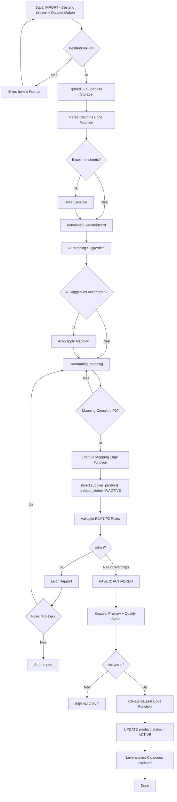

# User Flows

**Last Updated:** 17 oktober 2025  
**Version:** 1.0

---

## Overview

Visualisatie van belangrijkste user journeys door het PIM systeem.

---

## Flow 1: Leveranciers Import - 3-Fase Funnel (UPDATED 2025-12-19)

**Actor:** Import Manager of Admin  
**Entry Point:** Dashboard → "IMPORT: Bestand Inlezen" button  
**Goal:** Leveranciers data transformeren van Excel/CSV → ACTIVE producten  
**Architecture:** `docs/technical/import-architecture.md`  
**Masterplan:** `docs/ui-ux/navigation-restructure-masterplan.md`

### Nieuwe 2-Fase Structuur

**FASE 1: IMPORT - Bestand Inlezen + Dataset Maken**
- Upload + parse bestand
- Sheet/encoding detectie
- Kolom extractie
- **AI mapping suggesties**
- **Handmatige mapping aanpassingen**
- **Validatie + error rapport**
- **Dataset creëren** → `supplier_products` (product_status=INACTIVE)

**FASE 2: DATA DIRIGENT - ACTIVEREN**
- Dataset preview + quality score
- Priority selectie
- Activatie → Update `product_status` naar ACTIVE
- Priority management tussen datasets

### Mermaid Diagram



### Detailed 4-Step Wizard Flow

```
┌────────────────────────────────────────────────────────────┐
│ STAP 1: UPLOAD + CONFIGURATIE                              │
├────────────────────────────────────────────────────────────┤
│ Drag & Drop Zone                                           │
│ "Sleep Excel/CSV bestand hier of klik om te selecteren"   │
│                                                            │
│ Accepteerde formaten: .xlsx, .xls, .csv                   │
│ Max grootte: 20MB                                          │
│                                                            │
│ Leverancier: [Selecteer leverancier ▼]                    │
│                                                            │
│ [Upload wordt gestart...]                                 │
│ Progress: ████████░░ 80%                                   │
└────────────────────────────────────────────────────────────┘
                          │
                          ▼
┌────────────────────────────────────────────────────────────┐
│ STAP 2: HANDMATIGE MAPPING                                 │
├────────────────────────────────────────────────────────────┤
│ Map Excel kolommen naar PIM velden:                        │
│                                                            │
│ EAN (VERPLICHT) ⚠️         : [EAN ▼]                      │
│ Artikelcode                 : [Artikelnummer ▼]           │
│ Productnaam                 : [Omschrijving ▼]            │
│ Kleurcode                   : [Kleurcode ▼]               │
│ Kleurnaam                   : [Kleurnaam ▼]               │
│ Maatcode                    : [Maat ▼]                    │
│ Merknaam                    : [Merk ▼]                    │
│ Adviesprijs                 : [Prijs ▼]                   │
│ Afbeelding URL(s)          : [Afbeelding_URL ▼]           │
│                                                            │
│ Templates:                                                 │
│ [Template laden ▼] [✓ Opslaan als template]               │
│                                                            │
│ [Vorige] [Parse & Valideer]                                │
└────────────────────────────────────────────────────────────┘
                          │
                          ▼
┌────────────────────────────────────────────────────────────┐
│ STAP 3: SIMULATIE + UITVOEREN                              │
├────────────────────────────────────────────────────────────┤
│ Statistieken:                                              │
│ • 120 nieuwe producten                                     │
│ • 35 updates                                               │
│ • 155 totaal                                               │
│ • 3 validatie fouten                                       │
│                                                            │
│ ⚠️ Waarschuwingen:                                        │
│ • 15 producten zonder afbeelding                          │
│ • 3 prijzen zijn gedaald                                  │
│                                                            │
│ Preview wijzigingen (eerste 10):                           │
│ ┌─────────┬──────────┬─────────┬─────────┐               │
│ │ EAN     │ Actie    │ Naam    │ Prijs   │               │
│ ├─────────┼──────────┼─────────┼─────────┤               │
│ │ 570...  │ NIEUW    │ T-shirt │ €13.20  │               │
│ └─────────┴──────────┴─────────┴─────────┘               │
│                                                            │
│ [Vorige] [Import Uitvoeren]                                │
└────────────────────────────────────────────────────────────┘
                          │
                          ▼
┌────────────────────────────────────────────────────────────┐
│ STAP 4: RESULTAAT                                          │
├────────────────────────────────────────────────────────────┤
│ ✅ Import succesvol voltooid!                             │
│                                                            │
│ Resultaten:                                                │
│ • 120 producten toegevoegd                                │
│ • 35 producten bijgewerkt                                 │
│ • 3 fouten                                                │
│                                                            │
│ Tijdsduur: 12 seconden                                     │
│                                                            │
│ [Download Foutrapport] [Terug naar Dashboard]             │
└────────────────────────────────────────────────────────────┘
```
│ │ TC-001   │ UPDATE │ Prijs: €25→€27.50   │               │
│ │ TC-002   │ INSERT │ Nieuw product       │               │
│ │ TC-003   │ UPDATE │ Voorraad: 10→15     │               │
│ │ TC-POLO  │ SKIP   │ Duplicate EAN ✗     │               │
│ └──────────┴────────┴─────────────────────┘               │
│                                                            │
│ 🤖 AI Adviezen:                                            │
│ ⚠️ 5 producten: Prijsverschil >20% - Controleer           │
│ ✅ Geen onrealistische waarden gedetecteerd                │
│                                                            │
│ [Details Bekijken] [Mapping Aanpassen]                     │
│                                                            │
│ [Vorige] [🚀 Definitief Importeren]                        │
└────────────────────────────────────────────────────────────┘
                          │
                          ▼
┌────────────────────────────────────────────────────────────┐
│ STAP 7: IMPORT UITVOEREN ⚙️                                │
├────────────────────────────────────────────────────────────┤
│ ⏳ Import wordt uitgevoerd...                             │
│                                                            │
│ Progress: ███████████░░░░░ 75% (1,084 / 1,445)            │
│                                                            │
│ Status:                                                    │
│ ✓ 800 Styles geïmporteerd                                 │
│ ✓ 1,200 Color variants verwerkt                           │
│ ⏳ SKUs worden aangemaakt... (1,084 / 2,500)              │
│                                                            │
│ Geschatte tijd: 2 minuten                                  │
│                                                            │
│ [Import wordt automatisch doorgezet...]                    │
└────────────────────────────────────────────────────────────┘
                          │
                          ▼
┌────────────────────────────────────────────────────────────┐
│ STAP 8: RESULTAAT ✅                                       │
├────────────────────────────────────────────────────────────┤
│ 🎉 Import succesvol voltooid!                             │
│                                                            │
│ Statistieken:                                              │
│ ✓ 1,200 nieuwe producten                                  │
│ ✓ 245 bestaande updates                                   │
│ ✗ 5 fouten (duplicate EANs)                               │
│                                                            │
│ Gemiddelde datakwaliteit: 78%                              │
│ Import duur: 3 minuten 24 seconden                        │
│                                                            │
│ 🤖 AI Inzichten:                                           │
│ • Template "Tricorp Standard v2" gebruikt                 │
│ • 98% mappings auto-geaccepteerd                          │
│ • 15 producten verrijkt met AI-suggesties                 │
│                                                            │
│ ⏱️ Rollback beschikbaar tot: 26-01-2025 14:35             │
│ [🔙 Ongedaan Maken]                                        │
│                                                            │
│ [📊 Fouten Downloaden] [📄 Volledig Rapport (PDF)]        │
│ [👁️ Geïmporteerde Producten]  [🆕 Nieuwe Import]          │
└────────────────────────────────────────────────────────────┘
```

**Key Decisions:**

- A: Template gebruiken (>80% match) of nieuwe mapping maken?
- B: AI enrichment toepassen of handmatig verbeteren?
- C: Doorgaan met warnings (<80% kwaliteit) of eerst fixen?
- D: Simulatie akkoord of mapping aanpassen?
- E: Import definitief maken of nog aanpassingen?
- F: Rollback binnen 7 dagen of behouden?

**Time:** 
- Met bekende template: 2-3 minuten voor 1500 producten
- Nieuwe template: 5-8 minuten (mapping setup)
- AI analyse: +30 seconden extra
- Enrichment: +1-2 minuten (optioneel)

**UI Components:**
- `ImportWizard.tsx` - Multi-step stepper
- `ColumnMapper.tsx` - Drag-drop mapping interface
- `DataQualityReport.tsx` - Score visualization
- `ImportSimulationPreview.tsx` - Diff viewer
- `ImportProgress.tsx` - Real-time progress bar

**See Also:**
- Import architecture: `docs/technical/import-architecture.md` - Complete import system documentation
- Database schema: `docs/technical/database-schema.md#import-tables`

---

## Flow 2: Create Product Manually

**Actor:** Productmanager  
**Entry Point:** Products page → "Nieuw Product" button  
**Goal:** Single product aanmaken met varianten

```
Start
  │
  ▼
┌─────────────────────┐
│ Product Form        │
│ Style Code*         │
│ Style Name*         │
│ Brand*              │
│ Supplier            │
│ Material            │
│ Type: KERN/RAND     │
│                     │
│ [Cancel] [Opslaan]  │
└──────┬──────────────┘
       │ [Opslaan]
       ▼
┌─────────────────────┐
│ Style Created       │
│ "PRO-POLO-001"      │
│ Toast notification  │
└──────┬──────────────┘
       │ Auto-redirect
       ▼
┌─────────────────────┐
│ Style Detail        │
│ Tabs:               │
│ ├ Info              │
│ ├ Colors ← ACTIVE   │
│ ├ SKUs              │
│ └ Decoratie         │
└──────┬──────────────┘
       │ [Add Color]
       ▼
┌─────────────────────┐
│ Add Color Dialog    │
│ Color Code*         │
│ Color Family*       │
│ Color Name NL*      │
│ Hex Color           │
│ Pantone Code        │
│                     │
│ [Upload Images]     │
│                     │
│ [Cancel] [Opslaan]  │
└──────┬──────────────┘
       │ [Opslaan]
       ▼
┌─────────────────────┐
│ Color Created       │
│ "Navy"              │
└──────┬──────────────┘
       │ Back to detail
       ▼
┌─────────────────────┐
│ Style Detail        │
│ Colors: Navy        │
│                     │
│ [Generate SKUs] ←   │
└──────┬──────────────┘
       │ [Generate SKUs]
       ▼
┌─────────────────────┐
│ Generate SKUs       │
│ Select sizes:       │
│ ☑ S  ☑ M  ☑ L       │
│ ☑ XL ☑ XXL          │
│                     │
│ Default price: €34.95│
│                     │
│ [Generate 5 SKUs]   │
└──────┬──────────────┘
       │ [Generate]
       ▼
┌─────────────────────┐
│ SKUs Created        │
│ 5 SKUs generated    │
│                     │
│ [View SKUs tab]     │
└─────────────────────┘
```

**Key Decisions:**

- A: Welke maten genereren?
- B: Direct prijzen instellen of later aanpassen?

**Time:** 2-3 minutes per product

---

## Flow 3: Bulk Price Update

**Actor:** Productmanager  
**Entry Point:** Products list → Select → Bulk Actions  
**Goal:** Prijzen aanpassen voor actie

```
Start (Products List)
  │
  ▼
┌─────────────────────┐
│ Filter Products     │
│ Brand: Tricorp      │
│ Category: Polo's    │
│ [Apply filters]     │
└──────┬──────────────┘
       │
       ▼
┌─────────────────────┐
│ Filtered List       │
│ 120 products        │
│                     │
│ ☑ Select all        │
└──────┬──────────────┘
       │ [Select all checkbox]
       ▼
┌─────────────────────┐
│ Bulk Actions        │
│ 120 selected        │
│                     │
│ [Edit Prices]       │
│ [Update Stock]      │
│ [Archive]           │
└──────┬──────────────┘
       │ [Edit Prices]
       ▼
┌─────────────────────┐
│ Bulk Edit Dialog    │
│                     │
│ Discount:           │
│ ○ Percentage: 15%   │
│ ○ Amount: €5.00     │
│                     │
│ Valid from: Date    │
│ Valid until: Date   │
│                     │
│ Preview: "120 SKUs  │
│ krijgen 15% korting"│
│                     │
│ [Cancel] [Confirm]  │
└──────┬──────────────┘
       │ [Confirm]
       ▼
┌─────────────────────┐
│ Processing...       │
│ Progress: 80%       │
│ 96 / 120            │
└──────┬──────────────┘
       │
       ▼
┌─────────────────────┐
│ Update Complete     │
│ ✓ 120 SKUs updated  │
│                     │
│ [View Changes]      │
└─────────────────────┘
```

**Time:** 30 seconds for 120 products

---

## Flow 4: Export to Gripp

**Actor:** Productmanager (manual) or System (scheduled)  
**Entry Point:** Export page → Gripp card  
**Goal:** Sync producten naar Gripp ERP

```
Start
  │
  ▼
┌─────────────────────┐
│ Export Page         │
│                     │
│ ┌─────────────────┐ │
│ │ Gripp ERP       │ │
│ │ Last sync:      │ │
│ │ Today 08:00     │ │
│ │ Status: ✓       │ │
│ │                 │ │
│ │ [Sync Now]      │ │
│ └─────────────────┘ │
└──────┬──────────────┘
       │ [Sync Now]
       ▼
┌─────────────────────┐
│ Sync Options        │
│                     │
│ ○ Full sync         │
│ ● Delta sync        │
│   (since 08:00)     │
│                     │
│ Products to sync:   │
│ 47 changed          │
│                     │
│ [Cancel] [Start]    │
└──────┬──────────────┘
       │ [Start]
       ▼
┌─────────────────────┐
│ Syncing...          │
│ Progress: 60%       │
│ 28 / 47 products    │
│                     │
│ [Running in bg]     │
└──────┬──────────────┘
       │
       ├─[Success]──────────┐
       │                    │
       ▼                    ▼
┌─────────────────┐   ┌─────────────────┐
│ Sync Complete   │   │ Sync Failed     │
│ ✓ 47 synced     │   │ ✗ 5 failed      │
│ 0 errors        │   │ ✓ 42 synced     │
│                 │   │                 │
│ Updated:        │   │ Errors:         │
│ - 08:45         │   │ - Rate limit    │
│                 │   │ - Network       │
│ [View Log]      │   │                 │
│ [Close]         │   │ [Retry Failed]  │
└─────────────────┘   │ [View Log]      │
                      └─────────────────┘
```

**Time:** 30 seconds - 2 minutes depending on product count

---

## Flow 5: Search Product

**Actor:** Any user  
**Entry Point:** Global search bar (top nav)  
**Goal:** Snel product vinden

```
Start (Any page)
  │
  ▼
┌─────────────────────┐
│ Click search bar    │
│ (Cmd+K shortcut)    │
└──────┬──────────────┘
       │
       ▼
┌─────────────────────┐
│ Search Dialog       │
│ ┌─────────────────┐ │
│ │ 🔍 Search...    │ │
│ └─────────────────┘ │
│                     │
│ Recent:             │
│ - Polo Navy L       │
│ - Werkbroek 48      │
└──────┬──────────────┘
       │ [Type: "polo navy"]
       ▼
┌─────────────────────┐
│ Search Results      │
│ 12 results          │
│                     │
│ Products (8)        │
│ ├ PRO-POLO-001-NAV  │
│ ├ PRO-POLO-002-NAV  │
│ └ ...               │
│                     │
│ Brands (1)          │
│ └ Tricorp           │
│                     │
│ Imports (3)         │
│ └ tricorp_2025.xlsx │
└──────┬──────────────┘
       │ [Click result]
       ▼
┌─────────────────────┐
│ Product Detail      │
│ PRO-POLO-001-NAV-L  │
│ (Direct navigation) │
└─────────────────────┘
```

**Key Feature:** Real-time search-as-you-type

**Time:** < 1 second to find product

---

## Navigation Pattern (Updated - Nested Sidebar)

**Primary Navigation Flow:**

```
Dashboard (Home)
    │
    ├─→ Producten (Binnenkort)
    ├─→ Import (Binnenkort)
    ├─→ Export (Binnenkort)
    │
    ├─→ Stamdata (Admin only) ◄─ COLLAPSIBLE GROUP
    │    ├─ Merken
    │    ├─ Leveranciers
    │    ├─ Kleuren
    │    ├─ Decoratiemethoden
    │    ├─ Decoratieposities
    │    ├─ Taxonomieën
    │    ├─ Categorieën
    │    └─ Audit Log
    │
    └─→ Gebruikersbeheer (Admin only)
```

**Navigation Behavior:**
- **Persistent**: Sidebar blijft altijd zichtbaar (desktop)
- **Collapsible groups**: Stamdata submenu klapt open/dicht
- **Auto-expand**: Stamdata groep opent automatisch bij navigatie naar stamdata route
- **Active state**: Huidige pagina gemarkeerd met blue indicator
- **Mobile**: Sidebar wordt hamburger menu

**Navigation Type:** Persistent Sidebar met collapsible groups

---

## Error States

**Common Error Scenarios:**

### Import Error

```
Import Failed
  │
  ├─ File too large → "Max 10MB" → Retry
  ├─ Invalid format → "Only .xlsx/.csv" → Change file
  ├─ Network error → "Connection lost" → Retry
  └─ Server error → "Try again" → Contact support
```

### Sync Error

```
Gripp Sync Failed
  │
  ├─ Rate limit → "Wait 60s" → Auto-retry
  ├─ Auth failed → "Check API key" → Settings
  └─ Network → "Connection lost" → Retry
```

**Error Handling Pattern:**

1. Show clear error message
2. Explain what happened
3. Provide actionable next step
4. Option to retry or contact support

---

_User flows optimized for efficiency - minimize clicks, maximize context._
