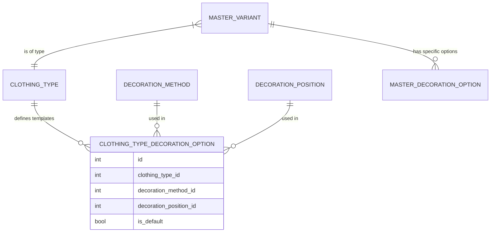

# 04a. Decoration Configuration Domain

## 1. Context
Binnen het PIM systeem is het noodzakelijk om te definiëren welke decoraties (bedrukkingen/borduringen) mogelijk zijn op specifieke kledingstukken. Omdat het handmatig instellen per product (`master_variant`) te arbeidsintensief is, introduceren we een **Template Systeem** op basis van Kledingtypes (`clothing_types`).

## 2. Data Model

### 2.1 Core Entiteiten
*   **Decoration Method**: De techniek (bv. Zeefdruk, Borduren).
*   **Decoration Position**: De locatie (bv. Borst Links, Rug).
*   **Clothing Type**: De categorie kleding (bv. T-Shirt, Hoodie, Pet).

### 2.2 De Template Tabel (`clothing_type_decoration_options`)
Dit is de koppeltabel die fungeert als blauwdruk.

| Veld | Type | Beschrijving |
|------|------|--------------|
| `clothing_type_id` | FK | Verwijzing naar het kledingtype (bv. T-Shirt). |
| `decoration_method_id` | FK | Verwijzing naar de techniek (bv. Zeefdruk). |
| `decoration_position_id` | FK | Verwijzing naar de positie (bv. Rug). |
| `is_default` | Boolean | Indien `true`: Deze optie wordt standaard aangevinkt bij nieuwe producten. |

### 2.3 Relatie Diagram (ERD)



## 3. Business Logic: Template Inheritance

Wanneer een nieuw product (`master_variant`) wordt aangemaakt of wanneer het kledingtype van een product wijzigt, treedt de volgende logica in werking:

1.  **Trigger**: Product wordt aangemaakt met `clothing_type_id = X`.
2.  **Lookup**: Systeem zoekt alle records in `clothing_type_decoration_options` waar `clothing_type_id = X`.
3.  **Replication**: Systeem kopieert deze records naar `master_decoration_options` voor het nieuwe product.
    *   `master_id` = Nieuw Product ID
    *   `decoration_method_id` = Template Method ID
    *   `decoration_position_id` = Template Position ID
    *   `is_available` = `is_default` (vanuit de template)

## 4. Frontend UI Concept (Beheerscherm)

Voor het beheren van deze koppelingen (`clothing_type_decoration_options`) wordt een **Matrix Interface** geadviseerd.

*   **Selectie**: Gebruiker kiest een Kledingtype (bv. "T-Shirt") uit een dropdown of lijst.
*   **Matrix Grid**:
    *   **Rijen**: Alle actieve Decoratie Posities.
    *   **Kolommen**: Alle actieve Decoratie Methoden.
    *   **Cellen**: Checkbox.
        *   *Unchecked*: Combinatie niet mogelijk.
        *   *Checked*: Combinatie mogelijk (record bestaat).
        *   *Star/Highlight*: Combinatie is default (`is_default = true`).

### 4.1 Mockup Beschrijving
```text
[ Select Clothing Type: T-Shirt v ]

| Positie \ Methode | Zeefdruk | Borduren | Transfer |
|-------------------|----------|----------|----------|
| Borst Links       | [x]      | [x] (*)  | [x]      |
| Rug               | [x] (*)  | [ ]      | [x]      |
| Mouw              | [ ]      | [x]      | [ ]      |
```
